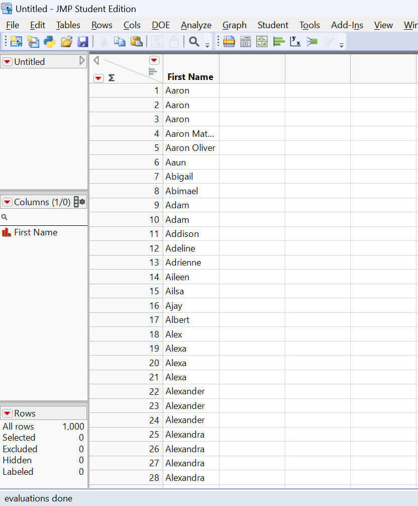
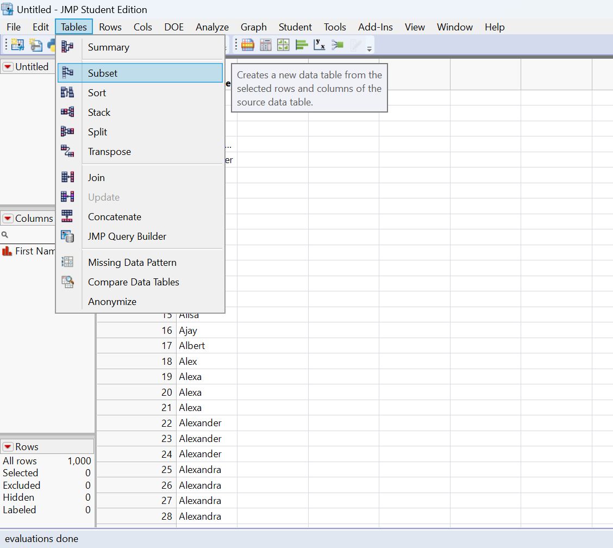
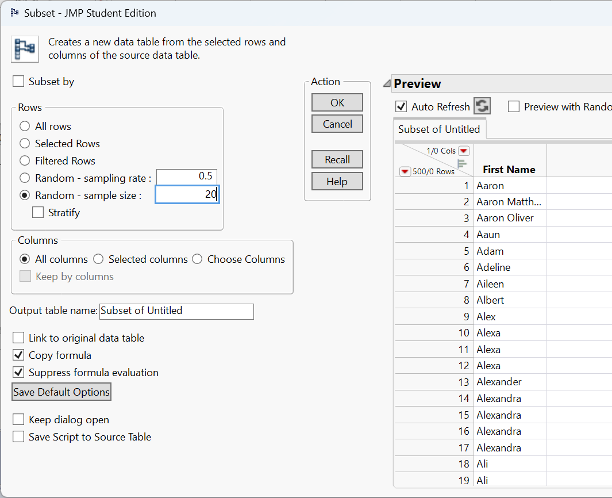
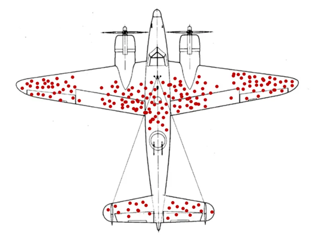

# Collecting Data

## Sampling Methods {#sec-sampling_methods}

> "And I knew exactly what to do. But in a much more real sense, I had no idea what to do." - Michael Scott

A sample is a subset of a population, but not every subset is equally informative. A **representative sample** mirrors the key characteristics of the population closely enough that analyzing the sample leads to the same conclusions you would reach by studying the entire population. Put differently, it is a smaller group whose results accurately reflect those of the larger group. Designing studies that produce representative samples lies at the core of statistics-it allows us to save time and resources without compromising the credibility of our conclusions.

### Probability vs. non-probability sampling

There are two big approaches to sampling:

-   In **probability sampling**, you use random mechanisms so that every member of the population has a known chance of being selected. This ensures that any differences between the sample and the population are due to random sampling error, not researcher choice, and makes it possible to quantify uncertainty in estimates.
-   In **non-probability sampling**, you choose participants based on convenience, volunteer responses, judgement or quotas. These methods are cheaper and often necessary for exploratory or qualitative work, but they make it hard to know whether the sample really reflects the population. Lack of a representative sample reduces the validity of conclusions and can introduce sampling bias.

Whenever you want to generalize, probability sampling is the gold standard.

### Simple random sampling (SRS)

In a **simple random sample (SRS)**, every individual in the population has an equal probability of being selected, and every possible sample of a given size is equally likely. To carry out an SRS, you must first have a **sampling frame**, which is a complete list of all units in the population. You then use a random mechanism-such as a random number generator or random number table-to choose the sample.

In practice, simple random sampling can be done **with replacement** or **without replacement**. Sampling without replacement is far more common in real studies, since it prevents the same individual from being selected more than once. Sampling with replacement is sometimes useful in theoretical settings, but it is rarely appropriate when collecting data from people or physical units.

The main advantage of an SRS is its fairness and transparency: because selection is purely random, it avoids systematic bias in who is included. However, SRS also has limitations. It requires a complete and accurate sampling frame, which may not exist or may be difficult to obtain. In addition, when a population is geographically dispersed or hard to reach, implementing an SRS can be costly or impractical.

::: {.example title="Example 2.1"}
Suppose you want to survey 100 employees of a social media marketing company out of 1,000. You assign each employee a number from 1 to 1,000 and use a random number generator to select 100 distinct numbers. The employees corresponding to those numbers form your sample. Because each employee had an equal chance of being selected, the resulting sample is likely to be representative, especially if the sample size is sufficiently large.

To do this in JMP, suppose you have the list of 1,000 names like you see below.

 

If we wanted to get a random sample of 20, we would just click on Tables&#8594;Subset.

 

This will open up the following window.

 

Selecting 'Random - sample size', entering the desired sample size in the box next to it, and then clicking 'OK' will make a new data table with 20 of the names selected at random.

Note the option above labeled 'Random - sampling rate' will allow you to choose a proportion of the population to randomly sample instead of choosing a sample size. 
:::

::: {.example title="Example 2.2"}
A university wants to estimate the average number of hours per week that undergraduates spend studying. The registrar has a list of all 12,000 enrolled undergraduates. Each student is assigned an ID number, and a computer randomly selects 400 unique IDs. Those students are contacted and asked to report their weekly study hours. This procedure produces a simple random sample because every student had the same chance of being included.
:::

### Systematic sampling

**Systematic sampling** is a practical alternative to simple random sampling that reduces logistical effort while preserving much of the randomness. Instead of selecting units entirely at random, you begin with an ordered sampling frame and choose every $k$-th unit, where $k$ is the *sampling interval*. The value of $k$ is typically determined by dividing the population size ($N$) by the desired sample size ($n$) (so $k \approx N/n$). To introduce randomness, you first select a random starting point between 1 and $k$, then continue by selecting units at fixed intervals.

When the ordering of the list is unrelated to the variable being studied, systematic sampling closely approximates a simple random sample. It is often faster, easier to explain, and simpler to implement-especially in field settings or large administrative lists-because it avoids repeated random number generation.

However, systematic sampling carries an important risk: **periodicity**. If the list has a repeating structure or is sorted in a way that is correlated with the outcome of interest, the method can unintentionally overrepresent some types of units and underrepresent others. For example, if employees are grouped by department, shift, or seniority, selecting every $k$-th name may systematically favor or exclude certain groups. In such cases, the resulting sample may be biased, even though the selection rule appears objective.

::: {.example title="Example 2.3"}

All employees of a company are listed in alphabetical order. You want to sample 100 employees from a list of 1,000, so you set $k = 10$. You randomly select a starting position among the first ten names-say, the 6th person-and then select every 10th person on the list (6, 16, 26, 36, …) until 100 employees are chosen. This approach is easy to carry out and avoids duplicates, but it may be problematic if the alphabetical ordering aligns with job roles, seniority, or family relationships, which could distort the representativeness of the sample.

:::


### Stratified sampling


In **stratified sampling**, the population is first divided into distinct, non-overlapping subgroups called *strata*, based on a characteristic that is relevant to the study (such as gender, age group, geographic region, or job level). Each individual in the population belongs to exactly one stratum. After forming the strata, a random sample is drawn *within each stratum*, rather than from the population as a whole.

The most common approach is *proportional stratified sampling*, where the number of units sampled from each stratum is proportional to that stratum’s share of the population. This guarantees that the composition of the sample mirrors the composition of the population with respect to the stratifying variable. In some studies, researchers may intentionally oversample smaller or especially important strata (called *disproportionate stratified sampling*) to ensure enough data for detailed subgroup analysis, adjusting for this later in the analysis.

Stratified sampling has several advantages. By forcing representation from each stratum, it prevents small but important subgroups from being underrepresented due to random chance. In addition, when individuals within a stratum are relatively similar to one another but different across strata, stratification can substantially **reduce sampling variability**, leading to more precise estimates than a simple random sample of the same size.

The main drawback is increased complexity. Stratified sampling requires reliable information to classify individuals into strata before sampling begins, as well as separate sampling procedures within each stratum. This can increase administrative effort, cost, and the potential for implementation errors if strata are poorly defined or misclassified.

::: {.example title="Example 2.4"}

A company has 800 junior employees and 200 senior employees. Because job seniority is expected to influence workplace satisfaction, the company divides employees into two strata: junior and senior. To draw a sample of 100 employees that reflects the population structure, the company randomly selects 80 junior employees and 20 senior employees. The resulting sample preserves the original 80/20 split, ensuring that both groups are appropriately represented and that comparisons between junior and senior employees are meaningful.

:::


### Cluster sampling

**Cluster sampling** also divides the population into groups, but the logic is fundamentally different from stratified sampling. In cluster sampling, each **cluster** is intended to be a small-scale version of the entire population-a *mini-population* that contains a diverse mix of individuals. Rather than ensuring representation from every group, the goal is to reduce cost by limiting how many groups are studied.

To implement cluster sampling, the population is first partitioned into clusters, often based on geography, organizational units, or naturally occurring groupings (such as schools, offices, or neighborhoods). A random sample of clusters is then selected, and data are collected from *all individuals within the selected clusters* (one-stage cluster sampling) or from a random subset of individuals within those clusters (two-stage cluster sampling).

The primary advantage of cluster sampling is efficiency. When populations are large and geographically dispersed, it is often impractical or prohibitively expensive to reach individuals scattered across many locations. By concentrating data collection within a small number of clusters, researchers can dramatically reduce travel, coordination, and administrative costs. For this reason, cluster sampling is commonly used in large-scale surveys, public health studies, and educational assessments.

The main drawback is increased variability. If individuals within a cluster tend to be similar to one another-and clusters differ meaningfully from one another-then sampling only a few clusters may fail to capture the full diversity of the population. This *intra-cluster similarity* reduces the effective amount of information in the sample and can lead to larger sampling variance than a simple random sample of the same size. In practice, this means cluster sampling often requires a larger total sample size to achieve comparable precision.

::: {.example title="Example 2.5"}
A company operates offices in 10 cities across the country, each employing roughly the same number of workers and performing similar roles. To conduct an employee satisfaction survey, the company randomly selects 3 offices and surveys every employee in those locations. This approach greatly reduces travel and administrative effort. However, it relies on the assumption that offices are reasonably similar; if workplace culture or management practices vary substantially by city, the survey results may be less precise or even misleading.

:::


### Non-probability methods

In some research settings, random selection is impossible, impractical, or unnecessary. **Non-probability sampling methods** rely on researcher judgment or participant availability rather than chance. Because individuals do not have known or equal probabilities of selection, these methods cannot guarantee that the sample is representative of the population. As a result, conclusions drawn from non-probability samples should be interpreted cautiously and generally should not be generalized to a broader population.

Despite this limitation, non-probability methods are widely used in practice. They are common in exploratory studies, pilot research, qualitative work, and studies involving hard-to-reach populations, where constructing a complete sampling frame or implementing random selection is unrealistic. In such cases, the goal is often to generate insights, identify patterns, or refine research questions rather than to make precise population-level estimates.

#### Convenience sampling

A **convenience sample** consists of individuals who are easiest for the researcher to access. Participants are selected simply because they are readily available, willing, or nearby. This approach is inexpensive, fast, and easy to implement, which makes it appealing for classroom projects, preliminary studies, and early stages of research.

However, convenience sampling comes with serious limitations. Because selection is driven by accessibility rather than randomness, certain groups may be systematically overrepresented while others are excluded entirely. This can introduce substantial bias, meaning the results may reflect the characteristics of the convenience group rather than those of the population of interest. For this reason, findings from convenience samples should not be treated as broadly generalizable.


::: {.example title="Example 2.6"}

You want to learn about student perceptions of campus support services. After each of your classes, you ask students in the room to complete a short survey. While this approach is quick and easy, it only captures the views of students enrolled in your classes. These students may differ from the broader student body in major, year, motivation, or academic engagement, so the resulting sample is not representative of all students at the university.

:::


#### Voluntary response sampling

A **voluntary response sample** is formed when individuals choose for themselves whether to participate in a study. Invitations are typically broad-such as open surveys, online polls, or public feedback forms-but participation is entirely self-selected. Because respondents are not randomly chosen, the resulting sample often reflects the views of those who feel most strongly about the topic.

The key issue with voluntary response sampling is *self-selection bias*. People with intense opinions, strong grievances, or high levels of engagement are much more likely to respond than those who are indifferent or moderately affected. As a result, voluntary response samples tend to exaggerate extremes and provide a distorted picture of average attitudes or behaviors.

Although voluntary response samples are easy and inexpensive to collect, they are inappropriate for drawing conclusions about a population as a whole. They are best used for gathering feedback, identifying potential concerns, or generating hypotheses rather than for making quantitative estimates.

::: {.example title="Example 2.7"}

You email a survey to the entire student body asking for opinions about a new campus policy. Only a small fraction of students respond, and those responses come primarily from students who are either strongly supportive or strongly opposed. Students with neutral or mildly held views are far less likely to participate, so the results cannot be trusted to represent the typical student’s perspective.

:::


#### Purposive sampling

In **purposive sampling**, participants are deliberately selected by the researcher because they possess characteristics, experiences, or knowledge that are especially relevant to the research question. Rather than aiming for representativeness, the goal is to obtain *information-rich cases* that can provide deep insight into a particular phenomenon.

This method is common in qualitative research, case studies, and applied settings where understanding *how* or *why* something occurs is more important than estimating its prevalence. Researchers often aim for diversity within the purposive sample-such as selecting participants with different backgrounds or experiences-to capture a range of perspectives.

The main limitation of purposive sampling is that selection is subjective and non-random. While the resulting data can be rich and informative, it cannot support population-level inference or precise numerical claims.

::: {.example title="Example 2.8"}

You want to understand how well university services support students with disabilities. You intentionally recruit students with different types of disabilities and varying levels of accommodation needs. This allows you to explore common challenges and contrasts across experiences, but it does not allow you to estimate what proportion of all disabled students share those experiences.

:::

#### Snowball sampling

**Snowball sampling** is a recruitment method in which existing participants help identify and recruit additional participants. The process typically begins with a small number of initial subjects, who then refer others they know who meet the study criteria. Over time, the sample grows through these social connections, much like a snowball rolling downhill.

Snowball sampling is especially useful for studying *hidden, stigmatized, or hard-to-reach populations*, such as individuals experiencing homelessness, undocumented workers, or members of informal networks. In these cases, traditional sampling frames may not exist, and trust is often essential for participation.

However, snowball sampling provides little control over who is included. Because referrals occur within social networks, the sample may overrepresent individuals who are more connected or similar to the initial participants. This can introduce substantial bias and limit the generalizability of findings.

::: {.example title="Example 2.9"}

To study experiences of homelessness, you begin by interviewing one participant who agrees to take part in the study. She then introduces you to others she knows who are also homeless, and those participants provide additional referrals. While this approach allows you to access a difficult-to-reach population, the resulting sample may reflect a narrow subset of experiences shaped by shared social connections.

:::


### Recap

| **Keyword** | **Definition** |
|----------------------|--------------------------------------------------|
| **Representative sample** | A sample that accurately reflects key characteristics of the population. |
| **Probability sampling** | Sampling technique using random selection so each unit has a known chance of inclusion. |
| **Non-probability sampling** | Sampling techniques based on convenience or judgement without randomisation. |
| **Simple random sampling** | Every unit has an equal chance of selection; implemented via random number generators. |
| **Systematic sampling** | Selecting every $k$-th unit from an ordered list after a random start. |
| **Stratified sampling** | Dividing the population into subgroups and randomly sampling within each subgroup. |
| **Cluster sampling** | Randomly selecting entire groups (clusters) and studying all units within them. |
| **Convenience sampling** | Including the most accessible units; prone to sampling and selection bias. |
| **Voluntary response** | Sampling based on participants who choose to respond, often those with strong opinions. |
| **Purposive sampling** | Selecting cases based on researcher judgement of what is most informative. |
| **Snowball sampling** | Recruiting participants via referrals from initial subjects, often for hidden populations. |

### Check your understanding

::: {.callout-note collapse="false" title="Problems"}

1.  You want to estimate the average GPA of all first-year students at your university.

    a)  Name two probability sampling methods you could use.
    b)  Briefly explain why a convenience sample of your friends might mislead you.

2.  A researcher selects every 5th name from a sorted list of patients to survey. What sampling method is this? Under what circumstance might this method introduce bias?

3.  Compare stratified sampling and cluster sampling. Give an example of a scenario where each would be appropriate.

4.  Explain why voluntary response samples often yield extreme views and cannot be trusted for generalizing to a population.

5.  In JMP, how could you create a simple random sample of 150 observations from a data table with 2,000 rows?
:::

::: {.callout-tip collapse="true" title="Solutions"}
1.  (a)*Simple random sampling* (assign each first-year student a number and randomly select using a random number generator); *stratified sampling* (divide students by major or residence hall and sample proportionally within each group). (b) Your friends are likely from similar classes or social circles, so they may have similar study habits; they might not reflect the broader student body.

2.  This is *systematic sampling*. It works well if the list has no pattern related to the outcome. If patients are sorted by appointment time, every 5th patient might always be a morning appointment, which could bias results if morning and afternoon patients differ.

3.  *Stratified sampling* divides the population into meaningful groups and samples within each (e.g., sampling men and women separately when studying height). It ensures each subgroup is represented. *Cluster sampling* selects whole groups (e.g., choosing three hospitals at random and surveying all nurses within them) to save cost when the population is geographically spread out.

4.  People with strong positive or negative feelings are more likely to volunteer, while those who are neutral remain silent. This *self-selection* skews the sample, so the responses do not reflect the average opinion in the population.
:::

## Experimental Design

> "All life is an experiment. The more experiments you make the better." -Ralph Waldo Emerson


Statistics provides two complementary approaches for gathering evidence: **surveys** and **experiments**. In a survey, we select individuals from a population, collect information by asking questions, and summarize the resulting data. In an experiment, we actively assign treatments to units and observe their responses. In both cases, sound inference depends on thoughtful sampling and careful study design. While other methods of data collection exist, surveys and experiments are the approaches most people have in mind when they think about gathering data.


### Principles of good experimental design

The goal of an experiment is to **isolate the causal effect of a treatment** by systematically controlling other sources of variation. Experiments give the researcher direct control over how treatments are assigned. To ensure that any observed differences in outcomes can be attributed to the treatment itself-and not to hidden biases or confounding factors-well-designed experiments rely on four core principles.


#### Randomization

**Randomization** is the foundation of experimental design. Assigning experimental units to treatment conditions by chance ensures that, on average, the groups being compared are similar with respect to both observed characteristics (such as age or prior experience) and unobserved characteristics (such as motivation or genetic differences). This balance allows differences in outcomes to be interpreted as causal effects of the treatment rather than artifacts of preexisting differences.

In a **completely randomized design**, each unit is assigned to a treatment independently of the others. For example, in a sleep study, students might be randomly assigned to different cell phone usage limits before bedtime. This approach is simple and effective when experimental units are fairly homogeneous.

In a **randomized block design**, units are first grouped into blocks based on a characteristic known to influence the response, and treatments are then randomly assigned within each block. For instance, agricultural plots might be blocked by rainfall zone before assigning fertilizer types. Blocking removes predictable variation due to the blocking variable, allowing randomization to work more efficiently within each group.

Randomization also applies beyond treatment assignment. In industrial or laboratory settings, the *order of experimental runs* should be randomized to prevent time-related factors-such as equipment warming, operator fatigue, or ambient temperature-from becoming confounded with treatment effects.

::: {.example title="Example 2.10"}
In a drug study with 20 mice and two test kits (A and B), you might randomly assign 10 mice to kit A and the remaining 10 to kit B. Differences in age, weight, or health are then spread randomly across the two groups, preventing these factors from systematically favoring one treatment over the other.

:::


#### Control and placebo

A well-designed experiment includes a meaningful comparison, typically between a **treatment group** and a **control group**. The control group provides a baseline against which the treatment effect is measured. Depending on the context, the control may receive no treatment, standard care, or a **placebo**-a treatment designed to mimic the experience of receiving the real intervention without containing the active ingredient.

Placebo controls are especially important in medical and psychological studies because participants’ expectations alone can influence outcomes. Improvements due to belief, attention, or the act of being treated are known as **placebo effects**. By giving both groups identical experiences except for the active component, researchers can attribute differences in outcomes specifically to the treatment.


#### Replication

**Replication** refers to applying each treatment to multiple experimental units. Replication is essential because outcomes naturally vary from unit to unit, even under identical conditions. By observing this variability, researchers can estimate the amount of random noise in the data and determine whether observed differences between treatments are larger than would be expected by chance alone.

Replication increases the *precision* of estimated treatment effects and provides the information needed for statistical inference. A single observation per treatment cannot distinguish a genuine effect from an unusual outcome.

::: {.example title="Example 2.11"}

Measuring battery life under a specific charging condition using several batteries gives a far more reliable estimate than testing just one battery, which might be unusually good or unusually poor.

:::

#### Blocking

**Blocking** is used when a nuisance variable-one that is not of primary interest but is known to affect the response-can be identified in advance. In a **block design**, experimental units are grouped into relatively homogeneous blocks based on this variable, and treatments are randomized within each block.

Blocking reduces unexplained variability by accounting for known sources of variation. This leads to more precise estimates of treatment effects without increasing sample size.

Natural blocking structures often arise in practice. In biological experiments, animals may be grouped by litter; in chemical experiments, samples may come from different batches; in education studies, students may be grouped by classroom. Treating these groupings as blocks and randomizing within them prevents block-level differences from obscuring the treatment effect.

### Putting the principles together

Strong experimental designs typically combine these principles rather than relying on just one. For example, an agricultural study might block plots by rainfall zone, randomly assign fertilizer treatments within each block, and replicate measurements across multiple growing seasons.

Experiments also differ in structure. In **between-subjects designs**, each unit receives exactly one treatment condition. In **within-subjects** (or **repeated-measures**) designs, each unit experiences all treatment conditions, usually in a randomized or counterbalanced order. Within-subjects designs reduce variability by allowing each unit to serve as its own control, but they require careful attention to *order effects*, such as learning, fatigue, or carryover. Randomizing or counterbalancing the order of treatments is essential to preserve validity.

Together, randomization, control, replication, and blocking form the backbone of experimental design, enabling researchers to make credible causal claims from data.


### Designing unbiased survey questions

High-quality surveys require care in two distinct areas: **how respondents are selected** and **how questions are written**. Sampling determines *who* provides data (see @sec-sampling_methods); question design determines *what* information those respondents actually provide. Even a perfectly representative sample can produce misleading results if the questions themselves are biased, confusing, or poorly structured.

Well-designed questions are clear, neutral, and interpretable in the same way by all respondents. Poorly designed questions can systematically distort responses, introduce bias, and lead decision-makers to draw incorrect conclusions. Below are several common pitfalls in survey question design, along with examples and revisions.

#### Leading questions

**Leading questions** subtly (or not so subtly) push respondents toward a particular answer by framing one response as more reasonable, popular, or desirable than others. This can inflate support for a policy, product, or opinion simply through wording rather than genuine sentiment.

*Biased:*

> “Don’t you agree that our new app is much easier to use?”

This wording assumes agreement and pressures respondents to conform.

*Unbiased:*

> “How would you rate the ease of use of our new app?”

*Another example:*
*Biased:* “Most students think this course is well organized. Do you agree?”
*Unbiased:* “How would you rate the organization of this course?”


#### Loaded questions

**Loaded questions** embed an assumption-often a controversial or emotionally charged one-into the question itself. Respondents are forced to accept the premise in order to answer, even if they disagree with it.

*Biased:*

> “When did you stop wasting time on your phone?”

This question assumes the respondent wastes time on their phone and that they have already stopped.

*Unbiased:*

> “How much time do you spend on your phone each day for non-work activities?”

*Another example:*
*Biased:* “Why do you support unfair tuition increases?”
*Unbiased:* “What is your opinion on recent tuition increases?”


#### Double-barreled questions

**Double-barreled questions** ask about two (or more) distinct issues but allow only a single response. Because respondents may have different opinions about each component, the resulting data are ambiguous and difficult-or impossible-to interpret.

*Biased:*

> “Do you intend to leave work and return to full-time study this year?”

A respondent might plan to leave work but not return to school, or vice versa.

*Unbiased:*

> “Do you intend to leave your current job this year?”
> “Do you intend to return to full-time study this year?”

*Another example:*
*Biased:* “How would you rate our products and level of service?”
*Unbiased:*

> “How would you rate the quality of our products?”
> “How would you rate the quality of our customer service?”


#### Ambiguous wording

**Ambiguous wording** occurs when a question uses vague terms or phrases that different respondents may interpret differently. When this happens, people may answer different questions even though they are responding to the same survey item.

*Biased:*

> “How do we compare to our competitors?”

Respondents may interpret this as referring to price, quality, customer service, innovation, or brand reputation.

*Unbiased:*

> “Compared to our competitors, how would you rate our prices?”
> “Compared to our competitors, how would you rate our customer service?”

*Another example:*
*Biased:* “How often do you exercise regularly?”
*Unbiased:* “On how many days per week do you engage in at least 30 minutes of physical activity?”


### Why this matters

Survey questions shape the data you collect. Poorly worded questions can introduce bias just as surely as a flawed sampling method. Clear, neutral, and focused questions help ensure that responses reflect what respondents truly believe or experience, rather than how the question guided them. In practice, careful question design often requires multiple drafts, pilot testing, and revision-but the payoff is data that support credible, defensible conclusions.


To craft unbiased and effective survey questions, researchers should follow several key principles. These guidelines help ensure that respondents interpret questions consistently and feel free to answer honestly, leading to data that support meaningful conclusions.

1. **Use neutral language.**
   Questions should be phrased without emotionally charged words, value judgments, or implied “correct” answers. Neutral wording allows respondents to express their true opinions rather than reacting to the tone of the question. Even subtle cues-such as describing a policy as “beneficial” or “harmful”-can influence responses. Replacing evaluative language with descriptive phrasing helps minimize this source of bias.

2. **Be specific and clear.**
   Vague terms can mean different things to different respondents. Whenever possible, define key concepts, specify time frames, and avoid shorthand that assumes shared understanding. For example, instead of asking “How often do you use the library?” a clearer question would be “How many times have you visited the library in the past month?” Specific wording improves consistency and makes responses easier to interpret and analyze.

3. **Ask one thing at a time.**
   Each survey item should measure a single concept. When a question combines multiple ideas, respondents may agree with one part but not the other, producing answers that are difficult to interpret. Splitting complex questions into separate items allows each concept to be measured cleanly and reduces confusion for respondents.

4. **Balance response options.**
   Response scales should be symmetrical and evenly spaced, offering a full range of plausible choices. For example, a 5-point Likert scale ranging from “Strongly disagree” to “Strongly agree” treats positive and negative responses equally and includes a neutral midpoint if appropriate. Unbalanced or uneven scales can push respondents toward certain answers and distort the results.

5. **Pilot test your survey.**
   Even well-intentioned questions can be misunderstood. Pilot testing the survey with a small group of respondents helps identify ambiguous wording, confusing response options, or unintended interpretations. Feedback from pilot tests often reveals issues that are not obvious to the survey designer but can significantly affect data quality if left unaddressed.

Together, these principles promote clarity, neutrality, and fairness in survey design. By reducing confusion and bias, they help respondents provide thoughtful, accurate answers-and help researchers draw conclusions that are trustworthy and defensible.


### Recap

| **Term** | **Definition** |
|-------------------|-----------------------------------------------------|
| **Random assignment** | Assigning sampled units to treatment conditions by chance to create comparable groups. |
| **Treatment group / control group** | Groups receiving the experimental intervention and baseline comparison, respectively. |
| **Placebo** | An inert treatment used to mimic the experience of the intervention to control for expectations. |
| **Replication** | Repeating the same treatment on multiple experimental units to estimate variability. |
| **Blocking** | Grouping similar units and randomizing within each group to control a nuisance factor. |
| **Between-subjects design** | Each unit experiences only one condition; comparisons are across subjects. |
| **Within-subjects design** | Each unit experiences all conditions in random order. |
| **Leading question** | A survey question that suggests a particular answer. |
| **Loaded question** | A survey question containing an assumption or implication. |
| **Double-barreled question** | A single question that asks about two things. |
| **Ambiguous wording** | Vague terms that can be interpreted differently by different respondents. |

### Check your understanding

::: {.callout-note collapse="false" title="Problems"}

1.  Explain the difference between **random sampling** and **random assignment**. Why are both important, and in what contexts do they apply?
2.  Name the four principles of good experimental design and give a brief example of each.
3.  Consider this survey question: “How satisfied are you with the cost and quality of your textbooks?” Identify the problem and rewrite the question.
4.  In a study of exam performance, 60 students volunteer for tutoring and 60 do not. The volunteer group has a higher average GPA than the non-volunteer group. Explain why this study may not show that tutoring causes better performance. How could you redesign it?
:::

::: {.callout-tip collapse="true" title="Solutions"}
1.  *Random sampling* determines who gets into the study. Every member of the population has a known chance of selection, improving generalizability. *Random assignment* determines which condition participants experience, creating comparable groups and allowing causal conclusions. Surveys rely on random sampling; experiments rely on random assignment.

2.  **Randomization:** assign units by chance (e.g., randomize phone use levels to study sleep). **Control/placebo:** include a baseline or placebo condition to isolate the treatment effect. **Replication:** repeat treatments on multiple units, like testing several batteries under the same condition. **Blocking:** group units by a nuisance factor (e.g., soil type) and randomize within blocks.

3.  The question is *double-barreled*-it asks about cost *and* quality. Rewrite as two separate questions (e.g., “How satisfied are you with the cost of your textbooks?” and “How satisfied are you with the quality of your textbooks?”).

4.  Volunteers may differ systematically from non-volunteers (e.g., motivation or prior GPA). Random assignment is missing. To infer causality, randomly assign students to tutoring or control groups and compare outcomes, possibly blocking on prior GPA.
:::

## Observational Studies vs. Experiments

> "You can observe a lot by just watching." - Yogi Berra

At first glance, collecting data looks the same whether you’re watching what happens or deliberately changing something. But *how* you gather the data matters tremendously for what you can conclude.

### Observational studies: watching without intervening

In an **observational** study, researchers record what happens without actively assigning exposures or treatments. Common types include:


#### Cohort Studies

**Cohort studies**, where a group of people linked by a characteristic (e.g., birth year) is followed over time. Researchers compare outcomes between those exposed to some factor and those not exposed.

A classic example of a cohort study is the Framingham Heart Study (FHS), which has been described in detail in the *International Journal of Epidemiology*. In 1948 the National Heart Institute recruited a community-based cohort of 5,209 adults aged 30–59 years from Framingham, Massachusetts, to investigate causes of cardiovascular disease (CVD). Two of every three families in the town were randomly sampled and invited; 4,494 (about 69%) agreed to participate, and an additional 715 volunteers joined. This initial **prospective cohort** has been followed every **two to four years** with detailed medical histories, physical examinations, electrocardiograms and laboratory tests. By following participants longitudinally for decades, the FHS identified major risk factors for CVD-such as high blood pressure, cholesterol, and smoking-helping to shape modern cardiovascular prevention guidelines.


#### Case-Control Studies

**Case–control studies**, where people with a condition (“cases”) are compared to similar people without it (“controls”) to look for differences in past exposures.

For example, a German study[^02-1] compared 118 patients with a rare form of eye cancer called uveal melanoma to 475 healthy patients who did not have this eye cancer. The patients' cell phone use was measured using a questionnaire. On average, the eye cancer patients used cell phones more often. The cases were those who had developed uveal melanoma and the controls were those who did not uveal melanoma. The cell phone use was compared between the two groups.

[^02-1]: Stang, A., Anastassiou, G., Ahrens, W., Bromen, K., Bornfeld, N., & Jöckel, K. H. (2001). The possible role of radio frequency radiation in the development of uveal melanoma. *Epidemiology*, 7-12.

Because participants choose their own behaviors, observational data reflect the real world and are often the only ethical way to study harmful exposures. For example, you can’t ethically assign people to smoke or not smoke, so the long-term effects of smoking are studied by tracking smokers and non-smokers over time.

Observational studies are usually quicker and cheaper than experiments and have high ecological validity (they mirror everyday life). But they have a critical limitation: you can’t be sure whether differences in outcomes are caused by the exposure or by other factors that differ between groups. For example, a highly publicized 1985 study from Johns Hopkins University linked coffee consumption to an increased risk of heart disease, especially for heavy drinkers. The study's findings, published in the *American Journal of Epidemiology*, were later challenged by other research that pointed out the failure to adequately control for the effect of cigarette smoking. Once smoking was controlled for, the link between coffee consumption and increased risk of heart disease was no longer significant.

### Experiments: deliberately changing something

As discussed previously, in an **experiment**, researchers assign treatments or interventions to units and observe the effects. Randomization-assigning units by chance-ensures that, on average, the groups are comparable on both observed and unobserved characteristics. The classic experimental design is the completely randomized design: participants are randomly allocated to receive a new drug, a placebo, or no treatment, and outcomes are compared. Experiments are considered the gold standard for establishing causality because randomization eliminates systematic differences between groups.

Experiments also offer a controlled environment, making it easier to isolate the effect of a single factor. However, they can be expensive, time-consuming, or unethical to conduct.

For example, suppose we were interested in the association between eye cancer and smart phone use. Suppose we conduct an experiment, such as the following:

1.  Pick half the students from your school at random and tell them to use a smart phone each day for the next 50 years.
2.  Tell the other half of the student body not to ever use smart phones.
3.  Fifty years from now, analyze whether cancer was more common for those who used smart phones.

There are obvious difficulties with such an experiment:

1.  It's not **ethical** for a study to expose over a long period of time some of the subjects to something (such as smart phone radiation) that we suspect may be harmful.

2.  It's difficult in practice to make sure that the subjects **behave** as told. How can you monitor them to ensure that they adhere to their treatment assignment over the 50-year experimental period?

3.  Who wants to **wait** 50 years to get an answer?

Thus, an observational study would be preferred over an experiment.

### Why observational studies can mislead

Observational data are susceptible to **confounding**-a situation where a third factor influences both the exposure and the outcome, creating a spurious association. For example, an observational cohort might find that people who meditate have lower rates of heart disease. But meditators may also exercise more and eat healthier diets, making it unclear whether meditation or lifestyle explains the difference. Similarly, people who choose to take daily vitamins might generally have healthier habits, so observed vitamin benefits may reflect those habits rather than the vitamins themselves.

Randomization is the only method that can eliminate potential confounders by balancing both measured and unmeasured factors across treatment groups. In observational research, statistical methods like stratification, regression adjustment and propensity score matching can reduce bias, but they depend on untestable assumptions: all confounders must be measured correctly and modeled properly. Many important confounders may be unknown or infeasible to measure. Even meticulously controlled observational studies cannot remove all confounding. As a result, observational evidence alone “cannot support conclusions of **causation**”.

Below is a simple simulation illustrating confounding. Shoe size and reading ability appear positively related, but both are driven by age. When age is not controlled, a misleading association emerges.

```{r}
#| echo: false
#| message: false
#| warning: false
set.seed(2025)
n <- 150
age <- runif(n, 5, 18)                 # age in years
shoe <- 0.8 * age + rnorm(n, 0, 0.7)   # shoe size roughly increases with age
reading <- 5 * age + rnorm(n, 0, 5)    # reading ability increases with age
plot(shoe, reading, xlab = "Shoe size", ylab = "Reading score",
     main = "A spurious correlation driven by age")
```

The scatterplot shows a strong correlation between shoe size and reading, even though neither directly affects the other. The common cause is age. Observational studies must always consider whether a hidden variable like age could be responsible for an observed association.


### Recap

| **Term** | **Definition** |
|-----------------|-------------------------------------------------------|
| **Observational study** | A study in which researchers record exposures and outcomes without assigning treatments or interventions. |
| **Cohort study** | Observational design where a group is followed over time to compare outcomes between exposed and unexposed members. |
| **Case–control study** | Observational design where people with a condition (“cases”) are compared to similar people without the condition (“controls”) to look for differences in past exposures. |
| **Experiment** | A study where researchers introduce an intervention and randomly assign subjects to treatment or control groups. |
| **Confounding** | A situation where a third factor influences both the exposure and the outcome, potentially creating a spurious association. |

### Check your understanding

::: {.callout-note collapse="false" title="Problems"}

1.  A nutrition researcher recruits people who already take daily multivitamins and compares their health outcomes to people who do not.

    a)  Is this an observational study or an experiment?
    b)  Name at least two potential confounding variables.

2.  In a randomized trial, half the participants are assigned to eat a Mediterranean diet and half to continue their usual diet. After a year, the first group shows lower cholesterol. Explain why randomization strengthens the causal interpretation.

3.  A cohort study finds that people who bike to work have lower rates of depression than those who drive. Suggest two reasons why this association may not reflect a causal effect of biking.

4.  Describe a research question that would be unethical or impractical to answer via experiment but could be studied observationally. Explain why.
:::

::: {.callout-tip collapse="true" title="Solutions"}
1.  a)This is an **observational study** because participants choose whether or not to take multivitamins. b) Potential confounders include diet quality, exercise habits, socioeconomic status, access to healthcare, smoking status and other health behaviors.

2.  Randomization assigns diets by chance, so, on average, both known and unknown factors (age, lifestyle, genetics) are balanced across the groups. Therefore, differences in cholesterol are likely due to the diet rather than pre-existing differences.

3.  People who bike may have higher baseline fitness and better mental health; they might live in neighborhoods with better infrastructure or community support; they may also have lifestyles that promote well-being (e.g., more time outdoors). Any of these confounders could explain the observed association.

4.  Studying the long-term effects of smoking is unethical to do experimentally, because you can’t randomly assign people to smoke. Instead, researchers observe smokers and non-smokers and compare outcomes.
:::

## Sources of Bias

> "Normally if given a choice between doing something and nothing, I'd choose to do nothing. But I would do something if it helps someone do nothing. I'd work all night if it meant nothing got done." - Ron Swanson


When we talk about bias in statistics, we mean a **systematic error** built into the way we select or measure our data. Bias is different from random sampling error. Sampling error comes from the natural variability you get when you observe only part of the population and tends to shrink as sample sizes grow. Bias, by contrast, does not go away with bigger samples; a flawed design simply produces more confident wrong answers. That makes it important to understand the different ways bias sneaks into our studies.

### How bias differs from sampling error

Whenever we select a sample, the numbers we compute (like the mean or proportion) will vary from one sample to the next. This variability is called **sampling error**. If we repeated our survey many times with different random samples, the average of those sample statistics would be the true population value, and the spread among them would reflect sampling error. Increasing the sample size reduces sampling error, but it *does not* correct for systematic flaws in how the sample was chosen. When the method of collecting or measuring data systematically favors some outcomes over others, we call it **bias**. A biased sample can be huge and still be wrong because its error is baked into the design.

To illustrate the difference, imagine a population with a true average income of \$8 (in arbitrary units), made up of 70% low earners (income of 5) and 30% high earners (income of 15). Below we simulate two ways of sampling from this population: a fair simple random sample and a biased sample that over-selects high earners (80% high, 20% low). As the sample size grows, the random sample mean settles near the true average, while the biased sample mean stays high. This shows that increasing the sample size reduces random error but does not fix bias.

```{r}
#| echo: false
#| message: false
#| warning: false
library(tidyverse)

set.seed(20254)

# population and truth
pop <- c(rep(5, 7000), rep(15, 3000))
true_mean <- mean(pop)
sizes <- c(30, 100, 500, 1000)

# compute means for random and biased samples
df <- tibble(size = sizes) %>%
  mutate(
    random_mean = map_dbl(size, ~ mean(sample(pop, .x))),
    biased_mean = map_dbl(size, ~ {
      n_high <- round(0.8 * .x)   # oversample the 15s
      n_low  <- .x - n_high
      mean(c(
        sample(pop[pop == 15], n_high),
        sample(pop[pop == 5],  n_low)
      ))
    })
  )

# long format for ggplot
df_long <- df %>%
  pivot_longer(c(random_mean, biased_mean),
               names_to = "type", values_to = "mean") %>%
  mutate(type = recode(type,
                       random_mean = "Random sample",
                       biased_mean = "Biased sample"))

# y-limits similar to base R version
y_limits <- range(c(df$random_mean, df$biased_mean, true_mean))
y_limits <- c(y_limits[1] - 1, y_limits[2] + 1)

# plot
ggplot(df_long, aes(x = size, y = mean, color = type, shape = type)) +
  geom_line() +
  geom_point() +
  geom_hline(aes(yintercept = true_mean, color = "True mean", linetype = "True mean")) +
  scale_color_manual(values = c("Random sample" = "blue",
                                "Biased sample" = "red")) +
  scale_shape_manual(values = c("Random sample" = 16,
                                "Biased sample" = 17)) +
  scale_x_continuous(breaks = sizes) +
  coord_cartesian(ylim = y_limits) +
  labs(title = "Random error shrinks; bias remains",
       x = "Sample size", y = "Sample mean",
       color = NULL, shape = NULL, linetype = NULL) +
  theme_minimal(base_size = 13)

```

### Common sources of bias

Bias can enter at many points in the data-collection process. Here are some of the most common culprits:


#### Coverage (undercoverage) bias

A **coverage bias** occurs when some members of the population are not included in the sampling frame. The Literary Digest’s famous 1936 presidential poll relied on telephone directories and car registration lists, thereby missing less affluent voters who tended to support Franklin Roosevelt. Because those voters were excluded, the sample favored wealthier respondents and overpredicted Alfred Landon’s support.

::: {style="text-align: center;"}
{width="4in"}
:::

#### Nonresponse bias 

A **nonresponse bias** arises when selected individuals choose not to participate and the responders differ systematically from nonresponders. In the same 1936 survey only 25% of those sampled returned the mail-in ballot. Landon supporters were more likely to return the survey, so the results overestimated his popularity.

#### Voluntary response bias 

When people opt into a survey on their own-like call-in radio polls about controversial topics-the sample disproportionately includes individuals with strong opinions. This **voluntary response bias** can produce extreme results because moderate voices remain silent.


#### Convenience sampling bias

A **convenience sample** chooses whoever is easiest to reach. If you stand outside a gym to survey “all adults in the city,” your sample will overrepresent health-conscious people. Convenience sampling often leads to coverage problems.


#### Response (measurement) bias

Even if we select the right people, the way we ask questions or record data can introduce **response bias**. Response bias occurs when the measurement process influences the answer: leading questions or unbalanced answer choices can nudge respondents toward particular responses. **Social desirability bias** occurs when people underreport socially undesirable behaviors or overreport virtuous ones.

#### Survivorship bias

When we only observe “survivors” and ignore those that dropped out or failed, we can mistake success for the rule.

::: {style="float: left; position: relative; top: 0px; padding: 30px;"}
{width="2in"}
:::

The most famous example of this is the WWII bomber problem. During WWII, analysts tallied bullet holes on returning Allied bombers and saw clusters on wings and fuselage, with relatively few in engines and cockpit. The intuitive fix was to add armor where the holes were densest. Statistician Abraham Wald pointed out the trap: these data come only from planes that survived. Holes on the survivors mark places a plane can be hit and still make it home. The *missing* planes-those that didn’t return-are precisely the ones likely hit in the “clean” areas (e.g., engines). So Wald recommended reinforcing the *areas with the fewest holes* on the survivors, not the most. That’s survivorship bias: drawing conclusions from only the observed “winners” and ignoring the unseen “failures.”


#### Recall bias

In retrospective studies, participants may not remember past events accurately. People who have developed an illness might recall exposures differently than healthy controls, leading to systematic differences.

#### Interviewer bias

The interviewer’s tone, appearance or expectations can subtly influence responses. Neutral wording and training can reduce this effect.

#### Healthy-user bias and attrition bias 

People who choose to participate in certain programs or who remain in a study for its duration often differ from those who do not, leading to biased estimates.

Each of these biases stems from the way participants are chosen or how data are measured; they cannot be “averaged out” by larger samples.

### Mitigating bias

To minimize bias:

-   Use probability sampling whenever you want to generalize to a population. Random sampling helps guard against undercoverage and voluntary response bias.
-   Ensure your sampling frame matches your target population. Consider oversampling underrepresented groups and weighting responses to reflect their true proportion.
-   Follow up with nonresponders and offer multiple modes of participation to reduce nonresponse bias.
-   Design neutral, balanced questions and offer anonymity to reduce measurement and social desirability bias.
-   Document who was invited and who actually participated so you can assess potential biases.
-   In observational studies, adjust for measured differences between participants and nonparticipants using weighting or modeling; but remember that unmeasured biases may remain.


### Recap

| **Term** | **Definition** |
|--------------|----------------------------------------------------------|
| **Coverage bias** | Systematic error that arises when part of the population is missing from the sampling frame. |
| **Nonresponse bias** | Bias introduced when individuals who do not respond differ meaningfully from those who do respond. |
| **Voluntary response bias** | Bias caused by allowing people to opt into a survey; respondents with strong opinions dominate the sample. |
| **Response bias** | Bias that arises from flaws in the measurement process, such as leading questions or social desirability. |
| **Sampling error** | Natural variability in statistics from sample to sample; decreases with larger samples. |
| **Bias** | Systematic error due to design or measurement; does not diminish with larger samples. |
| **Survivorship bias** | Focusing only on observed “survivors” and ignoring those that failed, leading to overly optimistic conclusions. |

### Check your understanding

::: {.callout-note collapse="false" title="Problems"}

1.  A tech company sends an email survey to customers using its premium service. Over half of the recipients do not respond. The company concludes that 85 % of its customers are satisfied.

    a)  Identify two potential sources of bias.\
    b)  Suggest one way to mitigate each bias.

2.  A political action group hosts an online poll on its website asking visitors whether they support a proposed tax increase. Seventy-five percent say “no.” What type of bias is most likely, and why does this poll not reflect general public opinion?

3.  Suppose you draw a simple random sample of 1,000 Baylor students from a roster and send them a questionnaire. Only 200 students respond. How could you use follow-ups or weighting to reduce bias? Explain your reasoning.

4.  Explain the difference between sampling error and bias in your own words. Why can a huge sample still give a wrong answer?

:::

::: {.callout-tip collapse="true" title="Solutions"}
1.  (a)**Coverage bias** and **nonresponse bias**. The company sampled only premium users (ignoring basic or free users) and most of the sampled customers did not respond, so respondents may differ from nonrespondents. (b) To reduce coverage bias, draw a sample from all customers or weight responses to reflect the full user base. To reduce nonresponse bias, send reminders, offer incentives or provide alternative modes (e.g., phone, mail).

2.  This is **voluntary response bias**: only visitors who care enough to vote participate, and they may have strong opinions. A poll embedded on a partisan website cannot be generalized because participants are self-selected and not representative of the broader population.

3.  The low response rate introduces **nonresponse bias**. You could send follow-up reminders, offer incentives, or contact nonrespondents by phone to increase participation. If demographic data are available for all sampled students, you can apply **weights** so that the 200 responders reflect the distribution of the 1,000 sampled students (and thus the target population).

4.  *Sampling error* is the random fluctuation you see from one sample to the next; it decreases with larger samples. *Bias* is a systematic error built into the design or measurement; it doesn’t shrink with bigger samples. A huge convenience or volunteer sample can still give a wrong answer if it systematically excludes part of the population or asks questions in a biased way.\
:::
