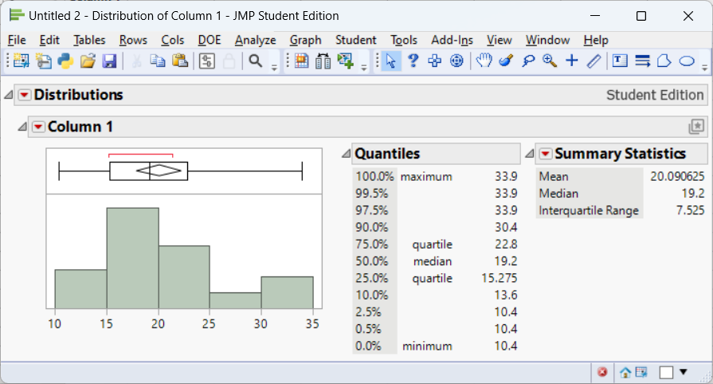
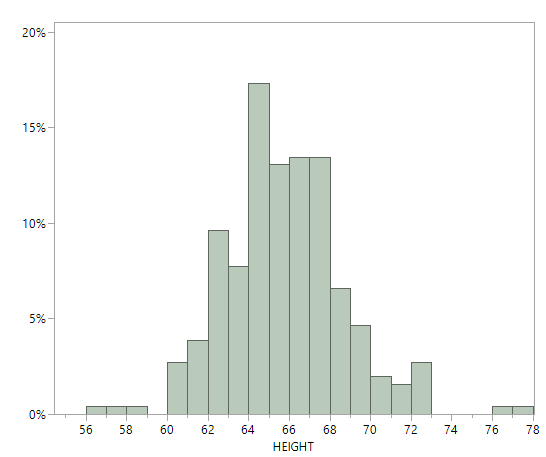
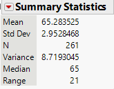

# Describing Data with Numbers

## Measures of Center (Mean, Median, Mode) {#sec-measures_of_center}

> "You keep using that word. I do not think it means what you think it means."   - Inigo Montoya


One of the first things we usually want to know about a numerical variable is where it *centers*. When we describe a value as “typical,” we are really asking a practical question: *If we had to summarize this entire group with a single number, which number would best represent it?*

In this section, we explore three common measures of center -the **mean**, **median**, and **mode** -and consider when each provides a sensible description of what is typical.


### What do we mean by “typical”?

A good measure of center should capture the *central tendency* of the data without being overly influenced by extreme values. However, no single summary works best in every situation. The “best” notion of typical depends on the *shape of the distribution*, the presence of *outliers*, and the *context* of the data.

The three most common measures of center, mean, median, and mode, answer the question of “typical” in different ways.


### The mean (arithmetic average)

The **mean** of a sample, often denoted $\bar{x}$, is the sum of all observations divided by the number of observations. If you imagine placing each data value as a weight on a number line, the mean is the *balance point* -the location where the line would balance perfectly.

Formally, for sample values $x_1, x_2, \dots, x_n$, the mean is
$$
\bar{x} = \frac{1}{n}\sum_{i=1}^n x_i.
$$

Because the mean uses *every observation*, it incorporates all available information and is mathematically convenient. However, this same feature makes the mean *sensitive to outliers*. A single unusually large or small value can pull the mean away from where most of the data lie, making it a poor description of what is typical.


::: {.example title="Example 4.1: Scutari data"}

Florence Nightingale is well known for her work in improving hospital conditions for British soldiers during the Crimean War. One dataset she examined recorded outcomes for soldiers treated in hospitals in Crimea and in Scutari, Turkey[^1].

[^1]: Small, H. (2020). *Nightingale's overlooked Scutari statistics*. **Significance**, 17(6), 28–33.

The file *scutari.jmp* contains the number of soldiers hospitalized in various regiments and the number who died. Consider the number of soldiers who died in Scutari for the first five regiments:

```{r}
#| echo: false
x <- c(93, 96, 42, 155, 94)
cat(t(x), sep=", ")
```

The mean is
$$
\begin{aligned}
\bar{x} &= \frac{1}{5}(93 + 96 + 42 + 155 + 94) \\
&= \frac{480}{5} \\
&= 96
\end{aligned}
$$

At first glance, 96 seems like a reasonable “typical” value for these data.

Now suppose a sixth regiment is added with 500 deaths. The data become:

```{r}
#| echo: false
x <- c(93, 96, 42, 155, 94, 500)
cat(x, sep=", ")
```

The new mean is
$$
\begin{aligned}
\bar{x} &= \frac{1}{6}(980) \\
&= 163.3
\end{aligned}
$$

Does 163.3 feel typical for this group? Clearly not. Most regiments had death counts well below 200, but the single extreme value dramatically inflates the mean. This example illustrates how *outliers can make the mean misleading* as a measure of center.

:::


::: {.example title="Example 4.2: Household income"}

Consider annual household incomes (in thousands of dollars) for a small neighborhood:

$$
45,\, 48,\, 50,\, 52,\, 55,\, 58,\, 60,\, 62,\, 65,\, 420
$$

Most households earn between \$45,000 and \$65,000 per year, but one household earns $420,000.

The mean income is
$$
\bar{x} = \frac{45 + 48 + 50 + 52 + 55 + 58 + 60 + 62 + 65 + 420}{10}
= 91.5
$$

A “typical” income of $91,500 does not reflect the reality for most households in this neighborhood. The single high-income household pulls the mean far above where the majority of incomes lie. This is why average income statistics are often criticized.

:::


### Adjusting the mean: trimmed means

Because of its sensitivity to extremes, the mean is sometimes modified to reduce the influence of outliers. A **trimmed mean** removes a fixed percentage of the smallest and largest observations before computing the average.

For example, a *10% trimmed mean* drops the lowest 10% and highest 10% of values, then averages the remaining data. This approach provides a compromise: it retains much of the information used by the mean while reducing the impact of extreme values.

Trimmed means are especially useful when data are moderately skewed or when a small number of outliers are present but not of primary interest.


#### Key takeaway

The mean is a powerful and widely used measure of center, but it answers the question of “typical” only when extreme values are not overly influential. When outliers are present -or when the distribution is strongly skewed -the mean can give a distorted picture, motivating the use of alternative summaries such as the median or trimmed mean.


### The median (middle value)

The **median** is the value that lies at the center of an ordered dataset. When the observations are arranged from smallest to largest, the median divides the data into two equal halves: *50% of the observations are at or below the median, and 50% are at or above it*.

How the median is computed depends on whether the number of observations is odd or even:

* For an **odd** number of observations, the median is the single middle value.
* For an **even** number of observations, the median is the average of the two middle values.

Because the median depends only on the *order* of the data and not on their numerical magnitudes, it is said to be *resistant* to extreme values. Large outliers may change the mean substantially, but they have little or no effect on the median unless they alter the ordering of the central observations.

This resistance makes the median a particularly useful measure of “typical” when distributions are *skewed* or contain *outliers*.


:::{.example title="Example 4.3: Scutari data again"}

Recall the Scutari death counts after adding an extreme value:

```{r}
#| echo: false
x <- c(93, 96, 42, 155, 94, 500)
cat(sort(x), sep = ", ")
```

There are six observations, so the median is the average of the third and fourth values in the ordered list:
$$
\text{median} = \frac{94 + 96}{2} = 95.
$$

Unlike the mean, which was pulled upward by the extreme value of 500, the median remains close to where most of the data lie. This robustness is why medians are often preferred for skewed data such as *incomes*, *house prices*, or *medical costs*, where a small number of unusually large values are common.

:::


:::{.example title="Example 4.4: Fuel efficiency of cars"}

Now consider a dataset that contains fuel efficiency (in miles per gallon) for various automobiles tested in the 1970s.

Suppose we examine the fuel efficiency of the *first 11 cars* in the dataset (an odd number of observations):

```{r}
#| echo: false
data(mtcars)

mpg_vals <- mtcars$mpg[1:11]
cat(sort(mpg_vals), sep = ", ")
```

Because there are 11 observations, the median is the *6th value* in the ordered list:

```{r}
#| echo: false
cat(median(mpg_vals))
```

This value represents the fuel efficiency of a “typical” car in this subset. Even if one of the cars had extremely poor or extremely high fuel efficiency, the median would remain stable unless that extreme value crossed the center of the ordered data.

This example illustrates why the median is often reported for performance measures like fuel economy, commute times, or household expenses -contexts where a few extreme cases should not define what is typical.

:::


The median answers the question of “typical” by focusing on *position rather than magnitude*. Its resistance to extreme values makes it a reliable measure of center for skewed distributions and data sets where outliers are common.


### The mode (most frequent value)

The **mode** of a dataset is the value that occurs *most frequently*. Unlike the mean and median, which describe the numerical center of a distribution, the mode describes what is *most common*. Because it depends only on frequency, the mode can be used with *categorical*, *ordinal*, and *quantitative* data.

A dataset may have:

* **One mode (unimodal)**  - a single most frequent value,
* **Two modes (bimodal)**  - often indicating two distinct groups,
* **More than two modes (multimodal)**  - suggesting additional structure or heterogeneity.

The mode is especially useful for *categorical variables* (such as favorite color or blood type) and *discrete quantitative variables* (such as number of visits or number of children), where identifying the most common outcome is meaningful. In these contexts, the mean may not even be defined, and the median may be less informative.

For *continuous variables* measured with fine precision, however, exact ties are uncommon. In such cases, the numerical mode may not be meaningful or may not exist at all. Instead, we often identify the mode visually as the **peak of a histogram**, representing the most densely populated region of the data rather than a single repeated value.

:::{.example title="Example 4.5: Clinic visit counts (discrete data)"}

Suppose a dental clinic records the number of visits made by each of 30 patients over the course of a year. The variable is a *discrete quantitative* count.

```{r}
#| echo: false
set.seed(2035)
visits <- rpois(30, lambda = 3)

cat(sort(visits), sep = ", ")
```

We can find the mode by identifying the most frequently occurring value.

```{r}
#| echo: false
temp = table(visits) 

# Convert to a data frame
count_df <- as.data.frame(temp)

# Set column names to "Value" and "Count"
colnames(count_df) <- c("Value", "Count")

# View the result
print(count_df, row.names = F)

```

In this dataset, the most common number of visits is *2*, making 2 the mode. Interpreted in context, this tells us that the *typical* patient visits the clinic about two times per year -not in the sense of an average, but in the sense of what happens most often.

This is a situation where the mode is particularly informative: patients and administrators may care most about the most common pattern of usage rather than a numerical balance point.

:::


:::{.example title="Example 4.6: Highway fuel efficiency (continuous data)"}

Now consider a dataset on fuel efficiency measurements for many car models.

We examine *highway miles per gallon* (`hwy`) for a subset of vehicles:

```{r}
#| echo: false
library(ggplot2)

hwy_vals <- mpg$hwy
```

Because highway fuel efficiency is measured on a continuous scale, exact repeated values are not especially meaningful. Instead, we identify the mode as the **peak of the distribution**, using a histogram.

```{r}
#| echo: false
mpg[mpg$cyl==4,] |> 
ggplot(aes(x = hwy)) +
  geom_histogram(binwidth = 3, color = "black", fill = "steelblue") +
  labs(
    x = "Highway miles per gallon",
    y = "Number of vehicles",
    title = "Distribution of highway fuel efficiency"
  ) +
  theme_minimal()
```

From the histogram, we see that the highest bar occurs around *28-32 mpg*, indicating the modal region of the distribution. Rather than a single numerical value, the mode here represents the *most common range* of highway fuel efficiency among these vehicles.

This approach is typical for continuous data: the mode is interpreted as a *region of highest density* rather than a single repeated observation.

:::


### Key takeaway

The mode answers the question: *What value occurs most often?* It is indispensable for categorical data, useful for discrete counts, and informative for continuous data when interpreted through histogram peaks. While it does not use all the information in the data the way the mean does, the mode often aligns closely with how people intuitively think about what is “typical.”


### The shape of a distribution


When examining a data distribution of a quantitative variable,
whether portrayed by a frequency table or by a graph such as a histogram, we should look for clear peaks. Does the distribution have a single mound? A distribution of such data is called *unimodal*. 

A distribution with two distinct mounds is
called *bimodal*. A bimodal distribution can result, for example, when a population
is polarized on a controversial issue. Suppose each subject is presented with
ten scenarios in which a person found guilty of murder may be given the death
penalty. If we count the number of those scenarios in which subjects feel the
death penalty would be just, many responses would be close to 0 (for subjects
who oppose the death penalty generally) and many would be close to 10 (for
subjects who think it’s always or usually warranted for murder).

A bimodal distribution can also result when the observations come from two different groups. For instance, a histogram of the height of students at a university might show two peaks, one for females and one for males. 


:::{.example title="Example 4.7: Highway fuel efficiency (bimodal)"}

Below is another subset of vehicles from the data described in Example 4.6. 

```{r}
#| echo: false
mpg |> 
ggplot(aes(x = hwy)) +
  geom_histogram(binwidth = 3, color = "black", fill = "steelblue") +
  labs(
    x = "Highway miles per gallon",
    y = "Number of vehicles",
    title = "Distribution of highway fuel efficiency"
  ) +
  theme_minimal()
```


We see here that there are two peaks thus we call this distribution *bimodal*. In Example 4.6, the subset of vehicles were just 4 cylinder (smaller engine) vehicles. The data in this histogram includes vehicles with 4, 6, and 8 cylinders (larger engines). Vehicles with larger engines tend to have less highway miles per gallon than those with smaller engines. The distributions of both of these groups (small and large engines) are mixed together in this histogram giving us the bimodal shape. 

:::


#### Distribution Shapes

What is the **shape** of the distribution? The shape of the distribution is often described as **symmetric** or **skewed**. 

A distribution is symmetric if the side of the distribution below a central value is
a mirror image of the side above that central value. The distribution is skewed
if one side of the distribution stretches out longer than the other side.

To *skew* means to stretch in one direction. A distribution is skewed to the **left** if the left tail[^3] is longer than the right tail. A distribution is skewed to the **right** if the right tail is longer than the left tail.

[^3]: The tails of a distribution are the parts that are for the lowest values and the highest values.


### Choosing the right measure

How do you decide which summary to use?  A few guidelines can help:

- Use the **mean** when the distribution is roughly symmetric without outliers.  The mean connects nicely to many statistical models and formulas.
- Use the **median** when the distribution is skewed or contains outliers.  The median provides a better sense of the typical case when extremes are present.
- Use the **mode** when describing the most common category or when the data are naturally discrete.  For continuous variables, speak of the “modal class” (the bin with the highest frequency).

You can also look at the relationship among mean, median, and mode to diagnose shape.  In a symmetric distribution these summaries coincide.  In a right‑skewed distribution the mean typically lies to the right of the median, and the mode is the smallest of the three; in a left‑skewed distribution the order reverses.


:::{.example title="Example 4.8: Illustration: skewness and the mean–median comparison"}

The following simulates data from a right‑skewed distribution and a symmetric distribution and plots them side by side.  Notice how the mean and median behave.

```{r}
#| echo: false
#| message: false
#| warning: false
set.seed(2401)

# Generate skewed and symmetric data
n <- 500
right_skewed <- rgamma(n, shape = 2, rate = 1)    # right skew
symmetric    <- rnorm(n, mean = 5, sd = 1.5)       # approximately symmetric

# Calculate means and medians
means   <- c(mean(right_skewed), mean(symmetric))
medians <- c(median(right_skewed), median(symmetric))

# Plot histograms with mean and median marked
op <- par(mfrow = c(1, 2), mar = c(4, 4, 2, 1))
hist(right_skewed, breaks = 30, col = "lightgray",
     xlab = "Value", main = "Right-skewed distribution")
abline(v = means[1],   lwd = 2, lty = 2)  # mean
abline(v = medians[1], lwd = 2, lty = 3)  # median
legend("topright", legend = c("Mean", "Median"), lty = c(2, 3), bty = "n")

hist(symmetric, breaks = 30, col = "lightgray",
     xlab = "Value", main = "Approximately symmetric distribution")
abline(v = means[2],   lwd = 2, lty = 2)  # mean
abline(v = medians[2], lwd = 2, lty = 3)  # median
legend("topright", legend = c("Mean", "Median"), lty = c(2, 3), bty = "n")
par(op)
```

In the right‑skewed distribution, the mean lies to the right of the median, reflecting the pull of larger values.  In the nearly symmetric distribution, the mean and median are close together.

:::

### Working in JMP

JMP makes it easy to compute and compare these summaries.

- Use **Analyze→Distribution** on a single numeric column.  The report shows the **Mean** and **Median** under the “Summary Statistics” section, and a “Quantiles” table lists the median explicitly.  The bar under the histogram marks the median with a vertical line.
- To find the **mode**, examine the histogram (bins with the highest bars) or create a **Tabulate** table.  Because continuous measurements rarely tie exactly, the notion of a mode is approximate.
- For a **trimmed mean**, click the red triangle ▶ next to the variable name in the Distribution platform, choose **Nonparametric→TrimmedMean**, and select the trimming proportion.

### Recap

| **Keyword**            | **Definition**                                                                                                               |
|------------------------|------------------------------------------------------------------------------------------------------------------------------|
| **Mean**               | The arithmetic average: sum of all observations divided by the number of observations; sensitive to extreme values.            |
| **Median**             | The middle value when data are ordered; half the observations are at or below it; resistant to outliers.                     |
| **Mode**               | The most frequently occurring value (or class) in the data; useful for categorical or discrete variables.                     |
| **Right-skewed**       | A distribution where the tail extends to the right; typically mean>median>mode.                                         |
| **Left-skewed**        | A distribution where the tail extends to the left; typically mean<median<mode.                                          |

### Check your understanding

::: {.callout-note collapse="false" title="Problems"}

1. A sample of commuting times (in minutes) for twelve workers is
$$
10,\ 12,\ 12,\ 15,\ 16,\ 17,\ 18,\ 18,\ 18,\ 20,\ 22,\ 90.
$$
Use these value for the following:

    a) Find the median commuting time.

    b) Find the mean commuting time.  How does the outlier affect the mean?

    c) If you were advising a city planner about what most commuters experience, which summary (mean or median) would you report?  Why?

2. For which of the following situations would the **mode** be a more informative summary than the mean or median?  Explain your reasoning.

    a) The test scores (0–100) from a class of 200 students.

    b) The favorite ice-cream flavors (chocolate, vanilla, strawberry, etc.) of 150 customers.

    c) The heights of 30 professional basketball players.

3. The median of five numbers is 8 and the mean is 10.  If four of the numbers are 3,7,8, and 20, what is the fifth number?  (Hint: Use the definitions of median and mean.)

4. Describe a situation in which the **trimmed mean** would be preferred over both the mean and the median.

:::

::: {.callout-tip collapse="true" title="Solutions"}


1. a)Ordering the commuting times yields 10,12,12,15,16,17,18,18,18,20,22,90.  With 12 observations, the median is the average of the 6th and 7th values: $(17 + 18)/2 = 17.5$ minutes. b)The mean is $(10 + 12 + 12 + 15 + 16 + 17 + 18 + 18 + 18 + 20 + 22 + 90)/12 = 268/12 \approx 22.33$ minutes.  The 90‑minute commute pulls the mean upward by about 5minutes compared to the median. c)For summarizing what most commuters experience, report the **median** (17.5minutes).  It better represents the typical commute and is not inflated by the one long commute.

2. a)**Mean or median.** Test scores on a bounded 0–100 scale often form a roughly bell‑shaped distribution; either mean or median can represent typical performance.  The mode might be less stable because exact scores can vary. b)**Mode.** Favorite flavors are categorical; reporting the most popular flavor (mode) is more meaningful than attempting to average flavors. c)**Mean or median.** Heights are quantitative; the mean or median conveys typical height.  The mode is less useful because exact duplicates are rare and height is nearly continuous.

3. With five numbers, the median is the third when ordered.  Because the median is 8, the third value (when the numbers are sorted) must be 8.  The numbers we know are 3,7,8,20 and an unknown $x$.  After sorting them, the median (middle value) must be 8, so the sorted list must be 3,7,8,$x$,20 (if $x \leq 20$) or 3,7,8,20,$x$ (if $x \geq 20$).  To satisfy a mean of 10, the sum of all five numbers is 5×10=50.  The known sum is 3+7+8+20=38, so $x = 12$.  Check the ordering: 3,7,8,12,20 has median 8 and mean 10.  Thus the fifth number is **12**.

4. Trimmed means are useful when you expect a few extreme observations in both tails but still want to use most of the data.  For example, in judging gymnastics or diving, a panel of judges gives scores; to guard against unusually high or low scores (perhaps due to bias), competitions often drop the highest and lowest score and average the rest.  A trimmed mean removes these extremes, producing a fairer overall score.

:::


## Measures of Variability 

> "In statistics, variation is the name of the game – without it there would be nothing to explain." – David Salsburg


If measures of center describe what is *typical*, measures of **variability** describe how much the data *deviate from that typical value*. Two datasets can share the same mean or median yet behave very differently in practice. One may be tightly clustered around the center, while the other is widely scattered, with values far from typical. Without a measure of spread, a measure of center alone can give a misleading sense of consistency or predictability.

Variability provides essential context. Knowing that the average commute time is 30 minutes is far less informative if commute times regularly range from 10 to 90 minutes than if they typically fall between 25 and 35 minutes. Measures of variability quantify this uncertainty and help us understand how much individual observations are likely to differ from the center.


### Why variability matters

Understanding variability is critical for assessing *reliability*, *risk*, and *precision*.

In everyday settings, variability affects decision-making. If daily commute times vary widely, planning becomes difficult and the “typical” commute time offers little reassurance. If test scores in a class are highly variable, a single average score may not accurately reflect most students’ experiences.

In applied settings, variability is often more important than the center. In manufacturing and quality control, low variability in part dimensions indicates a stable and well-controlled process, even if the average dimension is slightly off target. High variability, on the other hand, signals inconsistency and potential defects. Similarly, in finance, two investments with the same average return may carry very different levels of risk if one fluctuates much more than the other.

Variability also lies at the heart of *inferential statistics*. Measures such as variance and standard deviation quantify the natural randomness in data and determine how much confidence we can place in estimates, predictions, and conclusions. Larger variability generally means greater uncertainty, wider confidence intervals, and less precise inferences.

#### Measuring variability

There is no single “best” way to describe spread. Different measures emphasize different aspects of variability and are useful in different contexts. In this section, we will examine four commonly used summaries:

* The **range**, which captures the total spread from the smallest to the largest value,
* The **interquartile range (IQR)**, which focuses on the spread of the middle 50% of the data and is resistant to outliers,
* The **variance**, which measures average squared deviation from the mean,
* The **standard deviation**, which expresses typical deviation from the mean in the original units of the data.

Together, these measures provide a toolkit for describing and comparing variability across datasets and for understanding how much individual observations tend to differ from what is typical.


### The range

The *range* is the simplest measure of spread: it’s the difference between the largest and smallest values.

$$
\text{Range} = \max(x) - \min(x).
$$

The range is easy to compute and understand, but it depends only on two data points -making it very sensitive to outliers.  If one observation is extreme, the range may exaggerate typical variability.

Two data sets can
have the same range and be vastly different with respect to data variation.

For Example, Consider the data set A:
$$1, 3, 5, 6, 8, 9, 10, 15$$
and data set B:
$$1, 5, 5, 5, 5, 5, 5, 5, 5, 5, 15$$

Both data sets have the same range but are very different in how the data are spread out.


### Quartiles and the interquartile range (IQR)

When describing variability, we often want a measure of spread that is *not overly influenced by extreme values*. One way to achieve this is by focusing on **quantiles**, which divide an ordered dataset into portions containing equal fractions of the data.

The **first quartile** ($Q_1$) is the value below which approximately **25%** of the observations fall, and the **third quartile** ($Q_3$) is the value below which approximately **75%** of the observations fall. Recall from @sec-measures_of_center, the median separates the data into two equal halves. Thus, the median is also the **second quartile** ($Q_2$).

The **interquartile range (IQR)** measures the spread of the middle half of the data and is defined as
$$
\text{IQR} = Q_3 - Q_1.
$$

Because the IQR depends only on the central 50% of the data, it is a **resistant measure of spread**. Extremely large or small observations in the tails have little effect on it. For this reason, the IQR is especially useful for skewed distributions and data sets that contain outliers.

The IQR plays a central role in boxplots and in common rules for identifying potential outliers, which we will study in the next section.


### A note on quartile definitions

Unlike the mean or median, quartiles do not have a single universally accepted method for finding them. Different textbooks, software packages, and statistical traditions use slightly different rules for determining $Q_1$ and $Q_3$, particularly when the sample size is not divisible by four.

Some common approaches include:

* Computing quartiles as specific percentiles using interpolation,
* Defining quartiles as the medians of the lower and upper halves of the data,
* Using weighted averages when the quartile position falls between two observations.

As a result, you may see small numerical differences in reported quartiles depending on the method used. These differences are usually minor and do not change the overall interpretation, but they are important to be aware of when comparing results across software.

::: {.callout-tip collapse="true" title="For those who want to see the math:"}

JMP determines quartiles based on the following steps:

1. Sort the $n$ values in ascending order.

2. Compute the location index for the $p\text{th}$ percentile as
    $$
    r=(n+1)\frac{p}{100}
    $$
2. If $r\ge n$, then the $p\text{th}$ percentile is the maximum value in the data.

3. If $r\le 1$, then the $p\text{th}$ percentile is the minimum value in the data.

4. If $r$ is an integer, then the $p\text{th}$ percentile is the $r\text{th}$ value in the ordered data. 

5. If $r$ is not an integer, then the $p\text{th}$ percentile is found using the formula
$$
p\text{th percentile} = (1-f)y_i+(f)y_{i+1}
$$
where $i$ is the integer part of $r$ and $f$ is the fractional (decimal) part of $r$. 

The  [JMP documentation](https://www.jmp.com/support/help/en/18.2/#page/jmp/statistical-details-for-quantiles.shtml#ww1685306) provides an example where $n$ is 15 and the 75th and 90th percentiles are found. The value of $r$ for each is calculated to be
$$
\begin{align*}
r=(15+1)\frac{75}{100}=12\qquad\qquad r=(15+1)\frac{90}{100}=14.4
\end{align*}
$$

Since $r$ is an integer, then the 12th value in the sorted dataset is the 75th percentile. 

Suppose the values are 
```{r}
set.seed(1004)
x=sample(1:100, 15)
cat(x, sep=", ")
```

These values are sorted in ascending order:
```{r}
cat(sort(x), sep=", ")
```

The 12th value in this ordered dataset is 82. Thus the 75th percentile is 82.

For the 90th percentile, the value of $r$ is not an integer. Therefore, the 95th percentile is found by finding $i=14$ (since 14 is the integer part of 14.4) and $f=0.4$ (since 0.4 is the decimal part of 14.4). The 90 percentile is then calculated as

$$
\begin{align*}
90\text{th percentile} &= (1-0.4)y_{14}+(0.4)y_{14+1}\\
&= (0.6)89+(0.4)(100)\\
&=93.4
\end{align*}
$$

:::

:::{.example title="Example 4.9: Fuel efficiency of cars"}

Consider the fuel efficiency (miles per gallon) of cars first examined in Example 4.4. This time, we will use all 32 observations. 

```{r}
#| echo: false
data(mtcars)
mpg_vals <- mtcars$mpg
cat(sort(mpg_vals), sep = ", ")
```

We compute the first quartile, third quartile, and IQR using JMP:



From the JMP output, we see that $Q_1=15.275$ and $Q_3=22.8$. This leads to an interquartile range of 
$$
\text{IQR}=22.8-15.275=7.525
$$


:::


<!-- :::{.example title="Example 4.7: Waiting times at Old Faithful"} -->

<!-- Now consider a second real-world example from the built-in R dataset `faithful`, which records the waiting time (in minutes) between eruptions of the Old Faithful geyser in Yellowstone National Park. -->

<!-- ```{r} -->
<!-- #| echo: false -->
<!-- data(faithful) -->
<!-- wait_vals <- faithful$waiting -->
<!-- cat(sort(wait_vals)[1:30], "...,", sep = " ") -->
<!-- ``` -->

<!-- We compute the quartiles and IQR: -->

<!-- ```{r} -->
<!-- #| echo: false -->
<!-- quantile(wait_vals) -->
<!-- IQR(wait_vals) -->
<!-- ``` -->

<!-- The IQR here describes the variability of typical waiting times between eruptions, ignoring unusually short or long intervals. Because the distribution of waiting times is bimodal and somewhat skewed, the IQR provides a stable summary of spread that is not distorted by the extremes. -->

<!-- This is a setting where the IQR is far more informative than the range, and where small differences in quartile definitions across software have little practical impact. -->

<!-- ::: -->


### Why the IQR matters

The interquartile range focuses attention on the *core of the distribution*, where most observations lie. Its resistance to outliers makes it a natural companion to the median, particularly for skewed data. Together, the median and IQR provide a robust summary of center and spread that remains meaningful even when extreme values are present.

As we move forward, the IQR will play a key role in graphical summaries and in formal rules for detecting outliers.


#### Variance and standard deviation


For a different measure of variability,  we can calculate the distance and direction from the mean for each individual measurement. This is known as the *deviation* of the measurement.
$$
\text{deviation} = x - \bar x
$$


Using these deviations, we can construct a more sensitive (as compared to the range) measure of variation.

:::{.example title="Example 4.10"}

Data set 1:\
1, 2, 3, 4, 5

Data set 2:\
2, 3, 3, 3, 4

Both datasets have a mean of 3.

The deviations for data set 1 are:
$$
\begin{align*}
    (1-3), (2-3), (3-3), (4-3), (5-3) \Longrightarrow -2, -1, 0, 1, 2
\end{align*}
$$


The deviations for data set 2 are:
$$
\begin{align*}
    (2-3), (3-3), (3-3), (3-3), (4-3) \Longrightarrow -1, 0, 0, 0, 1
\end{align*}
$$

:::

What information do these deviations contain?

If they tend
to be large in magnitude, as in data set 1, the data are spread out, or highly variable.


If the deviations are mostly small, as in data set 2, the data are clustered around the
mean, $\bar x$ , and therefore do not exhibit much variability.


The next step is to condense the information in these distances into a single
numerical measure of variability.

While not just average these values?

You see from the two example datasets above that some of the values are below the mean making the deviation negative. Other values are above the mean making the deviation positive. The negative deviations cancel out the positive deviations when you sum them up. In fact, the sum of deviations of values from the mean will always be zero.

::: {.callout-tip collapse="true" title="For those who want to see the math:"}


$$
\begin{align*}
    \frac{1}{n}\sum^n_{i=1}(x_i - \bar x) &= {\frac{1}{n}\sum^n_{i=1}x_i - \frac{1}{n}\sum^n_{i=1}\bar x}\\
    &{ = \bar x - \frac{1}{n}n\bar x}\\
    & {= \bar x - \bar x}\\
    &{ = 0}
\end{align*}
$$
:::


So this won't work. What we can do instead is square the deviations. By doing this and averaging[^4] them out, we will obtain what is known as the sample *variance*.

[^4]: Why do we divide by $n-1$ in the variance and standard deviation instead of $n$? We said that the variance was an average of the $n$ squared deviations, so should we not divide by $n$? Basically it is because the deviations have only $n - 1$ pieces of information about variability: That is, $n - 1$ of the deviations determine the last one, because the deviations sum to 0. For example, suppose we haven $n= 2$ observations and the first observation has deviation $(x - \bar x) = 5$. Then the second observation must have deviation $(x - \bar x) = -5$ because the deviations must add to 0. With $n = 2$, there's only $n - 1 = 1$ nonredundant piece of information about variability. And with $n = 1$, the standard deviation is undefined because with only one observation, it's impossible to get a sense of how much the data vary.

$$
s^2 = \frac{1}{n-1} \sum_{i=1}^n (x_i - \bar{x})^2
$$

Because the variance uses the square of the units of measurement for the original data, its square root is easier to interpret. This is called the sample *standard deviation*.


$$
\begin{align*}
s =& \sqrt{s^2}\\
=& \sqrt{\frac{1}{n-1} \sum_{i=1}^n (x_i - \bar{x})^2}
\end{align*}
$$


Squaring the deviations ensures that positive and negative deviations don’t cancel out and gives more weight to larger deviations.  Taking the square root returns the measure to the original units of the data.  Standard deviation answers the question: on average, how far do observations fall from the mean?

Unlike the IQR, the standard deviation is *sensitive to outliers*, because every deviation is squared.


:::{.example title="Example 4.11: Illustration comparing spreads"}

Consider two small sets of exam scores.  Group A scores are tightly clustered, and Group B scores vary widely even though their means are similar.

```{r}
#| echo: false
#| message: false
#| warning: false
# Exam score examples
group_a <- c(70, 72, 73, 74, 75, 76, 78)
group_b <- c(60, 65, 70, 75, 80, 85, 90)

stats <- function(x) {
  c(
    mean   = mean(x),
    range  = diff(range(x)),
    IQR    = IQR(x),
    sd     = sd(x)
  )
}

stats_a <- stats(group_a)
stats_b <- stats(group_b)

knitr::kable(rbind(GroupA = group_a, GroupB = group_b), caption = "Exam scores for the two groups")

```


We’ll compute the range, IQR, and standard deviation for each group.

```{r}
#| echo: false
#| message: false
#| warning: false

knitr::kable(rbind(Group_A = stats_a, Group_B = stats_b), digits = 2, caption = "Comparing measures of spread for two groups")
```

In this example, both groups have means around the mid‑70s ($\bar{x}\approx 74$).  However, Group A’s range is 8 points and its IQR is 3 points, while Group B’s range is 30 points and its IQR is 15 points.  The standard deviation for Group B is more than triple that of Group A.  Even without a graph you can see that Group B’s scores are much more spread out.

:::

### Working in JMP

To examine variability in JMP:

- **Range and IQR.** In the **Distribution** platform, click the red triangle ▶ next to the variable name and select **Save Quantiles** or **Quantiles** to see $Q_1$, $Q_2$, $Q_3$ and compute the IQR ($Q_3 - Q_1$).  The range is visible from the minimum and maximum shown in the summary.
- **Variance and standard deviation.** These appear automatically in the “Summary Statistics” section of the Distribution report.  Standard deviation is labeled “Std Dev,” and variance is its square.
- **Multiple groups.** To compare groups, use **Analyze→Fit Y by X** with a continuous response and a categorical factor.  The side‑by‑side boxplots display medians, quartiles, and potential outliers, and the “Means and Std Dev” table summarizes each group’s mean and standard deviation.

### Recap

| **Keyword**                   | **Definition**                                                                                                                       |
|-------------------------------|---------------------------------------------------------------------------------------------------------------------------------------|
| **Range**                     | The difference between the maximum and minimum values in a dataset; very sensitive to outliers.                                       |
| **Quartile**                  | A value that divides ordered data into four equal parts; $Q_1$ is the first quartile (25% mark) and $Q_3$ is the third quartile (75% mark). |
| **Interquartile range (IQR)** | The difference $Q_3 - Q_1$; measures the spread of the middle half of the data; resistant to outliers.                           |
| **Variance**                  | The average squared deviation from the mean; units are squared.                      |
| **Standard deviation**        | The square root of variance; a typical distance from the mean; sensitive to outliers but commonly used in many statistical formulas.  |


### Check your understanding

::: {.callout-note collapse="false" title="Problems"}

1. For the exam score data above (Group A and Group B), interpret the differences in standard deviation.  Which group has more variability and why?

2. A dataset of weekly hours spent exercising (in hours) for eight people is 2, 3, 3, 4, 4, 4, 5, 15.

    a) Compute the range, IQR, and standard deviation.

    b) How does the outlier of 15 hours affect each measure of variability?

    c) If you wanted to describe the spread for most people in this group, which measure would you report?  Explain.

3. Explain in your own words why we square deviations when computing variance.  What would go wrong if we didn’t square them?

4. Two companies have average delivery times of 3 days.  Company A has a standard deviation of 0.5 days, while Company B has a standard deviation of 2 days.  Describe what this tells you about customer experiences with each company.

:::

::: {.callout-tip collapse="true" title="Solutions"}

1. GroupB has a standard deviation of about 10.808 points, whereas GroupA’s standard deviation is about 2.65 points (as computed in the example).  The larger standard deviation means GroupB’s scores are more spread out around the mean -students in GroupB vary widely in performance compared to the tight clustering of GroupA.

2. a)The ordered data are 2,3,3,4,4,4,5,15.  The range is 15−2=13.  $Q_1$ is halfway between the 2nd and 3rd observations (3 and 3), so $Q_1 = 3$; $Q_3$ is halfway between the 6th and 7th observations (4 and 5), so $Q_3 = 4.5$.  The IQR is 4.5−3=1.5 hours.  The mean is $(2+3+3+4+4+4+5+15)/8 = 40/8 = 5$ hours.  The standard deviation (using $n-1=7$ in the denominator) is about 4.14 hours. b) The outlier of 15 hours has a huge impact on the range (it becomes 13) and the standard deviation (4.14), both of which rise substantially.  The IQR remains 1.5 because quartiles ignore the extreme values -so the IQR is more robust. c) To describe the spread for most people, the **IQR** is most appropriate because it captures the middle 50% of values and is not distorted by the one extreme exerciser.

3. If we summed deviations from the mean without squaring them, positive and negative deviations would cancel out, giving zero.  Squaring each deviation ensures that all contributions to variability are positive and that larger deviations are weighted more heavily, which reflects their greater contribution to the overall spread.

4. Although the average delivery time is the same for both companies, Company A’s small standard deviation means most deliveries take close to 3 days -customers can expect consistent service.  Company B’s larger standard deviation indicates delivery times vary widely; some packages may arrive much sooner or much later than 3 days.  Customers may perceive Company A as more reliable.

:::


## Identifying Outliers

> “Would I rather be feared or loved? Easy, both. I want people to be afraid of how much they love me.” – Michael Scott

In any real dataset, not all observations behave nicely. Some values sit far away from the bulk of the data-much larger or much smaller than what we would consider typical. These observations are called **outliers**. Identifying outliers is a crucial step in data analysis because they can strongly influence summaries, visualizations, and statistical conclusions.

Outliers arise for many reasons. Some are the result of *errors*, such as data entry mistakes (an extra zero added to a value) or instrument malfunctions. Others reflect *rare but legitimate variation*, such as unusually long hospital stays or extremely high incomes. In some cases, outliers are the most *interesting* observations in the dataset, pointing to unusual events, special populations, or meaningful departures from expected behavior.

For these reasons, outliers should never be ignored automatically or removed without justification. Instead, they deserve careful attention. The goal is not simply to label points as “bad,” but to *detect them systematically*, investigate their source, and decide-based on context-how they should be handled in the analysis.


### What counts as an outlier?

There is no single, absolute definition of an outlier. What counts as “far away” depends on the scale, shape, and purpose of the data. As a result, statisticians rely on **rules of thumb** that flag *potential* outliers -values that merit closer examination rather than automatic exclusion.

Two of the most commonly used approaches are:

* The **interquartile range (IQR) rule**, which identifies outliers based on their distance from the middle 50% of the data and is resistant to skewness and extreme values.
* The **z-score rule**, which measures how many standard deviations an observation lies from the mean and is most appropriate for roughly symmetric distributions.

Both methods provide objective criteria for highlighting unusual observations, but neither replaces judgment. In the sections that follow, we will explore how each rule works, when it is appropriate to use, and how to interpret flagged values responsibly.

Ultimately, identifying outliers is as much about *understanding the data-generating process* as it is about applying formulas.


#### The IQR rule

One of the most widely used methods for identifying potential outliers is the **interquartile range (IQR) rule**. This approach is based on the idea that the *middle 50%* of the data provides a stable reference for what is typical, even when extreme values are present.

Recall that the **interquartile range** is defined as
$$
\text{IQR} = Q_3 - Q_1,
$$
where $Q_1$ is the first quartile and $Q_3$ is the third quartile. The IQR measures the spread of the central half of the data and intentionally ignores the tails of the distribution.

The IQR rule defines two cutoff values, often called **fences**, that mark unusually low or unusually high observations:

* The **lower fence**: $Q_1 - 1.5 \times \text{IQR}$,
* The **upper fence**: $Q_3 + 1.5 \times \text{IQR}$.

Any observation that falls *below the lower fence* or *above the upper fence* is flagged as a **potential outlier**. The factor of 1.5 is a convention rather than a strict law; it represents a balance between being too sensitive (flagging many ordinary values) and too conservative (missing truly unusual observations).

A key advantage of the IQR rule is its resistance. Because $Q_1$ and $Q_3$ are determined by the ranks of the data rather than their magnitudes, extreme values have little influence on the fences themselves. This makes the IQR rule especially effective for **skewed distributions** or datasets with heavy tails, where methods based on the mean and standard deviation can be distorted.

It is important to emphasize that observations identified by the IQR rule are **not automatically errors**. They are simply values that merit closer inspection. In some contexts, these points may reflect data entry mistakes or measurement problems; in others, they may represent rare but meaningful cases that are central to the story the data are telling.

For this reason, the IQR rule is best viewed as a **diagnostic tool**-a systematic way to highlight unusual observations-rather than as a mechanical rule for deleting data.


:::{.example title="Example 4.12: Identifying outliers in fuel efficiency"}

Recall in Example 4.9 that we found $Q_1=15.275$, $Q_3=22.8$, and $IQR=7.525$ for the fuel efficiency data. We will use the IQR rule to check whether any cars have unusually low or high fuel efficiency compared to the rest.

We calculate the lower and upper fences as
$$
\text{Lower fence} = 15.275 - 1.5 \times 7.525=3.9875, \quad
\text{Upper fence} = 22.8 + 1.5 \times 7.525=26.5625
$$

Recall the data in ascending order shown in Example 4.9
```{r}
#| echo: false
data(mtcars)
mpg_vals <- mtcars$mpg
cat(sort(mpg_vals), sep = ", ")

```


We see there are no vehicles below the lower fence but there are five vehicles above the upper fence. If we were to examine these potential outliers, we would see tht these five vehicles are very light, fuel-efficient cars. These observations are *not errors*-they reflect genuine differences in vehicle design-but they are unusual relative to the bulk of the cars in the dataset.

:::


#### The z‑score rule

We can place individual observations on a *common, unit-free scale* by **standardizing** them. Standardization uses the sample mean $\bar{x}$ and sample standard deviation $s$ to convert each observation $x_i$ into a **z-score**:
$$
z = \frac{x_i - \bar{x}}{s}
$$

A z-score tells us *how far an observation is from the mean*, measured in units of *standard deviations* rather than in the original units of the data. This makes z-scores especially useful for comparing values that come from different scales or contexts.


#### Interpreting z-scores

* A **positive** z-score means the observation is **above the mean**.
* A **negative** z-score means the observation is **below the mean**.
* A z-score of **0** corresponds exactly to the mean.
* The **magnitude** of the z-score indicates how unusual the observation is:

  * $z = 1$ means one standard deviation above the mean,
  * $z = -2$ means two standard deviations below the mean, and so on.

Because standard deviation reflects typical variability in the data, z-scores provide a natural way to judge whether a value is close to typical or unusually far from the center.


#### Why standardization is useful

Standardization removes the original units of measurement and rescales the data so that the mean becomes 0 and the standard deviation becomes 1. This has several advantages:

* It allows *fair comparisons* across variables measured on different scales (for example, test scores vs. reaction times).
* It helps identify *potential outliers*, since values with large absolute z-scores lie far from the mean relative to the overall spread.
* It forms the basis for many methods in *inferential statistics*, including confidence intervals, hypothesis tests, and normal probability calculations.


#### Caution

Z-scores rely on the *mean and standard deviation*, which are sensitive to outliers. As a result, standardization works best for *roughly symmetric distributions* without extreme values. In highly skewed datasets, z-scores may give a misleading impression of how unusual an observation truly is. In those cases, resistant measures such as the median and IQR may be more appropriate for assessing extremeness.

#### The Empirical Rule

For distributions that area approximately bell-shaped,

- about 68% of the observations fall within 1 standard deviation of the mean, that is, between $\bar x -s$ and $\bar x +s$ (denoted $\bar x \pm s$)

- about 95% of the observations fall within 2 standard deviations of the mean $(\bar x \pm 2s)$

- All or nearly all (about 99.7%) observations fall within 3 standard deviations of the mean $(\bar x \pm 3s)$

These results are known as the *Empirical Rule*.


:::{.example title="Example 4.13: Female heights"}

Many human physical characteristics have bell-shaped distributions. Let's explore height. The file *heights.jmp* contains heights of of 261 female students at the University of Georgia. Below is a histogram and summary statistics for these heights. Note that a height of 92 inches was not included below.

{}{}

The histogram has approximately a bell shape. From the summary statistics, the mean and median are close, about 65 inches, which reflects an approximately symmetric distribution. The empirical rule is applicable.
- About 68% of the observations fall between
$$
\begin{align*}
\bar x \pm s &= 65.3 \pm 3.0\\
& = {(62.3, 68.3)}
\end{align*}
$$

- About 95% of the observations fall between
$$
\begin{align*}
\bar x \pm 2s &= 65.3 \pm 2(3.0)\\
& = {(59.3, 71.3)}
\end{align*}
$$

- About 99.7% of the observations fall between
$$
\begin{align*}
\bar x \pm 3s &= 65.3 \pm 3(3.0)\\
& = {(56.3, 74.3)}
\end{align*}
$$


We can examine the dataset and count how many observations fall in these intervals:

- 187 observations, *72%*, fall within (62.3, 68.3).
- 248 observations, *95%*, fall within (59.3, 71.3).
- 258 observations, *99%*, fall within (56.3, 74.3).

In summary, the percentages predicted by the empirical rule are near the actual ones.

:::


#### Using the Empirical Rule to find outliers

Based on the Empirical Rule, an observation with $|z| > 3$ might be considered an outlier.  However, this method is *not resistant*-outliers inflate $s$, which can mask their own detection -and it should be used only when the distribution is close to bell-shaped.

### What to do with outliers

Identifying an outlier is not the same as discarding it.  Consider these steps:

1. **Investigate.** Check the raw data entry, measurement units, and collection context.  Could the value be a typo or a mis-recorded unit?  Is there an instrument calibration issue?
2. **Understand context.** Sometimes extreme values are genuine and carry important information (e.g., rare species sightings, extreme weather events).  Domain knowledge helps decide whether to keep them.
3. **Report and compare.** It’s often useful to perform analyses both with and without the outlier to see how much it influences results.  If conclusions change dramatically, acknowledge this in reporting.
4. **Use robust methods.** When outliers are present and valid, robust statistics like the median, IQR, trimmed mean, or non‑parametric tests help mitigate their influence.


<!-- :::{.example title="Example 4.14: Illustration: detecting outliers with both rules"} -->

<!-- Consider a small dataset of reaction times (in milliseconds): 240, 250, 255, 260, 265, 270, 275, 280, 450.  One value appears much larger than the others.  We’ll compute the IQR fences, z‑scores, and use a boxplot to visualize. -->

<!-- ```{r} -->
<!-- #| echo: false -->
<!-- #| message: false -->
<!-- #| warning: false -->
<!-- rt <- c(240, 250, 255, 260, 265, 270, 275, 280, 450) -->

<!-- # Compute quartiles and IQR -->
<!-- q1 <- quantile(rt, 0.25) -->
<!-- q3 <- quantile(rt, 0.75) -->
<!-- iqr <- IQR(rt) -->
<!-- lower_fence <- q1 - 1.5 * iqr -->
<!-- upper_fence <- q3 + 1.5 * iqr -->

<!-- # Compute z-scores -->
<!-- z_scores <- (rt - mean(rt)) / sd(rt) -->

<!-- # Create a table summarizing results -->
<!-- outlier_table <- data.frame( -->
<!--   Value = rt, -->
<!--   z_score = round(z_scores, 2), -->
<!--   Outlier_IQR = rt < lower_fence | rt > upper_fence, -->
<!--   Outlier_z_score = abs(z_scores) > 3 -->
<!-- ) -->

<!-- knitr::kable(outlier_table, caption = "Outlier detection using IQR fences and z-scores") -->

<!-- # # Plot boxplot -->
<!-- # op <- par(mfrow = c(1, 1), mar = c(4, 4, 2, 1)) -->
<!-- # boxplot(rt, main = "Boxplot of reaction times", ylab = "Milliseconds") -->
<!-- # par(op) -->
<!-- ``` -->


### Working in JMP

- **Boxplots and outliers.** Use **Graph→GraphBuilder** to create a boxplot.  JMP plots points beyond 1.5×IQR as small circles by default.  Hover over a point to see its value; right‑click to exclude or include it.
- **Distribution platform.** In **Analyze→Distribution**, the boxplot includes the fences and outlier points.  You can click the red triangle ▶ and choose **Nonparametric→Outlier Box Plot** for additional options.
- **Exploring z‑scores.** To compute z‑scores in JMP, create a new column and use **Formula→Standardize**.  Then filter rows with |z|>3 to flag potential outliers.

### Recap

| **Keyword**              | **Definition**                                                                                                                        |
|--------------------------|----------------------------------------------------------------------------------------------------------------------------------------|
| **IQR rule**             | Points more than 1.5×IQR below $Q_1$ or above $Q_3$ are flagged as potential outliers       |
| **Lower/Upper fence**    | Thresholds used in the IQR rule: $Q_1 - 1.5 \times \text{IQR}$                                      |
| **z‑score**              | Standardized value $z = (x - \bar{x})/s$; indicates how many standard deviations a point is from the mean.                            |
| **Empirical Rule**       | In a normal distribution, about 68% of values lie within 1 standard deviation of the mean, 95% within 2 standard deviations, and 99.7% within 3 standard deviations.                 |

### Check your understanding

::: {.callout-note collapse="false" title="Problems"}

1. For the dataset $3, 4, 5, 6, 7, 8, 9, 100$:

    a) Compute the quartiles, IQR, and the 1.5×IQR fences.

    b) Identify any outliers using the IQR rule.

    c) Compute z‑scores for each observation.  Which values, if any, have |z|>3?

2. Using GroupB’s exam scores from earlier (60, 65, 70, 75, 80, 85, 90), apply the IQR rule to determine whether any scores are outliers.  Explain why or why not.

3. Suppose heights of adult men follow a normal distribution with mean 70 inches and standard deviation 3 inches. Using z‑scores, what heights would be considered extreme outliers (|z|>3)?

4. Describe two different actions you might take after flagging an outlier in a dataset.  When would each be appropriate?

5. Explain why the z‑score rule may fail to detect outliers in skewed distributions.

:::

::: {.callout-tip collapse="true" title="Solutions"}

1. a)Ordering the data gives 3, 4, 5, 6, 7, 8, 9, 100.  There are 8 values, so the median is the average of the 4th and 5th values: $(6 + 7)/2 = 6.5$.  The lower half (3,4,5,6) has median $(4 + 5)/2 = 4.5$, so $Q_1 = 4.5$.  The upper half (7,8,9,100) has median $(8 + 9)/2 = 8.5$, so $Q_3 = 8.5$.  The IQR is 8.5−4.5=4.  The fences are $Q_1 - 1.5\times\text{IQR} = 4.5 - 6 = -1.5$ and $Q_3 + 1.5\times\text{IQR} = 8.5 + 6 = 14.5$. b) Values below −1.5 or above 14.5 would be considered outliers.  In this dataset, 100 > 14.5, so 100 is an outlier.  No value is below −1.5, so there are no lower outliers. c) The mean is $(3+4+5+6+7+8+9+100)/8 = 142/8 = 17.75$ and the standard deviation is about 31.63.  The z‑score for 100 is $(100 - 17.75)/31.63 \approx 2.59$.  Because |2.59| is less than 3, the z‑score rule does not flag 100 as an outlier.  This illustrates how outliers inflate the standard deviation and hide themselves.

2. GroupB’s scores (60, 65, 70, 75, 80, 85, 90) have $Q_1 = 67.5$ and $Q_3 = 82.5$ (see the previous section’s example).  The IQR is 15.  The fences are 67.5−22.5=45 and 82.5+22.5=105.  All scores lie between 45 and 105, so there are *no outliers* under the IQR rule.

3. Heights more than 3 standard deviations from the mean are below 70−9=61inches or above 70+9=79inches.  Thus, heights less than 61inches or greater than 79inches would be considered extreme outliers by the z‑score rule.

4. Possible actions include: (1) **Correcting or removing the outlier** if it is due to a data entry or measurement error.  This is appropriate when you have verified the value is incorrect.  (2) **Reporting results with and without the outlier** and using robust methods.  This is appropriate when the outlier is genuine but influential; you can present both analyses or use methods less sensitive to extreme values.

5. In skewed distributions, the standard deviation can be inflated by the skew, so the threshold of 3 standard deviations may be too high.  Outliers can inflate $s$ and thus produce smaller z‑scores than expected.  The z‑score rule also assumes symmetry; in a skewed distribution the tail on one side is longer, so using a symmetric cutoff like |z| > 3 may miss unusual observations in the longer tail.
        
:::
        
        
  
  
  
## The Five‑Number Summary and Boxplots

> "If it’s green or wriggles, it’s biology. If it stinks, it’s chemistry. If it doesn’t work, it’s physics or engineering. If it’s green and wiggles and stinks and still doesn’t work, it’s psychology. If it’s incomprehensible, it’s mathematics. If it puts you to sleep, it’s statistics."  - Anonymous (in Journal of the South African Institute of Mining and Metallurgy (1978))

The **five-number summary** provides a compact yet informative description of a numerical dataset by reducing it to five key values:

* the **minimum**,
* the **first quartile** ($Q_1$),
* the **median** ($Q_2$),
* the **third quartile** ($Q_3$), and
* the **maximum**.

Together, these values describe the dataset’s *location*, *spread*, and *extremes*. The minimum and maximum indicate the overall range of the data, while $Q_1$, the median, and $Q_3$ describe how the data are distributed through the middle. In particular, the distance between $Q_1$ and $Q_3$ (the interquartile range) captures the spread of the central 50% of the observations and is resistant to outliers.

The five-number summary is especially useful because it does not rely on assumptions about the shape of the distribution. It works well for symmetric data, skewed data, and data containing outliers, making it a robust descriptive tool.


### The Boxplot: A Visual Summary

A **boxplot**, also called a **box-and-whisker plot**, provides a compact graphical summary of a numerical dataset based on the **five-number summary**. Rather than displaying every data point, a boxplot highlights key features of the distribution—center, spread, skewness, and potential outliers—in a clean and interpretable way.

At the heart of the boxplot is the **box**, which spans from the first quartile $Q_1$ to the third quartile $Q_3$. The length of this box is the **interquartile range (IQR)**, representing the spread of the middle 50% of the data. A line drawn inside the box marks the **median**, providing a clear indicator of the dataset’s center.

Extending outward from the box are the **whiskers**, which summarize the range of typical values. Under a common and widely used convention, the whiskers extend to the smallest and largest observations that are within $1.5 \times \text{IQR}$ of the quartiles. Observations that fall beyond these limits are not included in the whiskers; instead, they are plotted individually, often as dots or small symbols, and labeled as **potential outliers**. This approach keeps extreme values from distorting the visual scale while still drawing attention to them.

Because a boxplot is built from *quartiles*, it is a *resistant* summary. The positions of the box and the median are largely unaffected by a small number of extreme observations, making boxplots especially useful for skewed distributions or data sets with outliers.

A boxplot also conveys information about the *shape* of the distribution. If the median lies near the center of the box and the whiskers are of similar length, the distribution is roughly symmetric. If the median is closer to one end of the box or if one whisker is noticeably longer than the other, this suggests skewness. While boxplots do not show fine detail, they provide a quick diagnostic view of distributional features.

One of the greatest strengths of boxplots is their ability to facilitate *comparisons across groups*. By placing multiple boxplots side by side on a common scale, you can quickly compare centers, variability, skewness, and the presence of outliers across different populations or experimental conditions. For this reason, boxplots are a staple of exploratory data analysis and an essential tool for comparing numerical data across categories.


:::{.example title="Example 4.14: Illustration: boxplots for two groups"}

Let’s revisit the exam score groups from the previous section.  We’ll compute their five‑number summaries and draw side‑by‑side boxplots.

```{r}
#| echo: false
#| message: false
#| warning: false
group_a <- c(70, 72, 73, 74, 75, 76, 78)
group_b <- c(60, 65, 70, 75, 80, 85, 90)

# Compute five-number summaries using fivenum
fn_a <- fivenum(group_a)
fn_b <- fivenum(group_b)

# Create a data frame for display
five_num <- data.frame(
Statistic = c("Min", "Q1", "Median", "Q3", "Max"),
Group_A = fn_a,
Group_B = fn_b
)

knitr::kable(five_num, digits = 1, caption = "Five-number summaries for Groups A and B")

# Draw boxplots
op <- par(mfrow = c(1, 1), mar = c(4, 4, 2, 1))
boxplot(group_a, group_b, names = c("Group A", "Group B"),
      main = "Side-by-side boxplots of exam scores", ylab = "Score")
par(op)
```

From the table you can see that Group A’s scores run from 70 to 78 with a median of 74, while Group B’s scores run from 60 to 90 with a median of 75.  The much longer whiskers and broader box of Group B reveal its greater variability.

:::


### Working in JMP

You can build boxplots quickly in JMP:

- Open **Graph→Graph Builder** and drag your variable to the **Y** axis.  Drag a grouping variable (if any) to the **X** axis.  From the gallery of plots, select the boxplot icon (a box with whiskers) to overlay a boxplot on the graph.  JMP uses the 1.5×IQR rule to draw whiskers and will display outliers as separate points.
- The five‑number summary is visible in the **Analyze→Distribution** output.  Click the red triangle ▶ next to the variable and choose **Nonparametric→Quantiles** to list the quartiles.  JMP labels the minimum and maximum directly in the summary.
- Right‑click on the boxplot to toggle “Show Outliers” or adjust the whisker definition if needed.

### Recap

| **Keyword**               | **Definition**                                                                                                                         |
|---------------------------|-----------------------------------------------------------------------------------------------------------------------------------------|
| **Five‑number summary**    | The five values $\min, Q_1, Q_2, Q_3, \max$ summarizing the distribution’s location and spread.                                           |
| **Boxplot**               | A graphical display of the five‑number summary: a box from $Q_1$ to $Q_3$ with a line at the median, and whiskers extending to the min/max (or to 1.5×IQR). |
| **Whisker**               | The line segment extending from the box to the smallest or largest non‑outlier value.                                                   |
                                |

### Check your understanding

::: {.callout-note collapse="false" title="Problems"}

1. Consider the dataset $5, 7, 8, 10, 12, 15, 18, 20, 25$.

  a) Compute the five‑number summary (min, $Q_1$, median, $Q_3$, max).

  b) Construct the corresponding boxplot.  Describe its shape.  Is the distribution symmetric or skewed?

2. A boxplot shows $Q_1 = 60$, $Q_2 = 75$, $Q_3 = 90$ with minimum 50 and maximum 120.  The right whisker is much longer than the left whisker, and there are several points plotted individually above 105.

  a) What does the long right whisker indicate about the distribution’s skewness?

  b) Using the 1.5×IQR rule, which observations (approximately) would be considered outliers?

3. For the dataset $40, 42, 44, 45, 48, 50, 51, 52, 90$:

  a) Compute the five‑number summary.

  b) Calculate the IQR and determine the lower and upper fences for outliers (using 1.5×IQR).

  c) Identify any outliers and explain how they would appear on a boxplot.

4. Explain why boxplots are particularly useful for comparing multiple groups on the same scale.  What aspects of the distributions can you quickly compare?

5. Describe at least one limitation of boxplots.  When might they hide important features of the data?

:::

::: {.callout-tip collapse="true" title="Solutions"}

1. a)Ordering the data gives 5,7,8,10,12,15,18,20,25.  The minimum is 5 and the maximum is 25.  The median (the fifth value) is 12.  The lower half (5,7,8,10) has median $(7 + 8)/2 = 7.5$, so $Q_1 = 7.5$.  The upper half (15,18,20,25) has median $(18 + 20)/2 = 19$, so $Q_3 = 19$.  The five‑number summary is (5, 7.5, 12, 19, 25). b) The box would span from 7.5 to 19 with a line at 12.  The whiskers would extend to 5 and 25.  The distribution is slightly right‑skewed because the upper whisker (19→25) is longer than the lower whisker (7.5→5).

2. a)A long right whisker suggests a right‑skewed distribution—there are some relatively high values pulling the upper tail outward. b) The IQR is $Q_3 - Q_1 = 90 - 60 = 30$.  The upper fence is $Q_3 + 1.5\times\text{IQR} = 90 + 45 = 135$.  Any observation above 135 would be considered an outlier.  Since the maximum is 120 (below 135), the individual points above 105 are unusual but do not meet the 1.5×IQR rule; they are “mild” outliers by some conventions.  If the maximum were above 135, those values would be flagged as outliers.

3. a)The ordered data are 40,42,44,45,48,50,51,52,90.  The minimum is 40 and the maximum is 90.  The median (the fifth value) is 48.  The lower half (40,42,44,45) has median $(42 + 44)/2 = 43$, so $Q_1 = 43$.  The upper half (50,51,52,90) has median $(51 + 52)/2 = 51.5$, so $Q_3 = 51.5$.  The five‑number summary is (40, 43, 48, 51.5, 90). b) The IQR is 51.5−43=8.5.  The lower fence is $Q_1 - 1.5 \times \text{IQR} = 43 - 12.75 = 30.25$.  The upper fence is $Q_3 + 1.5 \times \text{IQR} = 51.5 + 12.75 = 64.25$. c) Any observation below 30.25 or above 64.25 would be flagged as an outlier.  In this dataset, only 90 exceeds 64.25, so 90 is an outlier.  On a boxplot, the upper whisker would extend to 52 (the largest non‑outlier), and the value 90 would appear as a separate point above the whisker.

4. Boxplots align multiple groups on the same axis, allowing you to compare medians, the spread of the middle half (box length), the overall range (whisker length), and skewness (relative whisker lengths) at a glance.  This makes it easy to see which group has a higher central tendency, more variability, or more extreme values.

5. Boxplots summarize distributions succinctly but omit details like multimodality or the exact shape of the tails.  Two very different distributions can share the same five‑number summary.  When the sample size is small or when you need to see the full distribution (e.g., to spot bimodality), a histogram or dotplot may be more informative.

:::


## Choosing Appropriate Summary Statistics

> "It is not known how many office robberies occur every second because there is no Wikipedia entry for office robbery statistics." -Michael Scott


Not all variables are created equal, and as a result, *no single summary statistic is universally appropriate*. The usefulness of a summary depends on two key features of the data: the *type of variable* being measured and the *shape of its distribution*. Choosing summaries that ignore these features can lead to misleading or meaningless conclusions.


### Categorical and binary data

For *categorical variables* the values represent labels or group membership rather than numerical magnitude. Because the categories have no inherent numerical meaning, arithmetic operations such as addition or averaging are not meaningful. As a result, summaries like the mean or standard deviation do not make sense for categorical data.

Instead, categorical variables are best summarized using **counts** (frequencies), **proportions** (or percentages), and the **mode**, which identifies the most common category. These summaries answer natural questions such as *How many?*, *What fraction?*, and *Which category occurs most often?*

For example, if we record people’s favorite ice-cream flavors, a sensible summary would list how many respondents chose chocolate, vanilla, strawberry, and other flavors, along with the corresponding percentages. Reporting a “mean flavor” would be meaningless, because the categories do not lie on a numerical scale.

Graphical displays for categorical data—such as **bar charts** or **pie charts**—are built directly from these counts or proportions and reinforce the idea that categorical data are about group membership rather than numerical measurement.

A **binary variable** is a special case of a categorical variable with exactly **two categories**, such as yes/no, success/failure, pass/fail, or disease/no disease. Binary variables are common in practice and often arise as outcomes of interest.

It is common to **code** binary categories numerically, typically using 1 for “yes” or “success” and 0 for “no” or “failure.” While this coding does not turn the variable into a truly quantitative one, it allows for convenient calculation of proportions. In particular, the *mean of a 0/1-coded binary variable equals the proportion of observations coded as 1*.

For example, suppose 30 out of 100 students pass an exam. If we code “pass” as 1 and “fail” as 0, the mean of this variable is
$$
\frac{30 \times 1 + 70 \times 0}{100} = 0.30,
$$
which is exactly the *pass rate*. In this context, the mean has a clear and useful interpretation—not as an average score, but as a proportion.

This dual interpretation makes binary variables especially important in statistics. While they are fundamentally categorical, their proportions can be analyzed using tools that resemble those for quantitative data.


### Ordinal data

**Ordinal variables** consist of categories that have a *natural order*, but where the *distances between categories are not known or not equal*. Common examples include Likert-scale responses (such as *Strongly disagree* to *Strongly agree*), education levels, class ranks, or satisfaction ratings. The ordering conveys meaningful information—one category is clearly higher or lower than another—but the scale itself does not support precise numerical differences.

Because the spacing between categories is undefined, arithmetic operations can be problematic. For instance, consider a five-point Likert scale. While *Agree* is higher than *Neutral*, it is not clear that the “distance” from *Neutral* to *Agree* is the same as from *Disagree* to *Neutral*. As a result, computing a **mean** can be misleading, since it implicitly assumes equal spacing between levels.

A safer and more interpretable approach is to summarize ordinal data using the *mode*, which identifies the most common response, along with the *distribution of responses*. Reporting counts or percentages for each category preserves the ordering without imposing questionable numerical assumptions. Bar charts are especially effective for visualizing ordinal data because they clearly show how responses are spread across the ordered categories.

In some contexts, researchers also report the *median* for ordinal data, since it depends only on order rather than numerical distance. This can be useful when the categories represent a clear progression. However, even then, the interpretation should remain tied to category labels rather than numerical values.

In practice, ordinal data require careful handling. Treating them as purely categorical ignores their ordering, while treating them as fully quantitative risks overstating precision. Thoughtful summaries—focused on modes, medians, and response distributions—strike a balance that respects the structure of the data and communicates results honestly.


### Quantitative data: symmetric vs. skewed

For **quantitative variables**, the choice of summary statistics depends critically on the *shape of the distribution* and the presence (or absence) of *outliers*. Unlike categorical or ordinal data, quantitative data support a wide range of numerical summaries—but not all summaries are equally informative in every situation. The same dataset can tell very different stories depending on whether the center and spread are described using non-resistant or resistant measures.

A good first step is always to *examine the distribution*—using a histogram, dotplot, or boxplot—before deciding how to summarize it.


#### Symmetric distributions with no outliers

When a distribution is approximately *symmetric* and does not contain extreme values, the *mean* and *standard deviation* provide an efficient and interpretable summary.

* The *mean* captures the balance point of the distribution and represents a natural notion of “typical.”
* The *standard deviation* (or variance) describes the typical distance of observations from the mean.

In this setting, the mean and median are usually close, and no single observation dominates the summary. Because the standard deviation measures variability relative to the mean, it is most meaningful when the mean itself is representative of the data.


#### Skewed distributions or data with outliers

When a distribution is *skewed* or contains *outliers*, non-resistant measures like the mean and standard deviation can be misleading. A few extreme values may pull the mean far away from where most observations lie and inflate the standard deviation.

In these situations, *resistant summaries* are preferred:

* The *median* provides a more stable description of a typical value because it depends only on order, not magnitude.
* The *interquartile range (IQR)* summarizes variability in the middle 50% of the data and is not affected by extreme observations.
* A *trimmed mean* (such as a 10% trimmed mean) offers a compromise: it removes the most extreme values before averaging, reducing the influence of outliers while still using much of the data.


#### Quantitative counts (discrete variables)

Quantitative *count data*—such as the number of doctor visits, customer complaints, or emails received per day—occupy a middle ground. While counts are numerical and support means, they are often *skewed*, with many small values and a few large ones.

For count data, it is especially important to:

* Examine the distribution’s shape,
* Be cautious about relying solely on the mean,
* Consider reporting the *median* and *IQR* alongside or instead of the mean.


#### A guiding principle

For quantitative data, there is no one-size-fits-all summary.

* *Symmetric, well-behaved data → mean and standard deviation*
* *Skewed data or data with outliers → median and IQR (or trimmed mean)*

Choosing summaries that align with the distribution ensures that reported statistics are both meaningful and honest representations of the data.

:::{.example title="Example 4.15: Illustration: incomes vs. test scores vs. Likert responses"}

The following compares summary statistics for three small datasets: incomes (right‑skewed), test scores (symmetric), and Likert ratings (ordinal on a 1–5 scale).  We compute the mean, median, IQR, standard deviation, and mode where appropriate.

Here are the values:

```{r}
#| echo: false
#| message: false
#| warning: false
library(dplyr)

# Sample data
incomes    <- c(25, 28, 30, 32, 35, 40, 45, 50, 120)          # thousands of dollars
test_scores <- c(70, 72, 73, 75, 76, 77, 78, 80, 82)
likert     <- factor(c("Strongly disagree", "Disagree", "Disagree", "Neutral", "Neutral", "Neutral", "Agree", "Agree", "Strongly agree"), levels = c("Strongly disagree", "Disagree", "Neutral", "Agree", "Strongly agree"), ordered = TRUE)
likert2     <- c("Strongly disagree", "Disagree", "Disagree", "Neutral", "Neutral", "Neutral", "Agree", "Agree", "Strongly agree")

knitr::kable(rbind(Incomes = incomes, Test_scores = test_scores, Likert_ratings=likert2))


```


```{r}
#| echo: false
#| message: false
#| warning: false
library(dplyr)

# Sample data
incomes    <- c(25, 28, 30, 32, 35, 40, 45, 50, 120)          # thousands of dollars
test_scores <- c(70, 72, 73, 75, 76, 77, 78, 80, 82)
likert     <- factor(c(1, 2, 2, 3, 3, 3, 4, 4, 5), levels = 1:5, ordered = TRUE)

# Function to compute summaries
mode_value <- function(x) {
ux <- unique(x)
ux[which.max(tabulate(match(x, ux)))]
}

summaries <- tibble(
Dataset = c("Incomes", "Test Scores", "Likert Ratings"),
Mean    = c(mean(incomes), mean(test_scores), NA),
Median  = c(median(incomes), median(test_scores), NA),
IQR     = c(IQR(incomes), IQR(test_scores), NA),
SD      = c(sd(incomes), sd(test_scores), NA),
Mode    = c(mode_value(incomes), mode_value(test_scores), "Neutral")
)

knitr::kable(summaries, digits = 2, caption = "Summary statistics for different data types")
```

Interpretation:

- **Incomes.** The mean income (\$45k) is much higher than the median (\$35k) because of the 120k outlier.  The IQR (15k) shows that the middle half of incomes lies between \$30k and \$45k.  For skewed data like this, report the median and IQR rather than the mean and standard deviation.
- **Test scores.** The mean (75.89) and median (76) are similar, and the distribution is narrow (SD = 4.03).  Here, the mean and standard deviation are appropriate summaries.
- **Likert ratings.** The mode is 3.  Reporting the distribution of responses conveys the typical sentiment without implying equal spacing.

:::

### Working in JMP

JMP encourages choosing appropriate summaries by making you specify each column’s **modeling type** (Continuous, Nominal, Ordinal):

- **Nominal variables** are summarized with counts and proportions.  The Distribution platform shows frequency tables and bar charts; the mode is evident from the highest bar.  Means are not computed.
- **Ordinal variables** can display medians and quartiles.  In the Distribution platform, the **Quantiles** option lists $Q_1$, median, and $Q_3$.  A *Box Plot* shows the spread without relying on means.
- **Continuous variables** get means and standard deviations by default.  If the distribution is skewed, use the red triangle ▶ **Transform** options (e.g., **Log**) or the **Nonparametric** menu to request median and IQR.  You can also save robust statistics using **Save Summaries**.

In JMP’s Graph Builder, dragging a categorical variable to the X axis and a continuous variable to Y will create boxplots by default, highlighting medians and quartiles rather than means.


### Check your understanding

:::{.callout-note collapse="false" title="Problems"}

1. A health‑care researcher records the number of emergency room visits last year for 50 individuals.  The data are right‑skewed, with most people having 0–2 visits and a few having 5 or more.  Which measure of center and spread would you report?  Explain why.

2. A survey asks respondents to rate their satisfaction on a 1–5 Likert scale (1 = Very dissatisfied, 5 = Very satisfied).  For 300 respondents, the sample mean is 3.9, the median is 4, and the mode is 4.  Which statistic(s) would you use to describe typical satisfaction?  Why might the mean be misleading?

3. For a dataset of annual household incomes in a city, the mean is \$65,000, the median is \$45,000, the standard deviation is \$40,000, and the IQR is \$20,000.

  a) What does the large gap between the mean and the median tell you about the distribution?

  b) Which measure(s) of center and spread would you report?  Justify your choice.

4. A manufacturer tracks the number of defective items per batch (a count variable).  The mean number of defects per batch is 2.3 and the median is 1.  What does this tell you about the distribution?  Which summary statistic is more informative here?

5. Explain why it doesn’t make sense to compute a mean for ZIP codes or product serial numbers.  How would you summarize such data instead?

:::

::: {.callout-tip collapse="true" title="Solutions"}

1. Counts of emergency room visits are discrete and skewed to the right.  The *median* number of visits and the *IQR* are appropriate measures.  The mean would be pulled upward by a few high counts and would not represent the typical person.

2. For Likert responses, the *mode* (4) best describe typical satisfaction.  A mean of 3.9 suggests “almost 4,” but interpreting fractional satisfaction levels can be misleading because the scale’s steps are not necessarily evenly spaced.  Reporting the distribution of responses (e.g., “60% rated 4 or 5”) provides context.

3. a)The mean (\$65k) is much higher than the median (\$45k), indicating a right‑skewed distribution with some very high incomes.  The large standard deviation (\$40k) and moderate IQR (\$20k) reinforce that incomes vary widely, especially in the upper tail. b) Report the *median* and *IQR* as primary summaries because they better reflect the typical household and are less affected by very high incomes.  You could also mention the mean and SD to provide a sense of the overall level and variability, but note their sensitivity to outliers.

4. A mean of 2.3 and a median of 1 suggest that most batches have 1 or 2 defects, but some batches have many more, creating a right‑skewed distribution.  The *median* is more informative because it reflects what happens in a typical batch.  The mean is inflated by the few batches with many defects.

5. ZIP codes and serial numbers are *identifiers*, not quantities.  Arithmetic on them (like averaging) has no meaning.  They should be summarized by *counts* or *modes* if you need to know which codes occur most often.  Other summaries (like proportions of orders by ZIP code) can answer meaningful questions.

:::

  
  
  
  
  
  
  
  
  
        