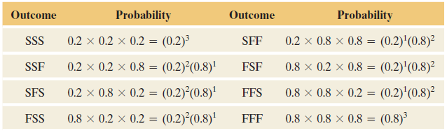

# Discrete Probability Distributions

## Random Variables {#sec-06_01}

> "There are some statistics that I'd like to share with you now, and they are numbers." - Perd Hapley (*Parks and Recreation*)


With proper methods of gathering data, the values that a variable takes should arise from some **random phenomenon**. Even if the process is carefully controlled, chance still plays a role: different samples, repeated experiments, or repeated measurements rarely produce exactly the same result. Statistics exists precisely because of this randomness.

At first glance, the outcomes of random phenomena may seem naturally numerical. But this raises an interesting question:

*Are outcomes themselves really numbers?*

In reality, numbers are often just **abstractions**—labels we assign to describe and measure aspects of the world.

Consider **weight**. Weight is a physical force resulting from the interaction between mass and gravity. The force itself is not inherently a number; it is a physical property. We assign numbers—such as pounds or kilograms—to represent this property so that we can compare, analyze, and communicate it.

The same idea appears in many settings. Numerical values do not exist independently of measurement; rather, they are tools we use to represent outcomes.


### Turning outcomes into numbers

Think about rolling a six-sided die. Physically, the outcome is not really the number 1 or 6—it is a particular face landing upward.

::: {style="text-align: center;"}
{width="4in"}
:::

By convention, we assign the labels

$$
\{1,2,3,4,5,6\}
$$

to these outcomes. We have created a *rule* that maps each physical outcome to a number.

Mathematically, this rule is a *function* whose:

* **domain** is the sample space (all possible outcomes of the experiment), and
* **range** is a subset of the real numbers.

This function is called a **random variable**.


### A conceptual view of random variables

Another way to think about it is this:

When we talk about chance, we need a language that converts unpredictable events into something we can analyze mathematically. A random variable provides that language. It takes the messy details of “what happened” and translates them into a numerical value.

Importantly, the random variable is *not the outcome itself*; it is the rule that assigns numbers to outcomes.

For example, the outcome of tossing three coins might be (HHT), (TTT), or (HTH). A random variable could assign a number to each outcome, such as the number of heads observed.

Thus multiple different outcomes can produce the same numerical value.


### Types of random variables

Random variables come in two broad types:

* A **discrete random variable** has a countable set of possible values. These often arise from counting: number of successes, number of arrivals, number of defects, and so on.
* A **continuous random variable** can take any value within an interval, such as height, temperature, or blood pressure. Continuous variables will be studied in more detail later; for now, our focus is primarily on discrete random variables.


### Random variables describe processes, not data

A key idea is that a random variable describes the *process that could generate data*, not the data themselves. Before an experiment is conducted, the value of the random variable is unknown and may take many possible values.

Once the experiment occurs, we observe a *realization* (or observed value) of that random variable.


### Examples

:::{.example title="Example 6.1: Example from Medicine"}

Suppose a clinic screens 20 patients for a rare side effect of a new drug. Let

$$
X = \text{number of patients who experience the side effect}.
$$

Before screening begins, $X$ could be any value from 0 to 20. Each possible value corresponds to many different combinations of patient outcomes. After the screening is complete, we observe one specific value (say $x=3$). This observed value is one realization of the random variable.[^1]

[^1]: Note that we use a uppercase letter to denote the random variable itself. We use a lowercase letter when denoting a realization of that random variable. 

Another clinic running the same experiment might observe a different value because the process contains randomness.

:::


:::{.example title="Example 6.2: Example from Biology"}

In a genetics lab, 10 plants are grown from seeds, each of which may carry a mutation that confers resistance to a fungus. Let

$$
Y = \text{number of resistant plants}.
$$

The possible values of $Y$ are 0 through 10. Even without running the experiment repeatedly, probability allows us to model how likely each value is, based on the underlying mutation rate.

:::

### Why random variables matter

In both examples, the random variable converts a complex outcome—many individual successes or failures—into a *single numerical summary*. That number changes from trial to trial, but its behavior follows predictable probabilistic rules.

This abstraction is powerful. By representing outcomes numerically, we can:

* describe variability mathematically,
* calculate probabilities,
* build models of uncertainty, and
* make predictions about future observations.

In short, random variables are the bridge between real-world randomness and the mathematics of probability. They allow us to move from observing chance events to analyzing and understanding them quantitatively.


### Working in JMP

In JMP you can work with discrete random variables by creating a column that represents the outcome of a chance process.  For example:

1. **Simulate a random count.**  To explore the distribution of a count like $X$ or $Y$, use **Rows → Add Rows** to create a data table with a desired number of simulated trials (say 1000).  Add a new column, choose **Column → Formula**, and use a random function such as `Random Binomial(n, p)` to generate counts of successes (e.g., the number of side effects among 20 patients with probability $p$ of a side effect per patient).  Each row in this column is one realization of your discrete random variable.
2. **Explore the distribution.**  Use **Analyze → Distribution** to see how often each value occurs.  The histogram and summary tables show the possible values and their relative frequencies.  This empirical distribution will get closer to the true probability distribution as you increase the number of simulated trials.

### Recap

| **Keyword** | **Definition** |
|-------------|---------------|
| **random variable** | A function that assigns a numeric value to each outcome of a random experiment. |


### Check your understanding

:::{.callout-note collapse=false title="Problems"}

1. Describe in your own words the difference between a random variable and the observed data.  
2. Give an example of a discrete random variable in a medical context and list its possible values.  
3. Is “blood type” (A, B, AB, O) a discrete random variable?  Explain why or why not.  
:::

::: {.callout-tip collapse="true" title="Solutions"}

1. The **random variable** is a rule that maps every possible outcome of a random experiment to a number.  The *observed data* are the actual values of that mapping in one experiment.  Before you flip 10 coins, the random variable “number of heads” could be 0–10; after you flip, you observe a single number, such as 4.
2. Let $X$ be the number of patients out of 15 who respond favorably to a new therapy.  The possible values of $X$ are 0,1,2,…,15—one number for each possible count of responders.
3. Blood type is **categorical** rather than numeric.  To analyze it as a random variable you would typically convert it to a binary indicator (e.g., 1 if type A, 0 otherwise).  The categories A, B, AB and O do not have a numerical order, so blood type on its own is not a discrete random variable in the sense used here.
:::

## Probability Distributions and Their Properties {#sec-06_02}

> "Iacta alea est. (The die is cast.)" - Julius Ceasar


Once we have defined a discrete random variable, the next step is to describe how likely each of its possible values is.  A **probability distribution** (also called a **probability mass function**) assigns a probability $P(X=x)$ to every value $x$ in the support of the random variable $X$.  A valid probability distribution must satisfy two simple but fundamental conditions:

1. *Non‑negativity:* For every possible value $x$, the probability satisfies $0 \le P(X=x) \le 1$.  Probabilities can’t be negative or exceed one.
2. *Sum to one:* The probabilities of all possible outcomes add up to one:
$$
\sum_{x} P(X=x) = 1\,.
$$
This reflects the fact that something in the sample space must occur on each trial.

A probability distribution summarizes the long‑run behavior of a random variable.  It tells you how often each value would appear if you repeated the experiment many times.  Let’s look at an example.


:::{.example title="Example 6.3: number of mutated alleles"}

Suppose biologists examine individual plants and record the number of copies of a recessive allele they carry.  The random variable $X$ takes the values 0, 1, 2 or 3 with the following probabilities:

| $x$ | 0 | 1 | 2 | 3 |
|-----|---|---|---|---|
| $P(X=x)$ | 0.50 | 0.30 | 0.15 | 0.05 |

Every probability is between 0 and 1, and the probabilities sum to 
$$
0.50+0.30+0.15+0.05=1
$$
Thus this table is a valid probability distribution.  If you grew a very large number of plants from the same genetic cross, about 50% would carry no copies of the allele, 30% would have one copy, 15% two copies, and 5% three copies. 


Commonly, the probability distribution of a discrete random variable is displayed with a bar chart. As long as the bar chart displays all possible values of the random variable, and the probability of each value, then it displays the probability distribution.

Below is a bar chart for the probability distribution in the table above.

```{r}
#| echo: false
#| message: false
#| warning: false
library(tidyverse)
allele_dist <- tibble(
  copies = c(0, 1, 2, 3),
  prob   = c(0.50, 0.30, 0.15, 0.05)
)
ggplot(allele_dist, aes(x = factor(copies), y = prob)) +
  geom_col(fill = "#2c7fb8") +
  labs(x = "Number of allele copies $X$", y = "Probability",
       title = "Probability distribution of X") +
  theme_minimal()
```

:::

:::{.example title="Example 6.4: Medical testing"}

In medical testing you often have a random variable that counts the number of positive results in a sample.  For instance, if you screen 5 animals for a virus and each has a small probability of being infected, the distribution of $Y$ = “number of infected animals” might look something like this:

| $y$ | 0 | 1 | 2 | 3 | 4 | 5 |
|-----|---|---|---|---|---|---|
| $P(Y=y)$ | 0.70 | 0.21 | 0.07 | 0.015 | 0.004 | 0.001 |

Again, each probability is between 0 and 1 and the sum is 1.  The table is more detailed because there are more possible counts, but the principles are the same.

:::

### Validity checks

Sometimes you will be given a proposed distribution and asked whether it is valid.  To check validity:

1. Make sure all probabilities are non‑negative and at most 1.
2. Add them up.  If they sum to 1 (allowing for small rounding error) the distribution is valid; otherwise it is not.

If a distribution is not valid, you cannot use it until it is corrected or rescaled.

### Working in JMP 

To examine a discrete probability distribution in JMP:

1. **Enter the values and probabilities.**  Create a new data table with one column for the possible values and another for the corresponding probabilities.  Be careful that your probabilities add to 1.
2. **Visualise the distribution.**  Use **Graph → Graph Builder**.  Drag the value column to the X‑axis and the probability column to the Y‑axis.  Choose *Bar* as the graph type.  The resulting bar chart is your probability mass function.  You can also label the bars with the probabilities by clicking the red triangle ▸ and selecting **Label**.
3. **Check the sum.**  You can add a column formula using **Column → New Column** and formula `sum(:Probability)` to verify that the probabilities sum to one.  JMP will report the sum in a single cell.

### Recap

| **Keyword** | **Definition** |
|-------------|---------------|
| **probability distribution** | A table, graph, or function assigning each possible value of a discrete random variable a probability between 0 and 1. |
| **probability mass function (pmf)** | Another name for the probability distribution of a discrete random variable. |


### Check your understanding

:::{.callout-note collapse=false title="Problems"}

1. Consider a random variable $X$ that takes values 0, 1, 2 with $P(X=0)=0.2$, $P(X=1)=0.5$ and $P(X=2)=0.4$.  Is this a valid probability distribution?  Explain.  
2. A diagnostic test counts the number of positive samples among three blood samples from the same patient.  Suggest a possible probability distribution for the number of positives and describe how you might visualize it.  
3. The following table describes a proposed distribution for a random variable $X$:  

    | $x$ | 0 | 1 | 2 | 3 |
    |---|---|---|---|---|
    | $P(X=x)$ | 0.3 | $–0.1$ | 0.6 | 0.2 |
    
    Is this distribution valid?  Why or why not?  

:::

::: {.callout-tip collapse="true" title="Solutions"}
1. The probabilities must sum to 1.  Here $0.2 + 0.5 + 0.4 = 1.1$, which is greater than 1, so this is **not** a valid distribution.  One or more probabilities needs to be adjusted or rescaled.
2. The number of positive samples ($Y$) can be 0, 1, 2 or 3.  A plausible distribution might be $P(Y=0)=0.70$, $P(Y=1)=0.20$, $P(Y=2)=0.08$ and $P(Y=3)=0.02$, but the actual numbers depend on the underlying infection probability.  To visualize the distribution, enter these values and probabilities into JMP and create a bar chart with categories 0–3 on the X‑axis and probabilities on the Y‑axis.
3. A valid distribution cannot have negative probabilities.  Because $P(Z=1)=-0.1$ is negative, this table is invalid.  You cannot assign negative weight to an outcome.  The probabilities also sum to $0.3-0.1+0.6+0.2=1.0$, but the negativity alone makes it invalid.
:::


## Mean and Standard Deviation of Discrete Distributions {#sec-06_03}

> "The most important questions of life are, for the most part, really only problems of probability." -Pierre Simon, Marquis de Laplace


As stated previously in this course, we want to examine the **center**, **spread**, and **shape** when we have a data distribution. In Chapter 4, we discussed doing this with sample data where we calculate statistics like $\bar{x}$, $s$, and $s^2$. These are *sample* statistics. The probability distribution tells us how likely *each* outcome of $X$ is. Thus, we should view the probability distribution as a representation of the *population*. 

We often want numeric values to describe the probability distribution in the same way we used statistics for the sample. Since these numeric values will be describing a population, these will be **parameters**.

It is common (but not always) to denote parameters with lowercase Greek letters. Below are some of the statistics we have discussed and the corresponding parameter.

|                    | Sample<br>Statistic | Population<br>Parameter |
|--------------------|---------------------|-------------------------|
| Mean               | $\bar{x}$           | $\mu$                   |
| Standard Deviation | $s$                 | $\sigma$                |
| Variance           | $s^2$               | $\sigma^2$              |


The mean or  **expected value** (denoted $E(X)$) of a discrete probability distribution is a weighted average:
$$
\mu = E(X) = \sum_x x \cdot P(X=x)
$$
You can think of the expected value as the long‑run average of $X$ over many repetitions of the experiment. 


:::{.example title="Example 6.5: Florida lottery"}


The Florida Lottery
runs two popular daily games
called Pick 3 and Pick 4.

In Cash 3, players pay $1 to select
three numbers in order, where each number ranges from
0 to 9. If the three numbers selected (e.g., 2–8–4) match
exactly the order of the three numbers drawn, the player
wins $500. The probability of winning Pick 3 is 0.001.

Play 4 is similar to Cash 3, but players must
match four numbers (each number ranging from 0 to 9).
For a $1 Play 4 ticket (e.g., 3–8–3–0), the player will win
$5,000 if the numbers match the order of the four numbers
drawn. The probability of winning Pick 4 is 0.0001


Let $X$ be the random variable representing the amount of money you get for playing Pick 3. 

The possible values of $X$ is then \
If you lose: $-\$1$\
If you win: $\$500-\$1=\$499$


What is the expected amount of money you get for playing this game?
$$
\begin{align*}
    \mu &= \sum xP$X$\\\\
    &{=-1(0.999)+499(0.001)}\\
    &{=-0.999+.499}\\
    &{=-0.5}
\end{align*}
$$

Let $X$ be the random variable representing the amount of money you get for playing Pick 4. 

The possible values of $X$ is then \
If you lose: $-\$1$\
If you win: $\$5000-\$1=\$4999$
The possible values of $X$ is then 

What is the expected amount of money you get for playing this game?
$$
\begin{align*}
    \mu &= \sum xP$X$\\\\
    &{=-1(0.9999)+4999(0.0001)}\\
    &{=-0.9999+.4999}\\
    &{=-0.5}
\end{align*}
$$

:::

:::{.example title="Example 6.6: Life insurance"}

Suppose you work for an insurance company and you sell a \$10,000 one-year term
insurance policy at an annual premium of \$290. Actuarial tables show that the probability of
death during the next year for a person of your customer’s age, sex, health, etc., is .001. What
is the expected gain (amount of money made by the company) for a policy of this type?
$$X=\text{money made by the company  per policy}$$
If the customer lives: $\$290$\
If the customer dies:$\$290-\$10,000=-\$9710$

The expected gain for a policy of this type:
$$
\begin{align*}
    \mu &= \sum xP$X$\\\\
    &{=290(0.999)+(-9710)(0.001)}\\
    &{=280}
\end{align*}
$$

:::

### Variance

The **variance** of $X$, denoted $\sigma^2$, measures how spread out $X$ is around its mean.  It is defined as
$$
\begin{align*}
\sigma^2 = \sum_x (x - \mu)^2  P(X=x)
\end{align*}
$$

It weights squared deviations from the mean by the probability of each value.  The **standard deviation** $\sigma$ is simply the square root of the variance.  It has the same units as $X$ and describes the typical distance between $X$ and its mean.


:::{.example title="Example 6.7: Allele copies revisited"}


Using the allele copy distribution from the previous section, we can compute the mean and variance.  Recall the probabilities:

| $x$ | 0 | 1 | 2 | 3 |
|-----|---|---|---|---|
| $P(X=x)$ | 0.50 | 0.30 | 0.15 | 0.05 |

The expected value is

$$
\begin{align*}
\mu_X =& 0 \cdot 0.50 + 1 \cdot 0.30 + 2 \cdot 0.15 + 3 \cdot 0.05\\
=& 0 + 0.30 + 0.30 + 0.15 \\
=& 0.75
\end{align*}
$$

On average, a plant carries 0.75 copies of the allele.  To compute the variance, we first calculate $(x - \mu)^2$ for each $x$:

| $x$ | $(x - 0.75)^2$ | $P(X=x)$ | Contribution |
|-----|----------------|-----------|--------------|
| 0 | $(0 - 0.75)^2 = 0.5625$ | 0.50 | $0.5625 \times 0.50 = 0.28125$ |
| 1 | $(1 - 0.75)^2 = 0.0625$ | 0.30 | $0.0625 \times 0.30 = 0.01875$ |
| 2 | $(2 - 0.75)^2 = 1.5625$ | 0.15 | $1.5625 \times 0.15 = 0.234375$ |
| 3 | $(3 - 0.75)^2 = 5.0625$ | 0.05 | $5.0625 \times 0.05 = 0.253125$ |

The variance is the sum of the contributions:
$$
\sigma^2 = 0.28125 + 0.01875 + 0.234375 + 0.253125 = 0.7875
$$

Thus the standard deviation is
$$
\sigma = \sqrt{0.7875} \approx 0.887
$$

This tells us that individual plants typically differ from the mean of 0.75 allele copies by about 0.89 copies.  Remember that the mean and standard deviation summarize the distribution; they do not necessarily correspond to actual observed values (you cannot have 0.75 copies of a gene, but the average over many plants can be fractional).

:::


### Working in JMP

To compute the mean and standard deviation of a discrete distribution in JMP:

1. **Enter the distribution.**  Create a table with columns for the values and their probabilities.
2. **Calculate the expected value.**  Add a new column and use **Column → Formula** to multiply each value by its probability.  Then use **Tables → Summary** to sum that column.  The sum is $\mu_X$.
3. **Compute the variance and standard deviation.**  Add a column for $(x - \mu)^2 \times P(X=x)$ (you can store $\mu_X$ in a script variable for reuse).  Summarize that column to get the variance.  Take the square root for the standard deviation.  Alternatively, use **Distribution** on the simulated values (as described in Section 6.1) to see empirical estimates of the mean and standard deviation.

### Recap

| **Keyword** | **Definition** |
|-------------|---------------|
| **expected value** | Weighted average of a random variable: $\sum_x x \,P(X=x)$. Another name for population mean.|


### Check your understanding

:::{.callout-note collapse=false title="Problems"}

1. A random variable $W$ takes values 0, 1, 2, 3 with $P(W=0)=0.1$, $P(W=1)=0.2$, $P(W=2)=0.4$ and $P(W=3)=0.3$.  Compute $E(W)$ and $\sigma_W$.  
2. Explain in plain language what the standard deviation tells you about a random variable.  

:::

::: {.callout-tip collapse="true" title="Solutions"}
1. Compute the mean: $E(W) = 0(0.1) + 1(0.2) + 2(0.4) + 3(0.3) = 0 + 0.2 + 0.8 + 0.9 = 1.9$.  The variance is
$$
\sum (w - 1.9)^2 P(W=w) = (0-1.9)^2\cdot 0.1 + (1-1.9)^2\cdot 0.2 + (2-1.9)^2\cdot 0.4 + (3-1.9)^2\cdot 0.3.
$$
Numerically this is $3.61(0.1) + 0.81(0.2) + 0.01(0.4) + 1.21(0.3) = 0.361 + 0.162 + 0.004 + 0.363 = 0.890$.  Thus $\sigma = \sqrt{0.890} \approx 0.944$.
2. The standard deviation measures how far the values of a random variable typically fall from their average value.  A small standard deviation means the values cluster tightly around the mean; a larger standard deviation means the values are more spread out and vary more from trial to trial.
:::

## The Binomial Distribution {#sec-binomial}

> "If people do not believe that mathematics is simple, it is only because they do not realize how complicated life is." -John Louis von Neumann


Many count variables in medicine and biology arise from a simple process: you perform the same experiment $n$ times, each time there are only two possible outcomes (success or failure), and the probability of success stays the same from trial to trial.  The random variable that counts the number of successes in these $n$ trials is said to follow a **binomial distribution**.  We denote it by $X \sim \mathrm{Bin}(n,p)$, where:

- $n$ is the number of independent trials.
- $p$ is the probability of success on each trial.

For the binomial model to be appropriate we must have:

1. A fixed number $n$ of trials.
2. Each trial results in a *success* or *failure*.
3. The probability $p$ of success is the same on every trial.
4. The trials are independent of each other.

### Motivating Example

John Doe claims to possess extrasensory perception (ESP). An experiment is
conducted in which a person in one room picks one of the integers 1, 2, 3, 4, 5
at random and concentrates on it for one minute. In another room, John Doe
identifies the number he believes was picked. The experiment is done with
three trials. After the third trial, the random numbers are compared with
John Doe’s predictions. Doe got the correct result twice.

If John Doe does not actually have ESP and is merely guessing the number,
what is the probability that he’d make a correct guess on two of the three
trials?

Let $X$ = number of correct guesses in $n = 3$ trials. Then $X = 0, 1, 2, \text{ or } 3$.

Let $p$ denote the probability of a correct guess for a given trial. 

If Doe is
guessing, $p = 0.2$ for Doe’s prediction of one of the five possible integers.
Then, $1 - p = 0.8$ is the probability of an incorrect prediction on a given
trial. 


Denote the outcome on a given trial by $S$ or $F$, representing success or
failure for whether Doe’s guess was correct or not. The table below shows the eight
outcomes in the sample space for this experiment. For instance, $FSS$ represents a correct guess on the second and third trials. It also shows their probabilities by using the multiplication rule for independent events.

::: {style="text-align: center;"}
{width="4in"}
:::


The three ways John Doe could make two correct guesses in three
trials are $SSF$, $SFS$, and $FSS$. Each of these has probability equal to
$$
(0.2)^2(0.8) = 0.032
$$


The total probability of two correct guesses (note these are mutually exclusive outcomes) is
$$
\begin{align*}
P(SSF\cup SFS \cup FSS) = & (0.2)^2(0.8) + (0.2)^2(0.8) + (0.2)^2(0.8)\\
=& 3(0.2)^2(0.8)\\
=& 3(0.032)\\ 
=& 0.096
\end{align*}
$$


When the number of trials $n$ is large,
it’s tedious to write out all the possible outcomes in the sample space. But there’s
a formula you can use to find binomial probabilities for any $n$.


### Probabilities for a Binomial Distribution

Denote the probability of success on a trial by $p$. For $n$ independent trials, the probability of
$x$ successes equals
$$
P(X) = \binom{n}{x}p^x(1-p)^{n-x}, \qquad x=0, 1, 2, \ldots, n
$$
where
$$
\binom{n}{x}=\frac{n!}{x!(n-x)!}
$$


Let's use this formula to find the probability that Doe would get only one correct in the previous section:
$$
\begin{align*}
    P(1) &= \frac{3!}{1!(3-1)!}0.2^1(1-0.2)^{3-1}\\\\
   & {=\frac{6}{1}0.2(0.8)^2}\\
   &{ =.3840}
\end{align*}
$$


### Check to See If Binomial Conditions Apply

Before you use the binomial distribution, check that its three conditions apply.
These are 

(1) binary data (success or failure), 
(2) the same probability of success for each trial (denoted by $p$), and 
(3) a fixed number $n$ of independent trials.


One scenario where the assumptions do not apply is when sampling from a small population **without replacement**. When this occurs, the assumption of independence does not hold since the probability of success will change after each trial. 

**Guideline: Population and
Sample Sizes to Use the Binomial**
For sampling $n$ separate subjects
from a population (that is, sampling
without replacement), the exact
probability distribution of the number
of successes is too complex to discuss
here, but the binomial distribution
approximates it well when $n$ is less
than 10% of the population size. In
practice, sample sizes are usually small
compared to population sizes, and this
guideline is satisfied.


### Mean and Standard Deviation  of the Binomial Distribution
 
 Recall that the formula for the expected value of a discrete random variable is
$$
E(X) = \mu = \sum xP(X)
$$


If we  substitute in the binomial formula for $P(X)$ in the formula for expected value we get[^2]
$$
\begin{align*}
E(X) &= \mu = \sum_{x=0}^n x \frac{n!}{x!(n-x)!}p^x(1-p)^{n-x}\\
& {= np}
\end{align*}
$$


::: {.callout-tip collapse="true" title="For those who want to see the math:"}

$$
\begin{align*}
E[X]
&= \sum_{x=0}^{n} x \, P(X=x) \\
&= \sum_{x=0}^{n} x \binom{n}{x} p^{x}(1-p)^{\,n-x}.
\end{align*}
$$

$$
\begin{align*}
E[X]
&= \sum_{x=1}^{n} x \binom{n}{x} p^{x}(1-p)^{\,n-x}
\qquad (\text{the }x=0\text{ term is }0) \\
&= \sum_{x=1}^{n} \left[n\binom{n-1}{x-1}\right] p^{x}(1-p)^{\,n-x}
\qquad \left(\text{since } x\binom{n}{x}=n\binom{n-1}{x-1}\right) \\
&= np \sum_{x=1}^{n} \binom{n-1}{x-1} p^{x-1}(1-p)^{\,n-x}.
\end{align*}
$$

$$
\begin{align*}
E[X]
&= np \sum_{y=0}^{n-1} \binom{n-1}{y} p^{y}(1-p)^{\,(n-1)-y}
\qquad (\text{let } y=x-1) \\
&= np \cdot 1 \\
&= np
\end{align*}
$$


:::


So if we know the random variable is binomial, the expected value is just $E(X) =np$.

The same thing can be done for the variance. 
If we know the random variable is binomial, the variance and standard deviation are
$$
{\sigma^2=npq}\qquad\qquad{\sigma=\sqrt{npq}}
$$

::: {.callout-tip collapse="true" title="For those who want to see the math:"}


We begin from the probability mass function
$$
P(X=x)=\binom{n}{x}p^x(1-p)^{,n-x}, \qquad x=0,1,\dots,n.
$$

Recall
$$
\mathrm{Var}(X)=E[X^2]-(E[X])^2,
$$
and from the previous result,
$$
E[X]=np.
$$


Compute $E[X(X-1)]$

A useful identity is
$$
X^2 = X(X-1)+X.
$$
So we first compute $E[X(X-1)]$.

$$
\begin{align}
E[X(X-1)]
&= \sum_{x=0}^{n} x(x-1)\binom{n}{x}p^x(1-p)^{,n-x} \\
&= \sum_{x=2}^{n} x(x-1)\binom{n}{x}p^x(1-p)^{,n-x}
\qquad (\text{terms }x=0,1\text{ vanish}) \\
&= \sum_{x=2}^{n} n(n-1)\binom{n-2}{x-2}p^x(1-p)^{,n-x}
\end{align}
$$

using the combinatorial identity
$$
x(x-1)\binom{n}{x}=n(n-1)\binom{n-2}{x-2}.
$$

Factor out constants and two powers of $p$:

$$
\begin{align}
E[X(X-1)]
&= n(n-1)p^2
\sum_{x=2}^{n}
\binom{n-2}{x-2}p^{x-2}(1-p)^{,n-x}.
\end{align}
$$

Let $y=x-2$. Then $y=0,\dots,n-2$:

$$
\begin{align}
E[X(X-1)]
&= n(n-1)p^2
\sum_{y=0}^{n-2}
\binom{n-2}{y}p^{y}(1-p)^{(n-2)-y}.
\end{align}
$$

Apply the binomial theorem:

$$
\begin{align}
E[X(X-1)]
&= n(n-1)p^2 (p+(1-p))^{n-2} \
&= n(n-1)p^2.
\end{align}
$$

Compute $E[X^2]$

Using $X^2=X(X-1)+X$,

$$
\begin{align}
E[X^2]
&= E[X(X-1)] + E[X] \\
&= n(n-1)p^2 + np.
\end{align}
$$

Now apply the variance formula:

$$
\begin{align}
\mathrm{Var}(X)
&= E[X^2] - (E[X])^2 \\
&= \left[n(n-1)p^2 + np\right] - (np)^2 \\
&= n(n-1)p^2 + np - n^2p^2 \\
&= np - np^2 \\
&= np(1-p).
\end{align}
$$


:::

:::{.example title="Example 6.8: Vaccine side effects"}


For a vaccine trial: each of 10 volunteers has a 0.2 probability of experiencing a side effect.  Let $X \sim \mathrm{Bin}(10, 0.2)$ be the number of side effects.  The probability of exactly $x$ side effects is
$$
P(X = x) = \binom{10}{x} 0.2^x 0.8^{10 - x}.
$$
For instance, the probability of exactly 3 participants experiencing side effects is
$$
\begin{align*}
P(X=3) &= \binom{10}{3} (0.2)^3 (0.8)^{7}\\
&= 120 \times 0.008 \times 0.2097152\\
&\approx 0.2013
\end{align*}
$$
The expected number of side effects is 
$$
E(X)=10\times 0.2=2
$$ 
and the standard deviation is 
$$
\sigma = \sqrt{10 \times 0.2 \times 0.8}\approx 1.265
$$

A bar chart of the distribution shows that most of the probability mass is centered around 2:

```{r}
#| echo: false
#| message: false
#| warning: false
library(tidyverse)
side_effects <- tibble(
  k = 0:10,
  prob = dbinom(k, size = 10, prob = 0.2)
)

ggplot(side_effects, aes(x = factor(k), y = prob)) +
  geom_col(fill = "#c51b8a") +
  labs(x = "Number of side effects $X$", y = "Probability",
       title = "Binomial distribution: X ~ Bin(10, 0.2)") +
  theme_minimal()
```

:::

:::{.example title="Example 6.9: Gene carriers"}

Suppose a particular allele is present in 10% of a plant population.  If you examine 12 randomly selected plants, the number $Y$ of plants carrying the allele follows $\mathrm{Bin}(n=12, p=0.10)$.  

The probability of exactly $x$ carriers is 
$$
\binom{12}{x} 0.1^x 0.9^{12-x}
$$  
The expected number of carriers is $12 \times 0.10 = 1.2$ and the standard deviation is $\sqrt{12 \times 0.10 \times 0.90} \approx 1.039$.  

The probability of *at least one* carrier is 
$$
1 - P(Y=0) = 1 - (0.9)^{12} \approx 0.717
$$
meaning there is a 71.7% chance of finding at least one resistant plant in 12.

:::

:::{.example title="Example 6.10: Counting positive results"}

Biologists often perform assays where each sample has a probability $p$ of yielding a positive result.  If you test $n$ independent samples, the number of positives follows a binomial distribution.  For example, if you test 6 fruit flies for a particular gene with presence rate 0.3, the distribution of $X \sim \mathrm{Bin}(6, 0.3)$ is:

| $x$ | 0 | 1 | 2 | 3 | 4 | 5 | 6 |
|---|---|---|---|---|---|---|---|
| $P(X=x)$ | $(0.7)^6$ | $6(0.3)(0.7)^5$ | $15(0.3^2)(0.7^4)$ | … | … | … | $(0.3)^6$ |

The probabilities can be computed by hand or with software.

:::

### Working in JMP 

JMP has built‑in tools for the binomial distribution:

1. **Probability Calculator.**  Choose **Help → Probability Calculator**, select *Binomial* as the distribution, and specify $n$ and $p$.  You can then compute probabilities for specific values (e.g., $P(X=3)$), cumulative probabilities (e.g., $P(X \le 3)$), and tail probabilities (e.g., $P(X \ge 5)$).  The calculator displays both numerical results and a dynamic bar chart.
2. **Simulate binomial counts.**  Add a new column and set its formula to `Random Binomial(n, p)`.  Generate many rows to see the empirical distribution, and analyse it with **Distribution**.  This is a good way to build intuition for binomial variability.
3. **Expected value and standard deviation.**  JMP’s probability calculator reports the mean and standard deviation for the chosen $n$ and $p$.  You can also compute them manually using formula columns (`n*p` and `sqrt(n*p*(1-p))`).

### Recap

| **Keyword** | **Definition** |
|-------------|---------------|
| **binomial distribution** | The distribution of the number of successes in $n$ independent trials with success probability $p$. |
| **binomial pmf** | $P(X=x) = \binom{n}{x} p^x (1-p)^{n-x}$ for $x=0,\dots,n$. |


### Check your understanding

:::{.callout-note collapse=false title="Problems"}

1. An antibiotic cures a bacterial infection in 75 % of cases.  In a study of 8 independent patients, let $X$ be the number of patients cured.  Compute:

    a) $P(X=6)$.  
    b) $P(X\le 4)$.  
    c) $E$X$$ and $\sigma$ 
2. A gene occurs in 15% of the population.  You sample 10 individuals at random.  What is the probability that exactly 2 individuals carry the gene?  What is the probability that at least one individual carries the gene?  
3. A researcher flips a biased coin (probability of heads is 0.6) 5 times.  Does the number of heads follow a binomial distribution?  Why or why not?  
4. Describe a real‑world scenario where the binomial model would **not** be appropriate even though the outcome is a count of successes.  Explain which assumption is violated. 
:::

::: {.callout-tip collapse="true" title="Solutions"}
1. Here $X \sim \mathrm{Bin}(n=8,p=0.75)$. a) $P(X=6) = \binom{8}{6} 0.75^6 0.25^2 = 28 \times 0.1779785 \times 0.0625 \approx 0.311$.  b) $P(X\le 4) = \sum_{x=0}^4 \binom{8}{x} 0.75^x 0.25^{8-x} \approx 0.0081$ (you can compute this with a calculator or software).  c) The mean is $E$X$=8\times 0.75=6$ and the standard deviation is $\sigma_X=\sqrt{8\times 0.75 \times 0.25}=\sqrt{1.5}\approx 1.225$.  
2. Let $Y \sim \mathrm{Bin}(10,0.15)$.  Then $P(Y=2) = \binom{10}{2} (0.15)^2 (0.85)^8 \approx 45 \times 0.0225 \times 0.27249 \approx 0.276$.  The probability of at least one carrier is $1 - P(Y=0) = 1 - 0.85^{10} \approx 1 - 0.1969 = 0.8031$.  
3. Yes.  Each flip is a trial with two outcomes (heads or tails), the probability of heads is the same (0.6) on each flip, and the flips are assumed independent.  Therefore the number of heads in 5 flips follows $\mathrm{Bin}(5,0.6)$.  
4. Suppose we sample 10 patients from a small village where tuberculosis is contagious and individuals tend to be exposed through one another.  Let $X$ be the number of infected patients.  Even if each individual infection has some probability $p$, the infections are **not independent**: once one person is infected, the chance that their neighbor is infected rises.  This dependence violates the independent‑trials assumption of the binomial model, so $X$ would not follow a binomial distribution.
:::
