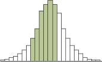
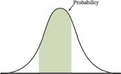
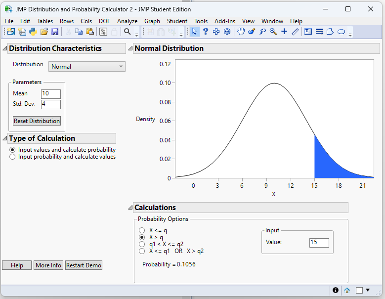
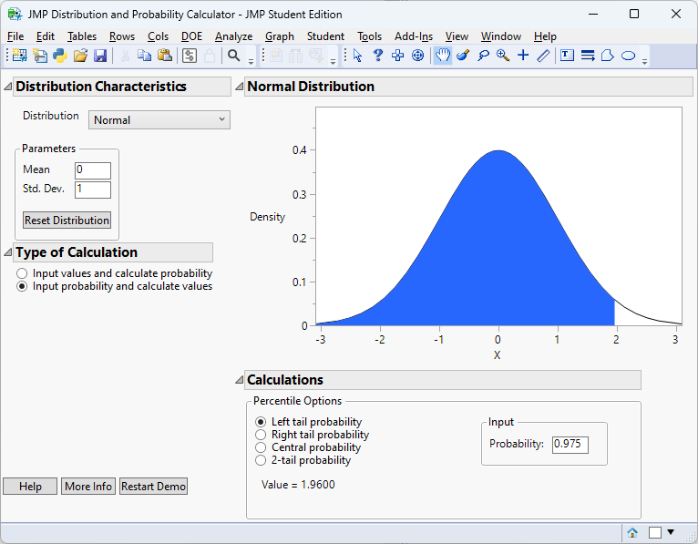

# Continuous Probability Distributions

## Continuous Probability Distributions and Their Properties {#sec-07_01}

> "Statistics is the grammar of science." – Karl Pearson 


So far, we has focused on *discrete* outcomes: counts of patients, number of mutated alleles and so on.  In those settings we could list the possible values, assign a probability to each one, and check that the probabilities summed to one.  Many measurements in medicine and biology, however, can take *any value within a range* rather than a handful of distinct values.  A person’s height could be 170.23 cm or 170.231 cm; the concentration of a hormone in blood plasma might be 2.7 or 2.701 ng/mL.  When a random quantity can assume infinitely many values on an interval we call it a **continuous random variable**.

Because there are infinitely many possible values, we cannot find the probability that a continuous random variable takes *any exact value*.  Instead of assigning probabilities to single points, we assign probabilities to **intervals**: the chance that a drug’s plasma concentration is between 2.5 and 3.5 ng/mL, for example.  


### Probability Distribution for Continuous Random Variables

Recall in Chapter 3, we discussed histograms in which the width of the bars is some interval of values and the height is either the frequency or relative frequency of the observations that fall in that interval. We could examine the relative frequency of the data that fall between any two value by adding the relative frequencies of the bars in that interval. For example, suppose we are looking for the relative frequency of the data shaded in the histogram below. 



Thus, the area of these bars is the relative frequency in the interval of interest. In Chapter 5, we stated that we are using the relative frequency interpretation of probability. Therefore, the area shaded in the histogram will estimate the **probability** of the random variable being in that interval. 

Now, let's think of all of the possible data in the population. In this case, we can shrink the width of the bars to however small we wish. As we let the bar widths shrink to zero, then we end up with a smooth curve like below.




The smooth curve (probability distribution of a continuous random variable)
is denoted by the symbol $f(x)$ and is often called the **probability density function** (pdf).
We can still view the area of the shaded region as the probability. 


Because the area under the pdf represents probability, then by definition we have
$$
P(X=x)=0
$$
In other words, we assign a probability of zero at a point. This happens since there is no area under the curve at a point. 

We do find the probability of a continuous random variable in an interval:
$$
P(a< X< b)
$$
How do we do this? We find the area *under the curve* between $a$ and $b$. We find the area under the curve by taking the integral
$$
P(a < X < b) = \int_a^b f(x) \; dx.
$$

The **cumulative distribution function** (cdf) of $X$, denoted $F(x)$, gives the probability that $X$ is less than or equal to $x$; it is the area under the density to the left of $x$.  

In summary:\
The probability distribution of a continuous random variable $X$

 * is represented by a smooth curve
 * the curve is called the probability density function (pdf)
 * the probability $P(a<X<b)=P(a\le X\le b)$ is the area under the curve between $a$ and $b$
 * the cumulative distribution function (cdf) give the area to the left of some value: $F(x)=P(X\le x)$


:::{.example collapse="false" title="Example 7.1: Drug Metabolism"}

After an oral dose, the amount of a drug in the bloodstream rises and then falls over time.  If we pick a random patient and record their peak plasma concentration, that value could be any number within a physiological range.  

The probability that the peak is *exactly* 3.000 µg/mL is zero; but we can talk meaningfully about the probability it lies between 2.8 and 3.2 µg/mL, which is the area under the density between those points.

:::

:::{.example collapse="false" title="Example 7.2: Plant heights"}

The height of a genetically identical group of plants grown under controlled conditions will vary due to micro‑environmental factors.  Those heights are modeled as a continuous random variable.  We might ask, for example, how likely it is for a plant to be taller than 15 cm; again, we look at the area under the density to the right of 15.

:::

When interpreting a probability density function for a continuous random variable, it is crucial to remember what the graph is—and what it is not—telling you.

A pdf does *not* give the probability of a specific value. Instead, it describes how probability is *distributed across an interval*. The vertical axis represents *probability density*, not probability itself. As a result, a taller portion of the curve indicates a region where probability is more densely concentrated—but the probability of any *single* exact value is still zero.


A helpful analogy is to think of the pdf like a *topographic map*. A taller peak indicates where probability is concentrated, but the “amount” of probability depends on how wide that region is. A very tall but extremely narrow spike may contribute little total probability because its area is small.


### Mean, Variance, and Standard Deviation of a Continuous Random Variable


Recall that for a *discrete random variable*, probabilities are assigned to individual points. Because there are only countably many possible values, we can compute means and variances using sums:

$$
\mu = \sum_x xP(x),
\qquad
\sigma^2 = \sum_x (x-\mu)^2 P(x).
$$

Each term in the sum represents the contribution of one possible value of $X$, weighted by how likely that value is.


#### Why sums no longer work for continuous variables

For a **continuous random variable**, the situation is fundamentally different. The variable can take infinitely many values in any interval, and the probability of any single exact value is
$$
P(X=a)=0.
$$

Because probability is spread continuously across the number line, there is no meaningful way to “add up” probabilities at individual points. Instead, probability accumulates over *intervals*, and the natural mathematical tool for accumulation over infinitely many points is *integration*.

You can think of the discrete formulas as weighted sums and the continuous formulas as their limiting counterparts—weighted integrals.


#### Expected value for a continuous random variable

If $X$ has probability density function $f(x)$, the expected value (mean) is

$$
\mu = \int_{-\infty}^{\infty} x f(x)dx.
$$

This integral plays the same conceptual role as the discrete sum:

* $x$ is the value,
* $f(x)$ is the “weight” (probability density),
* the integral aggregates contributions across all possible values.

Graphically, this computes a kind of *balance point* of the density curve, just as the discrete mean is the balance point of weighted masses.

For the mean to exist, the integral must converge (be finite).

#### Variance for a continuous random variable

The variance measures the average squared distance from the mean. For a continuous random variable,

$$
\sigma^2 = \int_{-\infty}^{\infty} (x-\mu)^2 f(x)dx.
$$

This mirrors the discrete formula but replaces the sum with an integral.


#### Discrete vs. continuous: the big picture

It is helpful to see the parallel structure:

$$
\begin{aligned}
\textbf{Discrete:} \quad & \sum_x (\text{value}) \times (\text{probability}) \\
\textbf{Continuous:} \quad & \int (\text{value}) \times (\text{density})dx
\end{aligned}
$$

The formulas look similar because they represent the *same conceptual operation*—a weighted average—but adapted to two different types of random variables.

Integration is the natural extension of summation when probability is distributed continuously across infinitely many possible values.


:::{.example collapse="false" title="Example 7.3: Mean and Variance of a Continuous Random Variable"}

Suppose $X$ has pdf

$$
f(x)=
2x, \qquad 0 \le x \le 1
$$

We will find the mean $,\mu = E[X],$ and the variance $,\sigma^2 = \mathrm{Var}(X),$.


#### Find the mean

For a continuous random variable,

$$
\mu = E[X] = \int_{-\infty}^{\infty} x f(x)dx.
$$

Since $f(x)=2x$ only on $[0,1]$, this becomes

$$
\mu = \int_0^1 x(2x)dx\\
= \int_0^1 2x^2dx.
$$

Now integrate:

$$
\begin{align*}
\mu &= 2\int_0^1 x^2,dx\\
&= 2\left[\frac{x^3}{3}\right]_0^1\\
&= 2\left(\frac{1}{3}-0\right)\\
&= \frac{2}{3}
\end{align*}
$$

So the mean is

$$
\mu = \frac{2}{3}.
$$


#### Find the variance

Use

$$
\sigma^2 = \int_{-\infty}^{\infty} (x-\mu)^2 f(x)dx.
$$

Substitute $\mu=\frac{2}{3}$ and $f(x)=2x$ on $[0,1]$:

$$
\sigma^2 = \int_0^1 \left(x-\frac{2}{3}\right)^2(2x)dx.
$$

Expand the square first:

$$
\left(x-\frac{2}{3}\right)^2 = x^2 - \frac{4}{3}x + \frac{4}{9}.
$$

Now multiply by $2x$:

$$
\begin{align*}
\left(x-\frac{2}{3}\right)^2(2x)
&= 2x\left(x^2 - \frac{4}{3}x + \frac{4}{9}\right)\\
&= 2x^3 - \frac{8}{3}x^2 + \frac{8}{9}x
\end{align*}
$$

So

$$
\sigma^2 = \int_0^1 \left(2x^3 - \frac{8}{3}x^2 + \frac{8}{9}x\right)dx.
$$

Integrate term by term:

$$
\begin{align*}
\sigma^2
&= \left[\frac{2x^4}{4} - \frac{8}{3}\cdot\frac{x^3}{3} + \frac{8}{9}\cdot\frac{x^2}{2}\right]_0^1\\
&= \left[\frac{x^4}{2} - \frac{8x^3}{9} + \frac{4x^2}{9}\right]_0^1
\end{align*}
$$

Evaluate at $x=1$ and $x=0$:

$$
\begin{align*}
\sigma^2
&= \left(\frac{1}{2} - \frac{8}{9} + \frac{4}{9}\right) - 0\\
&= \frac{1}{2} - \frac{4}{9}
\end{align*}
$$

Put over a common denominator:

$$
\begin{align*}
\frac{1}{2} - \frac{4}{9}
&= \frac{9}{18} - \frac{8}{18}\\
&= \frac{1}{18}
\end{align*}
$$

So the variance is

$$
\sigma^2 = \frac{1}{18}.
$$
:::


### Working in JMP

JMP can help you explore continuous distributions experimentally.  Here is a general workflow using an exponential example, but you can adapt it to other distributions:

1. **Simulate continuous data.**  Create a new data table and use **Rows → Add Rows** to add, say, 1 000 rows.  Add a new column and choose **Column → Formula**.  In the formula editor search for `Random Exponential(rate)` and specify a rate (e.g., `1/10`).  Each cell will then contain a simulated lifetime.
2. **Visualize the distribution.**  Use **Analyze  → Distribution** and select your simulated column.  JMP produces a histogram and summary statistics.  You can overlay a smooth density by clicking the red triangle ▸ next to the variable name and choosing **Continuous Fit  → Exponential**.
3. **Compute probabilities.**  JMP’s distribution calculator (found under **Add‑ins → Calculators → Distribution Calculator** in JMP  Pro  17) lets you choose a distribution, enter parameter values, and compute the probability that a continuous random variable lies between two values.  For the exponential example, choose **Exponential**, set the rate, and enter the lower and upper bounds to find $P(a ≤ X ≤ b)$.

### Recap

| **Keyword** | **Definition** |
|-------------|---------------|
| **continuous random variable** | A random variable that can take any value in an interval; probabilities are assigned to ranges of values rather than individual points. |
| **probability density function (PDF)** | A non‑negative function $f(x)$ such that $P(a ≤ X ≤ b)$ equals the area under $f(x)$ between $a$ and $b$ and the total area under the curve of $f(x)$ is one. |
| **cumulative distribution function (CDF)** | The function $F(x)=P(X ≤ x)$ giving the area under the PDF to the left of $x$.  It increases from 0 to 1 as $x$ goes from $-∞$ to $∞$. |

### Check your understanding

::: {.callout-note collapse="false" title="Problems"}

1. Explain in your own words why the probability that a continuous random variable equals exactly 5 is zero.  How, then, do we assign probabilities for continuous variables?
2. Sketch or describe the shape of a PDF that would model serum cholesterol levels in a population.  Why can’t a PDF ever dip below the horizontal axis?

:::

::: {.callout-tip collapse="true" title="Solutions"}

1. A continuous random variable can take infinitely many values within any interval.  Because the PDF spreads probability continuously across these values, the probability of landing on any single point is zero.  We obtain meaningful probabilities by integrating the density over an interval to find the area under the curve between the limits.
2. Serum cholesterol tends to cluster around an average value with fewer extremely low or high values.  A plausible PDF would be unimodal and right‑skewed: low near 0, rising to a peak near the typical cholesterol level, and gradually decreasing.  The density must always stay at or above zero because probabilities cannot be negative.
:::

## The Uniform Distribution {#sec-07_02}

> "Don't mistake possibilities for probabilities. Anything is possible. It's the probabilities that matter" – Ray Dalio


The simplest continuous distribution is the *uniform distribution*.  Imagine selecting a time uniformly at random within a two‑hour window; any minute in that window is just as likely as any other.  More formally, a continuous random variable $X$ has a *Uniform$(c,d)$* distribution if its PDF is constant on the interval $(c,d)$ and zero elsewhere.


Since all values in the interval $(c,d)$ are equally likely, the pdf of a uniform random variable appears as a horizontal line:
```{r}
#| echo: false

library(ggplot2)

# Parameters
a <- 2
b <- 5

# Make density of Uniform(a, b)
df <- data.frame(
  x = c(a, b),
  y = c(1 / (b - a), 1 / (b - a))
)

# Plot
ggplot(df, aes(x = x, y = y)) +
  geom_line()+
  # geom_segment(aes(x = a, xend = b, y = 1 / (b - a), yend = 1 / (b - a))) +
  # geom_segment(aes(x = a, xend = a, y = 0, yend = 1 / (b - a))) +
  # geom_segment(aes(x = b, xend = b, y = 0, yend = 1 / (b - a))) +
  scale_x_continuous(breaks = c(a, b), labels = c("c", "d")) +
  scale_y_continuous(breaks = 1 / (b - a), labels = c("")) +   # remove y-axis ticks
    # theme_minimal(base_size = 14) +
  theme(
    # axis.ticks.y = element_blank(), # remove y ticks
    axis.line = element_line(),     # show axis lines
    panel.grid = element_blank()    # remove grid
  )+
  ylab("")


```

Note that the area under the curve must equal 1 (since the area corresponds to probability). Therefore, the area between $c$ and $d$
$$
\begin{align*}
    \text{area of rectangle} = \text{base}\times \text{height} &\Longrightarrow{ 1 = (d-c) \times \text{height}}\\\\
    &\Longrightarrow \text{height} = \frac{1}{d-c}
\end{align*}
$$


So, the pdf of a uniform random variable is
$$
f(x) = \frac{1}{d-c}
$$

```{r}
#| echo: false

library(ggplot2)

# Parameters
a <- 2
b <- 5

# Make density of Uniform(a, b)
df <- data.frame(
  x = c(a, b),
  y = c(1 / (b - a), 1 / (b - a))
)

# Plot
ggplot(df, aes(x = x, y = y)) +
  geom_line()+
  # geom_segment(aes(x = a, xend = b, y = 1 / (b - a), yend = 1 / (b - a))) +
  # geom_segment(aes(x = a, xend = a, y = 0, yend = 1 / (b - a))) +
  # geom_segment(aes(x = b, xend = b, y = 0, yend = 1 / (b - a))) +
  scale_x_continuous(breaks = c(a, b), labels = c("c", "d")) +
  scale_y_continuous(breaks = 1 / (b - a), labels = expression(frac(1, d-c))) +   # remove y-axis ticks
    # theme_minimal(base_size = 14) +
  theme(
    # axis.ticks.y = element_blank(), # remove y ticks
    axis.line = element_line(),     # show axis lines
    panel.grid = element_blank()    # remove grid
  )+
  ylab("")


```


The expected value is
$$
\begin{align*}
E(X)=\int_{c}^d xf(x)dx &= \int_c^dx\left(\frac{1}{d-c}\right)dx\\
& {= \left(\frac{1}{d-c}\right)\int_c^dxdx}\\
& {= \left(\frac{1}{d-c}\right)\left(\frac{1}{2}\right)x^2\Big\vert^d_c} \\
& {= \left(\frac{1}{d-c}\right)\left(\frac{1}{2}\right)\left(d^2-c^2\right)} \\
& {= \left(\frac{1}{d-c}\right)\left(\frac{1}{2}\right)\left(d-c\right)\left(d+c\right)} \\
& {= \frac{c+d}{2}}
\end{align*}
$$


We will not show the steps here but we could find the variance in a similar fashion to get
$$
\sigma^2 = \frac{\left(d-c\right)^2}{12}
$$
The standard deviation is then
$$
\sigma = \frac{\left(d-c\right)}{\sqrt{12}}
$$

For a uniform random variable $X$, what is the probability $P(a<X<b)$?
$$
\begin{align*}
    P(a<X<b)=\int_{a}^b f(x)dx & = \int_{a}^b \frac{1}{d-c} dx\\
   & {= \left(\frac{1}{d-c}\right)x\Big\vert_a^b}\\
    &{= \left(\frac{b-a}{d-c}\right)}\\
\end{align*}
$$


Summary of Uniform RVs:

* the pdf is $f(x)=\frac{1}{d-c}\qquad c\le X\le d$
* the mean is $\mu = \frac{c+d}{2}$ and the standard deviation is $\sigma=\frac{d-c}{\sqrt{12}}$
* $P(a<X<b)=\frac{b-a}{d-c}$


:::{.example collapse="fale" title="Example 7.4: Patient Arrival Time"}

Suppose a clinic accepts blood samples from 8  am to 10  am and the phlebotomist expects donors to arrive at random.  Let $T$ be the arrival time after 8  am (in hours).  

If arrivals are equally likely at any moment, $T \sim \text{Uniform}(0,2)$.  The probability that a randomly arriving donor comes between 8:30 and 9:00  am (i.e., $0.5 ≤ T ≤ 1$) is
$$
\begin{align*}
P(0.5 ≤ T ≤ 1)&=\frac{1-0.5}{2-0}\\
&=0.25
\end{align*}
$$
:::


:::{.example collapse="fale" title="Example 7.5: Randomized drug administration"}

n a study, participants are randomly assigned to take a dose of medication at any time between noon and 3  pm.  The time of ingestion is Uniform$(0,3)$ hours after noon.  If we want the probability that a dose is taken in the first half‑hour, we compute
$$
\begin{align*}
P(0 ≤ T ≤ 0.5)=&\frac{0.5-0}{3-0}\\
=&0.167
\end{align*}
$$

:::

### Working in JMP

Uniform simulations are straightforward in JMP:

1. **Generate uniform random values.**  In a new data table, choose **Rows  → Add Rows** to add your desired number of observations.  Use **Column  → Formula**, find the function `Random Uniform`, and specify the lower and upper bounds $c$ and $d$.
2. **Visualize and compute probabilities.**  Use **Analyze  → Distribution** to produce a histogram.  Since the density is flat, the histogram should approximate a rectangle when you use many bins.  To compute $P(a ≤ X ≤ b)$ without simulation, use the distribution calculator: select **Uniform** from the list, enter $c$ and $d$, and set the lower and upper limits.  JMP will report the probability $(b-a)/(d-c)$.

### Recap

| **Keyword** | **Definition** |
|-------------|---------------|
| **uniform distribution** | A continuous distribution on $(c,d)$ whose PDF is constant at height $1/(d-c)$\.  All intervals of equal length within $(c,d)$ have equal probability. |


### Check your understanding
::: {.callout-note collapse="false" title="Problems"}

1. Suppose $X\sim\text{Uniform}(0,10)$.  What is $P(3 ≤ X ≤ 7)$?  Explain your reasoning.
2. A researcher measures the pH of soil samples collected uniformly at random along a transect from 0 to 100  m.  What is the probability that a randomly selected soil sample comes from between 20 m and 35 m?  Express your answer numerically.
3. If $Y\sim\text{Uniform}(c,d)$ and you know that $P(Y ≤ 5) = 0.5$, what relationship does this imply between $c$, $d$ and 5?

:::

::: {.callout-tip collapse="true" title="Solutions"}
1. The interval from 3 to 7 has length 4.  Since the distribution is Uniform$(0,10)$, the probability of any subinterval equals its length divided by the total length: $4/10=0.4$.
2. The transect is 100  m long.  The segment from 20 to 35  m is 15  m long, so $P(20 ≤ X ≤ 35) = 15/100 = 0.15$.
3. For a uniform distribution, $P(Y ≤ y) = (y-c)/(d-c)$ for $c ≤ y ≤ d$.  Setting $P(Y≤5)=0.5$ implies $(5 - c)/(d - c) = 0.5$.  Equivalently, $5$ is the midpoint of the interval and $5 = (c + d)/2$.
:::

## The Normal Distribution {#sec-07_03}

> "the normal distribution is seldom, if ever, observed in nature." – Louis Guttman


The **normal distribution** (also called the *Gaussian distribution*) is the most celebrated continuous distribution in statistics. It appears throughout science, engineering, and the social sciences and forms the theoretical backbone of many statistical procedures, including confidence intervals, hypothesis tests, and regression methods.


### Basic shape and properties

A random variable with distribution $N(\mu,\sigma)$ has a density curve that is:

* **symmetric** about $\mu$,
* **bell-shaped** (unimodal with a single peak),
* and **continuous** over the entire real line.

Because of the symmetry,

$$
\text{mean} = \text{median} = \text{mode} = \mu.
$$

The curve extends infinitely in both directions, getting closer and closer to the horizontal axis but never actually touching it. Thus, in theory, any real number is possible, although values far from the mean have very small probability density.


### The parameters $\mu$ and $\sigma$

The normal distribution is completely determined by two parameters:

* $\mu$ (mu): the **location parameter**, which sets the center of the distribution.
* $\sigma$ (sigma): the **scale parameter**, which determines the spread.

More specifically:

* $\mu$ is the location of the peak and the balance point of the distribution.
* $\sigma$ is the standard deviation and controls the **width of the bell**.

Changing $\mu$ shifts the entire curve left or right without altering its shape. Changing $\sigma$ stretches or compresses the curve:

* Larger $\sigma$ → wider, flatter bell
* Smaller $\sigma$ → narrower, taller bell


```{r}
#| echo: false

library(ggplot2)
library(dplyr)

# Parameters for the normals
params <- data.frame(
  mean = c(0, 2, -2),
  sd   = c(1, 0.5, 2),
  color = c("red", "blue", "green")
)

# Generate data for the curves
curve_data <- params %>%
  group_by(mean, sd, color) %>%
  do(data.frame(
    x = seq(min(params$mean) - 8, max(params$mean) + 4, length.out = 1000),
    mean = .$mean,
    sd = .$sd,
    color = .$color
  )) %>%
  ungroup() %>%
  mutate(density = dnorm(x, mean, sd))

# Base plot
p <- ggplot(curve_data, aes(x = x, y = density, color = color)) +
  geom_line(size = 1) +
  # Labels for each curve (slightly above max density for visibility)
  geom_text(
    data = params,
    aes(x = mean,
        y = dnorm(mean, mean, sd) + 0.05,
        label = paste0("mu==", mean, "*','~sigma==", sd),
        color = color),
    inherit.aes = FALSE,
    parse=T,
    vjust = -0.5
  ) +
  labs(x = "x", y = "Density") +
  theme_minimal(base_size = 14) +
  xlim(-8, 5)+
  ylim(0, 1)+
  theme(legend.position = "none")  # remove legend since labels are on plot

# Show plot
print(p)

```


### The Normal Probability Density Function

The probability density function (pdf) of a normal random variable is

$$
f(x) = \frac{1}{\sigma\sqrt{2\pi}}
\exp\left(-\frac{(x-\mu)^2}{2\sigma^2}\right), \qquad -\infty < x < \infty.
$$

While this formula looks complicated, its key role is to produce the familiar bell-shaped curve and to ensure that the total area under the curve equals 1.

You do not need to memorize this formula to use the normal model.  More important are its qualitative properties: it is unimodal, symmetric, and tails off smoothly; the total area under the curve is one.


### Why the normal distribution matters

The normal distribution occupies a special place in statistics not because every dataset is normal—many are not—but because the normal model emerges naturally in a wide range of settings and underpins much of statistical theory and practice.

Several key reasons explain its importance:

* **Many natural phenomena are approximately normal.** Measurements such as adult heights, measurement errors in instruments, and certain biological traits often display the familiar symmetric, bell-shaped pattern. This occurs because the observed value is frequently the result of many small, independent influences acting together. When no single factor dominates, the combined effect tends to produce a roughly normal distribution.

* **Sample means are often approximately normal (Central Limit Theorem).** Perhaps the most powerful reason for the normal distribution’s prominence is the *Central Limit Theorem (CLT)*. Roughly speaking, the CLT states that the distribution of the sample mean becomes approximately normal as the sample size grows, regardless of the shape of the original population (provided certain mild conditions hold). This remarkable result allows statisticians to use normal-based methods even when the underlying data are skewed or irregular. We will discuss the Central Limit Theorem more thouroughly in Chapter 8. 

* **Many statistical methods rely on normal approximations.** Classical inference procedures—such as z-tests, many confidence intervals, regression inference, and numerous quality-control methods—are derived under normal assumptions or justified by the CLT. The mathematics of the normal distribution is especially tractable, which makes it a convenient and powerful modeling tool.

Beyond these points, the normal distribution also serves as a *benchmark model*. Analysts often begin by comparing their data to a normal curve to assess symmetry, detect skewness, or identify heavy tails. Even when the normal model is not ultimately appropriate, it provides a useful reference point for understanding the data’s structure.

Importantly, real-world data are rarely perfectly normal. They may be skewed, have heavier tails, or exhibit multiple peaks. Nevertheless, the normal model often provides a *useful first approximation*, especially for averages and measurement error, and it forms the conceptual and mathematical foundation for many more advanced statistical techniques.

In short, the normal distribution matters not because it fits everything perfectly, but because it appears frequently, behaves predictably, and enables a vast toolkit of statistical methods.


<!-- #### Visualizing the normal curve -->

<!-- The plot below shows the standard normal density (mean 0, standard deviation 1) along with vertical lines at $\mu \pm \sigma$ and $\mu \pm 2\sigma$ to illustrate the 68–95 rule. -->

<!-- ```{r} -->
<!-- #| echo: false -->
<!-- #| message: false -->
<!-- #| warning: false -->
<!-- library(tidyverse) -->
<!-- ggplot(data.frame(x = c(-4, 4)), aes(x)) + -->
<!--   stat_function(fun = dnorm, args = list(mean = 0, sd = 1), colour = "#2c7fb8", size = 1) + -->
<!--   geom_vline(xintercept = c(-1, 1), linetype = "dashed", colour = "#e6550d") + -->
<!--   geom_vline(xintercept = c(-2, 2), linetype = "dotted", colour = "#31a354") + -->
<!--   labs(x = "z", y = "Density", title = "Standard normal density with one- and two-standard-deviation markers") + -->
<!--   annotate("text", x = 0, y = 0.35, label = "68% between -1 and 1", colour = "#e6550d", hjust = 0.5) + -->
<!--   annotate("text", x = 0, y = 0.3, label = "95% between -2 and 2", colour = "#31a354", hjust = 0.5) + -->
<!--   theme_minimal() -->
<!-- ``` -->


### Working in JMP

To explore normal distributions in JMP:

1. **Simulate normal data.**  Create a new column with **Column  → Formula** and use `Random Normal(µ, σ)` to generate values.  For example, `Random Normal(175,7)` will simulate heights in centimetres with mean  175 and standard deviation  7.
2. **Visualise the distribution.**  Use **Analyze  → Distribution** to generate a histogram and overlay a fitted normal curve.  Click the red triangle ▸ next to the variable and choose **Continuous Fit  → Normal**.  JMP displays parameter estimates and a density overlay.

### Recap

| **Keyword** | **Definition** |
|-------------|---------------|
| **normal distribution** | A continuous, symmetric bell‑shaped distribution defined by its mean $\mu$ and standard deviation $\sigma$; mean  =  median  =  mode. |
| **standard normal distribution** | The special case Normal$(0,1)$; its values are often called *z‑scores*, and any normal distribution can be standardized via $z = (x - \mu)/\sigma$. |


### Check your understanding

::: {.callout-note collapse="false" title="Problems"}
1. What does it mean that the mean, median and mode of a normal distribution are equal?  How is this reflected in the shape of the curve?
2. For a $N(150,20)$ distribution (representing, say, birth weights in grams), approximately what percentage of babies weigh between 110 g and 190 g?
3. Explain why extreme values (more than 3 standard deviations from the mean) are considered unusual under the normal model.
:::

::: {.callout-tip collapse="true" title="Solutions"}
1. A normal curve is perfectly symmetric about its mean; the highest point occurs at $\mu$ and the curve declines equally on both sides.  Because of this symmetry, the most typical value (the mode), the point dividing the distribution in half (the median) and the arithmetic average (the mean) coincide.
2. Two standard deviations on either side of the mean cover about 95% of the data.  The interval from $\mu-2\sigma = 150 - 40 = 110$ to $\mu+2\sigma = 190$ therefore captures roughly 95% of birth weights.
3. Under the normal model, only about 0.3% of observations lie beyond three standard deviations from the mean by the empirical rule.  Thus values outside that range are rare and often signal measurement error or a departure from normality.
:::

## Finding Probability for a Normal Distribution {#sec-07_04}

> "I once worked with a guy for three years and never learned his name. Best friend I ever had. We still never talk sometimes." -Ron Swanson


Once we determine the normal model for a variable, we can compute probabilities by standardizing the variable to a **z‑score**.  Given $X\sim N(\mu,\sigma)$, the z‑score corresponding to a value $x$ is

$$
z = \frac{x - \mu}{\sigma}.
$$

This transformation rescales and recenters $X$ so that $Z \sim N(0,1)$.  We then look up the area under the standard normal curve up to $z$ (or beyond) using tables, software or JMP.  Because the normal distribution is continuous, we always compute probabilities for intervals, not exact points.

### Step‑by‑step procedure

1. **State the distribution.**  Identify $\mu$ and $\sigma$ for your normal variable.
2. **Draw a sketch.**  Label the mean and the point(s) of interest on a bell curve.  Shading the region corresponding to the probability helps visualize whether you need the area to the left, right or between two points.
3. **Compute z‑scores.**  For each boundary $x$ compute $z=(x-\mu)/\sigma$.
4. **Use a table or software.**  For the standard normal distribution, tables give $P(Z ≤ z)$ for many $z$ values.  For probabilities of the form $P(X ≥ x)$ or $P(a ≤ X ≤ b)$, convert to z‑scores and use the fact that $P(Z > z) = 1 - P(Z ≤ z)$ and $P(a ≤ X ≤ b) = P(z_a ≤ Z ≤ z_b)$.
5. **Interpret in context.**  State your answer in terms of the original problem.

:::{.example collapse="false" title="Example 7.6: antihypertensive drug"}

Suppose the reduction in systolic blood pressure (SBP) after taking a new antihypertensive follows a $N(10,4)$ distribution.  What is the probability that a randomly treated patient experiences a reduction of at least 15  mm Hg?

Let $X$ be the reduction in SBP.  We want $P(X ≥ 15)$.

1. **Compute the z‑score.**

$$
z=\frac{15-10}{4}=1.25
$$

2. **Find the area to the right.** Using the Normal Probability Calculator in JMP 18 Student Edition (Student → Applets  → Distribution Calculator):


From this calculator we have:
$$
P(Z ≥ 1.25)=0.1056
$$

Using the Normal Calculator also allows us to find the probability without taking a z-score first. We just need to change the values of Mean and Std. Dev. in the applet.



3. **Interpretation.**  About 10.6% of patients have a reduction of at least 15  mm Hg.

:::


### Working in JMP

JMP’s distribution calculator makes these computations straightforward:

1. **Open the distribution calculator.**  In JMP  Pro  17 go to **Add‑ins  → Calculators  → Distribution Calculator**.  Choose **Normal** from the list of distributions.
2. **Enter parameters.**  Enter the mean and standard deviation (e.g., 10 and 4) and specify whether you want the area **Left**, **Right** or **Between** two values.  For a “greater than” probability like $P(X ≥ 15)$, choose **Right** and enter 15.  JMP will display the area to the right.
3. **Visual check.**  The calculator shows a graph of the normal curve with the relevant region shaded.  Use this to verify that you selected the correct tail or interval.

### Recap

| **Keyword** | **Definition** |
|-------------|---------------|
| **z‑score** | The number of standard deviations a value $x$ is from the mean: $z=(x-\mu)/\sigma$.  Converting to z‑scores allows probabilities from any normal distribution to be found using the standard normal distribution. |


::: {.callout-note collapse="false" title="Problems"}

1. Cholesterol reductions after a dietary intervention follow a $N(20,5)$  distribution.  What is the probability that a randomly selected participant’s reduction is less than 12  mg/dL?  Show the z‑score and compute the probability.
2. Serum calcium levels in a normal population have mean  9.5  mg/dL and standard deviation  0.4  mg/dL.  What proportion of individuals have calcium levels between 9.1 and 9.9  mg/dL?  Sketch the problem and find the probability.

:::


::: {.callout-tip collapse="true" title="Solutions"}
1. Compute $z=(12-20)/5=-1.6$.  From a standard normal table, $P(Z ≤ -1.6)\approx0.0548$.  Therefore $P(X ≤ 12)=0.0548$.
2. First convert the endpoints to z‑scores: $z_1=(9.1-9.5)/0.4=-1.0$ and $z_2=(9.9-9.5)/0.4=1.0$. Using the calculator, we have $P(-1\le Z \le 1)=0.6827$

:::

## Finding a Quantile for a Normal Distribution {#sec-07_05}

> "Two things are infinite: the universe and human stupidity; and I'm not sure about the universe." – Albert Einstein

In many applications we know a desired probability and wish to find the corresponding value of $x$ such that $P(X ≤ x)=p$.  This value is called a **quantile** or **percentile** of the distribution.  Mathematically, the quantile function $F^{-1}(p)$ is the inverse of the cumulative distribution function.  For a normal distribution, the quantile function returns the $x$ value whose cumulative probability is $p$.

### Relationship between the CDF and quantiles

The cumulative distribution function $F(x)$ gives the probability that a random variable $X$ is less than or equal to $x$.  The quantile function does the reverse: it takes a probability $p$ and returns the threshold $x$ such that $P(X ≤ x)=p$.  For example, the 0.5 quantile is the median.  Because the normal CDF does not have a simple algebraic inverse, quantiles are typically obtained from tables or software.

At times, there are special quantiles that will show up in statistical methods that we will discuss later. We denote these as
$$
p = P(Z> z_p)
$$
In other words, $z_p$ is the value of the standard normal distribution that will have $p$ area to the right. For example, $z_{0.05}$ is the value that has 0.05 area to the right.

```{r}
#| echo: false

# install.packages("ggplot2") # if needed
library(ggplot2)
library(grid)   # for arrow()

alpha <- 0.05
z_alpha <- qnorm(1 - alpha)  # upper-tail critical value (≈ 1.64485)

p <- ggplot(data.frame(x = c(-4, 4)), aes(x)) +
  # Density curve
  stat_function(fun = dnorm, linewidth = 1) +
  # Shaded upper-tail area
  stat_function(
    fun = dnorm, geom = "area",
    xlim = c(z_alpha, 4),
    alpha = 0.3
  ) +
  # Optional vertical line at z_{0.05} (helps show the cutoff)
  # Axis tick for z_{0.05}
  scale_x_continuous(
    breaks = z_alpha,
    labels = expression(z[0.05]),
    limits = c(-4, 4)
  ) +
  # Arrow and text pointing to shaded region
  annotate(
    "curve",
    x = z_alpha + 0.9, y = 0.18,
    xend = z_alpha + 0.25, yend = dnorm(z_alpha + 0.25),
    curvature = -0.25,
    arrow = arrow(length = unit(8, "pt"))
  ) +
  annotate(
    "text",
    x = z_alpha + 1.05, y = 0.20,
    label = "0.05",
    size = 5
  ) +
  labs(x = NULL, y = NULL) +
  theme_minimal(base_size = 14)

p


```

Here the value is
$$
z_{0.05}=1.645
$$


### Procedure for finding quantiles

1. *Specify the probability $p$.*  Decide whether you want a lower tail (left‑side) quantile (e.g., the 5th percentile) or a two‑sided bound, or an upper tail area.
2. *Find the corresponding z‑score.*  For the standard normal distribution, tables and software can give you the quantile.
3. **Transform back to $x$.**  If $X\sim N(\mu,\sigma)$, then $x=\mu + z\sigma$ gives the desired quantile. Some software can find the quantile right from $x$. In which case, there is no need to find the value for $z$-score first.

### Example: 

:::{.example collapse="false" title="Example 7.7: therapeutic drug monitoring"}

Suppose therapeutic blood levels of a drug after dosing follow a $N(50,10)$ distribution.  Physicians want to define the *upper control limit* beyond which a concentration is considered dangerously high.  If they choose the 97.5th percentile as the cut‑off, what value should they use?

1. *Find the 97.5th percentile for $z$.* Using the special quantile location, this would be $z_{0.025}$. Using the Normal Probability Calculator in JMP 18 Student Edition (Student → Applets  → Distribution Calculator):
    
2. *Transform back.*
    $$
    \begin{align*}
    x=&\mu + z\sigma\\
    =& 50 + 1.96\times10\\
    =& 69.6
    \end{align*}
    $$
3. *Interpretation.*  Only 2.5% of patients are expected to have concentrations above 69.6  ng/mL.  Concentrations exceeding this threshold may warrant intervention.

:::

### Working in JMP

To find quantiles in JMP:

1. **Use the distribution calculator.**  Open the distribution calculator and select **Normal**.  Switch to the **Percentile** (or **Inverse**) mode.  Enter the probability $p$ (e.g., 0.975) and the distribution parameters $\mu$ and $\sigma$.  JMP returns the corresponding $x$ value.
2. **Check with the CDF.**  You can verify your result by switching back to the probability mode and entering the value $x$ you found.  The calculator should return $p$.

### Recap

| **Keyword** | **Definition** |
|-------------|---------------|
| **quantile (percentile)** | For a continuous distribution with CDF $F$, the value $x=F^{-1}(p)$ such that $P(X ≤ x)=p$. |


### Check your understanding

::: {.callout-note collapse="false" title="Problems"}

1. Birth weights in a population follow a $N(3.5,0.4)$ distribution.  What is the weight corresponding to the 90th percentile?  Show your calculation.
2. An assay has measurement errors that are $N(0,2)$ distributed.  What cut‑off defines the central 80% of the error distribution (i.e., the range from the 10th to the 90th percentile)?
3. Explain the relationship between the CDF and the quantile function in your own words.  Why do we need tables or software to find quantiles for the normal distribution?

:::

::: {.callout-tip collapse="true" title="Solutions"}
1. First find the z‑score $z_{0.10}\approx1.2816$.  Then $x=3.5 + 1.2816\times0.4 = 4.0126$  kg.  Therefore, about 10% of babies weigh more than approximately 4.0  kg.
2. The central 80% corresponds to the interval between the 10th and 90th percentiles.  From a standard normal table $z_{0.90}\approx-1.2816$ and $z_{0.10}\approx1.2816$.  Multiply by $\sigma=2$ and add the mean  0: the interval is from $-1.2816×2≈-2.5632$ to $1.2816×2≈2.5632$.
3. The CDF gives the probability that a random variable is less than or equal to $x$.  The quantile function reverses this: given a probability $p$, it returns the $x$ for which the CDF equals $p$.  The normal CDF has no simple algebraic inverse, so we rely on tables or software to compute quantiles.
:::
