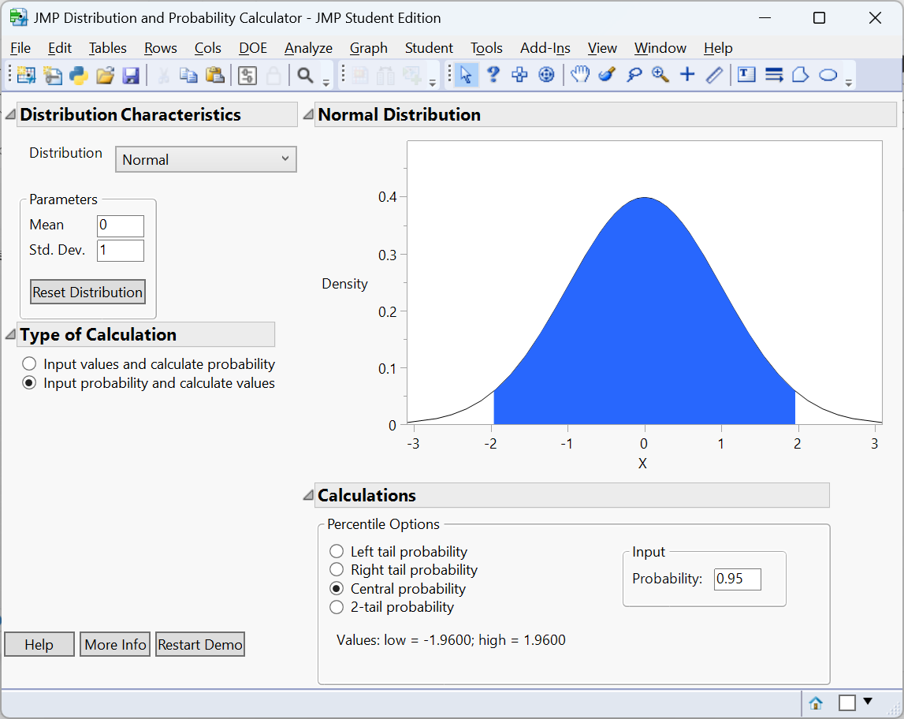

# Estimation and Confidence Intervals


## Point and Interval Estimates {#sec-09_01}

> “Facts are stubborn things, but statistics are pliable.” – Mark Twain


Statistical analysis begins with a *point estimate*, a single summary number computed from a sample to estimate an unknown population parameter.  For example, if a business analyst records the daily revenue of a store for 30 days and finds the average to be $\$2{,}500$, that sample mean is a **point estimator** of the true average daily revenue.  Similarly, if an epidemiologist surveys 200 patients and 36 carry a particular gene variant, the sample proportion $\hat{p} = 36/200 = 0.18$ is a point estimator for the unknown population proportion of carriers.

While a point estimate is easy to compute and understand, it is only one value.  Because every sample yields a slightly different statistic, point estimates vary from sample to sample.  To convey that uncertainty, statisticians construct an *interval estimate*, called a **confidence interval**.  A confidence interval provides a range of plausible values for the parameter together with a specified level of confidence.  The **margin of error** quantifies how far the point estimate may be from the true parameter; larger samples produce smaller margins of error.

### Point Estimation: Making a Best Guess for a Population Parameter

Once we have collected data, how do we produce a single best guess for a population parameter?  The answer is simple: we use an appropriate sample **statistic**.  For example, for a population mean $\mu$ the sample mean $\bar{x}$ is a point estimate of $\mu$.  For a population proportion $p$ the sample proportion $\hat{p}$ is a point estimate of $p$.  In practice, the choice of statistic depends on the parameter we wish to estimate (mean, median, proportion, variance, etc.).

Not all point estimates are equally good.  Some statistics tend to be closer to the parameter than others.  We will outline two desirable properties—center and spread—that make an estimator well suited for inference.

#### Properties of point estimators

Before building interval estimates, it is helpful to reflect on why some statistics make better single‑number estimates than others.  For any given parameter there may be multiple reasonable choices.  For example, for a symmetric normal distribution the center is both the mean and the **median**.  With sample data from a normal population, the sample mean and sample median both estimate this center.


A good estimator should satisfy two important criteria: it should be **centered at the true parameter** and it should have **small variability**. We examine these ideas through the concepts of **unbiasedness** and **efficiency**.

### Center: Unbiased estimators

The first desirable property of an estimator is that its sampling distribution is centered at the true population parameter. In other words, the **expected value** of the estimator should equal the parameter it is intended to estimate. Such an estimator is called **unbiased**.

For random sampling, two common statistics satisfy this property:

$$
\mu_{\bar{x}} = \mu
$$

$$
\mu_{\hat{p}} = p
$$

This means that the sampling distribution of the sample mean $\bar{x}$ is centered at the population mean $\mu$, and the sampling distribution of the sample proportion $\hat{p}$ is centered at the population proportion $p$. Thus, both $\bar{x}$ and $\hat{p}$ are **unbiased estimators**.

To illustrate the idea, consider two hypothetical estimators for the parameter $\mu$. Suppose estimator **a** has a sampling distribution centered exactly at $\mu$, while estimator **b** is centered somewhere else. In that case, **b** systematically misses the true value.

```{r}
#| echo: false
#| message: false
#| warning: false

library(ggplot2)

mu <- 10

x <- seq(4,16,length.out=400)

df <- data.frame(
  x = x,
  a = dnorm(x, mean = mu, sd = 1),
  b = dnorm(x, mean = mu + 1.5, sd = 1)
)

ggplot(df) +
  geom_line(aes(x, a), color="blue", linewidth=1.2) +
  geom_line(aes(x, b), color="red", linewidth=1.2) +
  geom_vline(xintercept = mu, linetype="dashed") +
  labs(title="Unbiased vs Biased Estimator",
       x="Value of statistic",
       y="Density") +
  annotate("text", x=mu, y=0, label="μ", vjust=-1) +
  annotate("text", x=mu-.1, y=.42, label="Estimator a", color="blue") +
  annotate("text", x=mu+1.6, y=.42, label="Estimator b", color="red") +
  theme_minimal()+
  ylim(0, 0.5)
```

In this figure, the dashed vertical line marks the true parameter value $\mu$. The sampling distribution of estimator **a** (the blue curve) is centered at $\mu$, so it is **unbiased**. The sampling distribution of estimator **b** (the red curve) is shifted to the right, meaning it systematically overestimates the parameter. Because of this bias, estimator **a** is preferred if our goal is to estimate $\mu$ accurately in the long run.


### Spread: Efficient estimators

Center alone is not enough. Two estimators might both be unbiased yet differ in how much they vary from sample to sample. In such cases, we prefer the estimator with the **smaller standard deviation**, because its estimates tend to fall closer to the true parameter.

Suppose estimators **a** and **b** are both unbiased for $\mu$, but one has a narrower sampling distribution.

```{r}
#| echo: false
#| message: false
#| warning: false

df2 <- data.frame(
  x = x,
  a = dnorm(x, mean = mu, sd = 0.8),
  b = dnorm(x, mean = mu, sd = 1.6)
)

ggplot(df2) +
  geom_line(aes(x, a), color="blue", linewidth=1.2) +
  geom_line(aes(x, b), color="red", linewidth=1.2) +
  geom_vline(xintercept = mu, linetype="dashed") +
  labs(title="Two Unbiased Estimators with Different Variability",
       x="Value of statistic",
       y="Density") +
  annotate("text", x=mu, y=0, label="μ", vjust=-1) +
  annotate("text", x=mu, y=.52, label="Estimator a", color="blue") +
  annotate("text", x=mu, y=.28, label="Estimator b", color="red") +
  theme_minimal()+
  ylim(0,0.6)
```

Both estimators are centered at $\mu$, so both are unbiased. However, estimator **a** has a **narrower sampling distribution**, meaning its values tend to cluster more tightly around the true parameter. Estimator **b** is more spread out, meaning its estimates fluctuate more from sample to sample.

Because of this, estimator **a** is said to be **more efficient**—it has a smaller standard deviation and therefore produces more precise estimates.

#### Another way to look at it

Consider the four dartboards shown below.

```{r}
#| echo: false
#| message: false
#| warning: false
#| fig-width: 8
#| fig-height: 8

library(ggplot2)
library(dplyr)
library(tidyr)

set.seed(2026)

# ---- helper: make circles for a dartboard ----
make_circle <- function(r, n = 400) {
  tibble(
    theta = seq(0, 2*pi, length.out = n),
    x = r * cos(theta),
    y = r * sin(theta),
    r = r
  )
}

# Dartboard rings (choose a few radii)
rings <- bind_rows(
  make_circle(1.00),
  make_circle(0.75),
  make_circle(0.50),
  make_circle(0.25)
)

# ---- simulate "statistics" as dart throws ----
n_points <- 60

simulate_points <- function(n, mean_x, mean_y, sd) {
  tibble(
    x = rnorm(n, mean = mean_x, sd = sd),
    y = rnorm(n, mean = mean_y, sd = sd)
  )
}

# Parameter is the bullseye at (0,0).
# Bias is illustrated by shifting the center away from (0,0).
# Variance is illustrated by changing the spread (sd).

pts <- bind_rows(
  simulate_points(n_points,  0.0,  0.0, sd = 0.12) %>% mutate(scenario = "Unbiased\nLow variance"),
  simulate_points(n_points,  0.0,  0.0, sd = 0.35) %>% mutate(scenario = "Unbiased\nHigh variance"),
  simulate_points(n_points,  0.35, 0.25, sd = 0.12) %>% mutate(scenario = "Biased\nLow variance"),
  simulate_points(n_points,  0.35, 0.25, sd = 0.35) %>% mutate(scenario = "Biased\nHigh variance")
)

# Add scenario to rings too (so each panel gets a dartboard)
rings_faceted <- rings %>%
  crossing(scenario = unique(pts$scenario))

# Bullseye (the true parameter) for each panel
bullseye <- tibble(x = 0, y = 0) %>%
  crossing(scenario = unique(pts$scenario))

# ---- plot ----
ggplot() +
  geom_path(
    data = rings_faceted,
    aes(x = x, y = y, group = r),
    linewidth = 0.7
  ) +
  geom_hline(yintercept = 0, linewidth = 0.4, alpha = 0.35) +
  geom_vline(xintercept = 0, linewidth = 0.4, alpha = 0.35) +
  geom_point(
    data = pts,
    aes(x = x, y = y),
    size = 2.2,
    alpha = 0.75
  ) +
  geom_point(
    data = bullseye,
    aes(x = x, y = y),
    size = 3.2,
    shape = 4,   # x-mark
    stroke = 1.1
  ) +
  coord_equal(xlim = c(-1.05, 1.05), ylim = c(-1.05, 1.05)) +
  facet_wrap(~scenario, nrow = 2) +
  labs(
    title = "Unbiasedness and Variability",
    x = NULL, y = NULL
  ) +
  theme_minimal(base_size = 12) +
  theme(
    panel.grid = element_blank(),
    strip.text = element_text(size = 11),
    axis.text = element_blank(),
    axis.ticks = element_blank()
  )
```

The dartboard analogy provides a useful way to visualize the two desirable properties of an estimator: **unbiasedness** and **low variability**. In the figure above, each panel shows a dartboard target. The **center of the target** represents the true population parameter (for example, the mean (\mu)). Each **dot** represents the value of a statistic calculated from a different random sample. In other words, each point corresponds to one realization of the estimator from repeated sampling.

In the **unbiased, low-variance** case, the points are tightly clustered around the center of the target. This represents an estimator whose sampling distribution is centered at the true parameter and whose values do not vary much from sample to sample. Such an estimator is both **accurate** (it aims at the correct value) and **precise** (its estimates tend to fall close to that value). This is the ideal situation in statistical inference.

In the **unbiased, high-variance** case, the points are still centered around the bullseye, but they are much more widely scattered. On average the estimator still targets the correct parameter, but individual estimates can vary substantially from sample to sample. Although the estimator is unbiased, its large variability makes any single estimate less reliable.

The **biased, low-variance** case shows points that are tightly clustered but clearly offset from the center of the target. Here the estimator produces very consistent values, but those values systematically miss the true parameter. This estimator is **precise but inaccurate**, meaning it repeatedly estimates the wrong value.

Finally, the **biased, high-variance** case shows points that are both scattered and shifted away from the center. In this situation the estimator neither targets the correct value nor produces stable estimates from sample to sample. This is the least desirable scenario.

The dartboard analogy highlights the two goals of statistical estimation: we want estimators that **aim at the true parameter** (unbiasedness) and whose estimates **cluster tightly around it** (low variability). When comparing estimators, we therefore prefer those whose sampling distributions are centered at the parameter and have relatively small spread.


### Why this matters

In statistical inference we prefer estimators that satisfy both properties:

* **Unbiasedness:** the estimator is centered at the true parameter.
* **Low variability:** the estimator tends to fall close to the parameter.

These ideas help explain why certain statistics are used so frequently. For example, under random sampling the **sample mean** and **sample proportion** are unbiased estimators, and they also have relatively small variability compared with many alternatives. This combination of accuracy and precision makes them central tools throughout statistics.


### Working in JMP

JMP makes it straightforward to compute both point and interval estimates:

* **For a mean:** After opening your data table, choose **Analyze → Distribution** and assign your variable to *Y*.  The output displays the sample mean (the point estimate).  To add a confidence interval for the mean, click the red triangle next to the variable name and select **Confidence Interval**.  JMP will display the interval estimate along with the margin of error.
* **For a proportion:** If your data are coded as 1 = success and 0 = failure, choose **Analyze → Distribution** and assign the binary variable to *Y*.  Under the red triangle menu select **Confidence Interval** to obtain a confidence interval for the proportion.  JMP uses the normal approximation when the number of successes and failures is sufficiently large.

### Recap

| **Keyword**                | **Definition** |
|----------------------------|----------------|
| **Point estimator**          | A single statistic that estimates a population parameter. |
| **Interval estimator**        | A range of plausible values for a parameter formed by adding and subtracting a margin of error from the point estimate. |
| **Margin of error**          | The maximum expected difference between the point estimate and the true parameter; it determines the width of the confidence interval. |
| **Confidence interval**      | An interval estimate that includes the unknown parameter with a specified level of confidence. |
| **Unbiased estimator**         | An estimator whose sampling distribution is centered at the parameter (its expected value equals the parameter). |


### Check your understanding

:::{.callout-note collapse="false" title="Problems"}

1. Explain why relying solely on a point estimate can be misleading.  What extra information does a confidence interval provide?
2. In a pilot study of 20 patients, the average cholesterol reduction after a dietary intervention is 18 mg/dL.  Describe the difference between reporting this number alone and reporting a 95% confidence interval of (15 mg/dL, 21 mg/dL).
:::

::: {.callout-tip collapse="true" title="Solutions"}
1. **Why point estimates need help.** A point estimate is only one number drawn from a single sample.  Because different random samples produce different statistics, the point estimate alone does not convey how much uncertainty surrounds it.  A confidence interval couples the point estimate with a margin of error, giving a range of plausible values for the parameter and a level of confidence.  This range reflects the variability of the statistic due to sampling.

2. **Reporting cholesterol reductions.** Saying that the average reduction is 18 mg/dL hides the fact that the true mean reduction might be lower or higher.  Reporting a 95% confidence interval of (15, 21) mg/dL communicates that, based on the data, we are 95% confident the true mean reduction lies between 15 and 21 mg/dL.  The interval reveals both the estimate and the uncertainty, which is essential for informed decision making.
:::

## Confidence Intervals for a Population Proportion {#sec-09_02}

> “Be approximately right rather than exactly wrong."” – John Tukey

When outcomes are categorical—responders vs. non‑responders to a treatment, default vs. no default on a loan, presence or absence of a gene mutation—the parameter of interest is the **population** proportion, denoted $p$.  

We estimate $p$ with the **sample** proportion $\hat{p} = x/n$, where $x$ is the number of successes in a random sample of size $n$.  

As discussed in Chapter 8, if the sample is large and the number of successes and failures are both at least about 15, the sampling distribution of $\hat{p}$ is approximately normal with mean $p$ and standard error $\sqrt{p(1-p)/n}$. That is,
$$
\begin{align*}
\hat{p} \overset{\cdot}{\sim}N\left(p, \sqrt{\frac{p(1-p)}{n}}\right)
\end{align*}
$$
for large $n$. 

Recall from Chapter 7, that a normal random variable can be transformed to a standard normal random variable by taking the z-score. For $\hat{p}$, the z-score is
$$
z = \frac{\hat p - p}{\sqrt{\frac{p(1-p)}{n}}}
$$

Using the normal distribution, we choose some area under the curve and find the values of $z_{\alpha/2}$ that satisfies 
$$
P(-z_{\alpha/2}<Z<z_{\alpha/2}) = 1-\alpha
$$
where

- $1-\alpha$ is the area in the middle you choose,
- $\alpha$ is the area in the tails
- $z_{\alpha/2}$ is the value on the standard normal distribution that has $\alpha/2$ area to the right. 

The value $z_{\alpha/2}$ is often referred to as the **critical value**. 

For example, if we chose 95% of the area under the curve, then we would have
$$
P(-z_{0.025}<Z<z_{0.025}) = 0.95
$$

Using the Distribution Calculator in JMP:


Thus, we would have
$$
z_{\alpha/2} = 1.96
$$
and
$$
P(-1.96<Z<1.96) = 0.95
$$
when we use 95%.

Let's keep everything general and look at the interval 
$$
-z_{\alpha/2}<Z<z_{\alpha/2}
$$

Since we said that $\hat p$ can be converted into the standard normal, we can substitute the z-score for $\hat p$ into this interval:
$$
-z_{\alpha/2}<\frac{\hat p - p}{\sqrt{\frac{p(1-p)}{n}}}<z_{\alpha/2}
$$
Let's now solve this for $p$ in the numerator:
$$
\begin{align*}
-z_{\alpha/2}<\frac{\hat p - p}{\sqrt{\frac{p(1-p)}{n}}}<z_{\alpha/2} \Longrightarrow& -z_{\alpha/2}\sqrt{\frac{p(1-p)}{n}}<{\hat p - p}<z_{\alpha/2}\sqrt{\frac{p(1-p)}{n}}\\
\Longrightarrow& -\hat p-z_{\alpha/2}\sqrt{\frac{p(1-p)}{n}}<{ - p}<-\hat p+z_{\alpha/2}\sqrt{\frac{p(1-p)}{n}}\\
\Longrightarrow& \hat p+z_{\alpha/2}\sqrt{\frac{p(1-p)}{n}}>{  p}>\hat p-z_{\alpha/2}\sqrt{\frac{p(1-p)}{n}}\\
\Longrightarrow& \hat p-z_{\alpha/2}\sqrt{\frac{p(1-p)}{n}}<{  p}<\hat p+z_{\alpha/2}\sqrt{\frac{p(1-p)}{n}}\\
\end{align*}
$$

Thus, 
$$
\hat p\pm z_{\alpha/2}\sqrt{\frac{p(1-p)}{n}}
$$
is a $(1-\alpha)100\%$ confidence interval for $p$.

Note that we have a problem with this interval. The goal of the above confidence interval is to give an interval estimate for the unknown parameter $p$. How can we calculate this interval that has $p$ in the standard deviation if we don't know $p$. When we have a situation like this, we estimate the standard deviation with statistics that we do know. In this case, we use the statistic $\hat p$ as an estimate of $p$. 

When a standard deviation of a sampling distribution is estimated, we call it the **standard error**. 

Using the standard error, we can construct a $(1-\alpha)100\%$ confidence interval for $p$ with 
$$
\hat p\pm z_{\alpha/2}\sqrt{\frac{\hat p(1-\hat p)}{n}}
$$

where 

- $\hat p$ is the point estimate
- $\sqrt{\frac{\hat p(1-\hat p)}{n}}$ is the standard error
- $z_{\alpha/2}\sqrt{\frac{\hat p(1-\hat p)}{n}}$ is the margin of error.

This interval is valid if

- $n\hat p \ge 15$
- $n(1-\hat p)\ge 15$


:::{.example collapse="false" title="Example 9.1: Estimating a gene mutation prevalence"}

Suppose a geneticist screens $n=200$ individuals for a particular mutation and finds $x=36$ carriers.  Then $\hat{p} = 36/200 = 0.18$.

Suppose we want a 95% confidence interval for $p$ the true proportion of the population that has the mutation. We have
$$
n\hat p = 200(36/200) = 36\ge 15
$$
and
$$
n(1-\hat p) = 200(164/200)=164\ge 15
$$
Since both conditions hold, we can construct the 95% confidence interval.

For a 95% confidence interval, $z_{0.025} = 1.96$.  The standard error is 
$$
\sqrt{\frac{\hat{p}(1-\hat{p})}{n}} = \sqrt{\frac{0.18(1-0.18)}{200}} \approx 0.027
$$  
The margin of error is 
$$
m = 1.96\times 0.027 \approx 0.053
$$
The 95% confidence interval is $0.18 \pm 0.053$, or $(0.127,\,0.233)$.  We are 95% confident that between 12.7% and 23.3% of the population carries the mutation.

:::

:::{.example collapse="false" title="Example 9.2: Repeat-purchase rate in online retail"}

A business analyst wants to estimate the proportion of customers who make a repeat purchase within 30 days.  In a simple random sample of 500 customers, 120 made a repeat purchase. Here $\hat{p} = 120/500 = 0.24$. We have
$$
n\hat p = 500(120/500)=120\ge 15
$$
and
$$
n(1-\hat p)=500(380/500)=380\ge 15
$$

A 95% confidence level uses $z_{0.025} = 1.96$.  The standard error is $\sqrt{0.24\times 0.76/500} \approx 0.019$.  The margin of error is $1.96\times 0.019 \approx 0.037$.  Thus the 95% confidence interval is $(0.203,\,0.277)$.  We can report that the true repeat‑purchase rate is between 20.3% and 27.7% with 95% confidence.

:::


### Conditions and cautions

The normal approximation works well when both $n\hat{p}$ and $n(1-\hat{p})$ are at least about 15.  When the sample size is small or the proportion is very close to 0 or 1, the distribution of $\hat{p}$ is skewed.  In such situations, exact binomial methods or bootstrap confidence intervals may provide more accurate results.  Always check that the sample is random and that the binary outcome is independent across individuals.

### Working in JMP

To compute a confidence interval for a proportion in JMP:

1. Organize your data so that the binary outcome is coded as 1 = success and 0 = failure.
2. Use **Analyze → Distribution** and assign the binary variable to *Y*.
3. Under the red triangle menu, select **Confidence Interval**.  JMP will report the sample proportion, the standard error and the confidence interval.  You can specify the confidence level if you wish to use something other than 95%.
4. To explore the sampling distribution interactively, use **Graph Builder** and select **Bootstrap** from the red triangle.  Choose the *proportion* statistic and set the number of resamples.  JMP will display the bootstrap distribution, which approximates the sampling distribution.

### Recap

| **Keyword**                                 | **Definition** |
|---------------------------------------------|----------------|
| **Standard error of $\hat{p}$**    | The estimated standard deviation of the sampling distribution of $\hat{p}$, estimated by $\sqrt{\hat{p}(1-\hat{p})/n}$. |
| **Critical value**             | A quantile of the standard normal distribution used to achieve a desired confidence level (e.g., $z_{0.025}=1.96$ for 95%). |
| **Confidence interval for $p$**    | The interval $\hat{p} \pm z_{\alpha/2}\sqrt{\hat{p}(1-\hat{p})/n}$ that contains $p$ with a specified level of confidence. |

### Check your understanding

:::{.callout-note collapse="false" title="Problems"}

1. In a study of a new vaccine, 75 out of 250 randomly selected participants experienced mild side effects.  Compute a 90% confidence interval for the proportion of all vaccine recipients who experience side effects.
2. A marketing survey of $1{,}000$ customers finds that 280 prefer a new product design.  At the 99% confidence level, estimate the population proportion of customers who prefer the new design and interpret the result.
:::

::: {.callout-tip collapse="true" title="Solutions"}
1. **Vaccine side effects.** $\hat{p} = 75/250 = 0.30$.  For a 90% confidence level, $z_{0.05} = 1.645$.  The standard error is $\sqrt{0.30\times 0.70/250} \approx 0.0289$.  The margin of error is $1.645\times 0.0289 \approx 0.0476$.  Thus the confidence interval is $0.30 \pm 0.0476$, or $(0.2524,\,0.3476)$.  We are 90% confident that between 25.2% and 34.8% of all vaccine recipients will experience mild side effects.

2. **Preference for new design.** $\hat{p} = 280/1000 = 0.28$.  For a 99% confidence level, $z_{0.005} = 2.576$.  The standard error is $\sqrt{0.28\times 0.72/1000} \approx 0.0141$.  The margin of error is $2.576\times 0.0141 \approx 0.0363$.  The 99% confidence interval is $(0.2437,\,0.3163)$.  We can say with 99% confidence that between 24.4% and 31.6% of all customers prefer the new design.
:::

## Confidence Intervals for a Population Mean {#sec-09_03}

> “Statistics cannot be any smarter than the people who use them. And in some cases, they can make smart people do dumb things.” – Charles Wheelan


We’ve learned how to construct a confidence interval for a population proportion—a parameter that summarizes a categorical variable.

Next we’ll learn how to construct a confidence interval for a population mean—a summary parameter for a **quantitative** variable.  

The method resembles that for a proportion.

The confidence interval again has the form
$$
\text{point estimate} \pm \text{margin of error}
$$

The margin of error again equals a multiple of a standard error.

The sample mean $\bar{x}$ is the point estimate of the population mean $\mu$.

In Chapter 8, we learned that the standard deviation of the sample mean equals
$$
\sigma_{\bar{x}} = \frac{\sigma}{\sqrt{n}}
$$

where $\sigma$ is the population standard deviation.

Like the standard deviation of the sample proportion, the standard deviation of the sample mean depends on a parameter whose value is **unknown**, in this case $\sigma$.

In practice, we estimate $\sigma$ by the sample standard deviation $s$.

So, the estimated standard deviation used in confidence intervals is the standard error,
$$
se_{\bar{x}} = \frac{s}{\sqrt{n}}
$$

As with the proportion, the margin of error for a 95% confidence interval is roughly two standard errors.

However, we need to introduce a new distribution similar to the normal distribution to give us a more **precise** margin of error.

We’ll find the margin of error by multiplying $se$ by a score that is a bit **larger** than the z-score when $n$ is small but very close to it when $n$ is large.


### The $t$ Distribution and its Properties

Suppose we knew the standard deviation, $\frac{\sigma}{\sqrt{n}}$, of the sample mean.
Then, with the additional assumption that the population is *normal*, with small $n$ we could use the formula
$$
\bar{x} \pm z_{\alpha/2} \frac{\sigma}{\sqrt{n}}
$$


In practice, we don’t know the population standard deviation $\sigma$.
Substituting the sample standard deviation $s$ for $\sigma$ then introduces extra **error**.

This error can be sizable when $n$ is small. To account for this increased error, we must replace the z-score by a slightly larger score, called a **t-score**.

The confidence interval is then a bit *wider*.

The $t$-score is like a $z$-score but it comes from a *bell-shaped* distribution that has slightly thicker *tails* than a normal distribution. This distribution is called the $t$ distribution.

The $t$ distribution resembles the standard normal distribution, being bell-shaped around a mean of 0.

Its standard deviation is a bit larger than 1, the precise value depending on what is called the **degrees of freedom**, denoted by $df$.

For inference about a population mean, the degrees of freedom equal
$$
df = n - 1
$$

### Illustration: the $t$ distribution vs. the normal distribution

The $t$ distribution resembles the standard normal distribution but has heavier tails, reflecting extra uncertainty from estimating $\sigma$ with $s$.  As the degrees of freedom increase, the $t$ distribution converges to the normal.  The plot below shows the $t$ densities for $df=2$, $df=5$, $df=20$ and the standard normal for comparison.

```{r}
#| echo: false
#| message: false
#| warning: false
library(tidyverse)
df_grid <- tibble(x = seq(-4, 4, length.out = 400)) %>%
  mutate(norm = dnorm(x),
         t2   = dt(x, df = 2),
         t5   = dt(x, df = 5),
         t20  = dt(x, df = 20)) %>%
  pivot_longer(cols = c(norm,t2, t5, t20), names_to = "dist", values_to = "density")

ggplot(df_grid, aes(x = x, y = density, color = dist)) +
  geom_line(size = 1) +
  scale_color_manual(values = c("norm" = "black","t2" = "red", "t5" = "#3182bd", "t20" = "#9ecae1"),
                     labels = c("Standard normal","t(df=2)", "t(df=5)", "t(df=20)")) +
  labs(title = "Comparison of t distributions with the standard normal",
       x = "Value", y = "Density", color = "Distribution") +
  theme_minimal()
```


### Using the $t$ Distribution to Construct a Confidence Interval for a Mean

The confidence interval for a mean has a margin of error that equals a t-score times the standard error.

$(1-\alpha)100%$ Confidence Interval for a Population Mean:
$$
\bar{x} \pm t_{\alpha/2} \frac{s}{\sqrt{n}}
$$

Here, $df = n - 1$ for the t-score.

To use this method, you need:

* Data obtained by randomization 
* An approximately *normal* population distribution

---

### If the Population Is Not Normal, Is the Method Robust?

A basic assumption of the confidence interval using the $t$ distribution is that the population distribution is normal.

This is worrisome because many variables have distributions that are far from a bell shape. How problematic is it if we use the $t$ confidence interval even if the population distribution is not normal?

For large random samples, it’s not problematic because of the central limit theorem.
The sampling distribution is bell shaped even when the population distribution is not. But what about for small $n$?

Suppose we had a dataset with $n = 11$. For the confidence interval with this data to be valid, we must assume that the probability distribution of the population is normal.

How do we know if it is normal? A dot plot, histogram, or stem-and-leaf plot gives us some information about the population distribution, but it is not precise when $n$ is small and it tells us little when $n = 11$.

Fortunately, the confidence interval using the t distribution is a **robust** method in terms of the normality assumption.

A statistical method is said to be robust with respect to a particular assumption if it performs adequately even when that assumption is **modestly** violated.

Even if the population distribution is not normal, confidence intervals using t-scores usually work quite well.

The actual probability that the 95% confidence interval method provides a correct inference is close to 0.95 and gets closer as $n$ increases.

The most important case when the $t$ confidence interval method does not work well is when the data contain extreme **outliers**.

Partly this is because of the effect on the method but also because the mean itself may not then be a representative summary of the center.


### In Practice Assumptions Are Rarely Perfectly Satisfied

Knowing that a statistical method is robust (that is, it still performs adequately) even when a particular assumption is violated is important because in practice assumptions are rarely perfectly satisfied.

Confidence intervals for a mean using the $t$ distribution are robust against most violations of the normal population assumption.

However, you should check the data **graphically** to identify outliers that could affect the validity of the mean or its confidence interval.

Also, unless the data production used *randomization*, statistical inference may be inappropriate.


:::{.example collapse="false" title="Example 9.3: Enzyme activity levels"}

A biologist measures the activity (in units per milliliter) of a particular enzyme in a sample of $n=12$ subjects.  The sample mean is $\bar{x} = 45$ and the sample standard deviation is $s=10$.  With 11 degrees of freedom, the 95% $t$‑critical value is $t_{.025}=2.201$.  The standard error is 
$$
s/\sqrt{n} = 10/\sqrt{12} \approx 2.89
$$  
The margin of error is 
$$
2.201\times 2.89 \approx 6.35
$$
Thus the 95% confidence interval for $\mu$ is $45 \pm 6.35$, or $(38.65,\,51.35)$ units.  We are 95% confident that the true mean enzyme activity lies within this interval.

:::

:::{.example collapse="false" title="Example 9.4: Customer satisfaction ratings"}

A company surveys 40 customers about their satisfaction on a 1–5 scale and obtains a sample mean of $\bar{x} = 4.2$ with standard deviation $s = 0.6$.  With $n=40$, the degrees of freedom are 39 and the 95% $t$‑critical value is $t_{0.025} \approx 2.023$.  The standard error is 
$$
0.6/\sqrt{40} \approx 0.095
$$
The margin of error is 
$$
2.023\times 0.095 \approx 0.19
$$
Therefore, the 95% confidence interval for the mean satisfaction rating is $(4.01,\,4.39)$.  The company can report that the average satisfaction is between approximately 4.0 and 4.4 out of 5 at the 95% confidence level.

:::


### Working in JMP

To obtain a confidence interval for a mean in JMP:

1. Use **Analyze → Distribution** and assign your quantitative variable to *Y*.
2. Click the red triangle next to the variable name and select **Confidence Interval**.  JMP will display the interval using the $t$ distribution by default when the standard deviation is estimated from the sample.
3. If you wish to specify a different confidence level, choose **Confidence Interval** again and adjust the level accordingly.
4. For small samples, visually examine your data using **Graph Builder** or **Distribution** to ensure the normality assumption is reasonable.  If the data are heavily skewed, consider a bootstrap interval instead of relying on the $t$ distribution.

### Recap

| **Keyword**                               | **Definition** |
|-------------------------------------------|----------------|
| **Standard error of $\bar{x}$**    | The estimated standard deviation of the sampling distribution of $\bar{x}$, estimated by $s/\sqrt{n}$. |
| **$t$ distribution**               | A family of distributions with heavier tails than the normal, indexed by degrees of freedom; used when $\sigma$ is unknown. |
| **Confidence interval for $\mu$** | The interval $\bar{x} \pm t_{\alpha/2}\, s/\sqrt{n}$ that contains the population mean with a specified level of confidence. |

### Check your understanding

:::{.callout-note collapse="false" title="Problems"}

1. A physician records the recovery time (in days) for 8 patients after a minor surgery: 5, 7, 6, 4, 6, 8, 5 and 9 days.  Compute a 95% confidence interval for the mean recovery time.
2. A manufacturing process produces bottles of juice with an unknown mean fill volume.  In a sample of 25 bottles the mean fill volume is 499.2 mL with standard deviation 3.1 mL.  Construct a 99% confidence interval for the true mean fill volume and interpret the result.
:::

::: {.callout-tip collapse="true" title="Solutions"}
1. **Recovery time.** First compute $\bar{x}$ and $s$ for the eight observations (mean = 6.25 days, standard deviation = 1.667 days).  With $n=8$, the degrees of freedom are 7 and the 95% $t$‑critical value is $t_{0.025}=2.365$.  The standard error is $1.667/\sqrt{8}\approx0.589$.  The margin of error is $2.365\times0.589\approx1.39$.  The 95% confidence interval is $6.25\pm1.39$, or $(4.86,\,7.64)$ days.

2. **Bottle fill volumes.** $\bar{x} = 499.2$, $s = 3.1$, $n = 25$ and degrees of freedom $\nu=24$.  The 99% $t$‑critical value is $t_{0.005}=2.797$.  The standard error is $3.1/\sqrt{25}=0.62$.  The margin of error is $2.797\times0.62\approx1.73$.  The confidence interval is $499.2\pm1.73$, or $(497.47,\,500.93)$ mL.  We can be 99% confident that the true mean fill volume lies between about 497.5 mL and 500.9 mL.
:::

## Choosing a Sample Size {#sec-09_04}

> “Quality is never an accident; it is always the result of intelligent effort.” – John Ruskin


Before collecting data, researchers often want to know how many observations they need to achieve a specified margin of error.  Planning the sample size is crucial for budgeting time and resources.  The margin of error $m$ for a confidence interval depends on three quantities: the critical value ($z_{\alpha/2}$ or $t_{\alpha/2}$), the variability of the data (standard deviation or proportion) and the sample size $n$.  Solving the margin‑of‑error formula for $n$ yields the required sample size.

### Sample size for estimating a mean

If the population standard deviation $\sigma$ is known or can be approximated from previous studies, the required sample size to estimate $\mu$ with margin of error $m$ at confidence level $(1-\alpha)$ is

$$
n = \left( \frac{z_{\alpha/2}\,\sigma}{m} \right)^2.
$$

::: {.callout-tip collapse="true"}
## For those who want to see the math:

Let's denote the margin of error $m$. Then the margin of error is
$$
m =  {z_{\alpha/2}{\frac{\sigma}{\sqrt{n}}}}
$$


We can solve this equation for $n$:
$$
\begin{align*}
    m =  z_{\alpha/2}\frac{\sigma}{\sqrt{n}} & \Longrightarrow \frac{m}{z_{\alpha/2}} =  \frac{\sigma}{\sqrt{n}}\\\\
    &\Longrightarrow \frac{m}{z_{\alpha/2}\sigma} =  \frac{1}{\sqrt{n}}\\\\
    & \Longrightarrow \left(\frac{m}{z_{\alpha/2}\sigma}\right)^2 =  \frac{1}{n}\\\\
    &\Longrightarrow n = \left( \frac{z_{\alpha/2}\,\sigma}{m} \right)^2\\\\
\end{align*}
$$
:::


When $\sigma$ is unknown, you may use an estimate from a pilot study or a similar population.  Always **round up** to the next whole number—surveying a fractional person is impossible and rounding down yields a margin of error larger than desired.

### Sample size for estimating a proportion

For a desired margin of error $m$ and confidence level $(1-\alpha)$, the sample size needed to estimate a population proportion is
$$
n = \left( \frac{z_{\alpha/2}}{m} \right)^2 p^*(1-p^*),
$$

where $p^*$ is a preliminary estimate of the true proportion.  

::: {.callout-tip collapse="true"}
## For those who want to see the math:

Let's denote the margin of error $m$. Then the margin of error is
$$
m =  {z_{\alpha/2}\sqrt{\frac{p^*(1-p^*)}{n}}}
$$


We can solve this equation for $n$:
$$
\begin{align*}
    m =  z_{\alpha/2}\sqrt{\frac{p^*(1-p^*)}{n}} & \Longrightarrow{  \frac{m}{z_{\alpha/2}} =  \sqrt{\frac{p^*(1-p^*)}{n}}}\\\\
    & {\Longrightarrow  \frac{m^2}{z^2_{\alpha/2}} =  \frac{p^*(1-p^*)}{n}}\\\\
    & {\Longrightarrow  \frac{m^2}{z^2_{\alpha/2}p^*(1-p^*)} =  \frac{1}{n}}\\\\
    &  {\Longrightarrow n =  \frac{z^2_{\alpha/2}p^*(1-p^*)}{m^2} }\\\\
\end{align*}
$$

:::


If no prior estimate is available, use $p^* = 0.5$ to obtain the most conservative (largest) sample size.  As with means, round up to the next whole number.

:::{.example collapse="false" title="Example 9.4: Sample size for mean blood pressure reduction"}

A medical researcher wants to estimate the mean reduction in systolic blood pressure produced by a new medication within $2$ mmHg at 95% confidence.  Previous studies suggest the standard deviation of reductions is about $8$ mmHg.  With $z_{\alpha/2} = 1.96$, the sample size is
$$
n = \left(\frac{1.96 \times 8}{2}\right)^2 = (7.84)^2 \approx 61.5.
$$

Rounding up, at least 62 participants are needed to achieve the desired accuracy.

:::

:::{.example collapse="false" title="Example 9.5: Sample size for a proportion of smokers"}

Public health officials want to estimate the proportion of adults in a city who smoke cigarettes with a margin of error of $\pm0.04$ at 95% confidence.  A prior survey suggested a smoking rate of 30%.  Using $p^* = 0.30$ and $z_{\alpha_2} = 1.96$,
$$
n = \left( \frac{1.96}{0.04} \right)^2 0.30(1 - 0.30) = (49)^2 \times 0.21 \approx 504.0.
$$

Thus at least 505 individuals should be surveyed.  If no prior estimate were available, substituting $p^* = 0.5$ would yield a larger required sample size of 601.

:::


:::{.example collapse="false" title="Example 9.6: Planning a customer satisfaction survey"}

Suppose a company wants to estimate the average satisfaction rating to within 0.1 points on a 5‑point scale at the 95% confidence level.  Past surveys suggest the standard deviation of ratings is about 0.6.  Using $z_{\alpha/2} = 1.96$, we compute
$$
n = \left( \frac{1.96 \times 0.6}{0.1} \right)^2 = (11.76)^2 \approx 138.3.
$$

Therefore, the company should sample 139 customers to achieve the desired precision.

:::

### Exploring the relationship between sample size and margin of error

The margin of error for estimating a mean decreases at a rate proportional to $1/\sqrt{n}$.  The plot below shows how the margin of error changes as $n$ increases when $z_{\alpha/2} = 1.96$ and $\sigma = 10$.  Notice that quadrupling the sample size halves the margin of error.

```{r}
#| echo: false
#| message: false
#| warning: false
library(tidyverse)
n_vals <- seq(10, 400, by = 5)
sigma <- 10
z_star <- 1.96
margins <- z_star * sigma / sqrt(n_vals)
plot_df <- tibble(n = n_vals, margin = margins)

ggplot(plot_df, aes(x = n, y = margin)) +
  geom_line(color = "#31a354", size = 1) +
  labs(x = "Sample size (n)", y = "Margin of error",
       title = "Margin of error vs. sample size for estimating a mean (σ = 10, z = 1.96)") +
  theme_minimal()
```

### Working in JMP

JMP includes a *Sample Size and Power* platform that helps you plan your study:

1. Choose **Analyze → Specialized Modeling → Sample Size and Power** and select the appropriate type of analysis (for means or proportions).
2. For a mean, specify the standard deviation and the desired margin of error.  JMP computes the required sample size for various confidence levels and displays the results interactively.
3. For a proportion, enter the anticipated proportion $p^*$ (if available) and the desired margin of error.  JMP will calculate the needed sample size at different confidence levels.
4. The platform also allows you to explore how changes in confidence level or margin of error affect the sample size.  Use these tools during the design phase to ensure your study is neither under‑ nor over‑powered.

### Recap

| **Keyword**                            | **Definition** |
|----------------------------------|----------------|
| **Margin of error**          | Half the width of a confidence interval; the maximum allowed difference between the point estimate and the true parameter. |
| **Sample size for a mean**   | $n = (z_{\alpha/2}\sigma/m)^2$, the number of observations needed to estimate a mean within margin of error $m$ at a given confidence level. |
| **Sample size for a proportion** | $n = (z_{\alpha/2}/m)^2 p^*(1-p^*)$, the number of observations needed to estimate a proportion within margin of error $m$. |
| **Conservative estimate**      | When no prior estimate for $p$ is available, use $p^* = 0.5$ to maximize $p^*(1-p^*)$ and obtain a sample size that is large enough for any actual proportion. |
| **Rounding up**              | Always round up the computed sample size to the next whole number to ensure the margin of error is not exceeded. |

### Check your understanding

:::{.callout-note collapse="false" title="Problems"}

1. A dietitian wants to estimate the average daily sodium intake of a population within ± 30 mg at 90% confidence.  Previous studies suggest a standard deviation of 100 mg.  How many individuals should she include in her sample?
2. No prior information is available about the proportion of employees who prefer working remotely.  The human resources department wants to estimate this proportion within ± 0.05 at 95% confidence.  What sample size is required?  What if prior information suggests the true proportion is around 0.7?

:::

::: {.callout-tip collapse="true" title="Solutions"}
1. **Sodium intake.** For a 90% confidence level, $z_{\alpha/2} = 1.645$.  Plugging into the formula $n = (z_{\alpha/2}\sigma/m)^2$ with $\sigma = 100$ and $m = 30$ yields $n = (1.645\times100/30)^2 \approx (5.483)^2 = 30.07$.  Rounding up, she should sample at least 31 individuals.

2. **Remote work preference.** Without prior information, use $p^* = 0.5$.  For a 95% confidence level $z_{\alpha/2} = 1.96$ and $m = 0.05$.  The sample size is $n = (1.96/0.05)^2 \times 0.25 = (39.2)^2 \times 0.25 = 1536.64 \times 0.25 = 384.16$.  Rounding up, a sample of 385 employees is required.  If a prior estimate is $p^* = 0.7$, then $p^*(1-p^*) = 0.21$ and $n = (1.96/0.05)^2 \times 0.21 \approx 323.0$.  A sample of 324 employees would suffice.
:::