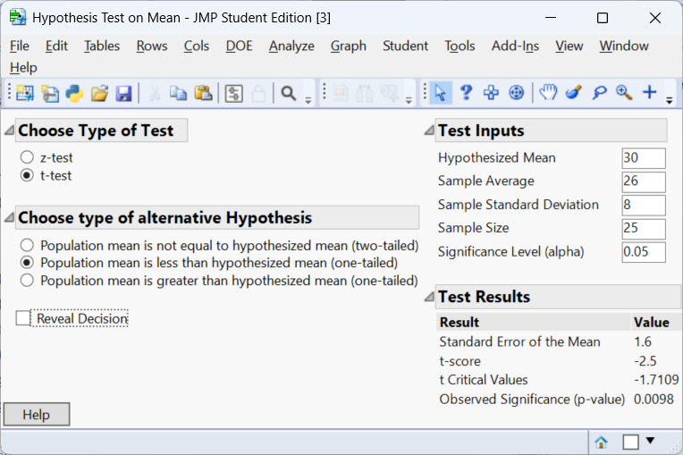
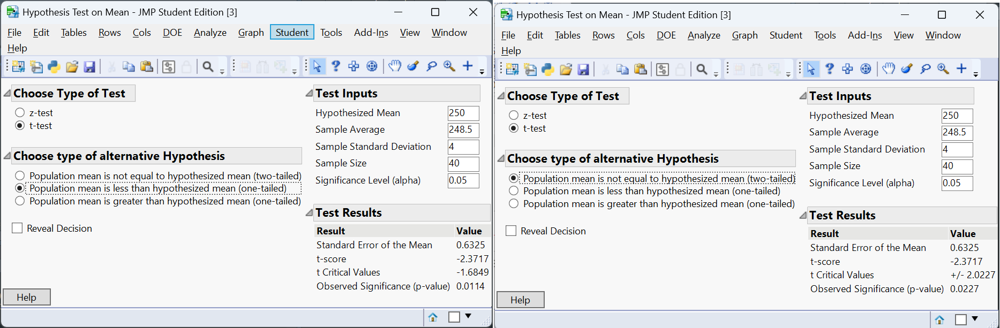
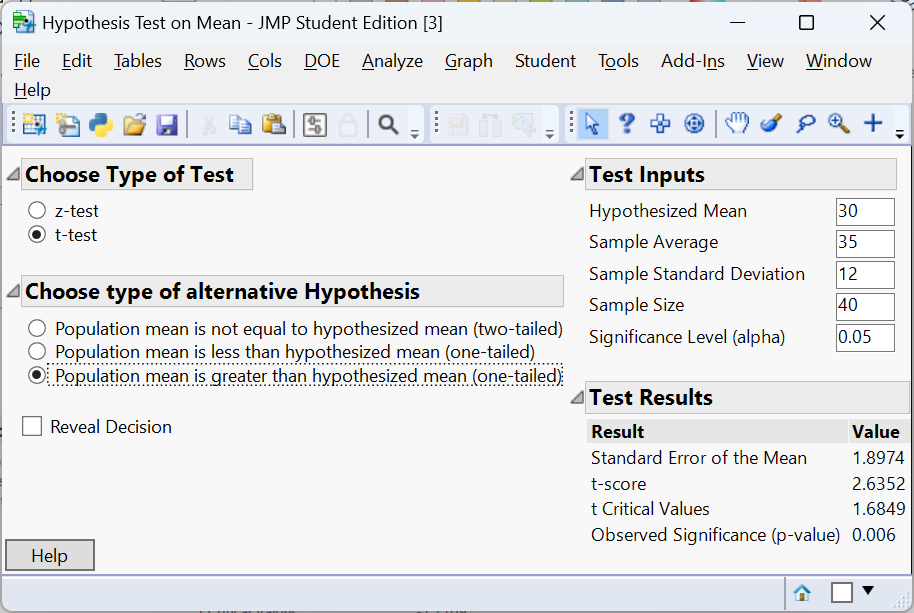
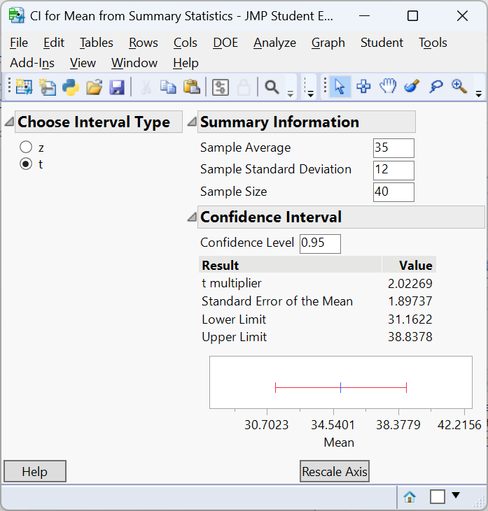

# Hypothesis Testing: The Basics

## Null and Alternative Hypotheses {#sec-10_01}

> "If you do not know how to ask the right question, you discover nothing." – W. E. Deming

Any statistical test begins with a **claim about an unknown population parameter**. This claim, called a **hypothesis**, formalizes a question we want to answer using data. For example, we might ask whether a new marketing strategy increases sales, whether a process meets a quality standard, or whether two groups differ in some meaningful way. Hypothesis testing provides a structured framework for evaluating such questions using sample data.  


### The role of competing hypotheses

Hypotheses always come in pairs:

* the **null hypothesis** ($H_0$), and
* the **alternative hypothesis** ($H_a$).

The **null hypothesis** represents a baseline or default position. It typically states that there is *no effect, no difference, or no change* in the population. In many applications, it reflects the current state of affairs or a claim that a process is operating as expected.

The **alternative hypothesis** represents what we are trying to find evidence for. It asserts that there *is* an effect, difference, or change. In many contexts, it corresponds to a research goal or a practical concern.

The logic of hypothesis testing is built around a key idea:

> We begin by **assuming the null hypothesis is true**, and then use sample data to assess whether that assumption is plausible.

If the observed data would be very unlikely under $H_0$, we reject it in favor of $H_a$. If not, we do not reject $H_0$. Because sampling is subject to randomness, our conclusions are always **probabilistic**, not certain.


#### A helpful analogy

A useful way to think about hypothesis testing is through the **legal analogy**:

* The null hypothesis is like the presumption of **innocence**.
* The alternative hypothesis is like **guilt**.
* The data serve as the **evidence**.

A jury does not prove innocence; it either finds enough evidence to convict or does not. Similarly, in statistics, we never “accept” $H_0$—we either **reject it** or **fail to reject it**. This distinction is important because even when we fail to reject $H_0$, it may still be false—we simply did not gather strong enough evidence.


### Defining the hypotheses

Constructing a hypothesis test begins with clearly identifying the parameter of interest and writing precise statements about it.

#### Population parameter vs. sample statistic

A **parameter** is a fixed but unknown number that describes a population, such as:

* the population mean $\mu$,
* the population proportion $p$,
* or the difference between two means.

A **statistic** is a value computed from a sample, such as $\bar{x}$ or $\hat{p}$, and is used to estimate the parameter.

> **Hypotheses are always statements about parameters, not statistics.**


#### The null hypothesis ($H_0$)

The null hypothesis usually takes the form of an equality:

$$
H_0: \text{parameter} = \text{specific value}.
$$

This value often represents “no effect” or a benchmark. For example:

* $H_0: \mu = 0$ (no change),
* $H_0: p = 0.5$ (no preference),
* $H_0: \mu_1 - \mu_2 = 0$ (no difference between groups).


#### The alternative hypothesis ($H_a$)

The alternative hypothesis reflects the research question and can take one of three forms:

* **Two-sided:**
  $$
  H_a: \text{parameter} \neq \text{value}
  $$
  (any difference matters)

* **Right-tailed (greater than):**
  $$
  H_a: \text{parameter} > \text{value}
  $$

* **Left-tailed (less than):**
  $$
  H_a: \text{parameter} < \text{value}
  $$

The choice depends on the context and what kinds of departures from the null are meaningful.


### Examples 

- Researchers develop a new cholesterol-lowering drug and want to know if it reduces LDL cholesterol more than the current standard.  Let $\mu$ be the mean reduction in LDL.  The hypotheses are

  $$
  \begin{align*}
    H_0&: \mu = 0 \quad\text{(no average reduction)}\\\quad H_a&: \mu > 0 \quad\text{(mean reduction is positive)}
  \end{align*}
  $$

  Here the alternative is one-sided because the investigators care only about increases in reduction.  They will look for evidence that the mean change is greater than zero.

- A geneticist compares the average expression level of a gene in treated cells versus control cells.  Let $\mu_T$ and $\mu_C$ be the mean expression levels.  If the goal is simply to detect any difference, the hypotheses are

  $$
  \begin{align*}
  H_0: \mu_T - \mu_C = 0 \\
  H_a: \mu_T - \mu_C \neq 0
  \end{align*}
  $$

  This is a two-sided alternative: the gene could be up-regulated or down-regulated, and both possibilities matter.

- A manufacturer packages coffee beans labelled “500 g.”  Customers suspect the packages may weigh less than advertised.  Let $\mu$ be the true mean weight.  The hypotheses become

  $$
  \begin{align*}
  H_0&: \mu = 500 \\
  H_a&: \mu < 500
  \end{align*}
  $$

  Notice that $H_a$ is one-sided ($<$).  If sample data show strong evidence that the mean is lower than 500 g, the company may need to adjust its filling process.

In each example we clearly separate the null (no change) from the alternative (change in a specified direction).  Remember that a test never **proves** the alternative; it only provides evidence against the null.  The next sections discuss the risks associated with rejecting or failing to reject $H_0$ and how we quantify that evidence.


#### Recap

| **Keyword/Concept**    | **Definition** |
|-----------------------|---------------|
| **Hypothesis** | A claim about a population parameter that can be tested using sample data. |
| **Null hypothesis ($H_0$)** | A statement of no effect or no difference; the hypothesis assumed true as the starting point of a test. |
| **Alternative hypothesis ($H_a$)** | The statement researchers hope to support; it suggests a parameter is different (greater, less, or not equal) from the null value. |


### Check your understanding

:::{.callout-note collapse=false title="Problems"}

1. A pharmaceutical company claims its new drug lowers systolic blood pressure by at least 5 mmHg compared with a placebo.  Express the null and alternative hypotheses in symbols.
2. A botanist believes two fertilizer treatments yield the same average plant height.  What are $H_0$ and $H_a$ for testing this belief?  Is the alternative one-sided or two-sided?
3. In your own words, explain why we never “accept” the null hypothesis in a statistical test.
:::

::: {.callout-tip collapse="true" title="Solutions"}
1. Let $\mu_D$ be the mean reduction in systolic blood pressure (drug minus placebo).  The company’s claim is that the reduction is at least 5 mmHg, so we test

   $$
   H_0: \mu_D = 5 \quad \text{vs.} \quad H_a: \mu_D > 5.
   $$

   Here $H_a$ is one-sided because we care only about reductions *greater* than 5 mmHg.  If sample evidence shows the mean reduction exceeds 5 by more than can be attributed to chance, we will reject $H_0$.

2. Let $\mu_1$ and $\mu_2$ be the mean heights under fertilizers 1 and 2.  The botanist’s belief is equality, so the null hypothesis is $H_0:\mu_1 - \mu_2 = 0$.  The alternative is that they differ: $H_a:\mu_1 - \mu_2 \neq 0$.  This is a two-sided alternative because we do not know which treatment might produce taller plants.

3. We do not accept $H_0$ because failing to reject it does not prove it is true.  A small sample might lack power to detect a real difference, so we can only say the data do not provide strong evidence against $H_0$.  Using the language “fail to reject” reminds us that all conclusions are tentative and based on limited information.
:::

## Type I and Type II Errors {#sec-10_02}

> "I can prove anything by statistics except the truth." – George Canning


Whenever we base a decision on a sample, there is always a chance that randomness will lead us to the wrong conclusion. Hypothesis testing makes this idea explicit by recognizing that our decisions are not guaranteed to be correct. Instead, they are subject to uncertainty, and that uncertainty can lead to two different kinds of mistakes.

### The two types of error

When conducting a hypothesis test, there are two possible truths (whether $H_0$ is actually true or false) and two possible decisions (reject or fail to reject $H_0$). This creates two kinds of mistakes:


#### **Type I error (false positive)**

A **Type I error** occurs when we **reject the null hypothesis even though it is true**. In other words, we detect an effect that does not actually exist. This is often called a false positive because we conclude that there is an effect or difference when, in reality, nothing has changed. 

For example, a company might conclude that a new marketing campaign increases sales when it actually has no impact, or a clinical trial might suggest that a drug is effective when it is not.

The probability of making a Type I error is denoted by $\alpha$,
called the **significance level**. This is a value we choose *before* conducting the test, commonly $\alpha = 0.05$ or $\alpha = 0.01$. It reflects how willing we are to risk making a false claim. If we set $\alpha = 0.05$, we are essentially saying that if the null hypothesis is true, we are willing to incorrectly reject it about 5% of the time in the long run.

#### **Type II error (false negative)**


A **Type II error** occurs when we **fail to reject the null hypothesis even though it is false**. This is a false negative: we miss a real effect that is actually present.

For instance, a business might conclude that a new pricing strategy has no impact on revenue when it actually increases profits, or a study might fail to detect that a treatment works. 

The probability of making this kind of error is denoted by $\beta$. While $\alpha$ is something we control directly, $\beta$ depends on several factors, including the sample size, the variability in the data, and how large the true effect is.


### Power of a test

Closely related to Type II error is the concept of **power**:
$$
\text{Power} = 1 - \beta.
$$

Power is the probability that the test **correctly rejects $H_0$ when the alternative is true**. In other words, it measures how good the test is at detecting real effects.

A **high-power test** is desirable because it is more likely to identify meaningful differences or changes when they exist.


### The trade-off between errors

A key idea in hypothesis testing is that there is a **trade-off** between Type I and Type II errors.

* Reducing $\alpha$ (being more cautious about false positives) makes it **harder to reject $H_0$**, which increases the chance of a Type II error.
* Increasing $\alpha$ makes it **easier to reject $H_0$**, which reduces $\beta$ but increases the risk of false positives.

> You cannot minimize both errors simultaneously without increasing the sample size.


### How to reduce errors

While we cannot eliminate errors entirely, we can reduce them through good study design:

* **Increase sample size ($n$):** Larger samples reduce variability and improve the ability to detect real effects (increase power).
* **Use precise measurements:** Reducing noise in the data makes differences easier to detect.
* **Choose a meaningful alternative hypothesis:** Clearly defining what effect matters improves test sensitivity.
* **Control variability:** Better experimental control leads to more reliable conclusions.


### The Legal Analogy

As stated in @sec-10_01, you can think of hypothesis testing through a legal analogy:

* The **null hypothesis** ($H_0$) corresponds to the assumption that the defendant is **innocent**.
* The **alternative hypothesis** ($H_a$) corresponds to the claim that the defendant is **guilty**.

A trial begins by assuming innocence, just as a hypothesis test begins by assuming $H_0$ is true. The goal is to examine the evidence (the data) and decide whether there is enough support to reject that assumption.


#### Type I error (false conviction)

A **Type I error** occurs when we reject $H_0$ even though it is true. In the legal setting, this corresponds to:

> **Convicting an innocent person.**

This is considered a very serious error, which is why the legal system is designed to make convictions difficult without strong evidence. Similarly, in statistics, we control the probability of this error using the significance level $\alpha$.

If $\alpha = 0.05$, we are allowing a 5% chance of rejecting the null hypothesis when it is actually true-in other words, a 5% chance of a “wrongful conviction” in the long run.


#### Type II error (failing to convict the guilty)

A **Type II error** occurs when we fail to reject $H_0$ even though it is false. In the legal analogy, this corresponds to:

> **Failing to convict a guilty person.**

Here, the evidence was not strong enough to overturn the presumption of innocence, even though the defendant was in fact guilty. This is also undesirable, but in many systems (both legal and statistical), it is considered less severe than convicting an innocent person.


#### Power (correct conviction)

The **power** of a test is the probability that we correctly reject $H_0$ when it is false. In the legal analogy, this is:

> **Correctly convicting a guilty person.**

A high-power test means that when the defendant is truly guilty (when the alternative is true), the evidence is likely to be strong enough to lead to conviction.


#### Putting it all together

The legal analogy highlights the balance inherent in hypothesis testing:

* We start by **presuming innocence** ($H_0$ is true).
* We require **strong evidence** to reject that presumption.
* We try to **avoid convicting the innocent** (control Type I error).
* At the same time, we want to **detect guilt when it exists** (achieve high power).

However, just like in the legal system, we cannot eliminate all errors. If we make it extremely difficult to convict (very small $\alpha$), we reduce wrongful convictions but increase the chance that guilty individuals go free (higher $\beta$). If we make conviction easier, we increase power but also risk more Type I errors.

This analogy emphasizes that hypothesis testing is fundamentally about **weighing evidence under uncertainty** and managing the risk of different types of mistakes.


### Summary table

| Truth about $H_0$ | Decision      | Result                      |
| ----------------- | ------------- | --------------------------- |
| $H_0$ true        | Reject        | Type I error ($\alpha$)     |
| $H_0$ true        | Do not reject | Correct                     |
| $H_0$ false       | Reject        | Correct (power = $1-\beta$) |
| $H_0$ false       | Do not reject | Type II error ($\beta$)     |


### Big picture

Hypothesis testing is not about certainty-it is about *managing risk*. By choosing $\alpha$ and designing studies carefully, we control how often we make errors and how sensitive our tests are to real effects. Understanding Type I and Type II errors helps us interpret results responsibly and make better decisions based on data.


### Examples and intuitive consequences

- **Medical trial.**  Suppose we test a new vaccine.  A Type I error would mean approving an ineffective vaccine, potentially exposing people to harm without benefit.  A Type II error would mean dismissing a vaccine that actually works, delaying protection.
- **Business quality control.**  In monitoring the mean fill weight of coffee packages, a Type I error might lead us to shut down a production line that is actually meeting specifications (costly downtime), whereas a Type II error might allow underfilled packages to reach customers (leading to complaints and regulatory problems).
- **Biology experiment.**  When testing whether a gene is differentially expressed, a Type I error corresponds to claiming the gene is regulated when it is not (leading to wasted follow-up experiments), and a Type II error misses a truly regulated gene.


#### Recap

| **Keyword/Concept** | **Definition** |
|--------------------|---------------|
| **Type I error** | Rejecting the null hypothesis when it is actually true; a false positive.  Its probability is the significance level $\alpha$. |
| **Type II error** | Failing to reject the null hypothesis when the alternative is true; a false negative.  Its probability is denoted $\beta$. |
| **Significance level ($\alpha$)** | The probability of committing a Type I error.  It is chosen by the researcher before data are collected (common values are 0.05 or 0.01). |
| **Power ($1-\beta$)** | The probability of correctly rejecting the null hypothesis when the alternative is true.  Power increases with sample size, effect size, and higher significance level. |

### Check your understanding

:::{.callout-note collapse=false title="Problems"}

1. In a courtroom analogy, a Type I error corresponds to convicting an innocent defendant, and a Type II error corresponds to letting a guilty defendant go free.  Explain why society might choose a very small $\alpha$ (e.g., 0.01) in this context.
2. A quality control engineer tests whether the mean diameter of machine-produced screws equals 5 mm.  Describe what a Type I error and a Type II error mean in this setting.  Which error would be more serious for the company?
:::


::: {.callout-tip collapse="true" title="Solutions"}
1. In criminal justice we usually prefer to err on the side of not convicting an innocent person.  A Type I error (convicting the innocent) is considered worse than a Type II error (acquitting the guilty).  Choosing a very small $\alpha$ makes false convictions rare, though it increases the chance that some guilty people go free.

2. A Type I error means concluding that the mean diameter differs from 5 mm when it actually equals 5 mm.  This might lead to unnecessary machine adjustments or wasted product.  A Type II error means concluding that the mean is 5 mm when it is not; defective screws may reach customers.  Depending on regulatory requirements, the latter error could be more costly, so the engineer may accept a slightly higher $\alpha$ to reduce $\beta$.

:::

## The p-Value and Significance Level {#sec-10_03}

> "A common misconception is that an effect exists only if it is statistically significant and that it does not exist if it is not." – Jonas Ranstam


Once the hypotheses are set, we quantify the evidence against the null hypothesis using a **test statistic**.  The test statistic measures how far the sample data (in the form of sample statistics) are from the hypothesized value assuming $H_0$ is true (e.g., the difference between the sample mean and the hypothesized mean, standardized by variability). 

From this statistic we compute a **p-value**, which is the probability of obtaining a result at least as extreme as the one observed given the null hypothesis is true.  The smaller the p-value, the stronger the evidence against $H_0$.

### Interpreting the p-value

Suppose we test $H_0:\mu=0$ versus $H_a:\mu>0$ and obtain a p-value of 0.03.  This p-value means that if the true mean were zero, there is a 3% chance of obtaining a sample mean as large (or larger) than what we observed.  Because such data are unlikely under $H_0$, we consider rejecting $H_0$.  Importantly, a p-value is *not* the probability that the null is true; it is conditional on $H_0$ being true.  Small p-values provide evidence against $H_0$, but they do not measure the size or importance of an effect.

To make a decision, we compare the p-value to the **significance level** $\alpha$.  If the p-value is less than $\alpha$, we reject $H_0$; otherwise we fail to reject it.  Common significance levels are 0.05, 0.01, and 0.10.  The choice should reflect the consequences of Type I and Type II errors in the context of the problem.

### Example: computing a p-value

Imagine a pharmaceutical company claims its headache medication provides immediate relief.  Historically the mean time to relief is 30 minutes.  In a sample of 25 patients using the new formulation, the sample mean time is 26 minutes with a standard deviation of 8 minutes.  We want to test

$$
H_0:\mu = 30\quad\text{versus}\quad H_a:\mu < 30
$$

at $\alpha=0.05$.  The null hypothesis asserts no improvement; the alternative suggests the new drug works faster.  A one-sample t-test provides the test statistic and p-value.  The JMP output below shows the results.




The resulting p-value  will be compared to 0.05.  If it is less than 0.05, we conclude that the data provide significant evidence that the new drug shortens the time to relief.  Otherwise we fail to reject $H_0$.  For this example, the p-value is 0.0098. Thus we reject $H_0$ and conclude that there is enough evidence to conclude the mean time to relief is less than 30 minutes.

### Practical vs. statistical significance

Statistical significance tells us whether the data provide enough evidence to reject a null hypothesis.  **Practical significance**, sometimes called clinical or substantive significance, asks whether the size of the effect is large enough to matter in the real world.  

A p-value alone cannot answer this second question.  In particular, large samples can produce very small p-values for effects that are trivial in practice, while small samples may yield non-significant p-values despite substantial differences.  To assess practical significance you need subject-matter expertise and, often, a pre-defined *smallest effect size of interest*. 

For example, if an educational program needs to improve test scores by at least 5 points to justify its cost, a statistically significant 3-point increase would not be practically significant.  Similarly, in medicine a reduction of 2 mmHg in blood pressure might achieve a tiny p-value when measured in thousands of patients, but clinicians may deem it too small to change practice.

One way to gauge the magnitude and precision of an effect is to report  its **confidence interval**.  A confidence interval provides a range of plausible values for the population effect size.  Because it incorporates sampling variability, a CI tells us not only whether an effect exists but also how large it might be.  When the entire interval lies above (or below) the threshold for practical importance, we can be more confident that the effect is both statistically and practically meaningful.  If the interval straddles this threshold, the study’s estimate is imprecise: the true effect may or may not be large enough to matter.  In contrast, if the CI includes zero, the data are compatible with no effect at all, and we should not claim practical significance.

To illustrate, consider two studies evaluating the same training program.  Both report a mean improvement of 9 points in test scores and both are statistically significant.  Study A has a 95% confidence interval from 3 to 15 points.  Since 3 points is below the 5-point threshold, we cannot rule out the possibility that the true effect is too small to be meaningful.  

Study B has a 95% confidence interval from 7 to 11 points.  Because the entire interval exceeds 5 points, we conclude that the improvement is both statistically and practically significant.  

Confidence intervals focus attention on effect sizes and their uncertainty rather than just whether the p-value crosses a cutoff.

#### Recap

| **Keyword/Concept** | **Definition** |
|--------------------|---------------|
| **Test statistic** | A numerical summary of the sample that measures how far the data deviate from what is expected under the null hypothesis. |
| **p-value** | The probability, under the null hypothesis, of obtaining a test statistic as extreme or more extreme than the one observed. |
| **Significance level ($\alpha$)** | A threshold chosen before the test that determines when to reject $H_0$.  If p-value < $\alpha$, we reject $H_0$.  Common levels are 0.05, 0.01, and 0.10. |
| **Statistical vs. practical significance** | Statistical significance refers to small p-values; practical significance refers to whether the effect size is large enough to matter in context. |

### Check your understanding

:::{.callout-note collapse="false" title="Problems"}

1. A study compares the mean yield of two corn varieties.  The p-value from a test is 0.08 at $\alpha=0.05$.  What conclusion would you draw?  Could the difference still be important in practice?
2. Describe in words what a p-value of 0.001 means in the context of testing whether the average commute time is greater than 20 minutes.
3. Explain why a p-value is not the probability that the null hypothesis is true.
:::

::: {.callout-tip collapse="true" title="Solutions"}
1. Because 0.08 > 0.05, we fail to reject the null hypothesis at the 5 % level.  The data do not provide strong evidence of a difference in mean yield.  However, the observed difference might still be practically important—for example, if one variety yields 10% more—but the study may lack power.  Researchers could collect more data or consider the cost/benefit of switching varieties.

2. A p-value of 0.001 means that if the true mean commute time were 20 minutes (the null), we would see an average as large (or larger) as the one observed only about 0.1% of the time.  Such an extreme result is very unlikely under $H_0$, so we have strong evidence that the average commute exceeds 20 minutes.

3. The p-value is computed assuming $H_0$ is true; it measures the compatibility of the data with that assumption.  It does not give the probability that $H_0$ itself is true because hypotheses are statements about fixed parameters, not random events.  
:::

## One-Tailed and Two-Tailed Tests {#sec-10_04}

> "As Confucius might have said, if the difference isn’t different enough to make a difference, what’s the difference?" – V. Chew


When you write the alternative hypothesis you must decide whether it specifies a direction.  If $H_a$ asserts that a parameter is greater than or less than the null value, the test is **one-tailed** (or one-sided).  If $H_a$ simply asserts that the parameter is not equal to the null value, the test is **two-tailed** (or two-sided).  This decision affects both the p-value and the interpretation of results.

### One-tailed tests

A one-tailed test asks whether a parameter is significantly higher *or* lower than the null value.  For example, a company might test whether a new marketing campaign *increases* average sales.  The hypotheses are $H_0:\mu=\mu_0$ versus $H_a:\mu>\mu_0$.  Only values of the test statistic in one direction count as evidence against $H_0$. 

Because we focus on a single tail of the distribution, the p-value for a given statistic is half that of a two-tailed test for the same data.  However, one-tailed tests ignore large deviations in the opposite direction, so you should only use them when increases (or decreases) in the other direction are irrelevant or impossible.  You must decide this *before* looking at the data.

### Two-tailed tests

A two-tailed test asks whether a parameter is *different* from the null value, regardless of direction.  For example, researchers might test whether a new fertilizer yields a different average plant height, without specifying whether it is higher or lower.  The hypotheses are $H_0:\mu=\mu_0$ versus $H_a:\mu\neq\mu_0$.  

Evidence on both sides of the sampling distribution counts against $H_0$.  Because the tails share the significance level, the p-value is roughly twice that of a one-tailed test for the same statistic.

### Example: comparing one- and two-tailed p-values

Suppose a manufacturer packages orange juice with a nominal volume of 250 mL.  In a sample of 40 cartons, the mean volume is 248.5 mL with a standard deviation of 4 mL.  We test whether the mean volume is less than 250 mL (one-tailed) and whether it differs from 250 mL (two-tailed).




Because the sample mean is lower than 250 mL, the one-tailed p-value is smaller than the two-tailed p-value.  If the sample mean had been above 250 mL, the one-tailed p-value would be large (close to 1) because the deviation in the “wrong” direction provides no evidence for $H_a$.  Always choose the alternative before analyzing data; otherwise you risk biasing your results.

### Choosing between one- and two-tailed tests

* Use a **two-tailed test** when you care about differences in either direction or when you want a more conservative test (it requires more evidence to reject $H_0$).  Many scientific studies default to two-tailed alternatives to avoid the risk of missing an effect in the unexpected direction.
* Use a **one-tailed test** only when values in the opposite direction are irrelevant, impossible, or would not change your conclusion.  For instance, if a regulatory standard specifies that a contaminant must not exceed 50 ppm, you may test $H_0:\mu=50$ versus $H_a:\mu>50$.

#### Recap

| **Keyword/Concept** | **Definition** |
|--------------------|---------------|
| **One-tailed test** | A hypothesis test with a directional alternative (greater than or less than).  Evidence is evaluated in one tail of the sampling distribution. |
| **Two-tailed test** | A test with a non-directional alternative (not equal).  Evidence in both tails counts against the null hypothesis.  The p-value is roughly twice the one-tailed p-value for the same statistic. |
| **Directional vs. non-directional** | Directional alternatives specify “greater than” or “less than”; non-directional alternatives specify “not equal.”  Choosing the direction must occur before seeing the data. |

### Check your understanding

:::{.callout-note collapse="false" title="Problems"}

1. A dietician wants to know if a new dietary program changes average blood glucose levels compared to the current standard.  Write the null and alternative hypotheses and state whether the test should be one- or two-tailed.
2. A safety inspector measures the decibel level of a machine that is regulated not to exceed 90 dB.  Should the test of $H_0:\mu=90$ be one- or two-tailed?  Explain why.
3. If a one-tailed t-test yields a p-value of 0.04, what would be the p-value of the corresponding two-tailed test (approximately) for the same data?  Why is it different?
:::

::: {.callout-tip collapse="true" title="Solutions"}
1. Let $\mu$ be the mean blood glucose level under the new program.  To detect any change (increase or decrease) the hypotheses are $H_0:\mu = \mu_0$ versus $H_a:\mu \neq \mu_0$.  This is a two-tailed test because both higher and lower glucose levels matter.  If the dietician is only concerned about decreases (for example, reducing high glucose levels), a one-tailed test could be used, but the decision must be made before looking at the data.

2. Because the regulation is about exceeding a maximum, the relevant test is $H_0:\mu = 90$ versus $H_a:\mu > 90$.  This is a one-tailed alternative: we care only about the machine being too loud.  If the measured average is below 90 dB, we will not shut down the machine even if it is lower than 90 by a large margin.

3. For symmetric distributions, the two-tailed p-value is approximately twice the one-tailed p-value.  If the one-tailed p-value is 0.04, then the two-tailed p-value is about 0.08.  The two-tailed test divides the total significance level between the two tails, making it harder to reject $H_0$ for a given statistic.
:::

## The Steps of Hypothesis Testing {#sec-10_05}

> "My philosophy is basically this, and this is something that I live by, and I always have, and I always will: Don't ever, for any reason, do anything, to anyone, for any reason, ever, no matter what, no matter where, or who, or who you are with, or where you are going, or where you've been, ever, for any reason whatsoever." – Michael Scott


Conducting a hypothesis test involves a systematic sequence of decisions.  There are four main steps: state the hypotheses, formulate an analysis plan, analyze the data, and interpret the results.  Here we break down those steps and illustrate them in practice.

### Step 1: State the hypotheses

Identify the population parameter of interest and formulate the null and alternative hypotheses.  Specify whether the alternative is one-sided or two-sided.  The hypotheses should reflect the research question.

### Step 2: Formulate the analysis plan

Choose the significance level $\alpha$ (the probability of a Type I error) and select an appropriate test statistic.  The statistic depends on the type of data and the assumptions you can make.  Also decide whether your test will be one-tailed or two-tailed and check conditions (such as normality or independence).

### Step 3: Analyze the data

Compute the test statistic from your sample and determine the p-value.  Modern software (including JMP, R, or Excel) readily calculates p-values.  Underlying calculations often involve standardizing the statistic by the standard error and referring to a distribution (t, normal, chi-square, etc.).

### Step 4: Interpret the results in context

Compare the p-value to the chosen significance level.  If $p < \alpha$, reject the null hypothesis; otherwise fail to reject it.  Then translate this conclusion back to the practical context of the problem.  Remember to discuss both statistical and practical significance and consider potential errors.  Summarize what the result means for stakeholders.

### Example: testing patient wait times

Suppose administrators of a hospital claim that the average wait time in the emergency department is 30 minutes.  A patient advocacy group believes the true mean is longer.  They collect a random sample of 40 patients and find an average wait time of 35 minutes with a standard deviation of 12 minutes.  We will test

$$
H_0:\mu = 30 \quad\text{versus}\quad H_a:\mu > 30
$$

at $\alpha=0.05$.  Here’s how we carry out the test in JMP:




The t-test computes a test statistic of approximately 2.6352 and a p-value of approximately 0.006.  Because the p-value is less than 0.05, we reject $H_0$ and conclude that the average wait time is significantly longer than 30 minutes.  From a practical standpoint, a five-minute difference (35 minutes instead of 30) may be important if it reflects overcrowding and patient frustration. We construct a 95% confidence interval as:



Not only do we see that there is enough evidence to conclude the mean wait time is greater than 30 minutes, we can also be 95% confident that the true mean wait time is in the interval $(31.16, 38.83)$. Thus, we do not have enough evidence to say the mean wait time is greater than 35 minutes. 


### Putting it all together

When you conduct hypothesis tests in practice, follow this template:

1. **State the hypotheses** in terms of the population parameter and decide if the alternative is one- or two-sided.
2. **Choose the significance level** $\alpha$ and the appropriate test statistic, verifying assumptions.
3. **Compute the test statistic and p-value** using software or formulas.
4. **Draw a conclusion**: compare the p-value to $\alpha$, decide whether to reject $H_0$, and interpret the result in context.

This structured approach ensures that your analysis is transparent and reproducible. 

#### Recap

| **Keyword/Concept** | **Definition** |
|--------------------|---------------|
| **Hypothesis test steps** | The sequence of state hypotheses, choose significance level and test statistic, analyze the data (compute test statistic and p-value), and interpret results. |


### Check your understanding

:::{.callout-note collapse="false" title="Problems"}

1. Outline the four steps of hypothesis testing in your own words and explain why each step is important.
2. A company advertises that the average life of its lightbulbs is 2,000 hours.  You take a sample of 50 bulbs and find a mean life of 1930 hours with a standard deviation of 250 hours.  At $\alpha=0.05$, test whether the mean life is less than advertised.  Write out the steps and provide the conclusion.
3. In Step 2 you must choose the significance level.  What factors should you consider when deciding between $\alpha=0.05$ and $\alpha=0.01$?

:::

::: {.callout-tip collapse="true" title="Solutions"}
1. **Step 1:** State $H_0$ and $H_a$ clearly in terms of the population parameter.  This ensures the test addresses the research question.  **Step 2:** Choose $\alpha$ and the test statistic appropriate for your data, and verify assumptions.  This controls the probability of Type I errors and ensures validity.  **Step 3:** Compute the statistic and p-value using your sample.  This translates data into evidence.  **Step 4:** Compare the p-value to $\alpha$ and interpret the result in context, considering both statistical and practical significance.  Communicating the conclusion completes the analysis.

2. Let $\mu$ be the mean life of the bulbs.  **Step 1:** $H_0:\mu = 2000$ versus $H_a:\mu < 2000$ (one-tailed).  **Step 2:** Choose $\alpha=0.05$ and a one-sample t-test (population sd unknown).  **Step 3:** Compute the test statistic and p-value:

   ```{r}
   #| echo: false
   set.seed(2025)
   n <- 50
   sample_mean <- 1930
   sample_sd <- 250
   mu0 <- 2000
   x <- rnorm(n, mean = sample_mean, sd = sample_sd)
   result <- t.test(x, mu = mu0, alternative = "less")
   result$statistic
   result$p.value
   ```
   Suppose the p-value is around 0.03 (the actual value depends on random simulation).  **Step 4:** Since p < 0.05, we reject $H_0$ and conclude that the average bulb life is significantly less than 2 000 hours.  The company may need to revise its claim or improve manufacturing.

3. The choice of $\alpha$ reflects how serious a Type I error would be.  A smaller $\alpha$ (e.g., 0.01) reduces the chance of falsely claiming a discovery but increases the chance of missing a real effect (Type II error).  Consider the consequences: in a medical trial for a life-saving drug, you may tolerate a higher $\alpha$ to avoid missing an effective treatment; in a court case, you might choose a very small $\alpha$ to minimize false convictions.  Practical and ethical considerations should guide the decision.
:::
