# Hypothesis Testing with Categorical Response

## Response and Explanatory Variables {#sec-response-explanatory}

>"Statistical thinking will one day be as necessary for efficient citizenship as the ability to read and write." - H.G. Wells

Every statistical study involves variables that play different roles.  Two of the most important are the *response variable* and the *explanatory variable*.

### Response Variable

The **response variable** is the variable that records the outcome we care about most in a study. It is the result we want to describe, understand, or explain. Because it reflects the outcome of interest, it is sometimes called the **outcome variable** or **dependent variable**.

A helpful way to think about the response variable is this: it answers the question

*“What are we trying to learn about?”*

In any statistical investigation, many variables may be recorded, but the response variable is the one that plays the central role. It is the variable whose behavior we want to study. We may want to know what affects it, whether it differs across groups, or whether there is evidence that it changes under different conditions.

For example, suppose a company changes its website and wants to know whether the redesign improves results. The response variable might be whether a visitor makes a purchase. In that case, the main outcome of interest is not the color of the page or the layout itself; those are possible explanatory variables. The outcome being measured is the purchase decision, so that is the response variable.

The response variable can take many forms depending on the study.

* It may be **categorical**, such as yes/no, pass/fail, voted/did not vote, or prefers Brand A/Brand B/Brand C.
* It may be **quantitative**, such as annual income, number of units sold, wait time, blood pressure, or exam score.

Because the response variable is the focus of the analysis, identifying it correctly is one of the first and most important steps in statistics. If we misunderstand what the response variable is, it becomes much harder to choose the correct graph, summary, or statistical test.

#### Examples of response variables

:::{.example collapse="false" title="Example 11.1: Examples from Business and Marketing"}

* A retailer studies whether a new loyalty program increases repeat purchases.
  The response variable is **whether a customer makes a repeat purchase**.
* A company compares two advertisements and wants to know which one is more effective.
  The response variable might be **whether a viewer clicks the ad**, or it might be **amount spent after clicking**.
* A restaurant surveys diners after a meal.
  The response variable could be **customer satisfaction score** on a scale from 1 to 10.
* A bank studies loan applications.
  The response variable might be **whether a loan is approved** or **whether the borrower later defaults**.
  
:::

:::{.example collapse="false" title="Example 11.2: Examples from Education"}

* A teacher compares two review methods before an exam.
  The response variable might be **exam score**.
* A university studies first-year students to understand retention.
  The response variable could be **whether a student returns for the second year**.
* A tutoring center evaluates its program.
  The response variable might be **improvement in test score** from before tutoring to after tutoring.
  
:::

:::{.example collapse="false" title="Example 11.3: Examples from Sports Analytics"}

* A basketball analyst studies the effect of rest days on player performance.
  The response variable might be **points scored**, **shooting percentage**, or **whether the team wins the game**.
* A baseball team evaluates a new training program.
  The response variable could be **batting average**, **exit velocity**, or **number of strikeouts**.
* A football researcher studies fourth-down strategy.
  The response variable might be **whether the conversion attempt succeeds**.
  
:::

:::{.example collapse="false" title="Example 11.4: Examples from Public policy and social science"}

* A city wants to know whether a new bus route improves access to transportation.
  The response variable might be **number of riders per day**.
* A political scientist studies voter turnout.
  The response variable could be **whether a person voted in the election**.
* A criminologist studies neighborhood programs.
  The response variable might be **crime rate** or **number of incidents reported**.

:::

:::{.example collapse="false" title="Example 11.5: Examples from Health and Science"}

* In a clinical trial, the response variable could be **whether a patient recovers**, **pain level**, or **change in blood pressure**.
* In an agricultural study, the response variable might be **crop yield per acre**.
* In an environmental study, the response variable could be **air quality index** or **level of a pollutant in water**.

:::

#### Why the response variable matters

The response variable determines much of the statistical analysis that follows. In particular, the **type** of response variable often determines which methods are appropriate.

For example:

* If the response variable is **categorical**, we may analyze proportions or use methods for categorical data.
* If the response variable is **quantitative**, we may analyze means, standard deviations, regression models, or other methods for numerical data.

This is why many statistical decision processes begin by asking:

*Is the response variable categorical or quantitative?*

That question helps guide the rest of the analysis.

#### A practical way to identify the response variable

When reading a study or word problem, ask:

* What outcome is being measured?
* What result are the researchers trying to explain?
* If the study is asking whether one thing affects another, what is the “other” thing being affected?

That affected outcome is usually the response variable.

For instance:

* “Does free shipping increase online purchases?”
  The response variable is **online purchase behavior**.
* “Does class attendance affect final exam score?”
  The response variable is **final exam score**.
* “Does fertilizer type influence plant growth?”
  The response variable is **plant growth**.

In each case, the response variable is the measured result, not the factor suspected of influencing it.

### Explanatory Variable

The **explanatory variable** is the variable that helps explain, predict, or influence the response variable. It is the factor that we think may be related to changes in the outcome of interest.

It is often called the **independent variable**, **predictor variable**, or **factor**, especially in experimental settings.

A helpful way to think about the explanatory variable is this: it answers the question

*“What might be causing or influencing the outcome?”*

If the response variable is the *result*, then the explanatory variable is the *potential reason* for that result.

For example, if a company wants to know whether a new website layout increases sales, then:

* The response variable is **whether a purchase is made**.
* The explanatory variable is **which website layout the user sees**.

The explanatory variable is what we change, compare, or observe in order to understand its relationship with the response.

#### Types of explanatory variables

Explanatory variables can take many forms:

* **Categorical**: group membership or categories
  (e.g., treatment vs. control, type of advertisement, gender, region)
* **Quantitative**: numerical measurements
  (e.g., price, hours studied, temperature, advertising budget)

Sometimes, there are **multiple explanatory variables** in a study. In that case, we are trying to understand how several factors together influence the response.

#### Examples of explanatory variables

:::{.example collapse="false" title="Example 11.6: Examples from Business and marketing"}

* A company tests two pricing strategies.
  The explanatory variable is **price level** (e.g., $9.99 vs. $12.99).
* An online retailer runs an A/B test on two homepage designs.
  The explanatory variable is **website version** (Design A vs. Design B).
* A firm studies what drives customer satisfaction.
  Explanatory variables might include **wait time**, **product quality**, and **customer service rating**.
* A streaming service analyzes user engagement.
  Explanatory variables could include **subscription type**, **time of day**, or **number of recommendations shown**.
  
:::

:::{.example collapse="false" title="Example 11.7: Examples from Education"}

* A teacher studies whether study habits affect performance.
  The explanatory variable might be **hours studied per week**.
* A school compares teaching methods.
  The explanatory variable is **instruction method** (lecture vs. interactive).
* A researcher examines factors influencing GPA.
  Explanatory variables could include **attendance rate**, **study time**, and **course load**.
  
:::

:::{.example collapse="false" title="Example 11.8: Examples from Sports Analytics"}

* A basketball analyst studies shooting performance.
  The explanatory variable might be **distance from the basket** or **defender proximity**.
* A team evaluates the effect of rest on performance.
  The explanatory variable is **number of rest days before a game**.
* A tennis analyst studies serve success.
  Explanatory variables might include **first serve percentage** or **serve speed**.
  
:::

:::{.example collapse="false" title="Example 11.9: Examples from Public policy and social science"}

* A city studies traffic congestion.
  The explanatory variable might be **time of day** or **number of lanes**.
* A political scientist examines voting behavior.
  Explanatory variables could include **age**, **income**, or **education level**.
* A criminologist studies crime rates.
  Explanatory variables might include **police presence**, **neighborhood income**, or **population density**.
  
:::

:::{.example collapse="false" title="Example 11.10: Examples from Health and science"}

* In a clinical trial, the explanatory variable is typically **treatment type** (drug vs. placebo).
* In agriculture, it might be **type of fertilizer** or **amount of water**.
* In environmental science, it could be **exposure level to a pollutant**.

:::

#### Experiments vs. observational studies

The role of the explanatory variable depends on the type of study.

* In an **experiment**, researchers **control or manipulate** the explanatory variable.
  For example, assigning patients to receive a new drug or a placebo.

* In an **observational study**, researchers **observe** the explanatory variable without controlling it.
  For example, recording a person’s exercise habits and health outcomes.

This distinction is important because:

* Experiments allow us to make **cause-and-effect conclusions**.
* Observational studies can show **associations**, but not necessarily causation.

#### Multiple explanatory variables

In many real-world situations, outcomes are influenced by more than one factor.

For example:

* Customer satisfaction may depend on **price**, **service quality**, and **wait time**.
* Exam performance may depend on **study time**, **attendance**, and **prior knowledge**.
* A team’s success may depend on **player skill**, **coaching strategy**, and **injuries**.

When multiple explanatory variables are present, we are often interested in understanding:

* Which variables have the strongest relationship with the response
* How variables interact with each other
* Whether the effect of one variable changes depending on another

#### A practical way to identify the explanatory variable

When reading a study or problem, ask:

* What variable is being changed, compared, or observed to see its effect?
* What groups or conditions are being compared?
* What might explain differences in the outcome?

For example:

* “Does free shipping increase online purchases?”
  Explanatory variable: **shipping policy** (free vs. not free)
* “Does class attendance affect exam score?”
  Explanatory variable: **attendance level**
* “Does fertilizer type influence plant growth?”
  Explanatory variable: **fertilizer type**

In each case, the explanatory variable is the factor we suspect is influencing the response.

#### Key idea

The explanatory variable provides the *context* for understanding the response. It allows us to ask:

*“Do changes in this variable help explain changes in the outcome?”*

Together, the explanatory and response variables form the foundation of statistical analysis. Identifying them clearly is the first step toward choosing the correct methods and making meaningful conclusions.

### Recap

| **Keyword/Concept**            | **Definition**                                                                                 |
| ------------------------------ | ---------------------------------------------------------------------------------------------- |
| **Response variable**          | The outcome or result measured in a study; the variable of primary interest.                   |
| **Explanatory variable**       | The variable thought to explain or predict changes in the response.                            |
| **Dependent vs. independent**  | “Dependent” refers to the response variable; “independent” refers to the explanatory variable. |

### Check your understanding

::: {.callout-note collapse="false" title="Problems"}

1. Identify the response and explanatory variables in each scenario:

   * (a) A company studies whether providing flexible work hours increases employee productivity.
   * (b) A biologist examines whether soil pH affects seed germination rate.
   * (c) An economist studies whether interest rates influence consumer spending.

2. In which of the above examples would it be appropriate to claim a cause-and-effect relationship?  Why?

:::

::: {.callout-tip collapse="true" title="Solutions"}
1.

* (a) **Response:** employee productivity; **Explanatory:** work-schedule type (flexible vs. fixed).
* (b) **Response:** germination rate; **Explanatory:** soil pH.
* (c) **Response:** consumer spending; **Explanatory:** interest rate.

2. Cause-and-effect can be claimed **only** in a true experiment—typically case (a) or (b) if the explanatory variable is *controlled* by the researcher.  In (c), interest rates are not manipulated by the researcher but merely observed, so the study is observational and cannot establish causation.
:::

## One Sample Test for a Proportion {#sec-11_01}

> "60% of the time, it works every time." - Brian Fantana

To decide on a statistical method, we should first start with asking what type of response variable we have (or will have). There are two main types: **quantitative** and **categorical**. 

After we determine the type of the response variable, we should then determine the explanatory variables (if any). We can think of this in terms of a flowchart:

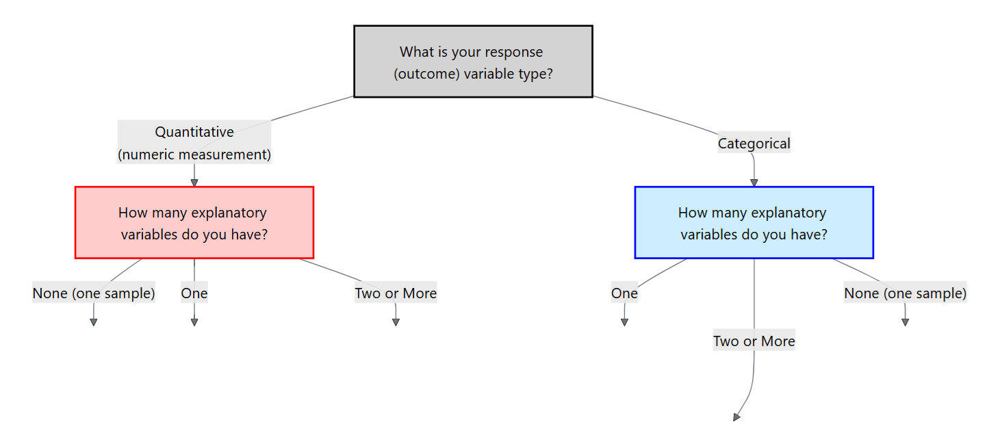

For the rest of this chapter, we will focus on a categorical response variable (the blue side on the flowchart). We will then cover different methods depending on the type and number of explanatory variables.

### Hypotheses and assumptions

Our first method is the scenario where the response is categorical but there are no explanatory variables. In particular, the response variable is binary and we are interested in making an inference of the proportion of the population for one of those categories.

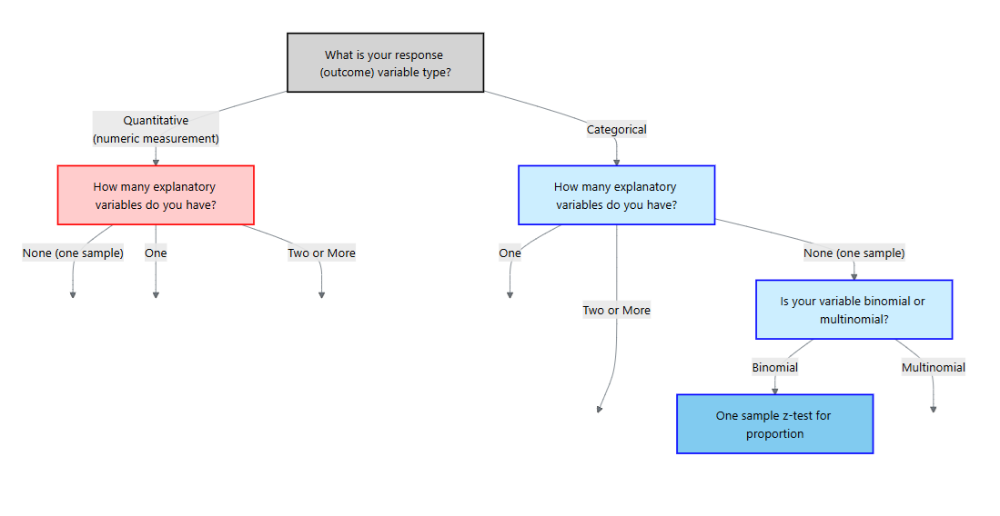

Let $p$ denote the true proportion of interest and let $p_0$ be the hypothesized value.  

The *null hypothesis* states that the population proportion equals the hypothesized value.  The *alternative hypothesis* may be two‑sided if we simply want to detect any difference, or one‑sided if we are interested in increases or decreases.

$$
\begin{align*}
H_0&: p = p_0\\
H_a&: p \ne p_0\quad\text{ or }\quad p>p_0\quad\text{ or }\quad p<p_o
\end{align*}
$$

Like all inference procedures, this test requires certain conditions.  We assume a **simple random sample** from a population of independent Bernoulli trials.  Each trial has two categories (success/failure) and a constant probability of success.  We must also have at least 15 successes and 15 failures ($np\geq15$ and $n(1-p)\geq15$) so that the normal approximation is reasonable.  These “success–failure” conditions ensure the sampling distribution of the sample proportion is approximately normal.

### Test statistic and p‑value

Given a sample of size $n$ with $x$ successes, the *sample proportion* is $\hat{p}=x/n$.  Under $H_0$ the test statistic

$$
z = \frac{\hat{p} - p_0}{\sqrt{\frac{p_0(1-p_0)}{n}}}
$$

measures how many standard errors the sample proportion deviates from the hypothesized proportion. For a two‑sided alternative the p‑value is $2P(Z > |z|)$; for a one‑sided alternative we compute $P(Z > z)$ or $P(Z < z)$ depending on the direction.  If the p‑value is less than the significance level $\alpha$, we reject $H_0$ in favor of $H_a$.

### Post‑hoc confidence interval

When the test is significant, a *confidence interval* for $p$ provides context.  A $(1-\alpha)\times100\%$ interval is

$$
\hat{p} \pm z_{\alpha/2}\sqrt{\frac{\hat{p}(1-\hat{p})}{n}},
$$

where $z_{\alpha/2}$ is the critical value from the standard normal distribution.  This interval uses the sample proportion in place of the hypothesized value in the standard error.  It gives a range of plausible values for $p$ and helps assess practical importance.

:::{.example collapse="false" title="Example 11.11: Side effects of a vaccine"}

Suppose a pharmaceutical company wishes to evaluate whether fewer than a quarter of patients experience a mild rash after receiving a vaccine.  In a random sample of $n=200$ vaccinated patients, $x=38$ report a rash.  We test

$$
H_0: p = 0.25 \quad\text{versus}\quad H_a: p < 0.25
$$

using $\alpha=0.05$.  The sample proportion is $\hat{p} = 38/200 = 0.19$.  Plugging into the test statistic formula gives

$$
z = \frac{0.19 - 0.25}{\sqrt{\frac{0.25\times 0.75}{200}}} \approx -2.06.
$$

For a one‑sided test the p‑value is $P(Z < -2.06) \approx 0.0198$, which is below 0.05.  We reject $H_0$ and conclude that the rash rate is lower than 25%.  

A 95 % confidence interval for $p$ is
5
$$
0.19 \pm 1.96\sqrt{\frac{0.19\times0.81}{200}} = (0.13, 0.244).
$$

This interval suggests the true proportion lies somewhere between 13.5% and 24.4%, consistent with our conclusion.

:::

:::{.example collapse="false" title="Example 11.12: Color morph frequency"}

A biologist studying a species of lizard notes that 40 out of 150 captured individuals have a rare blue color morph.  Is there evidence that the morph frequency differs from 20%?  We set up

$$
H_0: p = 0.20 \quad\text{vs.}\quad H_a: p \neq 0.20.
$$

We could perform this test by manually doing the calculations like the last example. Instead, we will use the Calculators available in JMP 18 Student Edition.

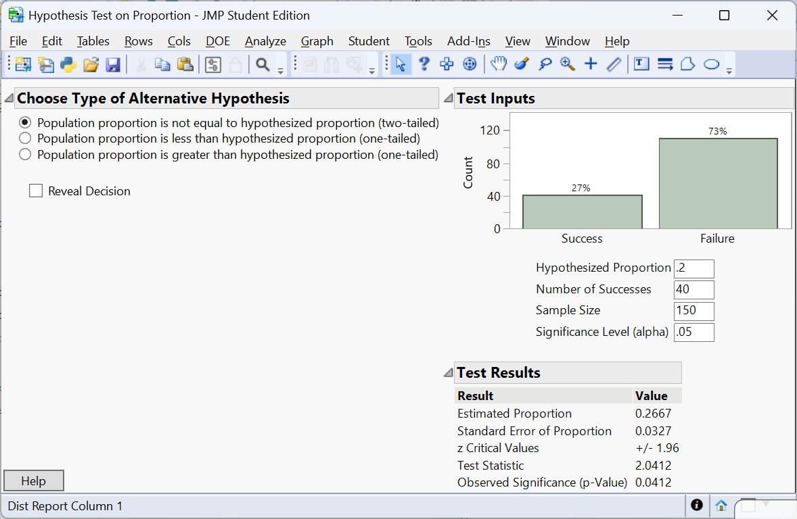

The p‑value is $P(Z > 2.0412) =0.0412$.  At $\alpha=0.05$ we *reject* $H_0$; the data provides enough evidence to conclude that the blue morph frequency differs from 20%.  

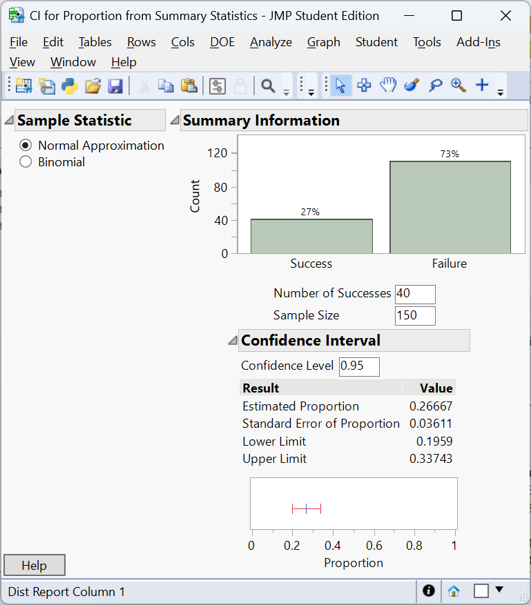

A 95% confidence interval for $p$ is $(0.1959, 0.3374)$. Note that the confidence interval just passes 0.20 on the lower limit. This is due to the confidence interval uses $\hat p$ in the standard error where as the test statistic uses the hypothesized value $p_0$. A larger study might yield a more definitive conclusion.

:::

:::{.example collapse="false" title="Example 11.13: Customer satisfaction"}

A retailer advertises that 85% of its customers are satisfied with the online shopping experience.  An independent survey of 250 recent customers finds that 192 report being satisfied.  We test

$$
H_0: p = 0.85 \quad\text{vs.}\quad H_a: p < 0.85.
$$

Here $\hat{p} = 192/250 = 0.768$.  The z‑statistic is $(0.768-0.85)/\sqrt{0.85\times 0.15/250} \approx -3.34$ with p‑value $<0.001$.  The data provide strong evidence that the true satisfaction rate is below the advertised 85%.  A 9 % confidence interval for $p$ is $(0.72, 0.81)$, well below 0.85.  Companies often report high satisfaction percentages in advertisements, but independent surveys can reveal gaps between perception and reality.

:::

### Performing the one‑sample proportion test in JMP Pro 18

1. **Enter or import the data.** Create a column for the binary response (e.g., “Rash”) coded with two categories (Yes/No).  If you have counts rather than individual observations, include a **Freq** column containing the counts.
2. **Launch the Distribution platform.** Choose `Analyze → Distribution`, assign the response to Y and the Freq column (if present) to **Freq**, and click OK.  JMP will display counts, proportions and a bar chart.
3. **Test the proportion.** Click the red triangle next to the variable’s name and choose **Test Probabilities**.  Enter the hypothesized proportion $p_0$; JMP reports the **Pearson $\chi^2$** statistic and associated p‑value.  The Pearson statistic is $z^2$ for a two‑sided test, so you can recover $z$ by taking its square root and assigning the sign based on $\hat{p}-p_0$.
4. **Confidence interval.** Under the same menu choose **Confidence Interval**.  Specify the confidence level (e.g., 0.95).  JMP calculates the interval using the standard normal approximation as above.

### Recap

| **Keyword/Concept** | **Definition/Formula** |
|---|---|
| **Null hypothesis** $H_0: p=p_0$ | Assumes the population proportion equals the hypothesized value $p_0$. |
| **Alternative hypothesis** | Specifies whether $p$ differs from $p_0$ (two‑sided) or is greater/less than $p_0$ (one‑sided). |
| **Z‑statistic** | $z = (\hat{p}-p_0)/\sqrt{p_0(1-p_0)/n}$. |
| **Confidence interval for $p$** | $\hat{p}\pm z_{\alpha/2}\sqrt{\hat{p}(1-\hat{p})/n}$. |

### Check your understanding

::: {.callout-note collapse="false" title="Problems"}

1. A survey asks whether citizens of a town support building a new park.  Out of 400 respondents, 112 say yes.  Test at the 0.05 level whether the support rate differs from 25%.  Find and interpret a 95% confidence interval.
2. A biologist believes that 30% of a wildflower species carry a recessive allele.  In a sample of 120 plants, 46 carry the allele.  Set up and perform a one‑sided test at $\alpha=0.10$ to determine whether the allele frequency is greater than 30%.
3. Explain why the z‑statistic uses the hypothesized proportion $p_0$ in the denominator when calculating the test statistic, but the confidence interval uses $\hat{p}$.
:::

::: {.callout-tip collapse="true" title="Solutions"}
1. The sample proportion is $\hat{p}=112/400=0.28$.  Test $H_0:p=0.25$ vs. $H_a:p\neq0.25$ at $\alpha=0.05$.  The z‑statistic is $(0.28-0.25)/\sqrt{0.25\times0.75/400}\approx1.39$ with two‑sided p‑value 0.164.  We fail to reject $H_0$; the support rate is not significantly different from 25 %.  A 95 % confidence interval is $0.28\pm1.96\sqrt{0.28\times0.72/400}= (0.23,0.33)$, which includes 0.25.

2. Here $\hat{p}=46/120=0.383$.  We test $H_0:p=0.30$ vs. $H_a:p>0.30$ at $\alpha=0.10$.  The z‑statistic is $(0.383-0.30)/\sqrt{0.30\times0.70/120}\approx2.07$ with one‑sided p‑value 0.019.  Since 0.019 < 0.10, we reject $H_0$ and conclude the allele frequency exceeds 30 %.  A 90 % one‑sided confidence bound would start at $\hat{p}-1.28\sqrt{\hat{p}(1-\hat{p})/n}=0.383-1.28\times0.042=0.33$; we are 90 % confident that the allele frequency is at least 33 %.

3. Under the null hypothesis the sampling distribution of $\hat{p}$ is centered at $p_0$ with variance $p_0(1-p_0)/n$, so the z‑statistic uses $p_0$ to measure how far the sample proportion deviates from what we expect when $H_0$ is true.  For a confidence interval we treat $\hat{p}$ as our best estimate of $p$ and use its estimated standard error $\sqrt{\hat{p}(1-\hat{p})/n}$ to account for sampling variability.
:::

## Test for Difference in Proportions {#sec-11_02}

> "The essence of mathematics is not to make simple things complicated, but to make complicated things simple." - S. Gudder

In clinical trials, marketing experiments and ecological studies we often compare two treatments or populations.  Each unit yields a binary response (success/failure), and the explanatory variable indicates group membership.  To decide whether a difference observed in the sample reflects a true difference in the populations we use a two‑sample proportion test.

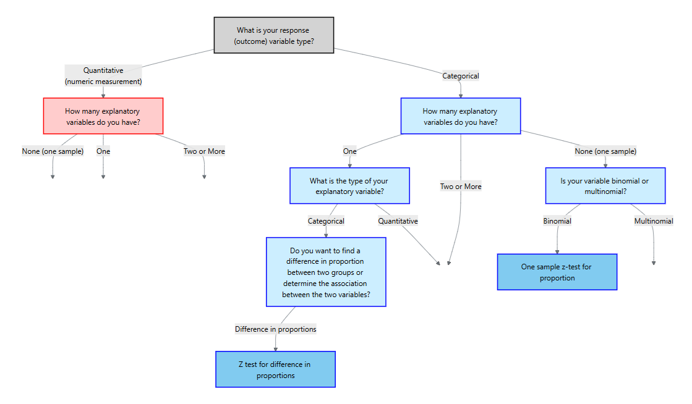

### Hypotheses and assumptions

Let $p_1$ and $p_2$ denote the proportions in groups 1 and 2, and let $\hat{p}_1$ and $\hat{p}_2$ be the sample proportions from independent random samples of sizes $n_1$ and $n_2$.  The null hypothesis is $H_0: p_1 = p_2$, implying no group effect.  The alternative can be two‑sided ($H_a: p_1 \neq p_2$) or one‑sided (e.g., $H_a: p_1 > p_2$).

The success–failure conditions must hold for each group separately: $n_1\hat{p}_1\geq 15$, $n_1(1-\hat{p}_1)\geq 15$, $n_2\hat{p}_2\geq 15$ and $n_2(1-\hat{p}_2)\geq 15$.  We also require that the samples are independent of each other and that observations within each sample are independent.  Meeting these conditions allows us to approximate the sampling distribution of $\hat{p}_1 - \hat{p}_2$ by a normal distribution.

### Test statistic

Under $H_0$ we assume the common population proportion is $p$ and estimate it by the *pooled proportion*

$$
p = \frac{x_1 + x_2}{n_1 + n_2},
$$

where $x_1$ and $x_2$ are the numbers of successes in groups 1 and 2.  The test statistic is

$$
z = \frac{\hat{p}_1 - \hat{p}_2}{\sqrt{p(1-p)\left(\frac{1}{n_1} + \frac{1}{n_2}\right)}},
$$

For a two‑sided alternative the p‑value is $2P(Z > |z|)$; for one‑sided tests we compute $P(Z > z)$ or $P(Z < z)$ depending on the direction.  A small p‑value indicates evidence against $H_0$.

### Post‑hoc confidence interval and multiple comparisons

When we reject $H_0$ (or even if we do not), it is informative to estimate the difference in proportions with a *confidence interval*.  Using the sample proportions (not pooled), the standard error is

$$
SE = \sqrt{\frac{\hat{p}_1(1-\hat{p}_1)}{n_1} + \frac{\hat{p}_2(1-\hat{p}_2)}{n_2}},
$$

and a $(1-\alpha)\times100\%$ confidence interval for $p_1 - p_2$ is

$$
(\hat{p}_1 - \hat{p}_2) \pm z_{\alpha/2} SE.
$$

Unlike the test statistic, the confidence interval does not use the pooled proportion because it aims to estimate the true difference rather than test a null hypothesis.  

:::{.example collapse="false" title="Example 11.14: Treatment success rates"}

A clinical study compares recovery rates between two therapies for treating a viral infection.  Therapy A is given to 150 patients, 105 of whom recover within a week; therapy B is given to 130 patients, with 72 recoveries.  We test

$$
H_0: p_A = p_B \quad\text{vs.}\quad H_a: p_A > p_B
$$

at $\alpha=0.05$.  The sample proportions are $\hat{p}_A = 105/150 = 0.70$ and $\hat{p}_B = 72/130 \approx 0.554$.  The pooled proportion is

$$
p = \frac{105 + 72}{150 + 130} = \frac{177}{280} = 0.632.
$$

The test statistic is

$$
z = \frac{0.70 - 0.554}{\sqrt{0.632\times(1-0.632)\left(\frac{1}{150} + \frac{1}{130}\right)}} \approx 2.68.
$$

The one‑sided p‑value is $P(Z > 2.68) \approx 0.0037$.  Since 0.0037 < 0.05, we reject $H_0$ and conclude therapy A has a higher recovery rate.  A 95% confidence interval for $p_A - p_B$ uses the standard error with unpooled proportions:

$$
SE = \sqrt{\frac{0.70\times0.30}{150} + \frac{0.554\times0.446}{130}} \approx 0.062,
$$

so the interval is $(0.70-0.554) \pm 1.96 \times 0.062 = (0.031, 0.238)$.  We are 95% confident that therapy A’s recovery rate exceeds therapy B’s by between 3.1% and 23.8%.

:::

:::{.example collapse="false" title="Example 11.15: Genotype frequencies"}

Researchers investigate whether the frequency of a deleterious allele differs between male and female mice.  Among 80 males, 24 carry the allele; among 90 females, 12 do.  Testing $H_0:p_M = p_F$ vs. $H_a:p_M \neq p_F$, we have $\hat{p}_M=0.30$ and $\hat{p}_F=0.133$.  The pooled proportion is $(24+12)/(80+90)=36/170=0.212$.  The z‑statistic is

$$
z=\frac{0.30 - 0.133}{\sqrt{0.212\times0.788\left(\frac{1}{80}+\frac{1}{90}\right)}} \approx 3.24,
$$

yielding a two‑sided p‑value of about 0.0012.  We reject $H_0$. At a 5% significance level, there is enough evidence to conclude the frequency of a deleterious allele differs between male and female mice.  A 95% confidence interval is $(0.30-0.133) \pm 1.96\sqrt{0.30\times0.70/80 + 0.133\times0.867/90} = (0.064, 0.262)$.

:::

:::{.example collapse="false" title="Example 11.16: A/B testing"}

An online retailer runs an A/B experiment to compare two website layouts.  Group A (old layout) has 1,800 visitors with 144 purchases; Group B (new layout) has 1,900 visitors with 190 purchases.  We test

$$H_0:p_A = p_B \quad\text{vs.}\quad H_a:p_A \neq p_B.$$

Let's do the test with JMP 18 Student Edition.

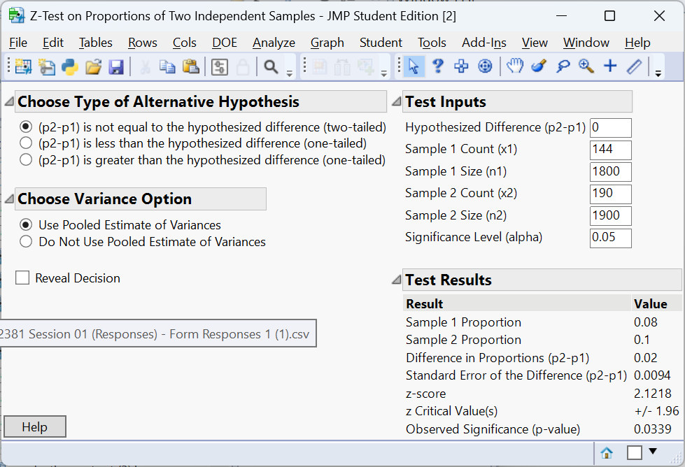

The two‑sided p‑value is about 0.0339, indicating a significant difference. At the 5% significance level, there is enough evidence to conclude the the proportion of visitors to the old layout who made a purchase differs from the proportion who made a purchase to the new layout.

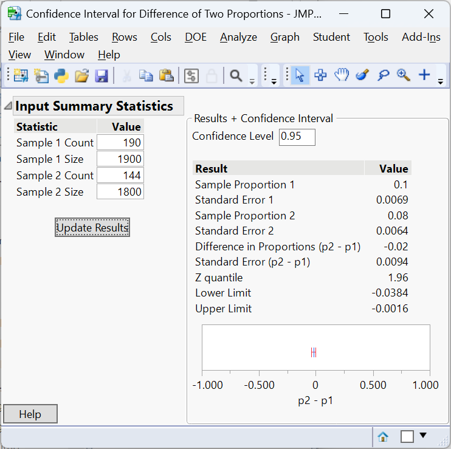

A 95% confidence interval for $p_A - p_B$ is $(-0.0384, -0.00016)$, so the new layout increases purchase rates by roughly 0.02% to 3.8%.

:::

### Performing the two‑sample proportion test in JMP Pro 18

1. **Prepare your data.** Each row should correspond to an individual with a column for the binary response (e.g., “Purchased”) and a column for group membership (“Layout”).  If you have aggregated counts, include a Freq column with the counts.
2. **Use the Contingency platform.** Choose `Analyze → Fit Y by X`, assign the response variable to **Y**, the group to **X**, and (if present) the counts column to **Freq**.  Click OK to produce a contingency table.
3. **Run the two‑sample test.** Click the red triangle next to “Contingency Analysis” and choose **Two Sample Test for Proportions**.  JMP reports the difference in sample proportions, the test statistic and p‑value, and a confidence interval for the difference.  Use the “Cell Chi Square” option to view contributions to the chi‑square statistic.
4. **Multiple comparisons.**  For pairwise comparisons, rerun the two‑sample test on each pair and adjust $\alpha$ using the Bonferroni correction to maintain the overall error rate.

### Recap

| **Keyword/Concept** | **Definition/Formula** |
|---|---|
| **Two‑sample test for proportions** | Tests $H_0: p_1 = p_2$ using a pooled estimate of the common proportion and a z‑statistic. |
| **Pooled proportion** $p$ | $(x_1+x_2)/(n_1+n_2)$, used in the denominator of the test statistic under $H_0$. |
| **Standard error for CI** | $\sqrt{\hat{p}_1(1-\hat{p}_1)/n_1 + \hat{p}_2(1-\hat{p}_2)/n_2}$. |

### Check your understanding

::: {.callout-note collapse="false" title="Problems"}

1. A vaccine trial compares adverse event rates between men and women.  Out of 250 men, 38 report an adverse event; out of 300 women, 22 do.  At $\alpha=0.05$, test whether the rates differ and construct a 95% confidence interval for the difference.
2. Why is the pooled proportion used in the test statistic but not in the confidence interval for $p_1 - p_2$?
:::

::: {.callout-tip collapse="true" title="Solutions"}
1. $\hat{p}_{\text{men}}=38/250=0.152$ and $\hat{p}_{\text{women}}=22/300=0.073$.  The pooled proportion is $(38+22)/(250+300)=0.1067$.  The z‑statistic is $(0.152-0.073)/\sqrt{0.1067\times0.8933\,(1/250+1/300)}\approx2.98$ with two‑sided p‑value 0.003.  We reject $H_0$; men experience adverse events more often.  A 95 % CI uses the unpooled SE $\sqrt{0.152\times0.848/250+0.073\times0.927/300}\approx0.025$; the interval is $(0.079\pm1.96\times0.025)=(0.029,0.129)$, so the difference ranges from 2.9 % to 12.9 %.

2. Under the null hypothesis $p_1 = p_2$, the sampling distribution of $\hat{p}_1-\hat{p}_2$ is centered at zero with variance $p(1-p)(1/n_1+1/n_2)$, where $p$ is the common value.  The pooled proportion estimates this common value.  For confidence intervals we no longer assume $p_1=p_2$; instead we estimate each population proportion separately to capture the true difference.
:::

## Chi‑Square Goodness of Fit {#sec-11_03}

> "As far as the laws of mathematics refer to reality, they are not certain; and as far as they are certain, they do not refer to reality."   - Albert Einstein

The chi‑square goodness‑of‑fit test assesses whether a single categorical variable follows a specified distribution.  Examples include testing whether the distribution of blood types in a sample matches known population proportions, whether Mendelian inheritance ratios (9 : 3 : 3 : 1) hold in a genetics experiment, or whether market shares of product categories agree with company projections.

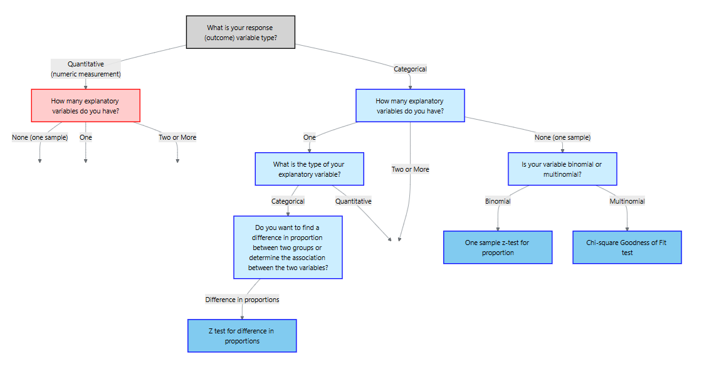

### Hypotheses and assumptions

Suppose there are $k$ categories with expected proportions $p_{1,0},\dots,p_{k,0}$ under the null hypothesis.  We observe counts $O_i$ for category $i$ in a random sample of size $n$.  The null hypothesis asserts that the population follows the specified distribution: $H_0: p_i = p_{i,0}$ for all $i$.  The alternative hypothesis is that at least one category proportion differs.

For the chi‑square goodness‑of‑fit test to be valid the data must be counts of a categorical variable, collected from a simple random sample, and that expected counts $E_i = n\,p_{i,0}$ should be at least 5 in each category.  These conditions ensure the chi‑square approximation is accurate.

### Test statistic

For each category compute the **expected count** $E_i = n p_{i,0}$.  The chi‑square statistic

$$
\chi^2 = \sum_{i=1}^k \frac{(O_i - E_i)^2}{E_i}
$$

measures the discrepancy between the observed and expected frequencies.  Under $H_0$ the statistic has a chi‑square distribution with $k-1$ degrees of freedom.  Because large deviations in either direction contribute to the sum of squared standardized differences, the test is always one‑sided: large $\chi^2$ values yield small p‑values.  If the p‑value is less than $\alpha$, we reject $H_0$ and conclude the observed distribution does not fit the specified proportions.

### Post‑hoc analysis:Bonferroni confidence intervals

A significant chi‑square statistic tells us that the observed distribution differs from the expected one, but it does not identify which categories contribute most.  To diagnose the differences, construct separate confidence intervals for each category proportion: 
$$
\hat{p}_i \pm z_{\alpha^*/2}\sqrt{\hat{p}_i(1-\hat{p}_i)/n}
$$  

Comparing these intervals to the hypothesized proportions reveals which categories differ from expectation. 

#### The Bonferroni Confidence Intervals

When we construct confidence intervals for *multiple categories* at once, each interval has its own chance of error.  If we build $k$ intervals each at the same confidence level ($1-\alpha$), the probability that *at least one* of them fails to capture the true parameter can exceed $\alpha$.  This inflation of the overall (family-wise) error rate is known as the *multiple comparisons problem.*

The **Bonferroni** correction provides a simple and conservative way to control this overall error rate.  Instead of using the full significance level $\alpha$ for each interval, we divide it equally among the $k$ intervals.  That is, we use a per-comparison error rate of

$$
\alpha^* = \frac{\alpha}{k}
$$

and construct each interval with confidence level

$$
1 - \alpha^* = 1 - \frac{\alpha}{k}.
$$

For example, if we want an overall 95% family confidence level across five categories ($k=5$), we set $\alpha^* = 0.05/5 = 0.01$.
Each individual interval then has confidence level $1 - 0.01 = 0.99$.  The resulting family of intervals jointly maintains an overall confidence of about 95%.

#### Why It Works

The justification comes from a basic probability inequality known as *Bonferroni’s inequality*, which states that for any collection of events $A_1, A_2, \ldots, A_k$,

$$
P(A_1 \cup A_2 \cup \ldots \cup A_k) \leq P(A_1) + P(A_2) + \ldots + P(A_k).
$$

If we interpret each $A_i$ as the event that the $i$th confidence interval fails to contain its true proportion, then

$$
P(\text{at least one interval fails}) \leq k \times \alpha^* = \alpha.
$$

Thus, the probability that *all* intervals simultaneously contain their true values is at least $1 - \alpha$.
In other words, the Bonferroni method guarantees that the *family-wise confidence level* is no smaller than the desired value.

Bonferroni intervals are *conservative*—they make it slightly harder to declare significance—but they ensure that the overall Type I error rate does not exceed the nominal level.  This conservatism is often desirable in confirmatory analyses, such as identifying which categories deviate from a hypothesized distribution after a significant chi-square test.

:::{.example collapse="false" title="Example 11.17: Mendelian inheritance"}

In a classic genetics experiment, pea plants are self‑fertilized to examine the distribution of phenotypes produced by a dihybrid cross.  Mendel’s theory predicts a 9 : 3 : 3 : 1 ratio of phenotypes.  Suppose a biologist observes the following counts in 1,600 offspring: 900 have phenotype A, 320 have phenotype B, 300 have phenotype C and 80 have phenotype D.  We test

$$
\begin{align*}
&H_0:p_1 = 0.5625, p_2=0.1875, p_3 = 0.1875, p_4 = 0.0625\\
&H_a:\text{at least one differs}
\end{align*}
$$

The expected counts based on the 9 : 3 : 3 : 1 proportions are 
$$
(0.5625, 0.1875, 0.1875, 0.0625)\times1600 = (900, 300, 300, 100)
$$  

The chi‑square statistic is

$$
\begin{align*}
\chi^2 &= \frac{(900-900)^2}{900} + \frac{(320-300)^2}{300} + \frac{(300-300)^2}{300} + \frac{(80-100)^2}{100}\\ 
&\approx 5.33
\end{align*}
$$

With 3 degrees of freedom the p‑value is about 0.1490, above 0.05.  We fail to reject $H_0$ and cannot conclude the observed distribution differs from the predicted Mendelian ratio.

We can perform the analysis in JMP to get the 

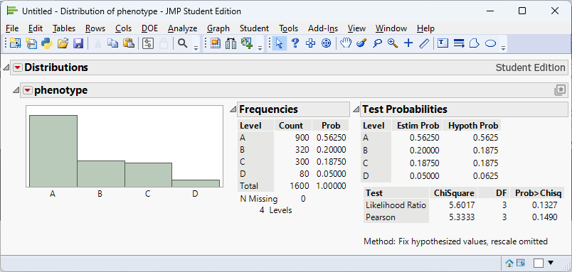

We can find the Bonferroni confidence intervals by first calculating
$$
\begin{align*}
1 - \alpha^* &= 1 - \frac{\alpha}{k}\\
& = 1-\frac{0.05}{4}\\
& = 1-0.0125\\
& = 0.9875
\end{align*}
$$
Thus, we are finding 98.75% confidence intervals:

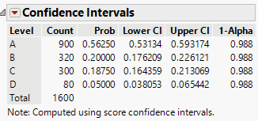

:::

### Performing the goodness‑of‑fit test in JMP Pro 18

1. **Enter the counts.** Create a column for the categorical variable and another for the observed counts (if the data are aggregated).  Alternatively, enter one row per observation.
2. **Analyze the distribution.** Choose `Analyze → Distribution`, assign the categorical variable to Y and, if using aggregated counts, the counts column to **Freq**.  Click OK to see the observed counts and bar chart.
3. **Specify expected proportions.** Click the red triangle next to the variable name and choose **Test Probabilities**.  In the dialog, set the expected probabilities (e.g., 0.45, 0.40, 0.11, 0.04) or equal proportions.  JMP displays the Pearson chi‑square statistic, degrees of freedom and p‑value. 

### Recap

| **Keyword/Concept** | **Definition/Formula** |
|---|---|
| **Goodness‑of‑fit test** | Evaluates whether observed categorical data follow a specified distribution. |
| **Expected count** | $E_i = n p_{i,0}$; should be at least 5 in each category. |
| **Chi‑square statistic** | $\sum (O_i-E_i)^2/E_i$; follows a chi‑square distribution with $k-1$ degrees of freedom. |
| **Bonferroni adjustment** | Divide $\alpha$ by the number of categories when examining individual residuals to control the family‑wise error rate. |

### Check your understanding

::: {.callout-note collapse="false" title="Problems"}

1. A genetics lab predicts a 3 : 1 ratio of dominant to recessive phenotypes in a monohybrid cross.  In a sample of 500 offspring there are 375 dominant and 125 recessive.  Perform a goodness‑of‑fit test at $\alpha=0.05$ and interpret the standardized residuals.
2. A restaurant anticipates that dinner orders will be evenly split among four meal types (fish, chicken, beef, vegetarian).  One night the observed counts are (80, 60, 100, 60) out of 300 orders.  Test whether the distribution differs from expectation and identify which meals are unusually popular or unpopular.  Use a Bonferroni correction.
3. Why is the chi‑square goodness‑of‑fit test always one‑sided?  How does this affect the calculation of the p‑value?

:::

::: {.callout-tip collapse="true" title="Solutions"}
1. Expected counts under a 3 : 1 ratio are $(375,125)$.  The chi‑square statistic is $(375-375)^2/375+(125-125)^2/125=0$ with p‑value 1.  We fail to reject $H_0$; the observed distribution perfectly matches the prediction.  

2. Expected counts are (75, 75, 75, 75).  The chi‑square statistic is $((80-75)^2+(60-75)^2+(100-75)^2+(60-75)^2)/75 = 20$.  With 3 degrees of freedom the p‑value is about 0.00016, so the distribution differs significantly.  Standardized residuals are $(0.58,-1.73,2.89,-1.73)$.  With Bonferroni adjustment ($\alpha/4=0.0125$) the critical value is $\approx 2.49$; only the beef category residual of 2.89 exceeds this threshold.  Beef orders are significantly more frequent than expected.

3. The chi‑square statistic sums squared standardized deviations, so any deviation from expected counts (whether above or below) increases the statistic.  Thus a large chi‑square statistic indicates lack of fit regardless of the direction of deviations.  The p‑value is the upper‑tail probability $P(\chi^2_{k-1} \geq \chi^2)$; there is no “lower tail” of interest because small values indicate good fit, not evidence against the null.
:::

## Chi‑Square Test for Association {#sec-11_04}

> "Although we often hear that data speak for themselves, their voices can be soft and sly." - Frederick Mosteller

The chi‑square test for **association** (also called the chi‑square test of independence) examines whether two categorical variables are related.  It generalizes the two‑sample proportion test when the explanatory variable has more than two categories or when the response variable has more than two categories.  Examples include assessing the association between smoking status and lung disease, genotype and phenotype, or customer gender and product preference.

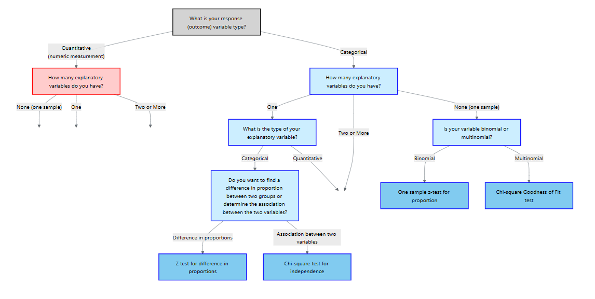

### Hypotheses and assumptions

Suppose a contingency table has $r$ rows (categories of the response variable) and $c$ columns (categories of the explanatory variable).  Let $O_{ij}$ be the observed count in cell $(i,j)$ with row total $R_i$, column total $C_j$ and grand total $N$.  The null hypothesis posits that the two variables are independent; equivalently, 
$$
P(\text{row }i \text{ and column }j) = P(\text{row }i)×P(\text{column }j)
$$

The *alternative* states that at least one cell’s probability differs from the product of its marginal probabilities.  Independence implies no association; rejecting it suggests an association exists.

The data must be counts from a simple random sample, both variables must be categorical, and all expected counts should be at least 5.  These conditions parallel those of the goodness‑of‑fit test and ensure the chi‑square approximation is valid.

### Test statistic

For each cell compute the expected count under independence:

$$
E_{ij} = \frac{R_i C_j}{N}.
$$

The chi‑square statistic is

$$
\chi^2 = \sum_{i=1}^r \sum_{j=1}^c \frac{(O_{ij}-E_{ij})^2}{E_{ij}},
$$

which follows a chi‑square distribution with $(r-1)(c-1)$ degrees of freedom under $H_0$.  As with the goodness‑of‑fit test, the p‑value is the upper‑tail probability: large values indicate evidence of association.

### Post‑hoc analysis

A significant result signals that the variables are associated but does not reveal the nature of the association.  Two common post‑hoc approaches are:

1. **Standardized and adjusted residuals.** Compute cell residuals $r_{ij} = (O_{ij}-E_{ij})/\sqrt{E_{ij}}$.  Residuals with absolute value greater than about 2 highlight cells contributing to the chi‑square statistic.  Adjusted Pearson residuals account for the degrees of freedom and have approximately a standard normal distribution.  Apply a Bonferroni correction by dividing $\alpha$ by the number of cells examined when identifying significant residuals.

2. **Pairwise proportion tests.** For a table with more than two columns, perform two‑sample proportion tests on pairs of columns.  For example, if you have 3 columns there are 3 pairwise comparisons; use $\alpha^*=\alpha/3$ when computing p‑values or confidence intervals.

You can also compute measures of association such as **Cramér’s V**, which rescales the chi‑square statistic to lie between 0 (no association) and 1 (perfect association).

**Note: in this course, we will not be doing Post-hoc analysis for a test of association.**

:::{.example collapse="false" title="Example 11.18: Smoking status and lung disease"}

A health researcher investigates the relationship between smoking status (non‑smoker, past smoker, current smoker) and diagnosis of a chronic lung disease (present or absent).  The observed counts for 400 participants are:

|                | Disease present | Disease absent | Total |
|---------------|----------------|---------------|------|
| Non‑smoker    | 20             | 180           | **200** |
| Past smoker   | 25             | 75            | **100**  |
| Current smoker| 30             | 70            | **100**  |
| **Total**     | **75**         | **325**       | **400** |

Under independence the expected count for the first cell is $(200\times75)/400=37.5$, and similarly for the other cells.  The chi‑square statistic is

$$
\chi^2 = \sum_{i,j}\frac{(O_{ij}-E_{ij})^2}{E_{ij}} \approx 20.923,
$$

with $(3-1)(2-1)=2$ degrees of freedom.  The p‑value is <0.0001.  We reject the null hypothesis; smoking status and lung disease are associated.  

In JMP, the output looks like

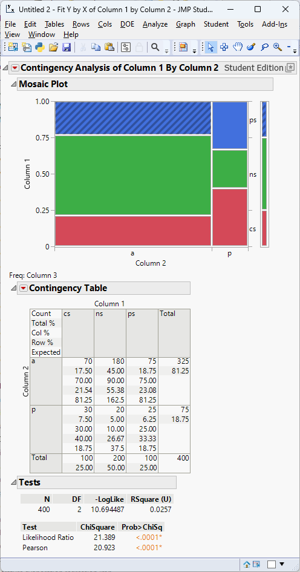

:::

<!-- ### Example 11.11 – Genotype and phenotype (biology) -->

<!-- Suppose a geneticist records the genotype (AA, Aa, aa) and phenotype (normal, affected) for 300 animals.  The contingency table is: -->

<!-- |         | Normal | Affected | Total | -->
<!-- |--------|--------|---------|------| -->
<!-- | AA     | 90     | 10      | 100  | -->
<!-- | Aa     | 85     | 15      | 100  | -->
<!-- | aa     | 60     | 40      | 100  | -->
<!-- | **Total** | **235** | **65** | **300** | -->

<!-- The chi‑square statistic is computed from the expected counts $(R_i C_j)/N$; here the value is approximately 23.55 with $(3-1)(2-1)=2$ degrees of freedom.  The p‑value is <0.00001, indicating a strong association.  Standardized residuals show that the aa genotype is overrepresented among affected individuals and underrepresented among normals, while AA individuals are underrepresented among affected animals.  Pairwise tests comparing genotype proportions across phenotype categories confirm that aa animals have a significantly higher disease rate. -->

<!-- ### Example 11.12 – Marketing preference by gender (business) -->

<!-- An advertising firm surveys 600 customers about their preferred product category (electronics, clothing, home goods) and records each customer’s gender (male, female).  The observed counts are: -->

<!-- |             | Electronics | Clothing | Home goods | Total | -->
<!-- |------------|------------|---------|-----------|------| -->
<!-- | Male       | 90         | 110     | 70        | 270  | -->
<!-- | Female     | 80         | 150     | 100       | 330  | -->
<!-- | **Total**  | **170**    | **260** | **170**   | **600** | -->

<!-- The chi‑square statistic with $(2-1)(3-1)=2$ degrees of freedom is about 13.91 with a p‑value of 0.00096, indicating an association between gender and product preference.  Standardized residuals reveal that males purchase home goods less often than expected and females purchase clothing more often.  Pairwise two‑sample tests for each product category, with Bonferroni‑adjusted $\alpha/3=0.0167$, can quantify the magnitude of these differences. -->

### Performing the chi‑square test for association in JMP Pro 18

1. **Organize your data.** Each row should represent an individual with two categorical variables.  If you have aggregated counts, include a Freq column.
2. **Use the Contingency platform.** Select `Analyze → Fit Y by X`.  Assign one variable to **Y**, the other to **X**, and the counts to **Freq** if needed.  Click OK to obtain the contingency table.
3. **Run the chi‑square test.** JMP displays the chi‑square statistic, degrees of freedom and p‑value.  Verify that all expected counts exceed 5.

### Recap

| **Keyword/Concept** | **Definition/Formula** |
|---|---|
| **Chi‑square test for association** | Tests independence between two categorical variables; the statistic sums $(O_{ij}-E_{ij})^2/E_{ij}$ over all cells. |
| **Expected count** | $E_{ij} = (R_i C_j)/N$; must be at least 5 in each cell. |
| **Degrees of freedom** | $(r-1)(c-1)$ for an $r\times c$ contingency table. |

### Check your understanding

::: {.callout-note collapse="false" title="Problems"}

1. A study records the preferred news source (TV, radio, internet, newspaper) and political affiliation (Democrat, Republican, Independent) for 900 voters.  Describe how to test for independence between news source and political affiliation.  If the overall test is significant, how would you identify which cells contribute most to the association?
2. The table below shows the relationship between genotype (AA, Aa, aa) and survival (survived, died) in a sample of 450 organisms.  Perform a chi‑square test for association and interpret the results.  Then compute standardized residuals and determine which genotype categories differ most from expectation.

|         | Survived | Died | Total |
|--------|---------|-----|------|
| AA     | 130     | 20  | 150  |
| Aa     | 120     | 30  | 150  |
| aa     | 80      | 70  | 150  |
| **Total** | **330**   | **120** | **450** |

:::

::: {.callout-tip collapse="true" title="Solutions"}
1. Enter counts in a contingency table with rows for political affiliation and columns for news source.  Compute expected counts $E_{ij}=R_i C_j/N$ and the chi‑square statistic $\chi^2 = \sum (O_{ij}-E_{ij})^2/E_{ij}$.  With $(r-1)(c-1)$ degrees of freedom, find the p‑value and decide whether to reject independence.  If significant, calculate standardized residuals for each cell and compare them to a Bonferroni‑adjusted critical value (e.g., $\alpha/(rc)$).  Cells with large positive residuals occur more often than expected; large negative residuals occur less often.

2. Expected counts: row totals × column totals divided by 450.  For AA survived: $(150×330)/450=110$; for AA died: 40; for Aa survived: 110; Aa died: 40; aa survived: 110; aa died: 40.  The chi‑square statistic is $((130-110)^2/110 + (20-40)^2/40 + (120-110)^2/110 + (30-40)^2/40 + (80-110)^2/110 + (70-40)^2/40)=\ldots$ which simplifies to 39.09.  With $(3-1)(2-1)=2$ degrees of freedom the p‑value is essentially zero, so genotype and survival are associated.  Standardized residuals: AA survived $(130-110)/\sqrt{110}=1.91$, AA died $(20-40)/\sqrt{40}=-3.16$, Aa survived $(120-110)/\sqrt{110}=0.95$, Aa died $(30-40)/\sqrt{40}=-1.58$, aa survived $(80-110)/\sqrt{110}=-2.86$, aa died $(70-40)/\sqrt{40}=4.74$.  After Bonferroni adjustment ($\alpha/6$), the critical value is about 2.73.  The aa died cell (4.74) and AA died cell (–3.16) show significant deviations: aa individuals die more often than expected while AA individuals die less often.

:::
