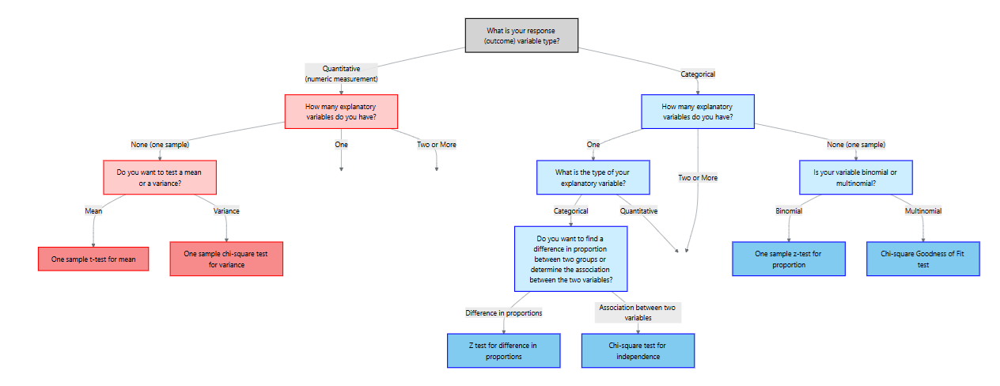
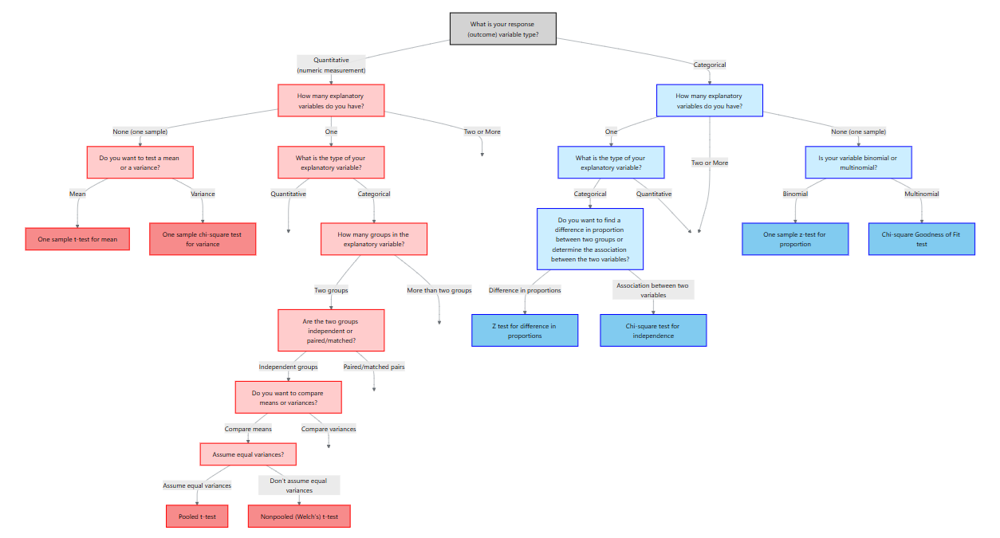
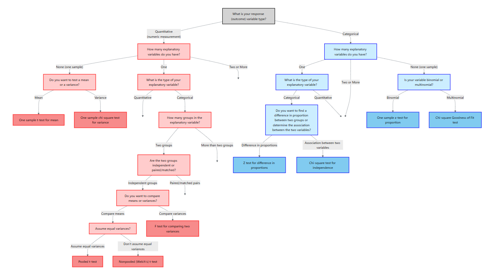
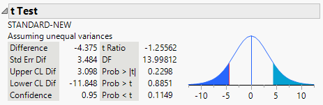
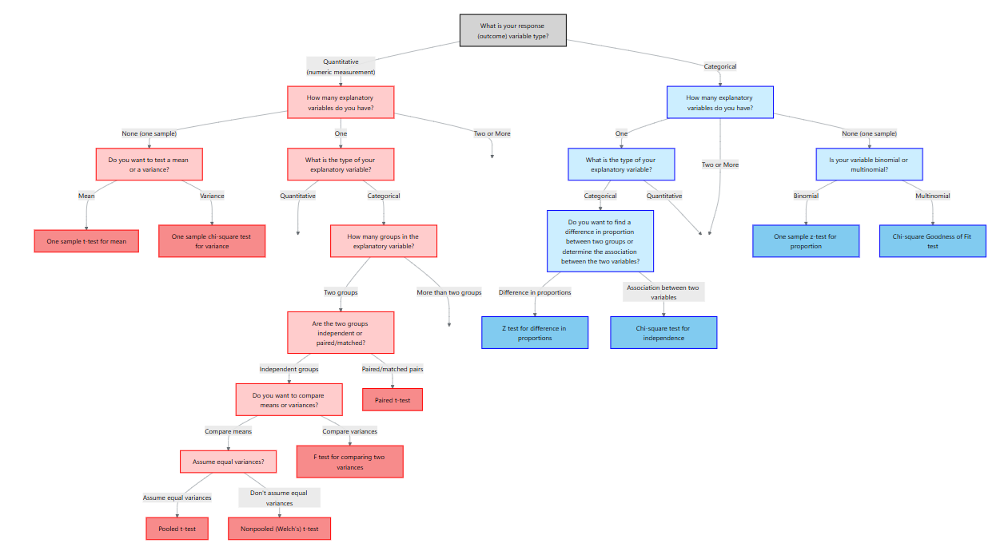
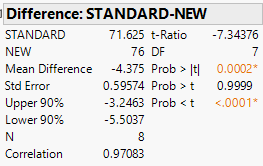

# Methods for Quantitative Response Variables – One and Two Groups

> “It’s easy to lie with statistics. It’s hard to tell the truth without statistics.” – Andrejs Dunkels

In the previous chapter we focused on categorical outcomes.  Here our response variable is **quantitative**, meaning it is measured on a numeric scale such as weight, blood pressure, cholesterol level, enzyme activity, revenue or time.  To decide on an appropriate analysis we must consider how many explanatory variables we have and whether the data are paired or independent.  The table below summarizes the situations covered in this chapter:

| **Scenario** | **Response variable** | **Explanatory variable** | **Appropriate method** |
|---|---|---|---|
| **No explanatory variable** | Quantitative | None (one sample) | One‑sample t‑test for the mean and chi‑square test for the variance |
| **Two paired measurements** | Quantitative | One categorical variable with two **matched** levels (e.g., before/after on the same subject) | Paired t‑test |
| **Two independent groups** | Quantitative | One categorical variable with two **independent** levels (e.g., treatment vs. control) | Two‑sample t‑test for means (pooled or Welch) and F‑test for equality of variances |

## One‑Sample Tests for the Mean and Variance

When there is no explanatory variable, we have a single quantitative sample.  Two natural questions arise:

1. *Is the population mean equal to a specified value?*
2. *Is the population variance equal to a specified value?*

We address these with the one‑sample *t*-test and the chi‑square test for the variance.

### One‑sample t‑test for a mean

Suppose we have a random sample $x_1, x_2,\dots,x_n$ from a population with unknown mean $\mu$ and standard deviation $\sigma$.  We want to test

$$
\begin{align*}
&H_0: \mu = \mu_0 \\ 
&H_a: \mu \neq \mu_0\quad (\text{or } \mu > \mu_0,\ \mu < \mu_0)
\end{align*}
$$

#### Assumptions

Like all inference methods, the t‑test rests on assumptions. In practice we require:

* A *simple random sample* from the population of interest; observations are independent of one another.
* The population is **normally** distributed, or the sample size is large (typically $n \ge 30$) so that the Central Limit Theorem ensures approximate normality.

#### Test statistic and p‑value

Under $H_0$, the test statistic

$$
 t = \frac{\bar{x} - \mu_0}{s/\sqrt{n}}
$$

follows a Student’s $t$ distribution with $n-1$ degrees of freedom.  We obtain the p‑value by comparing the observed $|t|$ to the $t$ distribution.  For a two‑sided alternative the p‑value is $2P(T_{n-1} > |t|)$; for a one‑sided alternative we compute $P(T_{n-1} > t)$ or $P(T_{n-1} < t)$ depending on the direction.

#### Confidence interval

When the test is significant (or even when it is not), a $(1-\alpha)\times100\%$ confidence interval for $\mu$ gives a range of plausible values.  The interval is

$$
 \bar{x} \pm t_{\alpha/2}\,\frac{s}{\sqrt{n}},
$$

where $t_{\alpha/2}$ is the critical value from the $t$ distribution.  

:::{.example collapse="false" title="Example 12.1: Leaf Nitrogen Content"}

In a nutrient study a botanist measures the nitrogen content (in % dry weight) of 15 leaves from a wildflower species.  The sample mean is 3.4% with a standard deviation of 0.6%.  Test whether the mean differs from 3.0% at the 5% significance level.

**Solution.**  The hypotheses are $H_0: \mu = 3.0$ vs. $H_a: \mu \neq 3.0$.  The test statistic is

$$
 t = \frac{3.4 - 3.0}{0.6/\sqrt{15}} \approx 2.58.
$$

With $n-1 = 14$ degrees of freedom the two‑sided p‑value is $2P(T_{14} > 2.58) \approx 0.021$.  Since 0.021 < 0.05, we reject $H_0$ and conclude that mean nitrogen content differs from 3.0%.  A 95% confidence interval is $3.4 \pm t_{0.025,14}\times0.6/\sqrt{15} = (3.05, 3.75)$.

:::

### Performing the one‑sample mean test in JMP

To carry out this test in **JMP 18 Student Edition**:

1. **Enter the data.** Create a column for the quantitative variable (e.g., “HeartRate”).
2. **Launch the Distribution platform.** Select `Analyze → Distribution`, assign the variable to **Y**, and click OK.  JMP displays summary statistics and a histogram.
3. **Test the mean.** Click the red triangle next to the variable name and choose **Test Mean**.  Enter the hypothesized value $\mu_0$ and specify the alternative (two‑sided or one‑sided).  JMP reports the $t$ statistic, degrees of freedom, and p‑value.  The same dialog box allows you to request a confidence interval.

### Chi‑square test for a variance

Sometimes we are interested in assessing whether the population variance equals a specified value $\sigma_0^2$.  For example, an engineer may want to know whether the variability of machine parts exceeds a tolerance level.  Let $s^2$ be the sample variance computed from a random sample of size $n$.  To test

$$
\begin{align*}
 &H_0: \sigma^2 = \sigma_0^2\\ 
 &H_a: \sigma^2 \neq \sigma_0^2 \quad (\text{or } >, <)
\end{align*}
$$

we use the test statistic

$$
 \chi^2 = \frac{(n-1)s^2}{\sigma_0^2},
$$

which has a chi‑square distribution with $n-1$ degrees of freedom under $H_0$.  Large values of $\chi^2$ indicate that $s^2$ is bigger than expected under $H_0$; small values indicate it is too small.  For a two‑sided alternative the p‑value is $P(\chi^2_{n-1} > \chi^2_\text{obs})$ for one tail plus $P(\chi^2_{n-1} < \chi^2_\text{obs})$ for the other.

#### Confidence interval

A $(1-\alpha)\times100\%$ confidence interval for the population variance is

$$
 \left(\frac{(n-1)s^2}{\chi^2_{1-\alpha/2}},\ \frac{(n-1)s^2}{\chi^2_{\alpha/2}}\right),
$$

where $\chi^2_{\alpha/2, n-1}$ and $\chi^2_{1-\alpha/2, n-1}$ are critical values from the chi‑square distribution.  Taking square roots yields a confidence interval for the standard deviation.

:::{.example collapse="false" title="Example 12.2: Manufacturing Variability"}

A company manufactures springs with a target variance in spring length of $\sigma_0^2 = 0.04\ \mathrm{cm}^2$.  A quality‑control engineer measures 25 springs and computes a sample variance of $s^2 = 0.065\ \mathrm{cm}^2$.  Test whether the variance differs from the target at the 5% level.

**Solution.**  With $n-1 = 24$ degrees of freedom, the test statistic is
$$
\begin{align*}
\chi^2 &= \frac{(24)(0.065)}{0.04}\\
&= 39.0
\end{align*}
$$  
For a two‑sided test, the p‑value is about $2P(\chi^2>39.0)=0.055$.  We fail to reject $H_0$.  A 95% confidence interval for $\sigma^2$ is

$$
 \left(\frac{24\times0.065}{39.4},\ \frac{24\times0.065}{12.4}\right) = (0.0396, 0.1256),
$$

so the variance may range from 0.04 to 0.13 cm².

:::

### Performing the variance test in JMP 

There is no dedicated “chi‑square test for variance” command in JMP.  However, you can assess variability through graphical tools and by constructing the confidence interval manually.  To do this:

1. Compute the sample variance $s^2$ and degrees of freedom $n-1$.
2. Find the critical chi‑square values using a table or the distribution calculator in JMP (`Analyze → Distribution → Continuous Distribution`).
3. Plug into the confidence interval formula above.

### Recap

| **Keyword/Concept** | **Definition/Formula** |
|---|---|
| **One‑sample t‑test** | Tests $H_0: \mu=\mu_0$ using $t = (\bar{x}-\mu_0)/(s/\sqrt{n})$ with $n-1$ df. |
| **Confidence interval for mean** | $\bar{x} \pm t_{\alpha/2,n-1} \times s/\sqrt{n}$. |
| **Chi‑square test for variance** | Tests $H_0: \sigma^2 = \sigma_0^2$ using $\chi^2 = (n-1)s^2/\sigma_0^2$ with $n-1$ df. |
| **Confidence interval for variance** | $\left(\frac{(n-1)s^2}{\chi^2_{1-\alpha/2,n-1}},\ \frac{(n-1)s^2}{\chi^2_{\alpha/2,n-1}}\right)$. |

---

### Check your understanding

:::{.callout-note collapse="false" title="Problems"}

1. The caffeine content of a new energy drink is claimed to be 80 mg per can.  In a lab study 12 cans have a mean caffeine level of 77 mg and a standard deviation of 5 mg.  At $\alpha=0.05$ test whether the average caffeine content differs from 80 mg and compute a 95% confidence interval.
2. A plant geneticist measures the variance in seed weight for a hybrid strain and obtains $s^2=0.25\,\text{g}^2$ from $n=16$ seeds.  Test whether the true variance differs from 0.20 g² at $\alpha=0.10$.
3. Why does the t‑test for the mean use the sample standard deviation $s$ in the denominator instead of the known standard deviation $\sigma$?
:::

::: {.callout-tip collapse="true" title="Solutions"}
1. **Test of the mean:** $H_0: \mu=80$ vs. $H_a: \mu\neq80$.  Here $\bar{x}=77$, $s=5$ and $n=12$, so $t=(77-80)/(5/\sqrt{12})\approx-2.08$.  With $n-1=11$ df the two‑sided p‑value is $2P(T_{11}>2.08)\approx0.062$.  At $\alpha=0.05$ we **fail** to reject $H_0$.  A 95% CI is $77 \pm t_{0.025,11}\times5/\sqrt{12}=(73.0,81.0)$; this interval contains 80 mg.
2. With $n-1=15$ df the test statistic is $\chi^2=(15\times0.25)/0.20=18.75$.  The critical values at $\alpha=0.10$ are $\chi^2_{0.95,15}\approx7.26$ and $\chi^2_{0.05,15}\approx24.99$.  Since 18.75 lies between these, we fail to reject $H_0$.  The data do not provide enough evidence that the variance differs from 0.20 g².
3. In practice we rarely know the population standard deviation $\sigma$.  The t‑test treats $s$ as an estimate of $\sigma$.  Using $s$ introduces additional uncertainty, so the sampling distribution becomes a t distribution rather than a normal distribution.
:::

## Two Independent Samples: Student’s t‑Test and Welch’s t‑Test

> "The twin assumptions of normality of distribution and homogeneity of variance are not ever exactly fulfilled in practice, and often they do not even hold to a good approximation." -John Tukey

When comparing means between two **independent** groups, the appropriate procedure depends on whether the population variances are equal.  We consider two methods: the pooled (Student’s) t‑test and Welch’s t‑test.

### Student’s (pooled) t‑test

Let $x_{1i}$ and $x_{2j}$ be independent random samples from populations with means $\mu_1$ and $\mu_2$ and common variance $\sigma^2$.  To test 
$$
\begin{align*}
&H_0: \mu_1 = \mu_2\\
&H_a: \mu_1 \neq \mu_2
\qquad\text{(or one‑sided)}
\end{align*}
$$

we compute

1. Pooled estimate of variance:

$$
 s_p^2 = \frac{(n_1-1)s_1^2 + (n_2-1)s_2^2}{n_1 + n_2 - 2}
$$

2. Test statistic:

$$
 t = \frac{\bar{x}_1 - \bar{x}_2}{s_p\sqrt{1/n_1 + 1/n_2}}
$$

The statistic follows a $t$ distribution with $n_1 + n_2 - 2$ degrees of freedom.  Assumptions include:

* Two independent random samples.
* Each population is approximately normally distributed.
* The population variances are **equal** ($\sigma_1^2 = \sigma_2^2$).  

A $(1-\alpha)\times100\%$ confidence interval for $\mu_1 - \mu_2$ is

$$
 (\bar{x}_1 - \bar{x}_2) \pm t_{\alpha/2,}\,s_p \sqrt{1/n_1 + 1/n_2}.
$$

### Welch’s (nonpooled) t‑test (unequal variances)

When the assumption of equal variances is violated, we use Welch’s t‑test (also called the nonpooled t-test). This test modifies the standard error and the degrees of freedom.  The test statistic is

$$
 t = \frac{\bar{x}_1 - \bar{x}_2}{\sqrt{s_1^2/n_1 + s_2^2/n_2}},
$$

and the degrees of freedom are approximated by

$$
 \nu = \frac{\left(\frac{s_1^2}{n_1} + \frac{s_2^2}{n_2}\right)^2}{\frac{(s_1^2/n_1)^2}{n_1 - 1} + \frac{(s_2^2/n_2)^2}{n_2 - 1}}.
$$

This formula yields a non‑integer value; software uses it to compute the p‑value.  The confidence interval for $\mu_1 - \mu_2$ uses the same standard error and the $t_{\nu}$ distribution.

### Assumptions and choosing the test

The assumptions for two‑sample t‑tests: the groups must be independent, each sample should come from a normal distribution, and the variances should be equal for the pooled test.  If variances are not equal, the Welch test is preferred.  **In practice, Welch's t-test should be used by default unless it is known the variances are equal.**

:::{.example collapse="false" title="Example 12.3: Ad campaign effectiveness"}

A marketing analyst compares sales increases after two different advertising campaigns.  Sales increases for 20 regions under campaign A have mean 1.8% and SD = 1.0%; for 18 regions under campaign B the mean is 1.2% with SD = 0.6%.  We do not know if the population variances are equal so we use Welch’s t-test:

$$
 t = \frac{1.8 - 1.2}{\sqrt{1.0^2/20 + 0.6^2/18}} = 2.17.
$$

The Welch degrees of freedom are

$$
 \nu = \frac{\left(\frac{1.0^2}{20} + \frac{0.6^2}{18}\right)^2}{\frac{(1.0^2/20)^2}{19} + \frac{(0.6^2/18)^2}{17}} \approx 31.
$$

With $\nu\approx31$ df, the two‑sided p‑value is 0.036.  We reject $H_0$; campaign A yields a greater increase in sales.  A 95% CI for the difference is $(0.037, 1.163)$ percentage points.

:::

### Performing the two‑sample tests in JMP 

1. **Organize the data.** Each row corresponds to an observation; include a response column and a group column.
2. **Fit Y by X.** Choose `Analyze → Fit Y by X`, assign the response variable to **Y** and the group to **X**, and click OK.
3. **Pooled t‑test (equal variances).** From the red triangle select **Means/ANOVA/Pooled t**.  JMP reports the pooled t statistic, p‑value and confidence interval.
4. **Unequal variances t‑test (Welch).** From the red triangle select **Unequal Variances**.  At the bottom of the report JMP presents the Welch t‑test results; use these when variances differ or by default for robustness.

### Recap

| **Keyword/Concept** | **Definition/Formula** |
|---|---|
| **Pooled t‑test** | Tests $H_0: \mu_1=\mu_2$ assuming equal variances; statistic $t=(\bar{x}_1-\bar{x}_2)/(s_p\sqrt{1/n_1+1/n_2})$ with df $n_1+n_2-2$. |
| **Welch’s (nonpooled) t‑test** | Tests $H_0: \mu_1=\mu_2$ without assuming equal variances; statistic $(\bar{x}_1-\bar{x}_2)/\sqrt{s_1^2/n_1+s_2^2/n_2}$ with approximate df given by Welch’s formula. |

---

### Check your understanding

:::{.callout-note collapse="false" title="Problems"}

1. Researchers compare the mean glucose levels of two independent groups of mice (n = 15 per group).  Group 1 has $\bar{x}_1=110\,\text{mg/dL}$ and $s_1=12$; Group 2 has $\bar{x}_2=103\,\text{mg/dL}$ and $s_2=15$.  Assume equal variances in the populations.  Test whether the mean glucose levels differ at the 5% level and compute a 95% confidence interval for the difference.

:::

::: {.callout-tip collapse="true" title="Solutions"}
1. Since the F‑test is not significant, we use the pooled t‑test.  The pooled standard deviation is $s_p=\sqrt{(14\times12^2+14\times15^2)/28}=13.54$.  The test statistic is $t=(110-103)/(13.54\sqrt{1/15+1/15})=1.52$ with df = 28; the two‑sided p‑value is 0.14.  We fail to reject $H_0$; the mean glucose levels do not differ significantly.  A 95% CI is $(110-103) \pm t_{0.025,28}\,13.54\sqrt{2/15} = (-2.56, 16.56)$ mg/dL.
:::

## Equality of Variances: F‑Test and Alternatives

> "To make the preliminary test on variances is rather like putting to sea in a rowing boat to find out whether conditions are sufficiently calm for an ocean liner to leave port." -George Box

The *F‑test* compares two sample variances to evaluate

$$
H_0: \sigma_1^2 = \sigma_2^2 \quad\text{vs.}\quad H_a: \sigma_1^2 \neq \sigma_2^2.
$$

### Test statistic and assumptions

Let $s_1^2$ and $s_2^2$ be the sample variances from independent random samples of sizes $n_1$ and $n_2$ drawn from normally distributed populations.  Without loss of generality assume $s_1^2 \ge s_2^2$.  The test statistic

$$
F = \frac{s_1^2}{s_2^2}
$$

has an F distribution with $(n_1-1, n_2-1)$ degrees of freedom under $H_0$.  Large values of $F$ indicate that $s_1^2$ is much larger than $s_2^2$; very small values (which correspond to $s_2^2$ being larger) are captured by the symmetry of the F distribution.

Assumptions include:

* Two independent random samples.
* Each population is normally distributed.  The F‑test is sensitive to departures from normality, so a normality check is essential.

### Confidence interval for the ratio of variances

We can estimate the ratio of population variances $\sigma_1^2/\sigma_2^2$ using the sample ratio $F$ and obtain a $(1-\alpha)\times100\%$ confidence interval:

$$
\left(\frac{s_1^2}{s_2^2}\times\frac{1}{F_{\alpha/2,\,n_1-1,\,n_2-1}},\ \frac{s_1^2}{s_2^2}\times\frac{1}{F_{1-\alpha/2,\,n_1-1,\,n_2-1}}\right).
$$

:::{.example collapse="false" title="Example 12.4: Enzyme activity variability"}

Two species of bacteria are tested for variability in an enzyme’s activity.  For species A ($n_1=10$) the sample variance is $s_1^2=0.08$; for species B ($n_2=12$) $s_2^2=0.03$.  With $s_1^2 > s_2^2$, the test statistic is $F=0.08/0.03=2.67$.  Degrees of freedom are $(9,11)$.  Using software, we find $P(F_{9,11}>2.67)\approx0.08$.  The two‑sided p‑value is $2\times0.08=0.16$.  We fail to reject $H_0$; the variances are not significantly different.  A 95% CI for $\sigma_1^2/\sigma_2^2$ would be computed using the formula above.

:::

### Performing the F‑test in JMP

1. **Prepare data.** Create a column for the quantitative response and a column for the group indicator (e.g., “Species”).
2. **Fit Y by X.** Choose `Analyze → Fit Y by X`, assign the response to **Y** and the group to **X**, and click OK.
3. **Unequal Variances.** Click the red triangle next to “Fit Y by X” and select **Unequal Variances**.  JMP displays tests such as Levene’s and Bartlett’s along with the F‑ratio.

If the normality assumption is doubtful, use a robust alternative such as Levene’s test (also available in the **Unequal Variances** output).

### Recap

| **Keyword/Concept** | **Definition/Formula** |
|---|---|
| **F‑test** | Tests $H_0: \sigma_1^2=\sigma_2^2$ with statistic $F=s_1^2/s_2^2$. |
| **Confidence interval for variance ratio** | $\big(\frac{s_1^2}{s_2^2}/F_{\alpha/2},\ \frac{s_1^2}{s_2^2}/F_{1-\alpha/2}\big)$ for df $(n_1-1,n_2-1)$. |

---

### Check your understanding

:::{.callout-note collapse="false" title="Problems"}

1. Two laboratories measure the variability of protein concentrations in a sample.  Lab 1 obtains $s_1^2=0.20$ (n = 8) and Lab 2 obtains $s_2^2=0.11$ (n = 10).  Test at $\alpha=0.05$ whether the variances differ.

:::

::: {.callout-tip collapse="true" title="Solutions"}
1. With degrees of freedom $(7,9)$ the F statistic is $F=0.20/0.11=1.82$.  The two‑sided p‑value is $2\min\{P(F_{7,9}>1.82),\ P(F_{7,9}<1/1.82)\}=2\times0.20=0.40$.  We fail to reject $H_0$; there is no evidence of unequal variances.
:::

## Paired Samples: Matched‑Pairs t‑Test

> "Statistics is the art of stating in precise terms that which one does not know." - William Kruskal

Suppose we want to compare two methods of teaching reading to  "slow learners”. Suppose it is possible to measure the  "reading IQs” of the  "slow learners” before they are subjected to a teaching method. 

Eight pairs of "slow learners” with similar reading IQs are found, and one member of each pair is
randomly assigned to the standard teaching method while the other is assigned to the
new method. 

The data are below and can be found in `PAIREDSCORES.jmp`.

| Pair | New Method (2) | Standard Method (1)	 |
|------|----------------|------------------------|
| 1    | 77             | 72                     |
| 2    | 74             | 68                     |
| 3    | 82             | 76                     |
| 4    | 73             | 68                     |
| 5    | 87             | 84                     |
| 6    | 69             | 68                     |
| 7    | 66             | 61                     |
| 8    | 80             | 76                     |

Do the data support the hypothesis that the population mean reading test score for “slow learners” taught by the new method is greater than the mean reading test score for those taught by the standard method?

Using what you know so far, the hypotheses are
$$
\begin{align*}
    {H_0:\mu_1 = \mu_2}\\
    {H_a:\mu_1<\mu_2}
\end{align*}
$$

Suppose we use the nonpooled t statistic for two independent samples  to
conduct this test and suppose both random samples come from approximately normal populations. 

JMP output:

The p-value is
$$
\begin{align*}
   {P(T<-1.256)=0.1149}
\end{align*}
$$

At $\alpha=.1$, we would fail to reject $H_0$ and conclude that there is insufficient evidence to infer a difference in the mean test scores for the two methods.

Look at the data again in the table. You will see that the test score of the new method is larger than the corresponding test
score for the standard method for every one of the eight pairs of "slow learners .” 

This, in
itself, seems to provide strong evidence to indicate that 
$\mu_1<\mu_2$. 

Why, then, did the
t -test fail to detect the difference? 

The answer is, the **independent** samples t-test is not a
valid procedure to use with this set of data.

We have randomly chosen **pairs** of test scores; thus, once we have chosen the
sample for the new method, we have not independently chosen the sample for the standard
method. 

The dependence between observations within pairs can be seen by examining
the pairs of test scores, which tend to rise and fall together as we go from pair to
pair.

We now consider a valid method of analyzing the data. We can add a column for the differences between the test scores of the pairs of "slow learners.”

| Pair | New Method (2) | Standard Method (1) | Difference (new - standard) |
|------|----------------|---------------------|-----------------------------|
| 1    | 77             | 72                  | 5                           |
| 2    | 74             | 68                  | 6                           |
| 3    | 82             | 76                  | 6                           |
| 4    | 73             | 68                  | 5                           |
| 5    | 87             | 84                  | 3                           |
| 6    | 69             | 68                  | 1                           |
| 7    | 66             | 61                  | 5                           |
| 8    | 80             | 76                  | 4                           |

When each subject or experimental unit provides *two related measurements*, such as before and after treatment or left‑ and right‑handed performance, we cannot treat the two samples as independent.  Instead, we analyze the **differences** within pairs.  The matched‑pairs t‑test focuses on the mean difference.

### Setting up the problem

Suppose we observe pairs $(x_{1i}, x_{2i})$ for $i=1,\dots,n$.  Let $d_i = x_{1i} - x_{2i}$ denote the difference for each pair and let $\bar{x}_x$ and $s_d$ be the mean and standard deviation of the differences.  To test whether the average difference $\mu_d$ equals zero, we formulate

$$
\begin{align*}
&H_0: \mu_d = 0\\
&H_a: \mu_d \neq 0\quad (\text{or } > 0,<0)
\end{align*}
$$

### Matched‑pairs t‑test

The test statistic is

$$
 t = \frac{\bar{x}_d}{s_d/\sqrt{n}}
$$

which follows a $t$ distribution with $n-1$ degrees of freedom under $H_0$.  We compute the p‑value as before.  A $(1-\alpha)\times100\%$ confidence interval for $\mu_d$ is $\bar{d} \pm t_{\alpha/2,n-1}\, s_d/\sqrt{n}$.

For our example, we have the following JMP output:

The p-value for this paired}t-test is
$$
\begin{align*}
    {P(T<-7.344)<0.0001}
\end{align*}
$$

#### Assumptions

* Observations are paired and differences $d_i$ are independent of one another.
* The distribution of differences is approximately normal.  If the number of pairs is small ($n < 30$) and the differences are skewed, the t‑test may not be reliable.  

### Paired t-test in JMP

JMP users can perform the matched‑pairs t‑test by creating a column for the differences and following the one‑sample mean procedure.  Alternatively, JMP provides a dedicated **Matched Pairs** command in the `Fit Y by X` platform: choose `Analyze → Fit Y by X`, assign the *after* measurement as Y, the *before* measurement as X, then click the red triangle and select **Matched Pairs**.  JMP computes the difference column, reports the t‑statistic, and provides a confidence interval.

### Recap

| **Keyword/Concept** | **Definition/Formula** |
|---|---|
| **Paired t‑test** | Tests $H_0: \mu_d=0$ using $t=\bar{d}/(s_d/\sqrt{n})$ with $n-1$ df. |

---

### Check your understanding

:::{.callout-note collapse="false" title="Problems"}

1. A pharmaceutical company tests a new drug designed to lower systolic blood pressure.  Ten volunteers have their blood pressure measured before and after taking the drug for a month.  The differences (before – after) are: 8, 5, 10, 6, 12, 3, 9, 7, 11, 4 mmHg.  Use the paired t‑test to determine whether the drug reduces blood pressure on average.  Provide a 95% CI for the mean reduction.

:::

::: {.callout-tip collapse="true" title="Solutions"}
1. Compute $\bar{d}=7.5$, $s_d=2.87$ and $n=10$.  The t‑statistic is $t=7.5/(2.87/\sqrt{10})\approx8.25$ with 9 df.  The two‑sided p‑value is $<0.0001$; we reject $H_0$ and conclude the drug lowers blood pressure.  A 95% CI is $7.5 \pm t_{0.025,9}\times2.87/\sqrt{10}=(6.0,9.0)$ mmHg.
:::

