# Analysis of Variance

## Why compare more than two means? {#sec-13_01}

> "The analysis of variance is the Hubble telescope of the experimenter; it lets you see structures you would miss if you only looked one piece at a time." – George Box


Imagine a physician comparing the average reduction in systolic blood pressure from three different antihypertensive medications. We could do a t-test for all possible pairs of the groups. So we would have the following sets of hypotheses:
$$
\begin{align*}
   &{H_0: \mu_1=\mu_2}\qquad\qquad &{H_0: \mu_1=\mu_3}\qquad\qquad &{H_0: \mu_2=\mu_3}\\
   &{H_a: \mu_1\ne \mu_2}\qquad\qquad&{H_a: \mu_1\ne\mu_3}\qquad\qquad&{H_a: \mu_2\ne \mu_3}
\end{align*}
$$


In general, for $g$ groups, there would be
$$
\begin{align*}
  { {}_g C_2 = {g \choose 2} = \frac{g!}{2!(g-2)!}}
\end{align*}
$$

Suppose you have 5 groups. We would have to do 
$$
\begin{align*}
  { {}_5 C_2} &{= {5 \choose 2} = \frac{5!}{2!(5-2)!}}\\\\
   &{=\frac{120}{2(6)}}\\\\
   &{=10}
\end{align*}
$$

tests to see if there were any differences between the means of the five groups. 

What is the danger in doing this many hypothesis tests?

Recall the **significance level**, $\alpha$, is chosen by the researcher before doing the test. Usually, $\alpha=0.05$.

The significance level is also the probability of making a **Type I Error** (Rejecting $H_0$ when $H_0$ is actually true). This would be saying the means are different, when they actually are not different. 

The complement of Type I error is failing to reject $H_0$ when it is actually true. This would be saying the means are not different, when they actually are not different. 

The probability of concluding the means are not different when they actually are not different is
$$
    \begin{align*}
  { 1-\alpha = 0.95}
\end{align*}
$$

If we were to conduct two hypothesis test for comparing the means, then the probability of saying that none of the means are different, when the actually are not will be 
$$
        \begin{align*}
  { 0.95\times 0.95=0.9025}
\end{align*}
$$
The complement of this would be the probability of making a Type I error in either test:
$$
            \begin{align*}
  { 1-0.9025=0.0975}
\end{align*}
$$
So even though the researcher picks $\alpha=0.05$ for each test, the probability of making a Type I error in either of the tests would be 0.0975. 

What if we do 10 tests (number of comparisons when there are five groups)?
$$
            \begin{align*}
  { 1-(1-0.05)^{10}=0.4013}
\end{align*}    
$$
So the probability of making a Type I error in any of the tests is 0.4013. As the number of comparisons increases, the probability of at least one erroneous conclusion skyrockets.  Analysis of variance (*ANOVA*) was designed to answer a single overarching question—“Are there any differences among the group means?”—while controlling the overall Type I error rate.

A **one‑way ANOVA** compares the means of three or more independent groups.  The groups correspond to different levels of a single explanatory factor (for example, different diets, treatments or business strategies). 

Under the null hypothesis all group means are equal, while the alternative is that at least one mean differs. 

$$
\begin{align*}
&H_0: {\mu_1=\mu_2=\cdots=\mu_m}\\
&H_a: \text{At least one mean differs}
\end{align*}
$$

The test statistic is an F ratio—the ratio of variation between groups to variation within groups. If $H_0$ is false, perhaps all the population means differ, but perhaps only one mean differs from the others. 

The test analyzes whether the differences observed among the sample means could have reasonably occurred by chance, if the null hypothesis of equal population means was true.

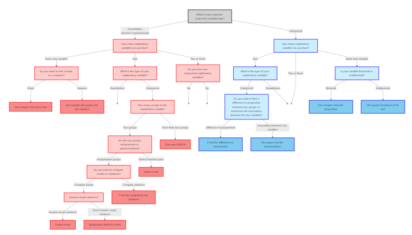

### Between‑ and within‑group variation

Consider $m$ groups with $n_i$ observations in group $i$.  Let $\bar{y}_{i\cdot}$ be the sample mean of group $i$ and $\bar{y}_{\cdot\cdot}$ be the grand mean.  ANOVA partitions the total sum of squares,

$$
\mathrm{SS}_{\mathrm{Total}} = \sum_{i=1}^m\sum_{j=1}^{n_i} (y_{ij} - \bar{y}_{\cdot\cdot})^2
$$

into between‑group variability

$$
\mathrm{SS}_{\mathrm{Between}} = \sum_{i=1}^m n_i\,(\bar{y}_{i\cdot} - \bar{y}_{\cdot\cdot})^2
$$

and within‑group (error) variability

$$
\mathrm{SS}_{\mathrm{Error}} = \sum_{i=1}^m\sum_{j=1}^{n_i} (y_{ij} - \bar{y}_{i\cdot})^2
$$

The total variability satisfies 
$$
\mathrm{SS}_{\mathrm{Total}}=\mathrm{SS}_{\mathrm{Between}}+\mathrm{SS}_{\mathrm{Error}}
$$  
Dividing each sum of squares by its degrees of freedom gives the mean squares:

$$
\mathrm{MS}_{\mathrm{Between}} = \frac{\mathrm{SS}_{\mathrm{Between}}}{m-1},\quad \mathrm{MS}_{\mathrm{Error}} = \frac{\mathrm{SS}_{\mathrm{Error}}}{N - m}
$$

where $N=\sum_{i=1}^m n_i$ is the total sample size.  The *F statistic* is the ratio of these mean squares:

$$
F = \frac{\mathrm{MS}_{\mathrm{Between}}}{\mathrm{MS}_{\mathrm{Error}}}
$$  
Under $H_0$ the F statistic follows an $F$ distribution with $(m-1,\,N-m)$ degrees of freedom.  A large F value indicates that the variability between group means is large relative to the random variability within groups, suggesting that at least one mean differs from the others.

The results of an ANOVA F-test are usually presented in a table. 
The ANOVA table usually takes the form

| **Source**     | **Sum of Squares** | **df**     | **Mean Square**                | **F**          | **p-value**                |
|--------------------|-------------------------|-----------------|--------------------------------------|---------------------|-------------------------------------------------|
| **Between** | $\text{SS}_\text{Between}$          | $m-1$ | $\text{MS}_\text{Between}$ | $\frac{\text{MS}_\text{Between}}{\text{MS}_\text{Error}}$ | $P(F>\frac{\text{MS}_\text{Between}}{\text{MS}_\text{Error}})$ |
| **Error**     | $\text{SS}_\text{Error}$          | $N-m$ | $\text{MS}_\text{Error}$ |                     |                                 |
| **Total**     | $\text{SS}_\text{Total}$      | $N-1$ |                                      |                     |                             |


### Assumptions

ANOVA relies on a few conditions.  Each observation should be independent of the others, the response variable should be continuous and approximately normally distributed within each group, and the population variances in all groups should be equal.  In practice the F test is fairly robust to mild departures from normality, especially when the sample sizes are similar.  If sample variances are markedly different, alternatives such as Welch’s ANOVA may be more appropriate.


:::{.example collapse="false" title="Example 13.1: Cholesterol‑lowering treatments"}

Suppose four cholesterol‑lowering drugs—A, B, C and D—are given to randomly selected patients.  After 6 weeks the reduction in LDL cholesterol (mg/dL) is measured.  We want to know if the average reduction differs among the four drugs.  Rather than perform six t‑tests, we compute the ANOVA F statistic.  An F ratio much larger than 1 would suggest that at least one mean reduction differs from the others.

We can visualize the data using boxplots. 

```{r}
#| echo: false
#| message: false
set.seed(123)
library(tidyverse)
dat = tibble(
  drug = rep(c("A", "B", "C", "D"), each = 20),
  reduction = c(
    round(rnorm(20, mean = 10, sd = 5),1),
    round(rnorm(20, mean = 12, sd = 5),1),
    round(rnorm(20, mean = 9, sd = 5),1),
    round(rnorm(20, mean = 15, sd = 5),1)
  )
) 
dat %>%
  ggplot(aes(drug, reduction)) +
  geom_boxplot(fill = "#FFB81c", color = "black") +
  labs(y = "Reduction in LDL (mg/dL)", x = "Drug") +
  theme_minimal()

# write_csv(dat, "anova1.csv")
```

The boxplot hints at possible differences—drug D seems to reduce cholesterol more than the others.  The F test will confirm whether such differences are statistically significant. B

Below is the JMP output of the ANOVA table for this data.

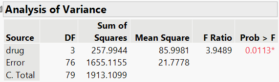

Using $\alpha=0.05$, we reject the null hypothesis. At the 5% significance level, there is enough evidence to conclude that at least one of the drugs differs. We will discuss how to determine which drugs differ with confidence intervals in the next section. 

:::

#### Recap

| **Keyword/Concept** | **Definition** |
|--------------------|----------------|
| **One‑way ANOVA** | A procedure for testing whether the means of three or more independent groups are equal. |
| **Between‑group variability** | Variability due to differences among group means. |
| **Within‑group (error) variability** | Variability of observations around their group means. |
| **F statistic** | The ratio $\mathrm{MS}_{\mathrm{Between}}/\mathrm{MS}_{\mathrm{Error}}$ used to test $H_0$ that all group means are equal. |
| **Assumptions** | Independence, normality of each group and equality of variances across groups. |

### Check your understanding

::: {.callout-note collapse="false" title="Problems"}

1. Why is it not advisable to use multiple t‑tests to compare the means of four or more groups?
2. In your own words, explain what it means if the ANOVA F statistic is close to 1.
3. List the key assumptions of a one‑way ANOVA.

:::

::: {.callout-tip collapse="true" title="Solutions"}
1. Performing several independent t‑tests inflates the probability of making at least one Type I error (false positive).  ANOVA tests all the means simultaneously and controls the overall error rate.
2. An F ratio near 1 means that the variability between group means is similar to the variability within groups.  Under such circumstances the data are consistent with all groups having the same mean, and we would likely fail to reject $H_0$.
3. The response variable should be continuous and approximately normally distributed in each group, observations should be independent, and the population variances should be equal.
:::


## Post‑hoc comparisons {#sec-13_02}

> "Statistics is a science in my opinion, and it is no more a branch of mathematics than are physics, chemistry, and economics; for if its methods fail the test of experience–not the test of logic–they will be discarded." - John Tukey


The global F test in a one‑way ANOVA tells us that not all group means are equal, but it does not identify *which* pairs of means differ.  Performing multiple two‑sample t‑tests on the same data inflates the family‑wise error rate.  Post‑hoc procedures are designed to compare all pairs of group means while controlling the overall probability of making any false positives.  The basic idea is to construct confidence intervals for each pair of means and adjust the critical values so that the chance of incorrectly claiming a difference remains at or below the chosen $\alpha$ level.

### Common post‑hoc methods

Several procedures exist for comparing means after an ANOVA.  Here is a brief overview:

- **Fisher’s least significant difference (LSD)** – performs unadjusted two‑sample t‑tests for each pair of means but only after the omnibus F test is significant.  Simple to compute but does not control the family‑wise error rate when there are many comparisons.
- **Bonferroni** – divides the desired significance level by the number of comparisons (or multiplies p‑values by that number).  Valid for unequal sample sizes, but conservative when many comparisons are made.
- **Scheffé’s method** – constructs simultaneous confidence intervals for *all* possible contrasts among means.  Highly conservative but useful when testing complex hypotheses involving multiple groups.

Other specialized procedures include Holm’s sequential Bonferroni and Dunnett’s test (for comparing several treatments against a control), which we will not cover in detail here.

### Tukey’s honestly significant difference (HSD)

Because it balances power and control of the family‑wise error rate, **tukey’s hsd** is the most widely used post‑hoc procedure in one‑way ANOVA.  It relies on the *studentized range* distribution, which models the range of sample means standardized by the within‑group variability.  After computing the ANOVA F test, the critical difference for comparing means of groups $i$ and $j$ is

$$
\mathrm{HSD} = \mathrm{q}_{1-\alpha, m, N - m}\,\sqrt{\frac{\mathrm{MS}_{\mathrm{Error}}}{2}\left(\frac{1}{n_i} + \frac{1}{n_j}\right)}
$$

where $\mathrm{MS}_{\mathrm{Error}}$ is the within‑group mean square from the ANOVA table and $\mathrm{q}_{1-\alpha, m, N - m}$ is the critical value from the studentized range distribution.  For equal group sizes $n_i = n_j = n$, this simplifies to 
$$
\mathrm{HSD} = \mathrm{q}\,\sqrt{\mathrm{MS}_{\mathrm{Error}}/n}
$$  
A pair of sample means $\bar{y}_{i\cdot}$ and $\bar{y}_{j\cdot}$ is declared significantly different if $|\bar{y}_{i\cdot} - \bar{y}_{j\cdot}| > \mathrm{HSD}$.  Equivalently, the $100(1-\alpha)\%$ confidence interval for the difference $\bar{y}_{i\cdot} - \bar{y}_{j\cdot}$ is

$$
\bar{y}_{i\cdot} - \bar{y}_{j\cdot} \pm \mathrm{HSD}
$$

Because Tukey’s method is based on the largest range among means, it controls the family‑wise error rate exactly when all group sizes are equal and remains robust for slight imbalances.

<!-- #### Interpreting Tukey’s results -->

<!-- When you apply Tukey’s HSD, the output typically lists the difference between each pair of group means, the standard error, and the lower and upper confidence limits.  If the interval does not include zero, the means differ significantly.  For example, in the plant growth example below, the interval for the difference between **SuperGrow** and **Nitro** might be $(2.1, 7.8)$, indicating that SuperGrow yields at least 2.1 grams more dry weight than Nitro with 95 % confidence. -->

### Performing Tukey’s HSD in JMP

1. Use **Analyze > Fit Y by X** to fit the one‑way ANOVA.  Assign the continuous response variable to *Y* and the categorical factor to *X*.
2. Click the red triangle next to the Oneway analysis report and choose *Means/Anova* to display the ANOVA table.
3. From the red triangle menu in the Oneway window, select *Compare Means > All Pairwise, Tukey HSD*.  A dialog box will prompt you to specify the significance level (default is 0.05); you can adjust this if needed.
4. JMP adds a table labeled **Tukey HSD** listing each pair of groups, the difference in means, standard error, confidence interval and adjusted p‑value.  Pairs with intervals that do not contain zero are flagged as significantly different.
5. You can visualize the results by selecting *Plot* in the same menu, which adds confidence interval plots for each pairwise comparison.  Always ensure that the global ANOVA F test is significant before interpreting post‑hoc comparisons.

:::{.example collapse="false" title="Example 13.2: Plant growth under different fertilizers"}

Suppose an agronomist measures the dry weight (grams) of plants grown under three fertilizers—Nitro, SuperGrow and GreenUp—with twenty plants in each group.  Below are boxplots of the data.

```{r}
#| echo: false
#| message: false
set.seed(456)
library(tidyverse)

dat <- tibble(
  fertilizer = rep(c("Nitro", "SuperGrow", "GreenUp"), each = 20),
  weight = c(
    round(rnorm(20, 50, 6),1),
    round(rnorm(20, 60, 6),1),
    round(rnorm(20, 49, 6),1)
  )
)

dat %>%
  ggplot(aes(fertilizer, weight)) +
  geom_boxplot(fill = "#FFB81c", color = "black") +
  labs(y = "Dry Weight (grams)", x = "Fertilizer") +
  theme_minimal()


# write_csv(dat, "anova2.csv")

# anova_res <- aov(weight ~ fertilizer, data = dat)
# TukeyHSD(anova_res)
```


The one‑way ANOVA yields a significant F statistic, indicating that not all mean weights are equal.  

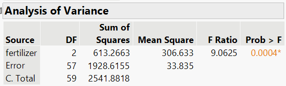
 
 At the 5% significance level, there is enough evidence to conclude that at least one of the fertilizers has a mean different than the others. 
 
 Below is the JMP output for Tukey's HSD:
 
 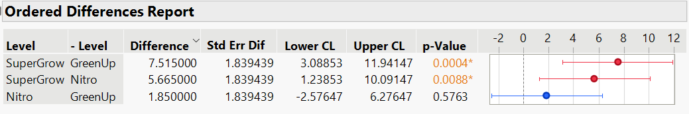
For the difference between SuperGrow and GreenUp, we see the confidence interval does not include zero. Thus, there is a significant difference between these two fertilizers. In addition, the interval indicates that SuperGrow is between 3.09 and 11.94 grams more than GreenUp, on average. 

Likewise, we see that SuperGrow is between 1.24 and 10.09 grams more thant Nitro, on Average. 

For the difference between Nitro and GreenUp, we see the confidence intervals does include zero. Therefore, there is not enough evidence that these two fertilizers are different. 

In all three of these results, we are 95% confident that all three of these intervals contain the true differences. 

:::


#### Recap

| **Keyword/Concept** | **Definition** |
|--------------------|----------------|
|  **Post‑hoc test ** | A procedure for comparing pairs of group means after an ANOVA indicates that not all means are equal, while controlling the family‑wise error rate. |
|  **Tukey’s HSD ** | Uses the studentized range distribution to construct simultaneous confidence intervals for all pairwise differences; exact for equal group sizes and less conservative than Bonferroni. |


### Check your understanding

:::{.callout-note collapse="false" title="Problems"}

1. In your own words, describe how Tukey’s HSD controls the family‑wise error rate.
:::

::: {.callout-tip collapse="true" title="Solutions"}
1. Tukey’s HSD uses the studentized range distribution to adjust the critical value.  It accounts for the probability of the *largest* difference among group means exceeding a threshold, ensuring that the chance of falsely declaring any difference among the means is at most $\alpha$.
:::


## Two‑way ANOVA and randomized blocks {#sec-13_03}

> "Statistics is the art of stating in precise terms that which one does not know." - William Kruskal


When experiments involve two categorical factors—say, *treatment* and *gender*, or *fertilizer type* and *irrigation level*—we can use a **two‑way ANOVA**.  This model allows us to test for **main effects** of each factor and to examine whether the effect of one factor depends on the level of the other (the **interaction**).  In certain designs where a second factor is used only to reduce variability and is not of substantive interest, we call it a **randomized block design**.

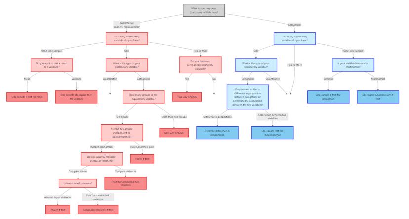

### Model and hypotheses

Suppose we have two factors, $A$ with $a$ levels and $B$ with $b$ levels.  Each treatment combination has $n_{ij}$ observations.  Let $\mu_{ij}$ be the mean for combination $(i,j)$.  We write the model as

$$y_{ijk} = \mu + \alpha_i + \beta_j + (\alpha\beta)_{ij} + \varepsilon_{ijk},$$

where $\mu$ is the grand mean, $\alpha_i$ is the effect of level $i$ of factor $A$, $\beta_j$ is the effect of level $j$ of factor $B$, $(\alpha\beta)_{ij}$ is the interaction effect, and $\varepsilon_{ijk}$ are independent normal errors with common variance.  The hypotheses for each effect are:

- **Main effect of $A$:**
$$
H_0: \alpha_1 = \alpha_2 = \cdots = \alpha_a = 0\quad \text{vs.}\quad H_a: \text{At least one } \alpha_i \neq 0
$$
This tests whether the mean response differs across levels of factor $A$. This is equivalent to testing
$$
H_0: \mu_1 = \mu_2 = \cdots = \mu_a\quad \text{vs.}\quad H_a: \text{At least one differs} 
$$
For all levels of factor $B$. 

- **Main effect of $B$:**
$$
H_0: \beta_1 = \beta_2 = \cdots = \beta_b = 0\quad \text{vs.}\quad H_a: \text{At least one } \beta_j \neq 0
$$
This is equivalent to testing
$$
H_0: \mu_1 = \mu_2 = \cdots = \mu_b\quad \text{vs.}\quad H_a: \text{At least one differs} 
$$
for all levels of factor $A$. 

- **Interaction:**
$$
H_0: (\alpha\beta)_{ij} = 0\ \text{for all } i,j\quad \text{vs.}\quad H_a: \text{At least one } (\alpha\beta)_{ij} \neq 0
$$
We can write this hypothesis without the math symbols as
$$
\begin{align*}
&H_0: \text{There is no interaction between the two factors}\\
&H_a: \text{There is interaction between the two factors}
\end{align*}
$$

For each hypothesis, an F statistic is computed by dividing the mean square for that factor or interaction by the mean square error.  Large F values suggest significant effects.

### Partitioning variation

The two‑way ANOVA partitions the total variability into contributions from factor $A$, factor $B$, their interaction, and random error.  For balanced designs with equal sample sizes $n$ per combination, the sums of squares are

$$
\mathrm{SS}_A = bn\sum_{i=1}^a(\bar{y}_{i\cdot\cdot} - \bar{y}_{\cdot\cdot\cdot})^2,\quad \mathrm{SS}_B = an\sum_{j=1}^b(\bar{y}_{\cdot j\cdot} - \bar{y}_{\cdot\cdot\cdot})^2
$$

$$
\mathrm{SS}_{AB} = n\sum_{i=1}^a\sum_{j=1}^b (\bar{y}_{ij\cdot} - \bar{y}_{i\cdot\cdot} - \bar{y}_{\cdot j\cdot} + \bar{y}_{\cdot\cdot\cdot})^2,
$$

and the error sum of squares captures the variability of observations around their cell means.  Dividing each sum of squares by its degrees of freedom yields mean squares for computing F statistics.

### Randomized block designs

In a randomized block design, one factor is a **blocking factor** used to group similar experimental units and reduce variability.  For example, in a drug trial, patients might be blocked by age group; in agricultural experiments, plots might be blocked by soil type.  The model is the same as the two‑way ANOVA model, but only the treatment factor is of interest; the block factor is included solely to account for variation among blocks.  

We typically test the **treatment effect** and ignore the block effect.  When the blocking factor is actually a repeated measurement on the same subject, we instead use a repeated measures ANOVA (see next section).


:::{.example collapse="false" title="Example 13.3: Antidepressants and Age"}

A psychiatrist wants to study the effects of three antidepressants on subjects in three different age groups. There were 12 subjects in each age group who were then randomly assigned one of the three antidepressants. Each subject was rated on a scale of 0 to 100, with higher numbers indicating greater relief from depression. The data is presented in the following table (and can be found in the file `antidepressantrating.jmp`):

|           | **18–30**             | **31–50**             | **51–80**             |
|:----------|:----------------------|:----------------------|:----------------------|
| **Drug A** | 43,  43,  41,  42        | 53,  51,  53,  52        | 57,  55,  58,  56        |
| **Drug B** | 52,  51,  51,  50        | 62,  61,  60,  61        | 65,  66,  66,  67        |
| **Drug C** | 71,  72,  70,  71        | 81,  83,  82,  82        | 86,  84,  87,  86        |


In two-way ANOVA, a null hypothesis states that the population means are the
same in each category of one factor, at each fixed level of the other factor. 


For example, we could test
$$
\begin{align*}
H_0: \text{Mean rating is equal for all three drugs for each age group}
\end{align*}
$$
We could also test
$$
 \begin{align*}
H_0: \text{Mean rating is equal for all age groups for each drug }
\end{align*}
$$

Suppose the population means for each of the cells were displayed in table (a) below. Since the means are the same for all three drugs in each age group, our first null hypothesis above would be true. If the means were as displayed in table (b), then the means would be the same for all three age groups in each drug group. So, our second null hypothesis above would be correct. 

| **(a)** | **Drug** | **18–30** | **31–50** | **51–80** |   | **(b)** | **Drug** | **18–30** | **31–50** | **51–80** |
|:-------:|:----------|:---------:|:---------:|:---------:|:-:|:-------:|:----------|:---------:|:---------:|:---------:|
|          | Drug A | 60 | 70 | 80 |   |  | Drug A | 50 | 50 | 50 |
|          | Drug B | 60 | 70 | 80 |   |  | Drug B | 60 | 60 | 60 |
|          | Drug C | 60 | 70 | 80 |   |  | Drug C | 70 | 70 | 70 |


#### Exploring Interaction Between Factors in Two-Way ANOVA


Investigating whether **interaction** occurs is important whenever we analyze multivariate relationships. 

No interaction between two factors means that the effect
of either factor on the response variable is the same at each category of the other
factor. 

The ANOVA tests of main effects assume there is no interaction between the factors. What does this mean
in this context?

Let’s plot the means for the three drugs,   within each age group. 

The figure below shows a plot in which the y-axis gives
estimated mean ratings, and points are shown for the nine drug / age group combinations.

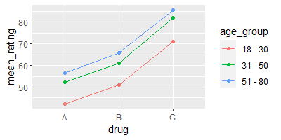


 The horizontal axis is not a numerical scale but merely lists the three
drugs. The drawn lines connect the means for the three drugs, for
a given age group. The absence of interaction is indicated by the (approximate) parallel lines.

The parallel lines occur because the difference in the estimated mean
rating between the three drugs is the **same** for each age group. 


By contrast, the figure below shows a set of means for which there is
interaction. 
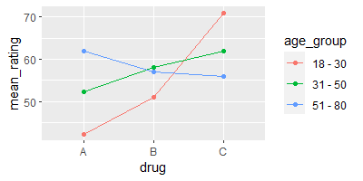


Here, the difference in means depends on the age group: According to these
means, drug A is better for the 51-80 age group, drug B is better for the 31-50 age group, and drug C is better for the 18-30 age group. 

 The lines in the previous figure are not parallel.


*It is not meaningful to test the main effects hypotheses when there is interaction*.

Below is the JMP output for the two-way ANOVA for this example. 


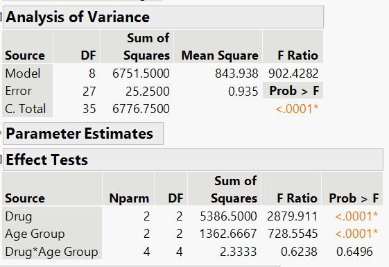

At the 5% significance level, there is not enough evidence to conclude that there is interaction between Drug and Age Group. Because there is no significant interaction, we can test the main effects. 

At the 5% significance level there is enough evidence to conclude that at least one of the drugs differs in mean for each Age Group.

At the 5% significance level there is enough evidence to conclude that at least one of the Age Group differs in mean for each Drug.  

We can also do Tukey's HSD method to determine which of the groups are different for each main effect. 

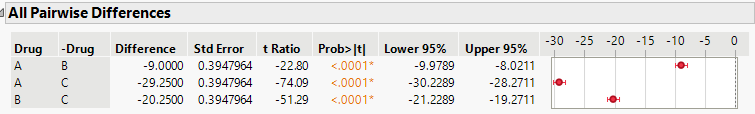

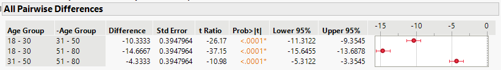

:::

<!-- ### Example: Sales training and incentive programs -->

<!-- Imagine a business study examining whether a sales training program (online vs. in‑person) and incentive type (commission vs. salary) affect monthly sales (in $10^3$ dollars).  Each combination is assigned to ten sales representatives, and monthly sales are recorded.  A two‑way ANOVA allows us to test whether the training method has a main effect, whether the incentive type has a main effect, and whether there is an interaction—that is, whether the effectiveness of training depends on the incentive scheme.  The code below simulates such a dataset and fits the model. -->

<!-- ```{r} -->
<!-- set.seed(789) -->
<!-- library(tidyverse) -->

<!-- dat <- expand_grid( -->
<!--   training = c("Online", "In‑person"), -->
<!--   incentive = c("Commission", "Salary"), -->
<!--   rep = 1:10 -->
<!-- ) %>% -->
<!--   mutate( -->
<!--     sales = 50 + (training == "In‑person")*5 + (incentive == "Commission")*8 + -->
<!--       (training == "In‑person" & incentive == "Commission")*3 + -->
<!--       rnorm(n(), 0, 6) -->
<!--   ) -->

<!-- model <- aov(sales ~ training * incentive, data = dat) -->
<!-- summary(model) -->
<!-- ``` -->

<!-- The ANOVA table shows F statistics for the main effects and interaction.  A significant interaction term would suggest that the effect of training depends on the incentive type.  If the interaction is not significant, we interpret the main effects. -->

### Performing two‑way ANOVA in JMP

To carry out a two‑way ANOVA or a randomized block design in JMP, choose **Analyze > Fit Model**.  Select your response variable for *Y* and add both factors to the *Construct Model Effects* box.  If you have a complete factorial design, click *Macros > Full Factorial* to include the main effects and interaction.  Click *Run* to produce the ANOVA table.  JMP will display an *Effect Tests* table with F statistics for each effect.  Use the prediction profiler to visualize interactions, and check residual plots to assess model assumptions.

#### Recap

| **Keyword/Concept** | **Definition** |
|--------------------|----------------|
| **Two‑way ANOVA** | A model with two categorical explanatory variables (factors) that tests for main effects and interactions. |
| **Main effect** | The effect of a factor averaged over the levels of the other factor; tested by comparing $\mathrm{MS}_{\text{factor}}$ to $\mathrm{MS}_{\mathrm{Error}}$. |
| **Interaction** | Occurs when the effect of one factor depends on the level of the other; tested via an F ratio using $\mathrm{MS}_{AB}$. |
| **Randomized block design** | A special two‑way ANOVA where one factor (the block) is used to control variability; only the treatment factor is of interest and the block factor accounts for nuisance variation. |


### Check your understanding

::: {.callout-note collapse="false" title="Problems"}

1. Describe the difference between a main effect and an interaction effect in a two‑way ANOVA.
2. In a randomized block design with five treatments and four blocks, how many degrees of freedom are associated with the treatment, block and error sums of squares?
3. Why is it important to include the blocking factor in the model when analyzing a randomized block design?

:::

::: {.callout-tip collapse="true" title="Solutions"}
1. A main effect measures the average difference in the response across the levels of a factor, ignoring (averaging over) the other factor.  An interaction effect tests whether the effect of one factor varies depending on the level of the other factor; if significant, the factors do not act independently.
2. The treatment factor has $a-1$ degrees of freedom and the block factor has $b-1$, where $a$ is the number of treatments and $b$ the number of blocks.  The error degrees of freedom are $(a-1)(b-1)$ for a balanced design with one observation per cell.  In this case, $a=5$ and $b=4$, so the treatment, block and error degrees of freedom are $4$, $3$ and $12$, respectively.
3. The block factor captures variation among blocks.  Omitting it would inflate the error term, reducing power to detect treatment differences.  Including the blocking factor removes block‑to‑block variability from the error and improves precision.
:::


## Repeated measures ANOVA {#sec-13_04}


> "Beware of the problem of testing too many hypotheses; the more you torture the data, the more likely they are to confess, but confessions obtained under duress may not be admissible in the court of scientific opinion." - Stephen Stigler


In many experiments the same experimental units are observed under multiple conditions—for example, measuring patients’ blood pressure at baseline, 1 month and 3 months after starting medication.  Because measurements on the same subject are correlated, we cannot treat them as independent.  A **repeated measures ANOVA** compares the means of three or more related measurements on the same subjects, taking into account this correlation.

### Model and partitioning variance

For a one‑factor repeated measures design with $m$ time points or conditions, we have $n$ subjects each observed under all $m$ conditions.  Let $y_{ij}$ denote the response of subject $j$ at time $i$.  The model can be written as

$$
y_{ij} = \mu + \tau_i + s_j + \varepsilon_{ij}
$$

where $\mu$ is the grand mean, $\tau_i$ is the effect of condition $i$, $s_j$ is the effect of subject $j$ (a random subject effect), and $\varepsilon_{ij}$ are error terms.  

The ANOVA partitions the total variation into *between‑treatments* (conditions), *between‑subjects*, and *error (within‑subjects)* components.  The F statistic for testing $H_0: \tau_1=\cdots=\tau_m=0$ uses the mean square for treatments divided by the mean square error:

$$
F = \frac{\mathrm{MS}_{\text{Treatments}}}{\mathrm{MS}_{\text{Error}}}
$$

The error term is derived by subtracting the between‑subjects variation from the within‑subjects variation, leading to a smaller denominator and increased power compared with ordinary one‑way ANOVA.

### Assumptions and sphericity

Repeated measures ANOVA requires that the differences between all pairs of conditions have equal variances—a property known as *sphericity*.  If sphericity is violated (common when measurements are taken at closely spaced time points), the F statistics may be too liberal.  Solutions include applying a *Huynh–Feldt* or *Greenhouse–Geisser* correction to the degrees of freedom or using a multivariate approach such as MANOVA.  Another assumption is that the subjects are independent; repeated measures should not be confused with randomized block designs in which treatments are assigned to different units within a block.


:::{.example collapse="false" title="Example 13.4: Pain scores over time"}

Suppose researchers collect pain scores on 12 patients after a surgical procedure at baseline, 2 hours, 6 hours, and 24 hours post‑surgery.  The goal is to determine whether mean pain changes over time.  The repeated measures ANOVA compares mean pain at the four time points.  

JMP output for the repeated measures ANOVA is shown below:

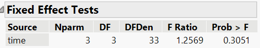


At the 5% significance level, there is not enough evidence to conclude the mean pain levels differs over time. We can also construct Tukey HSD confidence intervals as we have done before. Since we did not find the mean pain levels differ over any of the time points, we expect these intervals to all include zero. 

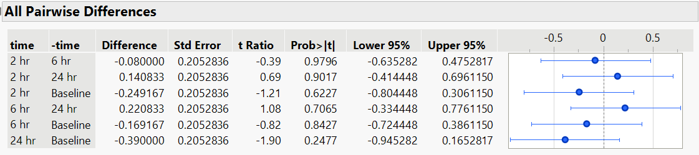

:::


<!-- # ```{r} -->
<!-- # # set.seed(101) -->
<!-- # # library(tidyverse) -->
<!-- # #  -->
<!-- # # dat <- tibble( -->
<!-- # #   subject = factor(rep(1:12, each = 4)), -->
<!-- # #   time = factor(rep(c("Baseline", "2 hr", "6 hr", "24 hr"), times = 12), -->
<!-- # #                 levels = c("Baseline","2 hr","6 hr","24 hr")), -->
<!-- # #   pain = rep(c(6,5,3,2), each = 12) + rep(round(rnorm(12,0,1),2), each = 4) + round(rnorm(48,0,0.5),2) -->
<!-- # # ) -->
<!-- # #  -->
<!-- # # # write_csv(dat, "pain and time.csv") -->
<!-- # #  -->
<!-- # # model <- aov(pain ~ time + Error(subject/time), data = dat) -->
<!-- # # summary(model) -->
<!-- # ``` -->

### Conducting repeated measures ANOVA in JMP 18

Stack the repeated measurements into a single column with a factor column indicating the measurement occasion.  Then use **Analyze > Fit Model** with the response variable as *Y* and include the repeated factor, the subject identifier, and their interaction.  Select *Random Effects* for the subject term to specify the correlation structure.  This approach yields the usual ANOVA table and F tests with appropriate degrees of freedom.


#### Recap

| **Keyword/Concept** | **Definition** |
|--------------------|----------------|
| **Repeated measures ANOVA** | A method for comparing means of three or more measurements on the same subjects, accounting for correlation among repeated observations. |
| **Sphericity** | The assumption that the variances of differences between all pairs of conditions are equal. |
| **Between‑subjects variation** | Variability due to differences among subjects; removed from the error term in repeated measures ANOVA to increase sensitivity. |


### Check your understanding

::: {.callout-note collapse="false" title="Problems"}

1. Why can’t we treat repeated measurements on the same subject as independent observations?
2. What is the purpose of the sphericity assumption, and what adjustments can be made when it is violated?
3. Describe one advantage of the repeated measures design over a completely randomized design when the same subjects are measured multiple times.

:::

::: {.callout-tip collapse="true" title="Solutions"}
1. Measurements taken on the same subject are correlated; they share subject‑specific variability that violates the independence assumption of one‑way ANOVA.  Repeated measures ANOVA models this correlation by separating between‑subjects and within‑subjects variation.
2. Sphericity ensures equal variances of pairwise differences between conditions.  When sphericity is violated, F statistics can be adjusted using the Greenhouse–Geisser or Huynh–Feldt correction, or one can use a multivariate approach such as MANOVA.
3. Because each subject serves as their own control, repeated measures designs reduce the impact of between‑subject variability.  This typically increases statistical power and requires fewer subjects to detect a given effect.
:::


