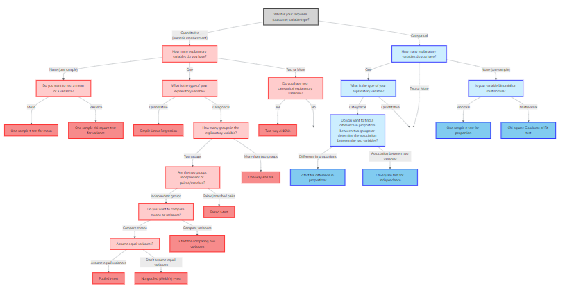
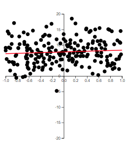
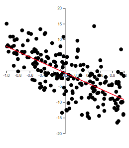
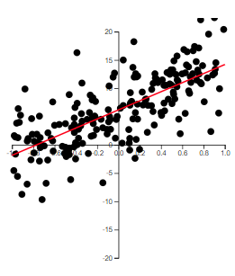
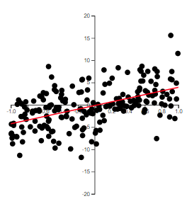
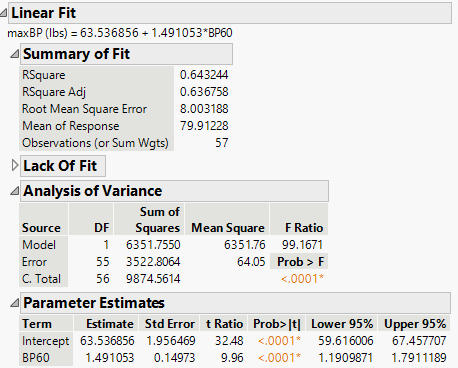
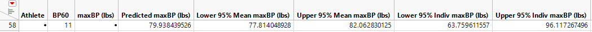
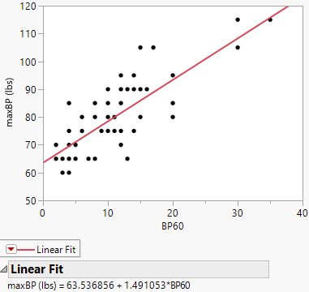

# Correlation and Simple Linear Regression

## Scatterplots and the Correlation Coefficient {#sec-14_01}

> "The modern student, and too often his teacher, overlook the fact that such a simple thing as a scatter diagram is a more important tool of prediction than the correlation coefficient..." – W. Edwards Deming




When exploring two numerical variables, the first step is to look at the variables graphically.  A **scatterplot** is simply a collection of points in the plane where each point represents one observation.  We usually plot the explanatory variable on the horizontal axis and the response variable on the vertical axis.  If you are unsure which variable should go on which axis, it often does not matter for descriptive purposes, but if your goal is prediction you should place the variable you wish to predict on the vertical axis.

Scatterplots reveal patterns that numbers alone cannot.  If the points lie cluster around a straight line, the relationship is approximately **linear**.  If the points form a curved band, the association is nonlinear.  The closer the points are to a straight line, the stronger the linear relationship.  Outliers can distort our impression, so always scan the plot before jumping into calculations.

### Measuring linear association

To quantify the strength and direction of a linear relationship we use the **correlation coefficient**.  

It is computed as
$$
\begin{align*}
    {r=\frac{SS_{xy}}{\sqrt{SS_{xx}SS_{yy}}}}
\end{align*}
$$
where
$$
\begin{align*}
SS_{xy} =& \sum \left(y_i-\bar{y}\right)\left(x_i-\bar{x}\right)\\
SS_{xx} =& \sum \left(x_i-\bar{x}\right)^2\\
SS_{yy} =& \sum \left(y_i-\bar{y}\right)^2
\end{align*}
$$


$SS_{xx}$ and $SS_{yy}$ are measures of *variability* of $x$ and $y$, respectively. That is, they indicate how $x$ and $y$ varies about their mean, individually.


$SS_{xy}$ is a measure of how $x$ and $y$ vary *together*.


For example, consider the data in the scatterplot below. The two red lines represent the mean of the $x$ variable (the vertical red line is for $\bar{x}$) and the mean of the $y$ variable (the horizontal red line is for $\bar{y}$).

```{r message=FALSE, warning=F, echo=FALSE}
library(tidyverse)

x = c(1, 2 ,2.75, 4, 6, 7, 8, 10)
y = c(2, 1.4, 1.6, 1.25, 1, 0.5, 0.5, 0.4)

dat =  tibble(x, y)

ybar =  mean(y)
xbar =  mean(x)

ggplot(data=dat, aes(x = x, y = y)) +
  geom_point() +
  xlim(0,10) +
  ylim(0,2) +
  geom_hline(yintercept = ybar,col="red") +
  geom_vline(xintercept = xbar, col="red")

```


Let's find $SS_{xx}$, $SS_{yy}$, and $SS_{xy}$.

```{r message=FALSE, warning=F, echo=FALSE}
`(x-xbar)` = x-xbar
`(y-ybar)` = y-ybar

`(x-xbar)(y-ybar)` = `(x-xbar)`*`(y-ybar)`

dx = x - xbar
dy = y - ybar
dxdy = dx*dy


dat1 = tibble(
  `$x$` = x,
  `$y$` = y,
  # `$x - \\bar{x}$` = dx,
  # `$y - \\bar{y}$` = dy,

  `$(x - \\bar{x})^2$` = dx^2,
  `$(y - \\bar{y})^2$` = dy^2,
    `$(x - \\bar{x})(y - \\bar{y})$` = dx * dy
)

knitr::kable(
  dat1
)

```

Note that each value in $(x_i-\bar{x})(y_i-\bar{y})$ is negative. This is because as $x$ is below $\bar{x}$, $y$ is above $\bar{y}$. Likewise, as $x$ is above $\bar{x}$, $y$ is below $\bar{y}$. In the scatterplot above, you can see how the observations are below or above these lines.


Summing up the values give us:
$$
\begin{align*}
SS_{xx} =& \sum \left(x_i-\bar{x}\right)^2\\
 = & `r sum(dx^2 )`\\\\
SS_{yy} =& \sum \left(y_i-\bar{y}\right)^2\\
= & `r sum(dy^2)`\\\\
SS_{xy} =& \sum \left(y_i-\bar{y}\right)\left(x_i-\bar{x}\right)\\
 = & `r sum(dxdy)`
 \end{align*}
$$


::: {.example collapse="false" title="Example 14.1: Volume of Lumber"}


In the following scatterplot, the volume of timber from 31 black cherry trees are plotted against the diamter of the tree measured at 54 inches off the ground. 


Again, we plot the data with red lines representing $\bar{x}$ and $\bar{y}$.


```{r message=FALSE, warning=F, echo=FALSE}
library(datasets)
x = trees$Girth
y = trees$Volume
xbar = mean(trees$Girth)
ybar = mean(trees$Volume)

ggplot(data=trees, aes(x=Girth, y=Volume)) +
  geom_point() +
  geom_hline(yintercept = ybar,col="red") +
  geom_vline(xintercept = xbar, col="red")+
  xlab("diameter")


```


```{r message=FALSE, warning=F, echo=FALSE}
library(datasets)
library(tidyverse)
dx = x - xbar
dy = y - ybar
dxdy = dx*dy


dat1 = tibble(
  `$x$` = x,
  `$y$` = y,
  # `$x - \\bar{x}$` = dx,
  # `$y - \\bar{y}$` = dy,

  `$(x - \\bar{x})^2$` = dx^2,
  `$(y - \\bar{y})^2$` = dy^2,
    `$(x - \\bar{x})(y - \\bar{y})$` = dx * dy
)

knitr::kable(
  dat1
)
```


In this example, most of the observations have $(x-\bar{x})(y-\bar{y})$ that are positive. This is because these observations have values of $x$ that are below $\bar{x}$ and values of $y$ that are below $\bar{y}$, or values of $x$ that are above $\bar{x}$ and values of $y$ that are above $\bar{y}$.

There are four observations that have a negative value of $(x-\bar{x})(y-\bar{y})$.  Although they are negative, the value of $SS_{xy}$ is positive due to all the observations with positive values of $(x-\bar{x})(y-\bar{y})$. Therefore, we say if  $SS_{xy}$ is **positive**, then $y$ tends to increase as $x$ increases. Likewise, if $SS_{xy}$ is **negative**, then $y$ tends to decrease as $x$ increases.

If $SS_{xy}$ is zero (or close to zero), then we say  $y$ does not tend to change as $x$ increases.

:::


### Correlation Coefficient

We first note that $SS_{xy}$ cannot be greater in absolute value than the quantity
$$
\sqrt{SS_{xx}SS_{yy}}
$$
We will not prove this here, but it is a direct application of the Cauchy-Schwarz inequality .


Thus, the correlation coefficient
$$
\begin{align}
    r=\frac{SS_{xy}}{\sqrt{SS_{xx}SS_{yy}}}
\end{align}
$$
is a value sucha that
$$
-1\le r \le 1
$$

If $r=0$, then there is no linear relationship between $x$ and $y$.

If $r$ is positive, then the slope of the linear relationship is positive. If $r$ is negative, then the slope of the linear relationship is negative.


The closer $r$ is to one in absolute value, the stronger the linear relationship is between $x$ and $y$.


Because it is based on means and standard deviations, Pearson’s $r$ is sensitive to outliers and assumes the data are reasonably normal.  When one or both variables are non‑normal, a rank‑based measure such as Spearman’s rho may be used instead (not discussed in this course).

It is tempting to interpret a large correlation as evidence of **causation**, but correlation merely quantifies association.  Even a strong correlation can arise from confounding variables or chance.  Always consider the context and remember that a scatterplot and subject‑matter knowledge are essential for interpretation.

::: {.example collapse="false" title="Example 14.2: Age and Systolic Blood Pressure"}

To see how scatterplots and correlation work in practice, consider a small study of 20 adults ranging in age from 30 to 80 years.  The response variable is systolic blood pressure (measured in mm Hg).  The scatterplot below shows the relationship.

```{r}
#| echo: false
#| message: false


library(tidyverse)
set.seed(123)
df_med <- tibble(
  age      = seq(30, 80, length.out = 20),
  systolic = 90 + 0.8 * age + rnorm(20, 0, 5)
)
ggplot(df_med, aes(x = age, y = systolic)) +
  geom_point(color = "#2c7fb8") +
  geom_smooth(method = "lm", se = FALSE, color = "red") +
  labs(x = "Age (years)", y = "Systolic blood pressure (mm Hg)",
       title = "Scatterplot with fitted line: age vs systolic blood pressure") +
  theme_minimal()
```

The cloud of points slopes upward, indicating a positive relationship: older participants tend to have higher systolic blood pressure.  The correlation coefficient for this dataset is about 0.93, suggesting a strong positive linear association.

:::


### Some Examples of $r$

The best way to grasp correlation is to see examples. In @fig-05_01, scatterplots of 200 observations are shown with a least squares line.


::: {#fig-05_01 layout-ncol=2}

{#fig-05_01a}

{#fig-05_01b}

{#fig-05_01c}

{#fig-05_01d}

Examples of correlation
:::

Note how the value of $r$ relates to how spread out the points are from the line as well as to the slope of the line.


### The Population Correlation Coefficient


The correlation $r$ is for the observed data which is usually from a sample. Thus, $r$ is the  *sample* correlation coefficient.


We could make a hypothesis about the correlation of the *population* based on the sample. We will denote the population correlation with $\rho$. The hypothesis we will want to test is
$$
\begin{align*}
  H_0:\rho = 0\\
H_a:\rho \ne 0
\end{align*}
$$


The test statistic is
$$
\begin{align}
t & =\frac{r\sqrt{\left(n-2\right)}}{\sqrt{1-r^{2}}}
\end{align}
$$

If $H_0$ is true, then $t$ will have a Student's $t$-distribution with $n-2$ degrees of freedom.


### Creating scatterplots and computing correlation in JMP 

JMP makes it easy to explore the relationship between two quantitative variables:

- **Create a scatterplot.**  Load your data into a JMP table.  Choose **Graph → Graph Builder**, drag the explanatory variable to the X‑axis and the response variable to the Y‑axis, and select the *Scatter Plot* element.  You can add a fitted line by clicking the blue triangle next to **Fit Line**.
- **Compute the correlation.**  Choose **Analyze → Multivariate Methods → Multivariate**.  Select your variables and click **Y, Columns**.  JMP displays a matrix of scatterplots and gives the Pearson correlation coefficient in the correlation table.  If normality is questionable, use **Analyze → Multivariate → Nonparametric Correlations** for Spearman’s rho.

### Recap

| **Keyword/Concept** | **Explanation** |
|---|---|
| **scatterplot** | A graph of paired quantitative data where each point represents one observation; used to visualize the relationship between two variables. |
| **Pearson’s correlation coefficient (r)** | A measure of the strength and direction of a linear relationship, ranging from −1 to +1; positive values indicate direct association and negative values indicate inverse association. |


### Check your understanding

::: {.callout-note collapse="false" title="Problems"}

1. A study of 30 students reports a correlation of $r=0.85$ between hours studied and exam score.  What does this value tell you about the relationship?  Would you conclude that studying more *causes* higher scores?  Explain.
2. Sketch (or describe) how a scatterplot would look if $r\approx -0.6$.  What does the sign and magnitude of this correlation tell you about the relationship?

:::

::: {.callout-tip collapse="true" title="Solutions"}

1. The correlation of 0.85 indicates a strong positive linear association: students who study more tend to score higher.  However, correlation on its own does not prove causation.  Other factors (prior knowledge, test difficulty) may influence scores, and experimental control would be needed to establish a causal link.
2. A correlation of $-0.6$ produces a downward‑sloping cloud of points: as one variable increases, the other tends to decrease.  The moderate magnitude (0.6) suggests a reasonably strong inverse relationship but with noticeable scatter around a straight line.

:::

## Least Squares Regression Line {#sec-14_02}

> "Regression. It is a universal rule that the unknown kinsman in any degree of any specified man, is probably more mediocre than he."  – Francis Galton

After visualizing and quantifying the relationship between two variables, the next step is to model that relationship.  In **simple linear regression**, we seek the line that best predicts the response variable $y$ from the explanatory variable $x$.  The model has the form
$$
\begin{align*}
y = \beta_0 + \beta_1 x+\varepsilon
\end{align*}
$$
where:

- $y$ is the response variable (also known as the **dependent** variable)
- $x$ is the predictor variable (also called the **independent** variable or explanatory variable)
- $\varepsilon$  is the *random error* component
- $\beta_0$ is the *y-intercept* of the line (the point where the line intersects the y-axis)
- $\beta_1$ is the *slope* of the line (the change in the mean of $y$ for every 1-unit increase in $x$)

We use Greek symbols $\beta_0$ and $\beta_1$ to denote the y-intercept and slope of the line. These are population *parameters* with values that would only be known if we had access to the entire population of $(x, y)$ measurements.


::: {.callout-note}
## Review: Greek Letters in Notation
Usually, in Statistics, lower-case Greek letters are used to denote population parameters. In our model above, we have an exception. The Greek letter $\varepsilon$ is not a parameter, but a random variable (parameters are not random variables in frequentist statistics). 
:::


### Fitting the Model: The Method of Least Squares


Suppose we have the data shown in @tbl-table2_1 below and plotted in the scatterplot in @fig-2_1.


| x    | y    |
|------|------|
| 1    | 2    |
| 2    | 1.4  |
| 2.75 | 1.6  |
| 4    | 1.25 |
| 6    | 1    |
| 7    | 0.5  |
| 8    | 0.5  |
| 10   | 0.4  |

: Data for Scatterplot  {#tbl-table2_1}


```{r}
#| warning: false
#| echo: false
#| label: fig-2_1
#| fig-cap: Scatterplot of the data in @tbl-table2_1
library(tidyverse)
x = c(1, 2, 2.75, 4, 6, 7, 8, 10)
y = c(2, 1.4, 1.6, 1.25, 1, 0.5, 0.5, 0.4)
dat = tibble(x, y)

dat |> 
  ggplot(aes(x = x, y = y)) + 
  geom_point()

```


We hypothesize that a straight-line model relates *y* to *x*, as follows:

$$
y = \beta_0 + \beta_1 x + \varepsilon
$$


How can we use the data from the eight observations in @tbl-table2_1 to estimate the unknown y-intercept ($\beta_0$) and slope ($\beta_1$)?


We can start by trying some lines and see how well they fit the data. But how do we measure how well a line *fits* the data?

A quantitative method to evaluate how well a straight line fits a set of data is by measuring the deviations of the data points from the line.

::: {.callout-note}
## Review: Deviations of Response Variable
$y$ is the variable of interest, so we are focused on the differences between observed $y$ and the predicted value of $y$
:::

We calculate the magnitude of the *deviations* (the differences between observed and predicted values of $y$).

These deviations, or prediction errors, represent the *vertical* distances between observed and predicted values of $y$.

Suppose we try to fit the line
$$
    \hat{y} =2-.2x
$${#eq-02_01}

This line can be seen in @fig-2_2. 
```{r}
#| warning: false
#| echo: false
#| label: fig-2_2
#| fig-cap: Scatterplot of data in @tbl-table2_1 with the red line representing the line in @eq-02_01 
dat |> 
  ggplot(aes(x = x, y = y)) + 
  geom_point() +
  geom_abline(intercept = 2, slope = -0.2, color = "red")

```


The observed and predicted values of $y$, their differences, and their squared differences are shown in the table below.

| $x$  | $y$  | $\hat{y}$ | $(y - \hat{y})$ | $(y - \hat{y})^2$ |
|------|------|-----------|-----------------|------------------|
| 1    | 2    | 1.8       | 0.2             | 0.004            |
| 2    | 1.4  | 1.6       | -0.2            | 0.004            |
| 2.75 | 1.6  | 1.45      | 0.15            | 0.0225           |
| 4    | 1.25 | 1.2       | 0.05            | 0.0025           |
| 6    | 1    | 0.8       | 0.2             | 0.04             |
| 7    | 0.5  | 0.6       | -0.1            | 0.01             |
| 8    | 0.5  | 0.4       | 0.1             | 0.01             |
| 10   | 0.4  | 0         | 0.4             | 0.16             |

: Deviations and squared deviations of the line in @eq-02_01 and the data in @tbl-table2_1.  {#tbl-table2_2}

Note that the sum of the errors (SE) is 0.8, and the *sum* of *squares* of the *errors* (SSE), which emphasizes larger deviations from the line, is 0.325.


We can try another line to see if we do better at predicting $y$ (that is, have smaller SSE). 

Let's try the line 
$$
    \hat{y} =1.8-.15x
$${#eq-02_02}

This line can be seen in @fig-2_3. 

```{r}
#| warning: false
#| echo: false
#| label: fig-2_3
#| fig-cap: Scatterplot of data in @tbl-table2_1 with the red line representing the line in @eq-02_02 
dat |> 
  ggplot(aes(x = x, y = y)) + 
  geom_point() +
  geom_abline(intercept = 1.8, slope = -0.15, color = "red")

```

The fit results are shown in @tbl-table2_3.

| $x$  | $y$  | $\hat{y}$ | $y - \hat{y}$ | $(y - \hat{y})^2$ |
|------|------|-----------|---------------|-------------------|
| 1    | 2    | 1.65      | 0.35          | 0.1225            |
| 2    | 1.4  | 1.5       | -0.1          | 0.01              |
| 2.75 | 1.6  | 1.3875    | 0.2125        | 0.04515625        |
| 4    | 1.25 | 1.2       | 0.05          | 0.0025            |
| 6    | 1    | 0.9       | 0.1           | 0.01              |
| 7    | 0.5  | 0.75      | -0.25         | 0.0625            |
| 8    | 0.5  | 0.6       | -0.1          | 0.01              |
| 10   | 0.4  | 0.3       | 0.1           | 0.01              |

: Deviations and squared deviations of the line in @eq-02_02 and the data in @tbl-table2_1.  {#tbl-table2_3}

The SSE for this line is 0.2727, which is lower than the SSE for the previous line, indicating a better fit.

While we could try additional lines to achieve a lower SSE, there are infinitely many possibilities since *$\beta_0$* and *$\beta_1$* can take any real value.


 
Using Calculus, we can attempt to minimize the SSE for the generic line
\begin{align*}
    \hat{y} = b_0 +b_1 x
\end{align*}

We will denote the sum of the squared distances with $Q$:
$$
Q=\sum \left(y_i-\hat{y}_i\right)^2 
$${#eq-w1_2}

We determine the "best" line as the one that minimizes $Q$.

::: {.callout-tip collapse="true"}
## For those who want to see the math:

To minimize $Q$, we differentiate it with respect to $b_{0}$
and $b_{1}$:
\begin{align*}
\frac{\partial Q}{\partial b_{0}} & =-2\sum \left(y_{i}-\left(b_{0}+b_{1}x_{i}\right)\right)\\
\frac{\partial Q}{\partial b_{1}} & =-2\sum x_{i}\left(y_{i}-\left(b_{0}+b_{1}x_{i}\right)\right)
\end{align*}

Setting these partial derivatives equal to 0, we have
\begin{align*}
-2\sum \left(y_{i}-\left(b_{0}+b_{1}x_{i}\right)\right) & =0\\
-2\sum x_{i}\left(y_{i}-\left(b_{0}+b_{1}x_{i}\right)\right) & =0
\end{align*}
Looking at the first equation, we can simplify as
\begin{align*}
-2\sum \left(y_{i}-\left(b_{0}+b_{1}x_{i}\right)\right)=0 & \Longrightarrow\sum \left(y_{i}-\left(b_{0}+b_{1}x_{i}\right)\right)=0\\
& \Longrightarrow\sum y_{i}-\sum b_{0}-b_{1}\sum x_{i}=0\\
& \Longrightarrow\sum y_{i}-nb_{0}-b_{1}\sum x_{i}=0\\
& \Longrightarrow\sum y_{i}=nb_{0}+b_{1}\sum x_{i}
\end{align*}


Simplifying the second equation gives us
\begin{align*}
-2\sum x_{i}\left(y_{i}-\left(b_0+b_1x_{i}\right)\right)=0 & \Longrightarrow\sum x_{i}\left(y_{i}-\left(b_0+b_1x_{i}\right)\right)=0\\
& \Longrightarrow\sum x_{i}y_{i}-b_0\sum x_{i}-b_1\sum x_{i}^{2}=0\\
& \Longrightarrow\sum x_{i}y_{i}=b_0\sum x_{i}+b_1\sum x_{i}^{2}
\end{align*}


The two equations
$$
\begin{align}
\sum y_{i} & =nb_0+b_1\sum x_{i}\nonumber\\
\sum x_{i}y_{i} & =b_0\sum x_{i}+b_1\sum x_{i}^{2}
\end{align}
$${#eq-w1_3}

are called the *normal* *equations*.


We now have two equations and two unknowns ($b_0$ and
$b_1$). We can solve the equations simultaneously. We
solve the first equation for $b_0$ which gives us
\begin{align*}
b_0 & =\frac{1}{n}\left(\sum y_{i}-b_1\sum x_{i}\right)\\
& =\bar{y}-b_1\bar{x}.
\end{align*}

We now substitute this into the second equation in @eq-w1_3. Solving this
for $b_1$ gives us
\begin{align*}
& \sum x_{i}y_{i}=b_0\sum x_{i}+b_1\sum x_{i}^{2}\\
& \quad\Longrightarrow\sum x_{i}y_{i}=\left(\bar{y}-b_1\bar{x}\right)\sum x_{i}+b_1\sum x_{i}^{2}\\
&\quad\Longrightarrow b_1=\frac{\sum \left(x_{i}-\bar{x}\right)\left(y_{i}-\bar{y}\right)}{\sum \left(x_{i}-\bar{x}\right)^{2}}.
\end{align*}


To show these estimators are the minimum, we take the second partial
derivatives of $Q$:
\begin{align*}
\frac{\partial^{2}Q}{\partial\left(b_{0}\right)^{2}} & =2n\\
\frac{\partial^{2}Q}{\partial\left(b_{1}\right)^{2}} & =2\sum x_{i}^{2}
\end{align*}
Since these second partial derivatives are both positives, then we
know the least squares estimators are the minimum.

:::


The line that best fits the data (that is minimizes $Q$ above) has the following y-intercept and slope:
$$
\begin{align}
b_0 & =\bar{y}-b_1\bar{x}\\
b_1 & =\frac{\sum \left(x_{i}-\bar{x}\right)\left(y_{i}-\bar{y}\right)}{\sum \left(x_{i}-\bar{x}\right)^{2}}
\end{align}
$${#eq-w1_4}


These equations are called the **least squares** estimators.


The least squares estimators in @eq-w1_4 can be expressed in simpler terms if we let
\begin{align*}
SS_{xx} &= \sum \left(x_i-\bar x\right)^2 \\
SS_{xy} &= \sum \left(x_i-\bar x\right)\left(y_i - \bar y\right)
\end{align*}

The least squares estimates become
\begin{align}
{b_1=\frac{SS_{xy}}{SS_{xx}}}\\
{b_0=\bar{y}-b_1\bar{x}}
\end{align}

To recap: The straight line model for the response $y$ in terms of $x$ is
\begin{align*}
{y = \beta_0 + \beta_1 x + \varepsilon}
\end{align*}


The fitted line (also called the *least squares line*) is
\begin{align*}
{\hat{y} = b_0 + b_1 x }
\end{align*}

For a given data point, $(x_i, y_i)$, the observed value of $y$ is denoted as $y_i$ and
the predicted value of $y$ is obtained by substituting $x_i$ into the
prediction equation:
\begin{align*}
{\hat{y}_i = b_0 + b_1 x_i }
\end{align*}


The deviation of the $i$th value of $y$ from its predicted value, called the
$i$th *residual*, is
$$
\begin{align*}
{e_i= \left(y_i-\hat{y}_i\right) }
\end{align*}
$$
Thus, SSE is just the sum of the squared residuals:
$$
SSE = \sum_{i=1}^n \left(y_i-\hat{y}_i\right)^2
$$

In practice we seldom calculate these estimates by hand; software computes them for us.


::: {.example collapse="false" title="Example 14.3: Advertising and Sales"}

Consider the business example introduced earlier.  The advertising budget (in thousands of dollars) serves as $x$, and weekly sales (in thousands of dollars) serve as $y$.  A scatterplot suggests a strong positive association.  Fitting a regression line by least squares yields an equation of the form

$$
 \widehat{y} = 12.47 + 1.74 x,
$$

meaning that each additional thousand dollars spent on advertising is associated with an estimated increase of about 1.74 thousand dollars in weekly sales.  The intercept (12.47) is the predicted sales when advertising spend is zero.  Depending on context, the intercept may or may not have a meaningful interpretation; often it represents an extrapolation outside the observed data range.

Below is the scatterplot with the fitted regression line.

```{r}
#| echo: false
library(tidyverse)
set.seed(7)
spend <- seq(10, 100, length.out = 15)
sales <- 20 + 1.5 * spend + rnorm(15, 0, 10)
df_bus <- tibble(spend = spend, sales = sales)

fit = lm(sales~spend, data = df_bus)

ggplot(df_bus, aes(x = spend, y = sales)) +
  geom_point(color = "#1b7837") +
  geom_smooth(method = "lm", se = FALSE, color = "red") +
  labs(x = "Advertising spend (thousand $)", y = "Weekly sales (thousand $)",
       title = "Regression of sales on advertising spend") +
  theme_minimal()
```

The slope 1.74 tells us that for each thousand‑dollar increase in advertising, sales increase by about 1.71 thousand dollars.  The intercept 12.47 suggests that if a store spent nothing on advertising, the model predicts $12,470 in weekly sales.  In reality, such an extrapolation may not be reasonable; always interpret the intercept within the range of your data.

:::

### Performing regression in JMP

To fit a simple linear regression in JMP:

1. **Load your data.**  Import or enter the variables into a JMP table.
2. **Fit the line.**  Choose **Analyze → Fit Y by X**.  Assign the response variable to **Y, Response** and the explanatory variable to **X, Factor**, then click **OK**.  A scatterplot appears with red triangles above it.  Click the red triangle ► and select **Fit Line**.  JMP displays the regression line, the estimated coefficients ($b_0$ and $b_1$), and the analysis of variance table.


### Recap

| **Keyword/Concept** | **Explanation** |
|---|---|
| **simple linear regression** | A model relating a quantitative response $y$ to a single quantitative predictor $x$ via a straight line. |
| **least squares** | A method that determines the intercept and slope by minimizing the sum of squared residuals. |
| **slope ($b_1$)** | The change in the predicted response for a one‑unit increase in the explanatory variable; its sign indicates the direction of the relationship. The population slope is denoted $\beta_1$|
| **intercept ($b_0$)** | The predicted response when the explanatory variable equals zero; may or may not have a meaningful interpretation depending on context. The population intercept is denoted $\beta_1$. |
| **residual** | The difference between an observed $y$ value and its predicted value $e_i = y_i - \widehat{y}_i$. |

### Check your understanding

:::{.callout-note collapse="false" title="Problems"}

1. Suppose you fit a regression model $\widehat{y}=2.5 + 0.8x$ relating hours of study (x) to exam score (y).  Interpret the slope and the intercept.
2. Explain why the least squares method squares the residuals instead of simply summing them.

:::

::: {.callout-tip collapse="true" title="Solutions"}

1. The slope 0.8 means that for each additional hour of study, the predicted exam score increases by 0.8 points.  The intercept 2.5 is the predicted exam score for a student who studies zero hours; it may not be meaningful if the data do not include students who studied so little.
2. Residuals can be positive or negative.  If we simply added them, positive and negative errors would cancel out, giving a misleading impression of model fit.  Squaring the residuals makes them all positive and penalizes larger discrepancies more heavily, ensuring that the line minimizes overall error.

:::


## Interpreting the Slope and Intercept {#sec-14_03}

> "Essentially, all models are wrong, but some are useful." - George Box


While the previous section introduced the regression line, here we dig deeper into interpreting its coefficients.  The *slope* $b_1$ tells us how the predicted response changes when the predictor increases by one unit.  If $b_1$ is positive, the regression line rises from left to right; if negative, it falls.  The magnitude of $b_1$ indicates how steep the line is.  

The *intercept* $b_0$ is the predicted value of $y$ when $x=0$.  In some situations it has a natural interpretation.  For instance, in the business example above, $b_0\approx 12.47$ means that a store with zero advertising dollars is predicted to sell about \$12,470 per week (perhaps due to walk‑in customers).  In other contexts the intercept may be outside the range of observed $x$ values.  In an example of height–weight, an intercept of any value would not be meaningful because nobody has a height of zero inches.  In such cases the slope is often the focus and the intercept is treated as a mathematical artifact.

### Examples

- **Medicine:** In pharmacokinetics, the relationship between drug dose ($x$) and concentration in blood ($y$) is often modeled linearly over a therapeutic range.  A slope of 0.2 means that each additional milligram of drug increases the mean concentration by 0.2 units.  The intercept might represent baseline concentration (e.g., residual drug from a previous dose).
- **Biology:** When studying growth, you might relate nutrient concentration to plant height.  A slope of 1.5 cm per nutrient unit indicates that increasing fertilizer by one unit yields plants 1.5 cm taller on average.  If the intercept is negative, it signals that the linear model is extrapolated below the smallest nutrient level and should not be taken literally.
- **Business:** In cost analysis, the total cost $y$ can often be written as a fixed cost ($b_0$) plus a variable cost per unit ($b_1$).  If a company has a fixed cost of $10,000 and spends $5 per unit produced, the regression equation would be $\widehat{y} = 10{,}000 + 5x$.  Here both slope and intercept have clear interpretations.

### Inference for the Regression Slope

Estimating the slope from a sample gives us a point estimate, but due to sampling variability we need to quantify its uncertainty.  Under the usual regression assumptions (discussed in a later section) the estimated slope $b_1$ follows a t‑distribution centered at the true population slope $\beta_1$.  The spread of this distribution is governed by the **standard error of the slope**, denoted $\mathrm{SE}_{b_1}$.  Software computes this value for us, but it can be expressed in terms of the residuals and the variability of the predictor:

$$
 \mathrm{SE}_{b_1} = \sqrt{\frac{SSE}{\sum (x_i - \overline{x})^2}}.
$$

The denominator is the spread of the $x$-values about their mean, and the numerator is the root mean squared error of the regression (the residual standard deviation).

#### Hypothesis testing for the slope

To test whether there is a linear relationship in the population, we set up the hypotheses

$$
\begin{aligned}
H_0 &: \beta_1 = 0 \quad \text{(no linear association)},\\
H_a &: \beta_1 \ne 0 \quad \text{(some linear association)}.
\end{aligned}
$$

The test statistic is the ratio of the estimated slope to its standard error:

$$
 t = \frac{b_1}{\mathrm{SE}_{b_1}},
$$

which follows a t‑distribution with $n-2$ degrees of freedom under the null hypothesis.  A large positive or negative $t$-value provides evidence against $H_0$.  The P‑value is the probability of observing a $t$-value as extreme as the computed value if $H_0$ were true.  A small P‑value (e.g., less than 0.05) leads us to reject $H_0$, concluding that the slope is significantly different from zero.

#### Confidence interval for the slope

A *confidence interval* for $\beta_1$ provides a range of plausible values.  A $(1-\alpha)100\%$ confidence interval is given by

$$
 b_1 \,\pm\, t_{(\alpha/2,\,n-2)} \times \mathrm{SE}_{b_1},
$$

where $t_{(\alpha/2,n-2)}$ is the critical value from the t‑distribution with $n-2$ degrees of freedom.   If the interval does not include zero, the sample provides evidence of a non‑zero slope.


:::{.example collapse="false" title="Example 14.4: Age and Systolic Blood Pressure"}

Consider again the dataset relating age to systolic blood pressure for 20 adults.  Fitting a regression line yields an estimated slope of roughly 0.95 mmHg per year and a standard error of about 0.09.  The test statistic $t = 0.95/0.09 \approx 10.8$ is large in magnitude, and the P‑value is less than 0.0001, indicating strong evidence that systolic blood pressure increases with age.  A 95% confidence interval for the slope is approximately $(0.77,\,1.14)$, meaning that we are 95% confident that each additional year of age increases mean systolic blood pressure by between 0.77 and 1.14 mmHg. 

:::

In JMP, after selecting **Fit Y by X** and choosing **Fit Line**, the **Parameter Estimates** table lists the slope estimate, its standard error, the $t$-ratio, the P‑value, and a 95% confidence interval.  To perform a slope test, check whether the P‑value for the predictor is below your significance threshold.  To report a confidence interval, use the “Lower 95%” and “Upper 95%” entries for the slope.


:::{.example collapse="false" title="Example 14.5: Enzyme concentration and reaction rate"}

Biologists fit a simple linear regression model relating reaction rate to enzyme concentration.  In our earlier sample of 15 observations, the estimated slope was about 0.42 with a standard error of 0.05.  The resulting test statistic $(0.42/0.05\approx 7.7)$ yields a tiny P‑value (<0.001), indicating a significant positive association.  The 95% confidence interval for the slope is roughly $(0.30,\,0.53)$.  We therefore estimate that increasing the enzyme concentration by one unit raises the reaction rate by between 0.30 and 0.53 units on average.

:::


### Performing inference in JMP 18

To obtain confidence intervals and hypothesis tests for the slope in JMP:

1. **Fit the regression.**  Use **Analyze → Fit Y by X**, assign the response variable to **Y** and the predictor to **X**, and click **Fit Line**.
2. **Examine the Parameter Estimates table.**  This table displays the estimate ($b_1$), its standard error, the $t$-ratio and P‑value, and 95% confidence limits for each coefficient.  A small P‑value for the predictor indicates a significant slope. 
3. **Report the confidence interval.**  Use the lower and upper 95% bounds provided for the slope.  For different confidence levels, click the red triangle beside **Parameter Estimates**, choose **Confidence Intervals**, and specify the desired level.

### Recap

| **Concept/Statistic** | **Interpretation** |
|---|---|
| **Sample Slope ($b_1$)** | Change in the predicted response for a one‑unit increase in the predictor; sign indicates direction and magnitude indicates steepness. |
| **Sample Intercept ($b_0$)** | Predicted response when the predictor is zero; meaningful only if zero is within or near the observed range. |
| **$t$-test for slope** | Test statistic $t=b_1/\mathrm{SE}_{b_1}$ follows a t‑distribution with $n-2$ degrees of freedom under $H_0:\beta_1=0$; a small P‑value indicates a non‑zero slope. |
| **Confidence interval for slope** | Interval of the form $b_1 \pm t \times \mathrm{SE}_{b_1}$; provides a range of plausible values for the population slope.  If the interval excludes zero, it suggests a significant linear association. |

### Check your understanding

:::{.callout-note collapse="false" title="Problems"}

1. In a study of lung function, researchers regress forced expiratory volume (FEV) on patient age using a sample of 25 participants.  The estimated slope is 0.12 L/year with a standard error of 0.03.  Test $H_0:\beta_1=0$ versus $H_a:\beta_1\ne 0$ at the 0.05 significance level.  Construct a 95% confidence interval for the slope and interpret it.
2. A nutritionist models the relationship between daily vitamin D intake (mg) and bone density.  The estimated slope is −0.05 with a standard error of 0.07 ($n=30$).  What can you conclude about the effect of vitamin D on bone density?  Explain.
3. For the advertising data, the slope estimate is 1.45 and the 95% confidence interval is approximately $(1.28,1.61)$.  How would you interpret this interval in the business context?  Would you conclude that advertising has no effect?  Why or why not?

:::

::: {.callout-tip collapse="true" title="Solutions"}

1. The test statistic is $t=0.12/0.03=4$ with $df=25-2=23$.  A $t$-ratio of 4 yields a P‑value much less than 0.05, so we reject $H_0$ and conclude that age is positively associated with FEV.  A 95% confidence interval is $0.12 \pm t_{0.025,\,23}\times 0.03 \approx 0.12 \pm 2.07 \times 0.03$, or $(0.06,\,0.18)$.  We are 95% confident that each additional year of age increases FEV by between 0.06 and 0.18 liters, on average.
2. Compute $t = -0.05/0.07 \approx -0.71$ with $df = 30-2=28$.  This value is small in magnitude, and the corresponding P‑value is greater than 0.05.  We fail to reject $H_0$; there is no evidence of a linear relationship between vitamin D intake and bone density in this sample.  The 95% confidence interval (not requested) would include zero, reinforcing this conclusion.
3. The interval $(1.28,1.61)$ means that for every additional \$1{,}000 spent on advertising, weekly sales are estimated to increase by between about $1.28k and $1.61k.  Because the interval is entirely above zero, we conclude that advertising has a positive effect on sales.  There is strong evidence against the null hypothesis of no effect, so it would be incorrect to claim that advertising has no impact.

:::

## Assessing the Fit {#sec-14_04}

> "If we did all the things we are capable of, we would literally astound ourselves." - Thomas Edison


We have already discussed a measure of how well a linear model explains the association between $y$ and $x$.

A second measure of how well the model fits the data involves measuring the amount of *variability* in $y$ that is explained by the model using $x$.


We start by examining the variability of the variable we want to learn about. We want to learn about the response variable $y$. One way to measure the variability of $y$ is with
$$
SS_{yy} = \sum\left(y_i-\bar{y}\right)^2
$$

Note that $SS_{yy}$ does not include the model or $x$. It is just a measure of how $y$ deviates from its mean $\bar{y}$.


We also have the variability of the points about the **line**. We can measure this with the sum of squares error
$$
SSE = \sum \left(y_i - \hat{y}_i\right)^2
$$

Note that SSE does include $x$. This is because the fitted line $\hat{y}$ is a function of $x$.

Here are a couple of key points regarding sums of squares:

- If $x$ provides little to no useful information for predicting $y$, then $SS_{yy}$ and $SSE$ will be nearly **equal**.
- If $x$ does provide valuable information for predicting $y$, then $SSE$ will be **smaller** than $SS_{yy}$. 
- In the extreme case where all points lie exactly on the least squares line, $SSE = 0$. 

Here’s an example to illustrate:

Suppose we have data for two variables, hours studied ($x$) and test scores ($y$). If studying time doesn't help predict the test score, the variation in test scores (measured by $SS_{yy}$) will be similar to the error in the prediction (measured by $SSE$). However, if studying time is a good predictor, the prediction errors will be much smaller, making $SSE$ significantly smaller than $SS_{yy}$. If the relationship between study time and test scores is perfect, then the error would be zero, resulting in $SSE = 0$.


### Proportion of Variation Explained

We want to explain as much of the variation of $y$ as possible. So we want to know just how much of that variation is explained by using linear regression model with $x$. We can quantify this variation explained by taking the difference
$$
\begin{align}
    SSR = SS_{yy}-SSE
\end{align}
$${#eq-w2_17}

SSR is called the sum of squares **regression**.


We calculate the *proportion*  of the variation of $y$ explained by the regression model using $x$ by calculating[^3]
$$
\begin{align}
    r^2 = \frac{SSR}{SS_{yy}}
\end{align}
$${#eq-w2_18}

[^3]: In simple linear regression, it can be shown that this quantity is equal to the square of the simple linear coefficient of correlation $r$.

$r^2$ is called the coefficient of *determination*[^4]

[^4]: Note that some software will denote the coefficient of determination as $R^2$.


### Interpreting $R^2$

Suppose $r=0.93$ in our blood‑pressure example.  Then $R^2 = 0.93^2 \approx 0.86$.  This means that about 86% of the variability in systolic blood pressure is explained by age through a linear relationship.  The remaining 14% represents variability due to other factors and random noise.  

In the advertising example with $r=0.98$, $R^2\approx 0.96$, suggesting that advertising spending explains 96% of the variation in sales.  High values of $R^2$ do not prove causation, and an excessively large $R^2$ can sometimes signal overfitting or the influence of an outlier.  Always inspect the scatterplot and residuals.

### Getting $R^2$ in JMP

After fitting a regression line in JMP (via **Fit Y by X** and **Fit Line**), the **Summary of Fit** table shows several statistics.  The row labeled **R Square** gives $R^2$.  The **Root Mean Square Error** (RMSE) is the square root of the mean squared residuals and provides a measure of typical prediction error in the units of the response.

### Recap

| **Statistic** | **Meaning** |
|---|---|
| **Coefficient of determination ($R^2$)** | The fraction of the variation in the response that can be explained by its linear relationship with the predictor. |
| **Root mean square error (RMSE)** | The square root of the average squared residuals; provides a typical size of prediction error in the response variable’s units. |

### Check your understanding

:::{.callout-note collapse="false" title="Problems"}

1. If $r=0.50$ for a pair of variables, what is $R^2$?  Interpret this value in context.
2. In the enzyme concentration example, the correlation was roughly 0.94.  What proportion of the variability in reaction rate does the linear model explain?  What percentage remains unexplained?
3. Can an $R^2$ value ever be negative?  Explain why or why not.

:::

::: {.callout-tip collapse="true" title="Solutions"}

1. Since $R^2 = r^2$, with $r=0.50$ we get $R^2 = 0.25$.  This means that about 25% of the variation in the response is explained by its linear relationship with the predictor.  The remaining 75% is due to other factors or random variation.
2. $R^2 = 0.94^2 \approx 0.88$, so about 88% of the variability in reaction rate is explained by enzyme concentration.  Roughly 12% remains unexplained by this simple linear model.
3. No.  $R^2$ is defined as the square of the correlation coefficient (or equivalently, as 1 minus the ratio of the residual sum of squares to the total sum of squares) and therefore must lie between 0 and 1.  A negative value would have no interpretation in this context.

:::

## Residual Analysis {#sec-14_05}

> "`…the statistician knows…that in nature there never was a normal distribution, there never was a straight line, yet with normal and linear assumptions, known to be false, he can often derive results which match, to a useful approximation, those found in the real world." - George Box


A regression line is a simplification of reality.  **Residuals**—the differences between observed and predicted values—tell us how well the model fits each observation.  By plotting and analyzing residuals we can assess the validity of our linear model and its underlying assumptions.

### Residual plots

The four main assumptions of simple linear regression are:

1. **Linearity:** The relationship between $x$ and $y$ is linear.  We assess this by examining the scatterplot and the residuals; a residual plot (residuals vs. fitted values) should show no systematic pattern.
2. **Independence of errors:** Residuals are independent of each other.  This is mainly a study‑design issue, but a residual plot with no obvious patterns supports independence.
3. **Normality of errors:** Residuals are approximately normally distributed.  Check this assumption with a normal probability plot or a histogram of the residuals.
4. **Equal variances (homoscedasticity):** The spread of residuals is roughly constant across all fitted values.  On a residual plot, the vertical spread should be similar across the range of $x$; funnels or megaphone shapes indicate heteroscedasticity.

Violations of these assumptions can invalidate inference.  For example, a curved pattern in the residual plot suggests that the relationship is nonlinear, calling for a transformation or a different model.  Non‑constant variance may require weighted regression or a transformation of the response.


If the linear model is appropriate, the residuals should be randomly scattered around zero with constant variance.  You can also create a normal probability plot of the residuals.  In JMP, select **Save Residuals** in the regression output and then use **Graph → Distribution** or **Analyze → Fit Y by X** to examine the residuals.

### Conducting residual analysis in JMP

1. **Save residuals.**  In the **Fit Y by X** output window, click the red triangle ► and choose **Save Residuals**.  A new column of residuals appears in your data table.
2. **Plot residuals vs. fitted values.**  Choose **Graph → Graph Builder**, drag the fitted values (predicted $y$) to the X‑axis and residuals to the Y‑axis, and select the *Scatter Plot* element.  The plot should show no obvious pattern if the linearity and equal‑variance assumptions are satisfied.
3. **Check normality.**  Use **Analyze → Distribution** on the residuals column.  Inspect the histogram and normal quantile plot.  If the residuals deviate greatly from normality, consider transformations or nonparametric methods.

### Recap

| **Concept** | **Description** |
|---|---|
| **Residual (error)** | The difference between an observed response and the value predicted by the regression line. |
| **Residual plot** | Scatterplot of residuals vs. fitted values; used to check linearity and constant variance assumptions. |
| **Equal variance (homoscedasticity)** | Assumption that residuals have constant variance across levels of the predictor; checked by looking for uniform spread in residual plots. |

### Check your understanding

:::{.callout-note collapse="false" title="Problems"}

1. Describe what you would look for in a residual vs. fitted plot to decide whether the linearity assumption is satisfied.
2. Why is it important that residuals have constant variance?  What problems arise if this assumption is violated?
3. Explain how you would check the normality of residuals in JMP.

:::

::: {.callout-tip collapse="true" title="Solutions"}

1. A residual vs. fitted plot should show residuals randomly scattered around zero with no systematic pattern.  If you see a curve, clusters or a funnel shape, the linearity assumption may be violated.
2. Constant variance ensures that the model’s prediction errors are equally reliable across all values of the predictor.  If the variance increases or decreases with the fitted values (heteroscedasticity), the standard errors of the coefficients may be biased, leading to misleading inference.  In such cases you might transform the response or use weighted least squares.
3. After saving residuals in JMP, use **Analyze → Distribution** to generate a histogram and normal quantile plot.  If the histogram is roughly bell‑shaped and the points in the quantile plot lie close to the reference line, the normality assumption is reasonable.  Significant departures (skewness or heavy tails) suggest that a transformation or a different model may be needed.

:::


## Prediction Intervals and Confidence Intervals {#sec-14_06}


> "Our greatest fear should not be of failure, but of succeeding at something that doesn’t really matter." - D.L. Moody


### The Residual Standard Deviation

Recall that the sample prediction equation 
$$
\begin{align*}
    { \hat y = b_0 + b_1 x }
\end{align*}
$$
estimates a population
regression equation,
$$
\begin{align*}
 { y = \beta_0 + \beta_1 x +\varepsilon}
\end{align*}
$$

For statistical inference, the regression model
also assumes that the conditional distribution of $y$ at a fixed value of $x$ is normal,
with the same standard deviation at each $x$ (the homoscedasticity assumption discussed in the previous section). 

This standard deviation, denoted by
$\sigma$, refers to the variability of $y$ values for all subjects with the same value of $x$.

This is a parameter that can be estimated from the data.

The estimate of $\sigma$ uses
$$
\begin{align*}
    { \sum \left(y-\hat y\right)^2}
\end{align*}
$$
the residual sum of squares, which summarizes sample variability about the regression line. 

The estimate, called the
residual standard deviation, is
$$
\begin{align*}
    {s = \sqrt{\frac{\sum \left(y-\hat y\right)^2}{n-2}} }
\end{align*}
$$

It describes the typical size of the residuals. The $n - 2$ term in the denominator is
the df value of the $t$ distribution used for inference about $\beta_1$ in the previous section.


### Confidence and Prediction Intervals

If we are satisfied that a useful model has been found, we are ready to use the model for estimation and
prediction.

We have already seen how to estimate the mean value of $y$ given some value of $x$. For example, if $\hat{y}=-9.2+0.4x$, then an estimate for the mean value of $y$ at $x=65$ is
$$
\begin{align*}
    { \hat{y}=-9.2+0.4(65) = 16.8  }
\end{align*}
$$

If we want to predict a new value of $y$ for some value of $x$, then again we can use the regression line. For the same example:
$$
\begin{align*}
    { \hat{y}=-9.2+0.4(65) = 16.8  }
\end{align*}
$$

So we estimate the mean and predict for an individual value in the same way. What is different in the two uses of regression involves the variability. 

What has greater variability, the mean of $y$ or a single value of $y$?

The mean will have **less** variability than an individual value.


### Sampling Errors for the Estimator of the Mean of $y$ and the Predictor of an Individual New Value of $y$

The standard deviation of the sampling distribution of the estimator $\hat y$ of the
mean value of $y$ at a specific value of $x$ , say $x_p$, is
$$
\begin{align*}
\sigma_{\hat{y}} & =\sigma\sqrt{\frac{1}{n}+\frac{\left(x_{p}-\bar{x}\right)^{2}}{SS_{xx}}}
\end{align*}
$$

We refer to $\sigma_{\hat y}$ as the
standard deviation of $\hat y$.

The standard deviation of the prediction error for the predictor $\hat y$ of an
individual new $y$ value at a specific value of $x$ is 
$$
\begin{align*}
\sigma_{\left(y-\hat{y}\right)} & =\sigma\sqrt{1+\frac{1}{n}+\frac{\left(x_{p}-\bar{x}\right)^{2}}{SS_{xx}}}
\end{align*}
$$

We refer to $\sigma_{(y-\hat y)}$  as
the standard deviation of prediction.

The true value of $\sigma$ is rarely known, so we estimate $\sigma$ by $s$.

We can then construct the **confidence interval** for the **mean** value of $y$ at $x=x_p$ as
$$
\begin{align*}
\hat{y} & \pm t_{\alpha/2}s\sqrt{\frac{1}{n}+\frac{\left(x_{p}-\bar{x}\right)^{2}}{SS_{xx}}}
\end{align*}
$$

The **prediction interval** for an **individual** new value of $y$ at $x=x_p$ is
$$
\begin{align*}
\hat{y} & \pm t_{\alpha/2}s\sqrt{1+\frac{1}{n}+\frac{\left(x_{p}-\bar{x}\right)^{2}}{SS_{xx}}}
\end{align*}
$$

Note that the prediction interval for an individual new value of $y$ is always **wider**
than the corresponding confidence interval for the mean value of $y$.


:::{.example collapse="false" title="Example 14.6: Bench Press Data"}

 The data for female athlete on the bench press can be found in the file `female_athlete_strength.jmp`.

The response variable is the maximum bench press and the explanatory variable is the number of bench press reps of 60 lbs. 

JMP output:




Suppose we want to make a confidence interval for the mean bench press for all those who can do 11 reps at 60 lbs. Also, suppose we want a prediction interval for one athlete who can do 11 reps at 60 lbs. 




Caution: We do not want to **extrapolate** when conducting a regression analysis. That is, we do not want to construct confidence intervals or prediction intervals for values of $x$ that are outside the range of the $x$ values we had in our sample. 

For example, below is the scatterplot for the benchpress data. 




Note that we do not have any athlete who can do 40 reps or more at 60 lbs. So to use our estimated model to predict at say 50 reps would be extrapolation. We should not do this in regression analysis. 

:::


